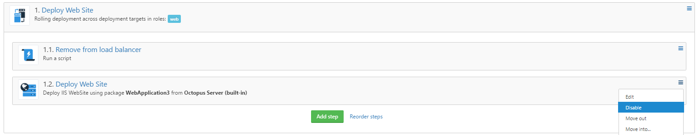
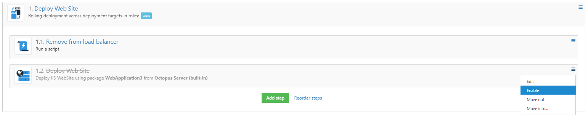

As part of our [2017 roadmap](https://octopus.com/blog/roadmap-2017) we have a goal for our UserVoice items:

> By the end of 2017:
> - Octopus will have implemented all UserVoice items with over 200 votes

So to kick the year off the project modelling team (with contributions of some other members of the company) we have implemented and shipped the following 3 UserVoice items since we started the new year:

- [Allow steps to be 'disabled' or 'inactive'](https://octopusdeploy.uservoice.com/forums/170787-general/suggestions/6324610-allow-steps-to-be-disabled-or-inactive) 
  - **649** votes
  - shipped in version `3.5.5` (_which actually was released in November 2016, but we wanted to mention it in this post as it was one of the highest customer requested features_)
- [Cloning of steps](https://octopusdeploy.uservoice.com/forums/170787-general/suggestions/6470009-cloning-of-steps) 
  - **282** votes
  - shipped in version `3.7.16`
- [Allow the Run Condition of a step to be based on a variable](https://octopusdeploy.uservoice.com/forums/170787-general/suggestions/6594872-allow-the-run-condition-of-a-step-to-be-based-on-a) 
  - **245** votes
  - shipped in version `3.7.13`

## Allow steps to be 'disabled' or 'inactive'
The title is pretty self-explanatory I think, what it allows you to do is to disable any step that might be causing issues with a deployment while configuring the project deployment process. Previously you would either have to delete the step, assign the step to a role that doesn't do anything or skip the step at deployment time, not the cleanest or most user friendly solution!

Now, we've added an option to the context menu of the step that allows you to disable the step so that deployments can still be performed while ironing out any kinks with the new step.

To disable a step, select the `Disable` option from the step context menu

Once a step has been disabled it will not be included in the deployment plan for any releases created while the step is disabled

To enable a disabled step again, simply select the `Enable` option from the step context menu 

## Cloning of steps
This is a feature that was available in the BlueFin Chrome extension, but as not all organizations allow installation of browser extensions/plugins we decided to bring the feature into Octopus so that all our customers can take advantage of this functionality.

To clone a step, you simply select the `Clone` option from the step context menu

This will copy the step you want cloned and add it below the step being cloned

## Allow the Run Condition of a step to be based on a variable
