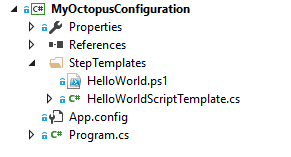

:::tip
Update: Learn about the [deployment process as code pattern](https://octopus.com/docs/deployment-patterns/deployment-process-as-code) where we will continue to provide the best approaches for storing your Octopus configuration in code. We are actively investing in an official [Octopus Terraform Provider](https://github.com/OctopusDeploy/terraform-provider-octopusdeploy) for declarative configuration of Octopus.
:::

> The #6 highest voted item in our UserVoice is some way to **store Octopus data in source control**. It's something we think about a lot, and I've lost count of how many times we've drawn solutions for it on the whiteboard over the years. 

We said we would do something about this in our [2017 roadmap](https://octopus.com/blog/roadmap-2017), but it's potentially a significant undertaking. Each time we've brainstormed how we could do this, our approaches have fallen into a few categories:

- Store Octopus modelling data in Git only
- Store Octopus modelling data in the database, but sync it to a Git repo - the TeamCity approach
- Store individual scripts etc. in Git, and let Octopus reference them

I think we've come up with an alternative approach to this problem that's much simpler, and could satisfy the majority of use-cases, and that could be more flexible and powerful than the default assumption of "sync Octopus settings to version control". I'm calling it "**Octopus Declarative**" for now, and in this post I want to make the case why it's a superior approach, and get your feedback on whether it's the right direction. 

!toc

## What are we trying to solve?

Octopus stores a lot of different data, and not all of it makes sense to store in Git. The primary things people are asking for are:

- Step templates and PowerShell scripts
- Deployment processes
- Variable sets

You could also make the case that some of these may be worth storing in Git too:

- Lifecycles and channels
- Environments
- Tenants

At a higher level, the use cases people seem to be most interested in are:

- Being able to browse the history, easily compare, and roll back changes
- Being able to move configuration between Octopus servers
- Being able to create multiple copies of something (e.g., projects based on a template)

## Why are Git "sync" approaches so hard

Suppose we took the approach of synchronizing settings in Octopus with a Git repository. For it to be truly useful, it would need to work bi-directionally (so people can make changes in Git and have them appear in Octopus). 

### Conflict resolution

The first issue is the synchronization process and dealing with conflict. Each time you change something in Octopus, we'd need to commit the change to Git, and push it to any remotes (e.g., GitHub, VSTS) that you've configured. It's quite possible that there might be a conflicting change on one of those remotes, so Octopus would need some form of conflict resolution. 

What would happen if you change a deployment process, then create a release, then deploy it, and somewhere during that process we detected a conflict? We could roll back, but we already made a deployment based on that change. 

### Scope

The second issue is scope. Do we have one Git repo for an entire Octopus server? Or do we have one for each individual project? 

Given Octopus is used for production deployments, and Git doesn't have a lot of controls around who can edit files in a given path, I think an Octopus server-wide Git repo would be out of the question. But if we're going to have a repo per project (and another for the library), what happens when we need to make a change across multiple of them? And what happens if one of the repos has a conflict but the others don't? 

As I think through these problems, I realize that there are solutions to all of these. But my spidey senses tell me there's quite a bit of effort involved to make it production ready. I could easily imagine us spending 4-6 months getting something like this to work. 

## Alternative: Infrastructure as Code approach 

As I thought about version control and DevOps tooling in general, it dawned on me that there are other ways this problem can be solved. 

For example, take Amazon Web Services. AWS is the go-to example of [Infrastructure as Code](https://en.wikipedia.org/wiki/Infrastructure_as_Code). Heck, the reason the AWS team don't put any effort into the AWS Console user interface is because they assume everyone is using the command line or REST API's to manage their AWS infrastructure (OK, I made that up). 

No one would claim "we shoudn't use AWS because it's not version controlled". Yet, **there's no page in AWS that I could find that tells it to sync your AWS account to Git**. Instead, AWS exposes API's, and you write code against them - and of course you can version control that code. 

When you think about it, it's far superior:

- The scoping issues go away. It up to you to decide which repository should contain the code that sets up each part of your AWS account. 
- Since you are executing code against an API, not just pushing JSON files into Git, you can use for loops, query external services, etc. 

Granted, certain AWS services like CloudFormation do use declarative JSON approaches to configure them, but again, you don't commit them to a repository and expect AWS to sync it bi-directionally - you version control it yourself, then call their API to upload a new configuration. 

### You can do this in Octopus already

Octopus already has a [comprehensive REST API](https://octopus.com/docs/octopus-rest-api) that you can use to do anything that you can do in the Octopus UI. And we have a .NET client library, [Octopus.Client](https://octopus.com/docs/octopus-rest-api/octopus.client), that you can use work with the API easily from C#. 

For example, if you wanted to version control your step templates, right now, you could:

- Create a console app that uses Octopus.Client
- Define each of your step templates by calling the appropriate methods on the client
- Load the script body for each step template from a .PS1 file
- Store all this in version control

Each time you change the .PS1 files or the step template parameters, you could just re-run this app you've built to push the new configuration into Octopus. You could even set up a TFS or TeamCity build to compile, test and run it every time you change the scripts. 

The same can be done for deployment processes or variable sets (with the exception of sensitive variables - we'll find a solution for that). 

Problem solved! Kind of...

### Where it falls short today

While you can do it, right now it's not quite something I'd recommend to everyone. First, the code to check if each resource exists, if not create it, if so update it, etc.. would get very tedious. 

## Solution: Octopus.Client.Declarative

My proposed solution is to create a layer on top of the existing "imperative" Octopus.Client called Octopus.Client.Declarative. You'd create a C# console application like this:



Each class would declaratively define what you expect in your Octopus server:

```c#
public class HelloWorldScriptTemplate : ScriptStepTemplate
{
    public HelloWorldScriptTemplate()
    {
        Name = "Hello world";
        Body = FromFile("HelloWorld.ps1");
    }
}
```
The `Program.cs` file would call some method in Octopus.Client to apply the configuration by making calls to our REST API, checking if resources exsit, creating them if they don't, and ensuring they match what they are expected to be.  

We'd build a bunch of nice ways to define other resource types too. There would be a nice C# object model for building out a deployment process, or a variable set. Or perhaps to import the variables from a CSV or XLSX file. 

And, being code, you could loop over things. For example, maybe you wished you could clone a copy of a "template" project for each of your customers: 

```c#
public class MyProjectTemplate
{
    public MyProjectTemplate(string customerName, string databaseName) 
    {
        Name = "MyProject - " + customerName;
        Steps = ...
        Variables = FromSpreadsheet("Variables.xlsx");
        Variables["DatabaseName"] = databaseName;
    }
}
```

In your `Program.cs`, you could loop over your customer database and new up this template for each customer, then push the configuration to Octopus. 

This is similar to the approach taken by the [Kotlin DSL for TeamCity](https://confluence.jetbrains.com/display/TCD10/Kotlin+DSL), except that you get a lot more choice around how and when you run it. 

To make this feature truly shine and get people using it, I think we'd need a few extra features. 

### Drift detection

In addition to applying the declarative configuration, you could detect whether anything has changed in the Octopus server that means it has "drifted" from the configuration. You could run that on a schedule, for example, to detect if someone modified something they shouldn't have. 

### Locking

If you are looping over an external data set and using it to dynamically create Octopus projects, users are going to get annoyed if they make changes to those projects, and you obliterate them the next time the project runs. I imagine we'll provide a simple mechanism that lets you "lock" certain resource types from being edited in the UI, with a nice message. 

### Export

It's not always easy to map our UI to the resources underneath, so we'd need some way to take an object and export it to the equivalent declarative C# code. This could also be part of Octopus.Client, or something we build into the Octopus UI to make it discoverable. 

## Side effects

If we took this approach, in addition to the original UserVoice suggestion of being able to version control your Octopus configuration, we'd also have a solution that could help to solve a few other issues:

- **Composite step templates** - 609 votes
  Quite often people just want multiple projects to reuse deployment steps. It would be possible to just reuse the same object in C# code across projects. The only question is whether for these projects, they'd be OK with not being editable in the UI anymore. 
- **Improve the variables UI** - 834 votes
  Most of the comments here were focused on dealing with many variables, which are probably defined elsewhere. While we should still do work to improve the UI (we will!), being able to programatically create them or import from a spreadsheet would help many people. 
- **Inheritable templates** - 171 votes
  My example above already showed how this could work. In fact, the "template" project could remain editable within Octopus, and the code would pull it down, and clone it for each instance of it. 

## What do you think?

As a product owner, I'm not afraid of "stop the world rewrites" that take 6-9 months or more. We did it in Octopus 1.6 to 2.0, when we rewrote our orchestration layer and went API-first. We did it again in 3.0 when we switched from [RavenDB to SQL Server](https://octopus.com/blog/3.0-switching-to-sql). When I'm confident the end result is going to be a much better product, I'm happy to go down that path. 

If we took the approach of storing Octopus configuration as XML or JSON files in a Git repository, I think it would take significant effort to address the challenges I mentioned before. And ultimately, if you wanted to take the "for loop" approach to dynamically generate your configuration based on external data sources, you'd want to disable UI editing and use a nice, strongly typed language to do it. And I think we can build that for much less effort. 

We're at a point in the year where we need to make a decision one way or the other. If we go the Git sync approach, the user experience is likely to impact most of the new features we're building, so we'll probably start working on that first. On the other hand, if we take the declarative Octopus Client approach I've outlined here, it's something we can easily ship and improve over the next few months without slowing anything else down. 

My question to you is: **does this declarative C# approach work for you?** Or is there something else you would need from version controlled Octopus configuration? 
