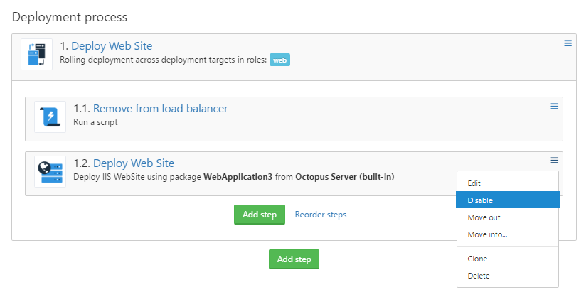
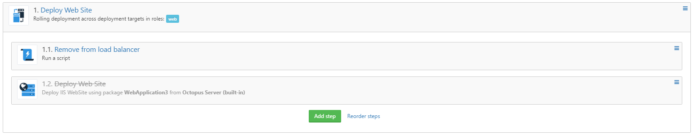
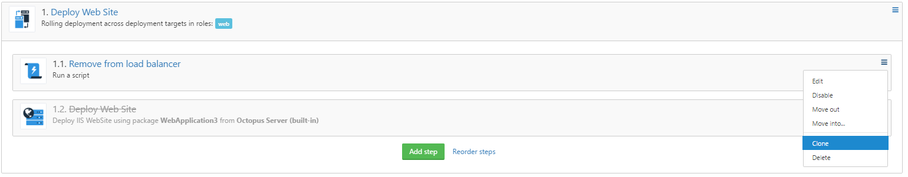
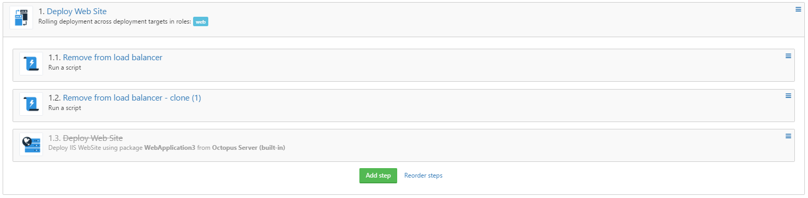
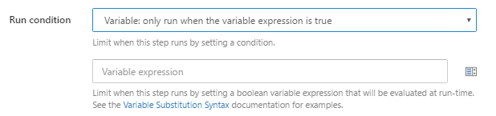

One of the big parts of our [2017 roadmap](https://octopus.com/blog/roadmap-2017) is our goal for UserVoice:

> By the end of 2017:
> - Octopus will have implemented all UserVoice items with over 200 votes

To kick the year off, the project modelling team (with contributions of a few inter-team members) implemented and shipped the following 3 UserVoice items that we hope should make configuring your deployment process a little bit easier:

- **Allow steps to be 'disabled' or 'inactive'** 
  - **649** votes
  - Shipped in version `3.5.5`
- **Cloning of steps** 
  - **282** votes
  - Shipped in version `3.7.16`
- **Allow the Run Condition of a step to be based on a variable** 
  - **245** votes
  - Shipped in version `3.7.13`

## Allow steps to be 'disabled' or 'inactive'
While this feature actually shipped in November 2016 we wanted to mention it in this post as it was one of the highest customer requested features. 

This feature allows you to disable any step that might be causing issues with a deployment while configuring the project deployment process or you might just want to prevent the step from being run at deployment time temporarily. Previously you would either have to delete the step, assign it to a role that doesn't do anything or skip it at deployment time, not the cleanest or most user friendly solution!

Now, we've added an option to the context menu of the step that allows you to disable the step so that deployments can still be performed while ironing out any kinks with the new step.

To disable a step, select the `Disable` option from the step context menu

Once a step has been disabled it will not be included in the deployment plan for any releases created while the step is disabled

To enable a disabled step again, simply select the `Enable` option from the step context menu 

## Cloning of steps
This is a feature that is available in the [BlueFin](http://bluefin.teapotcoder.com/) Chrome extension, but as not all organizations allow installation of browser extensions/plugins, or maybe you are not using Chrome, we decided to bring the feature into Octopus so that all our customers can take advantage of this functionality.

To clone a step, you simply select the `Clone` option from the step context menu

This will copy the step you want cloned and add it below the step being cloned

## Allow the Run Condition of a step to be based on a variable
This feature allows you to tailor your deployment process **at runtime** by giving you the option to conditionally **run** or **skip** an action based on the **boolean** result of an [Octopus Variable Expression](https://octopus.com/docs/projects/variables/variable-substitutions#binding-variables).

Once you've selected the `Variable: only run when then variable expression is true` option, you will get an additional field where you would enter the `Octopus Variable Expression`

To run a step based on the *truthy* value of a variable:

`#{VariableToCheck}` (if you want to check for any value that isn't `undefined`, empty, `0` or `False`) or `#{if VariableToCheck == "ValueToCheckAgainst"}true{/if}` (if you want to check for a specific value)

To run a step based on the *falsy* value of a variable:

`#{if VariableToCheck != "ValueToCheckAgainst"}true{/if}`

To run a step only if all previous steps were successful, and based on the *truthy* value of a variable:

`#{unless Octopus.Deployment.Error}#{VariableToCheck}#{/unless}`

To run a step if any of the previous steps have failed, and based on the *truthy* value of a variable:

`#{if Octopus.Deployment.Error}#{VariableToCheck}#{/if}`

## In closing
We're off to a good start to the year, and we have a long list of other great value add features ahead of us. We're really excited and looking forward to tackling these highly requested features.

We really do appreciate all our customers input - so make sure you add your votes to your favourite feature requests!