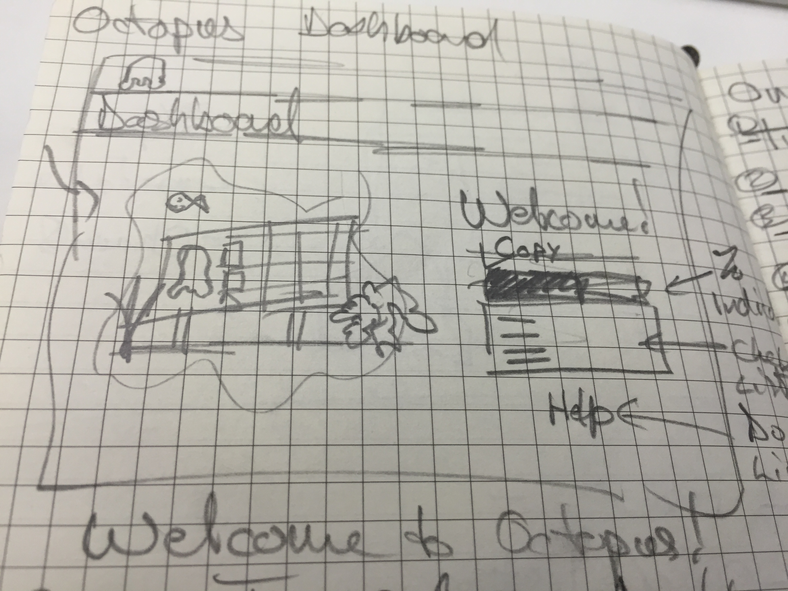

TODO: Add blog post illustration

Intro new release candence and highlight this month's new features.

## Getting started with Octopus is now even easier

Octopus has always helped make it easy to get started with deployment automation but it can still be a long and complicated road to complete automation nirvana.  Setting up a new Octopus server to deploy an ASP.NET web app can involve creating environments, adding machines, packaging your application, creating a project and definiting its deployment process and finally creating and deploying a release.  Our [getting started guide](https://octopus.com/docs/getting-started) walks you through this process but it can still be a bit dauting and the Octopus web portal didn’t really help you with this process after you first logged in.

We had little tidbits of help spread throughout the app but nothing to  actively help you reach that first automated deployment.

This changes in Octopus 3.12 where the new Octopus Dashboard now welcomes you and displays an interactive walkthrough to get started.  You can following the links to create your first environment or project, add machines, configure tentacles as well as define your deployment process.  We also include links to provide more help as every company/team’s projects are different.  

The dashboard automatically shows you your progress and it can be dismissed if you’re experience user.  The projects and environments dashboard have also been updated to help guide you through the process of setting up each respective area.  

Our goal with this work is to help new and experienced users get to deploy their first release as quickly and easily as possible and then continue to automate other projects.  It’s a pleasent side effect that everything looks a little bit nicer. :)

## Step update

## VM Extension

## Substitude in files - glob pattern matching for json config files

## Octopus license alerts and renewal notifications

Wrap Up
