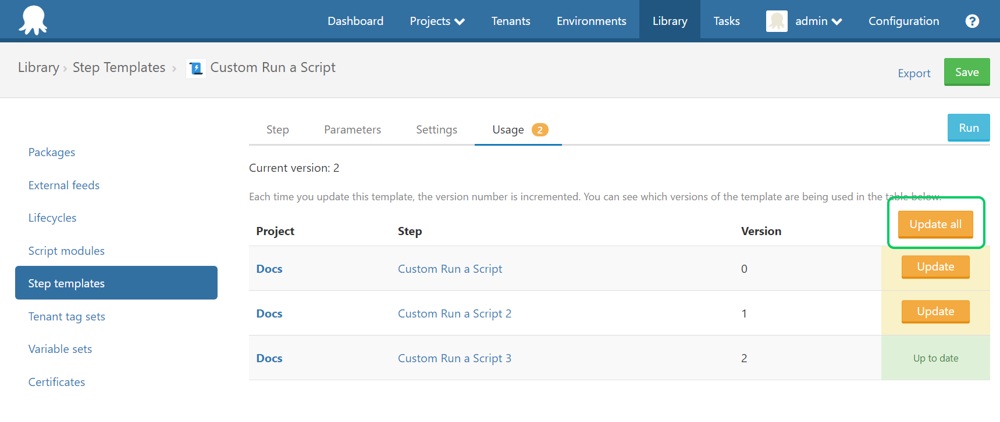

Octopus 3.12 is now available to download and we’re trying a new monthly release cadence.  This means we’ll ship a new release on a predictable schedule that you can count on.  We’re doing this experiment with the following goals in mind:

- Easier to stay across new features and enhancements
- Easier to coordinate the deliver of multiple new features and manage a single new release
- Improve quality by having a structured delivery schedule, bug bashes and fixes

**NOTE**: We’ll still continue to ship small enhancements and bug fixes as soon as they’re ready.  We want to get those changes in your hands as soon as possible so that won’t change.  

## Getting started with Octopus is now even easier

Octopus has always helped make it easy to get started with deployment automation but it can still be a long and complicated road to  automation nirvana.  Setting up a new Octopus server to deploy an ASP.NET web app can involve creating environments, adding machines, packaging your application, creating a project and its deployment process and finally creating and deploying a release.  Our [getting started guide](https://octopus.com/docs/getting-started) walks you through this process but it can still be a bit daunting if you’re doing it for the first time.  

	⁃	This changes in Octopus 3.12 where the new Octopus dashboard now welcomes you and displays an interactive walkthrough to get started.  Our new walkthrough helps you to create your first environments and project, add machines, configure tentacles as well as define your deployment process.  We also include links to provide more help as every company/team’s projects are different.  The dashboard automatically shows you your progress and helps you celebrate at major milestones as you get up and running!  We’ve also updated our Projects, Environments and Configuration pages to be a bit more friendly too.  

The new onboarding is beneficial for experienced Octopus users as well.  It can help you set up a new instance for a new project or team and can be very beneficial for consultants setting up a deployment pipeline at new clients.  The new features can help you set up common environment structures as well as bootstrap common projects to deploy APS.NET web apps or windows services.  Also, the new interactive  dashboard can be toggled on or off as you desire.  

Our goal with this work is to help new and experienced users get to deploy their first release as quickly and easily as possible and then continue to automate other projects.  It’s a pleasant side effect that everything looks a little bit nicer. :)  We think we’ve achieve this goal and we’d love your feedback.  Spin up a virtual machine and start a fresh new instance or simply have a play with your existing Octopus server.  

## Update steps across all projects

Updating steps across multiple projects requires a lot of work because each step needs to be updated manually. You have let us know about that [loud and clear](https://octopusdeploy.uservoice.com/forums/170787-general/suggestions/6072178-when-updating-a-step-template-update-across-all) in the past. Today we are happy to announce that we have automated [that process](https://octopus.com/docs/deploying-applications/step-templates/updating-step-templates) and all it requires from you is a single click.

## Substitute variables in files now supports extended wildcard pattern matching

A popular feature on package steps is the ability for Octopus to do [variable substitution](https://octopus.com/docs/deploying-applications/substitute-variables-in-files) in configuration and JSON files. Which lets you make use of the [embedded template syntax](https://octopus.com/docs/reference/variable-substitution-syntax).

The way these extra configuration actions worked was on a fixed set of files, 1 line per file. This was a rigid configuration, if the file was missing it would fail the deploy. This may be desirable if you've got a handful of files, but there was 90 user voice votes for this to be more flexible. The issue was with larger deployments there would be an unknown and changing amount of configuration files that needed to be transformed. The breaking of a build because of moved configuration files was a terrible experience.

To the rescue comes extended wildcard pattern matching for these configuration options. With this enhancement you can use patterns to specify sets of filenames with wildcard characters to determine the set of files that will be modified. Here's two examples: `**/*.config` which will match any file that ends in `.config` in any depth of nesting, and `Area1/**/*.config` will match only `*.config` files any folder in `Area1` and deeper.

## Improved license notifications

Our final update this month is a minor improvement to help show your Octopus License status.   We’ve updated our license page to show you an alert if your license is expiring soon or expired and we added a very subtle reminder so Octopus users are aware of their license status.  We’ve found that the developers who use Octopus are often unaware of their company/team’s license status and therefore cannot always take advantage of new features or enhancements so we’ve made it easier to know when it’s time to renew.  We worked hard to make sure this is very subtle and doesn’t annoy you.  

It’s worth pointing out that this currently only shows license expiring notifications and new release notifications (as per your preferences) but we will build upon it in the future.  

## Wrap Up

That’s it for this month.  We hope you enjoy the latest features and our new release cadence.  Feel free to leave us a comment and let us know what you think!  Happy deployments!  
