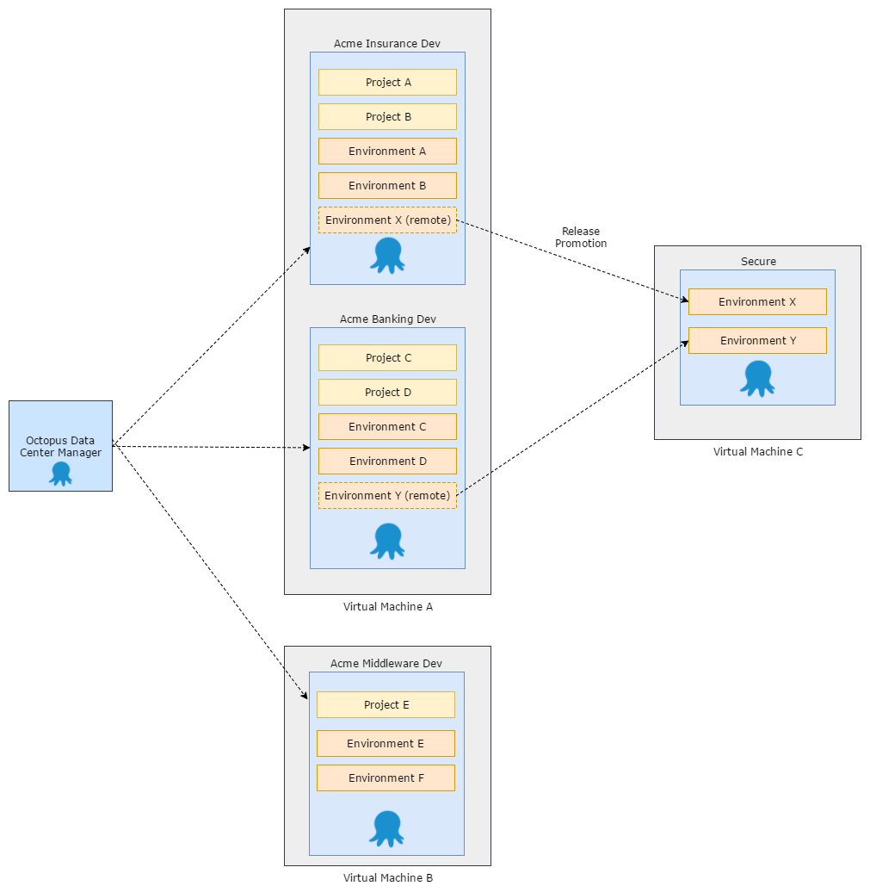

When we first built Octopus, we imagined it would be used by small teams to deploy applications to a dozen or so machines. Over time, we've [seen customers scale Octopus up to many thousands of machines](https://octopus.com/blog/octostats), deploying hundreds of different projects. At that scale, customers need their Octopus servers to be online at all times, so we support running a single [Octopus server across a multi-node, high availability cluster](https://octopus.com/high-availability).

One great big Octopus server isn't always a great idea though, especially when it's used by a large number of teams that don't share a lot in common. That was the case at Accenture, who [standardized on Octopus](https://channel9.msdn.com/Shows/ANZMVP/Updating-Octopus-Deploy-at-Accenture-with-Jim-Szubryt-and-Damian-Brady) across the organization, and had many hundreds of teams on a handful of very large Octopus servers. For their scenario, it made much more sense to split the big Octopus servers into lots of small ones, effectively giving each team or handful of teams their own small, isolated Octopus servers.

Another scenario where it makes sense to split into multiple Octopus servers is for [security isolation](https://octopus.com/docs/patterns/isolated-octopus-deploy-servers). Customers who [deploy their applications into PCI Compliant environments](https://octopus.com/docs/reference/pci-compliance-and-octopus-deploy) typically end up managing two separate Octopus servers: one in their development/insecure environment, and one in their production/secure environment. In this scenario the difficulty is in synchronizing projects across the two security zones.

The more we thought about it, the more we realised there are quite a few compelling reasons why might split up your Octopus servers:

1. **Independent teams:** Your organization has multiple teams that work independently. Currently Octopus has many entities that are shared between Projects (e.g. Lifecycles, Variable Sets, Step Templates, etc). Separate Octopus servers ensure your peas and carrots stay on their own sides of the plate.

1. **Scale:** A single server has finite resources. Whilst a [high availability cluster](https://octopus.com/high-availability) allows you to scale work across multiple servers, there are many situations where having large numbers of entities (Environments, Machines, Projects, etc) impacts performance and usability.

1. **Distributed Environments:** Many organisations deploy to environments in multiple geographic regions. Deployment times (particularly package transfers) can be dramatically reduced by hosting an Octopus server instance in each location.

1. **Security:** For security and compliance reasons your organization doesn't allow network communication between development and production environments. In most cases, you also need strict controls around which people can access your production environment. Many customers address this by having an Octopus server in each security zone.

Currently, based on some of these reasons, you go ahead and split your single Octopus server instances, only to realise just how difficult it can be to manage them all! How should you manage user identies and access control across your Octopus servers? How do you promote a release of a project between your network security zones, and then share the results of the deployments?

In each of these cases we have found ways to get the job done, but it still doesn't feel like we've solved any of those problems in a "first-class" way.

For example, you can use one of our federated [authentication providers](https://octopus.com/docs/administration/authentication-providers) to enable single-sign on (SSO), but managing the rights each user is granted on your Octopus servers can be painful.

Likewise, to promote a release to a disconnected environment, you could use an [offline package drop](https://octopus.com/docs/deployment-targets/offline-package-drop) but [they have some important limitations](https://octopusdeploy.uservoice.com/search?filter=ideas&query=offline%20drop) including the fact you [cannot use output variables in offline drops](https://octopusdeploy.uservoice.com/forums/170787-general/suggestions/9196032-output-variables-for-offline-drops) and [the dashboard can get confusing](https://octopusdeploy.uservoice.com/forums/170787-general/suggestions/13066998-offline-drop-specific-dashboard-status). You could take it a step further and use [data migration](https://octopus.com/docs/administration/data-migration) to move data around, but this is complex, it's an all-or-nothing solution, and there is no good way to handle conflicts.

Finally, how do you apply upgrades to all of these independent Octopus servers? You might have some teams who want to stay on a specific version during a period of stability, and other teams who want to install a newer version in order to access a new feature or bug fix.

We want to make all of this easier, as first-class citizens of the Octopus world.

Here is an example of the architecture we want to support.

