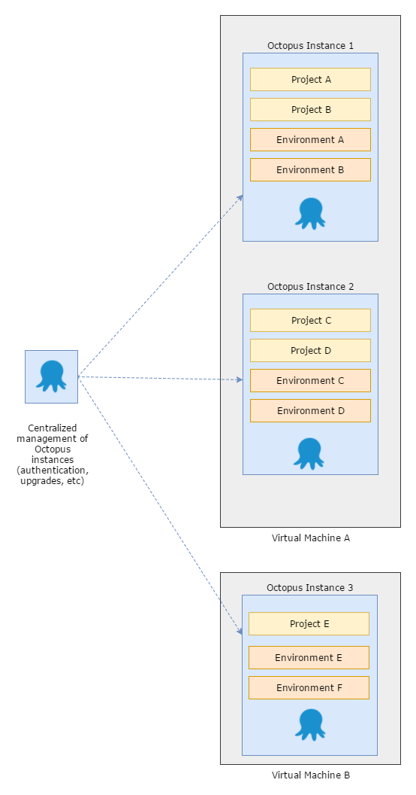
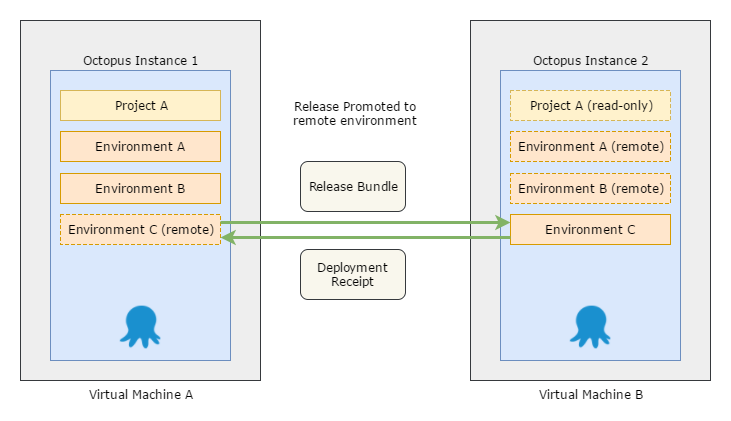

When we first built Octopus, we imagined it would be used by small teams to deploy applications to a dozen or so machines.  Over time, we've [seen customers scale Octopus up to many thousands of machines](https://octopus.com/blog/octostats), deploying hundreds of different projects.  At that scale, customers need their Octopus Servers to be online at all times, so we support running a single [Octopus Server across a multi-node, high availability cluster](https://octopus.com/high-availability).

One great big Octopus Server isn't always a great idea though.

You may have a large number of teams that have little in common. That was the case at Accenture, who [standardized on Octopus](https://channel9.msdn.com/Shows/ANZMVP/Updating-Octopus-Deploy-at-Accenture-with-Jim-Szubryt-and-Damian-Brady) across the organization, and had many hundreds of teams on a handful of very large Octopus Servers. For their scenario, it made more sense to split the big Octopus Servers into lots of small ones, effectively giving each team or handful of teams their own small, isolated Octopus Servers.

Or perhaps your organization is [PCI compliant](https://octopus.com/docs/reference/pci-compliance-and-octopus-deploy), and requires a strict separation between your development and production environments. Customers in this situation often [manage an Octopus Server in each security zone](https://octopus.com/docs/patterns/isolated-octopus-deploy-servers) and synchronize projects across the two.

The more we thought about it, the more we realized there are a few compelling reasons why you might split up your Octopus Server:

1. **Independent teams:** Your organization, like Accenture, has multiple teams that work independently. Currently Octopus has many entities that are shared between Projects (e.g. Lifecycles, Variable Sets, Step Templates, etc). Separate Octopus Servers ensure your peas and carrots stay on their own sides of the plate.

1. **Scale:** Machines have finite resources. Whilst a [high availability cluster](https://octopus.com/high-availability) allows you to scale work across multiple servers, there are many situations where having large numbers of entities (Environments, Machines, Projects, etc) impacts performance and usability.

1. **Secure Environments:** For security or compliance reasons your organization requires strict separation between your development and production environments. Many customers address this by having an Octopus Server in each security zone.

1. **Distributed Environments:** Many organizations deploy to environments across multiple geographic regions. Deployment performance (particularly package transfers) can be dramatically improved by hosting an Octopus Server in each location.

## You can do all this with Octopus now, but it hurts

All of these are real-world scenarios, and our customers are dealing with them currently. In each of these cases we have found ways to get the job done, but it doesn't feel like we've solved all of these problems in a "first-class" way.

Let's take a look at some examples.

### Scaling out across multiple Octopus Servers

The _independent teams_ and _scale_ scenarios are typically dealt with by spreading many Octopus Servers across one or more machines, often using [high availability clusters](https://octopus.com/docs/administration/high-availability) somewhere in the mix.

OK, now you've decided to shard across multiple servers; you've solved some problems, but you've replaced them with others: 
- How do you manage identity and access control across your Octopus Servers? 
- How do you manage Octopus upgrades across your Servers? 
- What if you wish to share some things like [step templates](https://octopus.com/docs/deploying-applications/step-templates), [variable sets](https://octopus.com/docs/deploying-applications/variables/library-variable-sets), or even [deployment targets](https://octopus.com/docs/deployment-targets)?

To solve the identity and access control problem you could use one of our federated [authentication providers](https://octopus.com/docs/administration/authentication-providers) to enable single sign-on (SSO), but managing the rights each user is granted on each of your Octopus Servers can be painful.

You can share data between Octopus Servers using [data migration](https://octopus.com/docs/administration/data-migration), but this is complex and there is no good way to handle conflicts.

### Promoting releases across multiple Octopus Servers

The _secure environments_ and _distributed environments_ scenarios are similar to _independent teams_ and _scale_, but different.

Generally what is desired is a way to promote a release between Octopus Servers. Ideally retaining all the Octopus goodness like viewing the progression on the dashboard and deployments being as simple as clicking a button.

Today, this is often tackled via a few approaches:

- [Isolated Octopus Servers](https://octopus.com/docs/patterns/isolated-octopus-deploy-servers): placing an Octopus Server in each zone.
- [Offline-Drop deployment targets](https://octopus.com/docs/deployment-targets/offline-package-drop): to deploy your release to machines that can't communicate with an Octopus Server.
- The [Octopus Migrator utility](https://octopus.com/docs/octopus-rest-api/octopus.migrator.exe-command-line): to migrate entities between Octopus Servers.

These all work; there are many customers using them every day. But they all have downsides:

- Offline-drop deployments have to be executed manually on each target machine, and don't allow you to view the results of the deployment or the task logs.
- The Migrator utility was never designed for promoting a single release between environments.
- Isolated Octopus Servers suffer from all the management headaches we mentioned earlier.

In short, they don't solve the root problems in a way that we are happy with.

## Octopus Deploy 4.0 

Can you imagine a tool which lets you manage identity, access control, upgrades, and information sharing across an entire farm of Octopus Servers? We can!

Can you imagine promoting a release from one Octopus Server to another, and seeing the deployment results flow back across, even if the servers are completely disconnected? We can imagine that too!

At Octopus HQ we have been thinking about the next major release of Octopus Deploy: version 4.0

A primary focus of this release will be addressing the scenarios introduced above, and we are going to delve into _much_ more detail in posts in the coming weeks.

Stay tuned.

