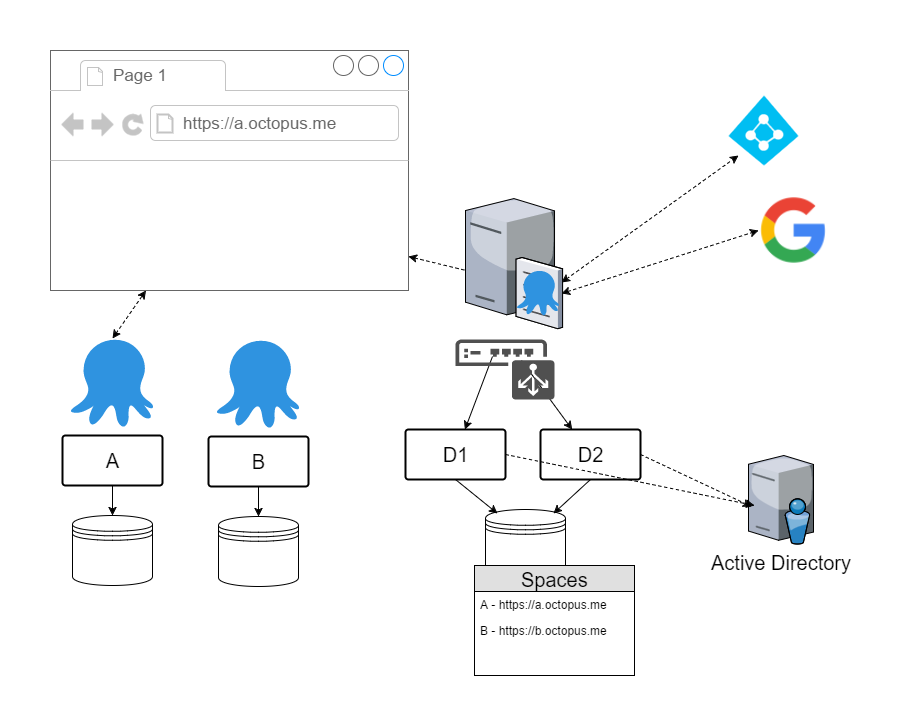

When we first built Octopus, we imagined it would be used by small teams to deploy applications to a dozen or so machines. Over time, we've [seen customers scale Octopus up to many thousands of machines](https://octopus.com/blog/octostats), deploying hundreds of different projects. At that scale, customers need their Octopus instances to be online at all times, so we support running a single [Octopus server across a multi-node, high availability cluster](https://octopus.com/high-availability).

One great big Octopus server isn't always a great idea though, especially when it's used by a large number of teams that don't share a lot in common. That was the case at Accenture, who [standardized on Octopus](https://channel9.msdn.com/Shows/ANZMVP/Updating-Octopus-Deploy-at-Accenture-with-Jim-Szubryt-and-Damian-Brady) across the organization, and had many hundreds of teams on a handful of very large Octopus servers. For their scenario, it made much more sense to split the big Octopus servers into lots of small ones, effectively giving each team or handful of teams their own small, isolated Octopus servers.

When it comes to rolling out Octopus at scale, we want to offer more choices:

1. One or two really big, highly available instances with great performance
2. Lots of teeny, tiny Octopus instances (which might also be highly available)
3. Some mix of the above

While we've had a great story for a while now for scenario #1, we haven't had great solutions for #2 and #3. In this post, we're going to outline a new product offering that we're working on for enterprise-wide adoption of Octopus, that's designed to make all of these scenarios easier.

## The case for lots of small instances
A large, single HA Octopus makes sense when you have a team that share a lot of projects and machines - imagine something like a team building an ecommerce platform that runs across hundreds of machines, deploying often and rolling back if something goes wrong. The existing Octopus HA solution is perfect for this.

Where it doesn't make sense, is when the Octopus server is used by many disparate teams or departments, without a whole lot in common. We'll continue to do work to make Octopus easier to navigate when you have lots of unrelated projects and environments, but sometimes it would just be better if every team got their own Octopus instance.

Here are some problems to having one big Octopus instance when so many different teams are involved:

- Maintaining permissions for each team on specific projects is tedious
- It is not possible to restrict many concepts to specific teams, e.g. NuGet feeds, variable sets and machine policies
- Large numbers of projects, environments and tenants cause queries to run slowly, e.g. Dashboard
- Deployments for other teams that you may have no control over (or access to) impact the deployment of your projects
- Upgrading an Octopus instance impacts everyone. This causes a tension between leading-edge teams that want the latest Octopus features, and more stable teams that might be in a freeze or undergoing an audit
- It’s not possible to delegate permissions - e.g., the manager of a dev team can’t add a new developer to a team, they have to ask an Octopus administrator to do it
- Backup and restore of an individual team is practically impossible. What do you do if one team makes a big mistake and needs a backup restored, while other teams have moved forward? How does this impact on your compliance obligations?

For these reasons, we've been recommending that customers run lots of small instances, perhaps one for each team or each department.

**You can already do this today.** We have customers, like Accenture in the video linked above, but also others, who are doing this in production at scale with lots of small Octopus instances.

- You can share the same SQL Server cluster, but give each team their own SQL database
- You can run many instances of Octopus (each pointed at a different database) on a single machine, or in high availability mode across machines

The best part about this is that you gain so much more ability to scale - you can effectively "shard" your Octopus across many machines and many database servers.

## Points of friction
While it can be done today, the major downside is that we don't currently provide any tooling to help mange all those little Octopus servers - the experience for end users and Octopus administrators just isn't great.

- If the instances are installed on the same VM, they all have to be upgraded together
- Users need to remember/bookmark all the URLs for the servers they have access to
- Users need to log on to each instance
- When a new user joins, they need to be added to teams on every instance

## Addressing the friction
To make it easier for customers to move towards this model of having lots of smaller instances, we want to address these friction points. To do that, we want to make the following easier:

- For administrators to manage multiple smaller instances of Octopus Deploy, including configuration and upgrades
- For administrators to manage users and groups across those instances of Octopus Deploy
- For teams to become more self-managed and independent - so they can manage their own Octopus Projects, Environments, Machines, Variables, Step Templates etc without worrying about the impact on other teams
- For users to switch between all the instances they have access to using Single Sign-On (SSO)
- For administrators and managers to be able to view reports and information across all of the instances

## Octopus Data Center Manager
When we looked at the friction points outlined above, they're all a direct result of working across Octopus Deploy installation boundaries. The answer we're looking for seems to be a layer above Octopus Deploy itself, and so we're building a new product called **Octopus Data Center Manager** (ODCM).

Let's have a look through what we see as some of the key features for ODCM, and look at how they address the points above.

To help visualize what an ODCM installation might look like, and to help illustrate some of the points we'll talk about below, the following diagram shows a scenario where there are two server instances (A and B) and an ODCM installation. ODCM is shown in a Highly Available style configuration (like Octopus Deploy itself, it will support single node and HA configuration depending on your requirements).

### Spaces
When you first start using Octopus Deploy you will likely start with a standard installation and over time, it grows. As the installation grows, you will reach a point where your Octopus feels cluttered. When you reach that point you will also probably be able to identify collections of related things that could be grouped together and separated from everything else. What you would like to do is move those into their own Space, i.e. their own smaller Octopus Deploy.

We can help you manage this using ODCM. It allows you to:

- enlist existing installations as Spaces,
- separate things out of an existing Space into a new one,
- create a new blank Space

### Identity management
One of the keys to working with multiple instances of Octopus is to deal with user identity and access control. We can solve these problems by having ODCM take responsibility for them.

When you enlist a Space with ODCM we will configure the Space so authentication is handled by ODCM. This means you can centralize identity management and SSO.

Now if you want all your users to sign on with Active Directory, Azure AD, Google Apps, or any other supported identity provider, you would configure this in one place: your ODCM.

### Access control
When you have multiple Spaces, access control operates at two levels:

1. who can access a Space?
1. what can a user do within a Space?

If you're responsible for administering ODCM, you can control which groups of users have access to which Spaces. A group may consist of Users and/or external groups (i.e. those sourced from Active Directory or Azure AD).

If you're responsible for a Space, you can add groups from ODCM to a Team control permissions.

### Switching Spaces
Now you have access to a few spaces, that's great. How do you get between them quickly and easily though? How good is your memory for all those different URLs or do you like to use browser bookmarks?

How about a handy little switcher inside Octopus that knows all the spaces you have access to? We're thinking it will look like this.

The switching mechanism will make use of Single Sign On (SSO) and will allow you to move between spaces effortlessly, with minimal impact to the current Octopus Deploy experience.

### Sharing
When you only have a single installation of Octopus, sharing of information is a non-issue. Once you have lots of smaller installations, there is an increased likelihood you'll want/need to share information between them.

Our vision for Spaces is that they should be collections of related things, so the need for sharing should be minimal. We thought about which things are likely to need sharing, and think they'll be things like:

- Step Templates
- Server Extensions
- Variables
- Tentacles

We're thinking that ODCM will have the ability to host a version of the Community Step Template library, to share Step Templates between Spaces. We may also introduce a similar concept for Octopus Deploy server extensions, so they can be shared between Spaces.

Sharing of Variable Sets is a little more complicated, primarily because they are owned by a Space and could contain sensitive information. We have a model in mind where ODCM will broker the exchange of the Variables Sets. In this model, the Space that owns the variables receives the request and can decide whether it wants to allow sharing with the Space that made the request.

A Tentacle can already be used by more than one Octopus server, so this still applies and it can be used by more than one Space.

### Multiple Octopus Deploy versions
On to sharing of a different kind. The current Octopus Deploy MSI installer only allows a single version to be installed on a machine, by virtue of "*C:\Program Files*". You can use Octopus Server Manager to configure multiple instances on a single machine, but they are all sharing the same binaries and are therefore the same version. If you want to have multiple Spaces on the same machine using different Octopus Deploy versions, this presents a problem.

As we mentioned earlier, you can already work around this today but it takes some effort. We want to make it easy. Our current idea is that we'll include an agent on the host machines of the Spaces and automate the deployment of Octopus server itself.

If you are responsible for a Space, you can then control (via ODCM) which version your Space is using and if/when you want to upgrade to newer versions.

If you are responsible for a Space that is Highly Available, you will also be able to control versions and upgrades across your Node Set.

Once there are multiple Spaces, and even versions, of Octopus Deploy server running on a machine, maintaining isolation will be important. We haven’t settled on exactly how we'll ensure this, but expect there will some changes required to the way Server Side scripts operate.

### Octopus Deploy Server monitoring and reporting
If you are managing a single installation of Octopus, getting consolidated information across projects/teams is relatively easy. Once you have lots of installations, it's not easy.

ODCM will help you with this. It will be in communication with the Spaces, so it can request information and statistics that can be collated centrally. You'll be able to access this information through a dashboard and some reports in ODCM.

We don't expect that all of the dashboard and reports will make it into the initial release. We will focus on a minimal set and build on this over subsequent releases. The initial release may contain something like:

- a dashboard showing Spaces, with their server version and current status (online/offline)
- a report showing project count and target count per Space
- a report showing deployment counts (number of successful and failed deployments) per Space over a give timeframe

If there are other metrics you think would be valuable, please let us know.

### Licensing
ODCM will be a separate product to Octopus Deploy itself, and will have a different licence model. The model is still under discussion and we’ll share more details as they become available. The pricing will be friendly in regards to running lots of Spaces.

## Feedback
What we've talked about above is what we think will be the minimum viable product for ODCM. As always, we're keen to get your feedback and from there we'll be looking to start the implementation in the next couple of weeks.
