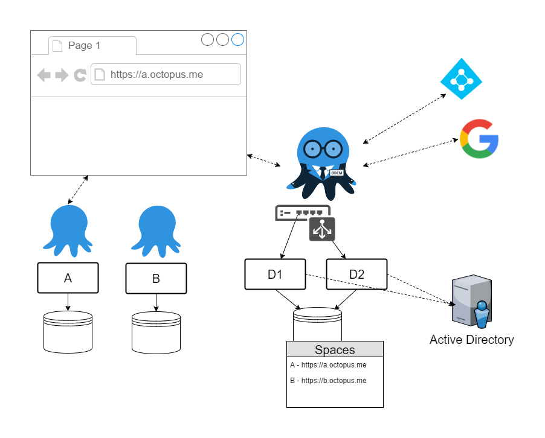
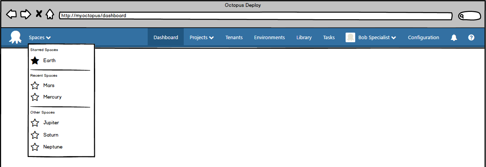
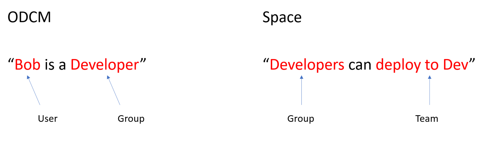

:::warning

**UPDATE JANUARY 2019**
In the [2019.1](https://octopus.com/downloads) release of Octopus Deploy we have a new feature called [Spaces](https://octopus.com/blog/octopus-spaces-blog-series-kick-off) that has achieves the original goals proposed by the ODCM Feature.

Have a look at [Spaces here](https://octopus.com/blog/octopus-release-2019.1), it's available for download now.

:::

---
In an [earlier post](octopuses.md) we talked about some of the real world problems our customers are having with Octopus at scale, and introduced some of our vision for solving those problems in Octopus 4.0.  In that post we floated the idea of a tool that centrally manages a number of Octopus servers.

In this post we are going to talk more about what this tool, provisionally named **Octopus Data Center Manager** (ODCM), would look like.

## Usage Scenarios

Let's introduce you now to some users who work for an organization that is looking to centralize the management of a number of Octopus servers.

### User 1: Lisa Shipping
Lisa is responsible for a team who are delivering some new internal software. They are nearing their first delivery milestone and don't want any surprises. They have been working happily with a specific version of Octopus, they aren't experiencing any issues, and they want to keep it that way.

During the project it's become apparent that some specialist skills would help get one feature completed more quickly, and Lisa has been able to locate a developer on another team in the organization who can help. It's important to Lisa that allowing access for that developer is quick and easy.

### User 2: Bob Specialist
Bob is the developer with specialist skills who is going to do some work with Lisa's team. He already has access to Octopus through his other team and he doesn't want new credentials or to have to remember a new Url.

### User 3: Geoff Outsider
Geoff is a consultant from an external organization who is also joining Lisa's team. He already has an Azure AD login managed by his organization, and would really prefer to not have another set of credentials to manage.

### User 4: Barry Infrastructure
Barry is responsible for the organization's Octopus infrastructure. Some critical projects rely on this infrastructure and it's important he knows when any Octopus servers go offline.

He is also responsible for helping the teams standardize on Octopus practices and share that knowledge within the organization.

## Features
Now let's talk about some of the challenges these users face when dealing with multiple Octopus servers and look at the ODCM features that will help them.

The ODCM installation for the organization might look something like the following.

ODCM is shown in a [Highly Available](https://g.octopushq.com/HighAvailability) configuration (it will support single node and HA configuration), which is important to Barry. Projects are depending on these Octopus servers and he wants to ensure reliable and responsive feedback.

### Giving teams their own Space
When we started talking about ODCM and its functionality internally something became apparent pretty quickly, some of the terminology can be overloaded and confusing. This was within our team, and we're living this stuff every day, so let's go through some definitions to try to avoid confusion.

Instance
:   a running [instance of Octopus server or Tentacle EXE](https://octopus.com/docs/administration/managing-multiple-instances)

Server
:   a machine on which an instance runs

Node
:   an Octopus Deploy server instance

Node Set
:   a number of nodes that share an Octopus database and work together to provide High Availability

Space
:   a container for Octopus Deploy concerns (e.g. Projects, Environments, Variables, Deployment Targets), as bounded by a single Octopus database. (i.e. it's Octopus as you know it today)

The key new definition here is Space. The concept came from the idea of one big Octopus being split so that projects/teams had their own independent space in which to work.

Now, back to our friend Barry Infrastructure. He will deal directly with Spaces in his day to day management of Octopus. The other users all operate within a Space, but it will be fairly transparent.

ODCM will provide Barry with features like:

- enlist an existing Octopus as a Space,
- separate things out of an existing Space into a new one,
- create a new blank Space
- monitor Spaces, via a dashboard and alerts
- report across Spaces

### Identity management
One of the keys to working across multiple Spaces is dealing with user identity and access control. We can solve these problems by having ODCM take responsibility for them.

When a Space is enlisted with ODCM its authentication will be configured to point to ODCM, which will centralize identity management and allow SSO across Spaces. ODCM will support all of the [authentication providers](https://g.octopushq.com/AuthenticationProviders) currently supported by Octopus Deploy (i.e. UsernamePassword, Active Directory, Azure AD, GoogleApps).

A number of the users benefit from this centralization.

- Bob Specialist can move teams and doesn't need a new identity or need to find a new URL
- Barry Infrastructure can locate Bob's existing identity to grant him access to Lisa Shipping's Space
- Barry can create an external identity for Geoff Outsider, who can then log in with his existing credentials.

Let's imagine Bob now has his access to multiple Spaces, how does he switch between them quickly and effortlessly? We're thinking it'll look something like this.

The user experience might be something like Trello uses for managing and switching boards, with features like:

- quickly see and select a Space you've recently visited
- "favorite" a Space so it always appears near the top
- link to a page that shows the Spaces as tiles and allows searching

### Access control
We picture access control operating across Spaces at two levels:

1. who can access a Space?
1. what can a user do within a Space?

Barry Infrastructure, as an ODCM administrator, will be able to control which groups of users have access to which Spaces. A group may consist of users and/or external groups (i.e. those sourced from Active Directory or Azure AD).

Lisa Shipping, as a Space administrator, will be able to use teams to manage which groups of users have which permissions in her Space, just like in Octopus today. For example, she could specify a team which permits Developers to deploy things to the Dev environment. If Bob Specialist is a member of the Developer group in ODCM then when he is given access to the Space he'll be able to deploy to Dev immediately.

### Sharing
Our vision for Spaces is that they should be collections of related things, so the need for sharing should be minimal. We thought about which things are likely to need sharing, and think they'll be things like:

- Users (as discussed above)
- [Step templates](https://g.octopushq.com/CommunityContributedStepTemplates)
- [Server extensions](https://g.octopushq.com/ServerExtensions)
- [Variables](https://g.octopushq.com/LibraryVariableSets)
- Releases
- Tentacles

#### Step templates and server extensions
Barry Infrastructure will again be the one primarily responsible for managing these things, and again we're thinking he'll do that through ODCM. It will:

- have the ability to host a version of the community step template library
- have something similar for hosting server extensions

#### Variables
Now, Barry is responsible for standardization and as part of that he'd like to define/manage some variables for the teams to use. We're imagining he could do that along the following lines:

- He creates a Space to contain the variables he wants to share
- He adds a trust between this Space and those he wants to share with (e.g. Lisa's)
- He creates a variable set in the Space and specifies the Spaces he wants to share it with

We're considering support for two modes of synchronization in the sharing. The first mode lets the publisher specify that updates must be automatically pushed to the subscribers and the second lets the subscribers chose whether updates are automatically pushed to them or synchronized on demand. In our scenario above, Barry could then ensure that all Spaces stay up to date by specifying that automatic pushes are required. Lisa would have to accept this if she subscribes the Variable Set into her Space.

The variable set will appear as read-only in a subscribers Space, regardless of the synchronization mode, and can be added to the projects like any other variable set.

We considered a few options for how this might work and landed on this model for a few reasons. One key reason is consistency, ODCM broking information from a publisher to a subscriber fits all of the sharing scenarios outlined above. It doesn't have to understand any of the information, it just helps get it to where it needs to go.

#### Releases
Sharing of releases is the subject of an upcoming RFC, so we won't talk too much about it here.  In the context of this discussion (ODCM management) we think it will hold a lot in common with variables.

#### Tentacles
On a final note about sharing, Tentacles can already be used by more than one Octopus server, so this still applies and it can be used by more than one Space.

### Multiple Octopus Deploy versions
Next, let's consider what happens when another team starts up and Barry Infrastructure gets a request for a new Space. Let's say he looks across the current machines and sees that one has capacity to host another Space. It happens to be the machine that's hosting Lisa Shipping's Space. So whilst the machine has capacity, the Octopus version being used by Lisa's Space must not change.

The current Octopus Deploy MSI installer creates a problem here because it only allows a single version to be installed on a machine, by virtue of "*C:\Program Files*". You can use Octopus Server Manager to configure multiple instances on a single machine, but they are all sharing the same binaries and are therefore the same version.

You can work around the MSI today but it takes some effort. We want to make it easy. To do that, ODCM will take on the management of Octopus on the servers and automate the deployment of Octopus itself.

Each Space will be an isolated copy of Octopus, and maintaining that isolation will be important. This is easier on some levels than others. For example, isolation of instance versions based on binaries is fairly straightforward. Isolation across shared resources like CPU, RAM and disk is more problematic. We're investigating options at the moment and we'll share more once that's done.

### Octopus Deploy monitoring and reporting
A key part of Barry Infrastructure's role is monitoring Octopus servers and reporting on usage across them. We see ODCM facilitating this, given it's perfectly placed to collect and aggregate this information. We're imagining it will have a dashboard for real-time monitoring and a number of pages to report statistics and usage information.

We don't expect that all of the dashboard functionality and reports will make it into the initial release. We will focus on a minimal set and build on this over subsequent releases. The initial release may contain something like:

- a dashboard showing Spaces, with their server version and current status (online/offline)
- a report showing project count and target count per Space
- a report showing deployment counts (number of successful and failed deployments) per Space over a give timeframe

If there are other metrics you think would be valuable, please let us know.

## Licensing
ODCM will be a separate product to Octopus Deploy itself, and will have a different licence model. The model is still under discussion and we’ll share more details as they become available. The pricing will be friendly in regards to running lots of Spaces.

## Feedback
What we've talked about above is what we think will be the minimum viable product for ODCM. As always, we're keen to get your feedback and from there we'll be looking to start the implementation in the next couple of weeks.

We've created a [new repository](https://github.com/OctopusDeploy/Specs) and in there you'll find a [spec document for ODCM](https://github.com/OctopusDeploy/Specs/blob/master/ODCM/index.md). The spec is initially based off what we've shared here, and our plan is to use issues and PRs to gather feedback and evolve it over the coming weeks and months. It will be a living document and will evolve into a spec for the features and how they're implemented. We're hoping that through the issues and PRs there'll then be a good story around tracking how features came to be.

What we'd like to ask is that if you just want to provide some quick feedback then do that below as always. If there's something bigger that warrants a more detailed conversation we'd like to do that over in GitHub, so head over there and create an issue.
