

We are currently designing a feature we are calling _Remote Release Promotions_.

This post is a request-for-comments on our thoughts at this stage.

:::hint
This post follows on from two earlier posts:
- [Octopuses](https://octopus.com/blog/octopuses): Introduced the general class of problems this feature will address 
- [Spaces & Octopus Data Center Manager](https://octopus.com/blog/odcm-rfc): Another new feature we are working on which complements Remote Release Promotions.  
:::

!toc

## The problem

There are scenarios where it makes sense for different Octopus Server instances to perform deployments depending on which environment is being deployed to. For example:

- Octopus Server 1 deploys to `Development` and `Test` environments
- Octopus Server 2 deploys to `Staging` and `Production` environments

### Elevator pitch

We are planning a feature which enables you to promote releases across multiple Octopus Servers... in a nice way :) 
If you are doing this today, then you know that it's currently possible... but not exactly pleasant.

If you are trying to do this today, you know it hurts real good.

The two most common reasons for this are:

- Secure environments
- Geographically distant environments

### Secure environments

For security purposes many organizations separate their production and development environments. A common driver for this is achieving [PCI DSS](https://octopus.com/docs/reference/pci-compliance-and-octopus-deploy) compliance.

The secure zone may even be completely disconnected (aka air-gap).

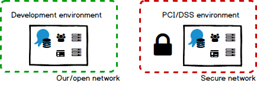

These organizations still want all of the Octopus-goodness, like promoting the same release through the environments, overall orchestration, and seeing the progression on the dashboard. But they don't want the development Octopus Server to be connected to the production environment. It's also common to want a different set of users (possibly from a distinct Active Directory domain) to have permissions to the production Octopus Server.

### Geographically distant environments

Other organizations may deploy to geographically-distant environments.

For example, their development environment may be located in [Brisbane, Australia](http://www.visitbrisbane.com.au/) (it's a great place to live!), while their production environment is hosted by data centers in the US and Europe.

There are two main problems with this, both related to performance:

1. Packages are transferred at deployment time. If packages are large this can take quite a long time.
1. Information has to be shipped back and forth between the Octopus Server and deployment targets during deployments. High latency in these communications can have a significant impact on deployment durations.

These customers would like to promote the release at a time of their choosing, have packages automatically transferred efficiently to the appropriate data center, and then perform the deployment as quickly as possible.

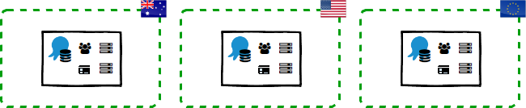

### Other examples

Some of our customers decide to manage their deployments across multiple Octopus Servers for a variety of other reasons. We think our proposed solution will help customers who are:

- dividing their work amongst multiple teams, possibly distributed around the world
- using a Service Oriented (SOA) or Microservices architecture
- using Octopus to deploy their software directly into their customer's networks
- depending on a combination of all these examples

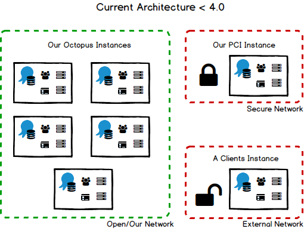

## Proposed solution

Our proposed solution will enable you to **spread your entire deployment lifecycle across multiple Spaces**, allowing you to **promote releases to other Spaces**, and **flow deployment results back again** to be displayed on dashboards.

Imagine if you could add a Space to your Lifecycle, just like you can add environments, and then promote a release to another Space. When you promote a release to another Space, Octopus could bundle up everything required to deploy that release into the environments in the _other_ Space. We will also cater for scenarios where there is strict separation between your Spaces (think PCI DSS). That's why we're calling this feature **Remote Release Promotions**.

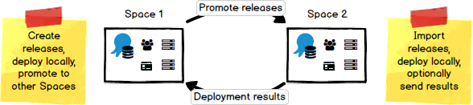

We think there are three major concepts at play to make all of this come together: **Spaces**, **Trusts**, and **Lifecycles**.

### Spaces

A **Space** is a concept we introduced in our [previous RFC](https://octopus.com/blog/odcm-rfc). Each Space has its own set of projects, environments, lifecycles, teams, permissions, etc.

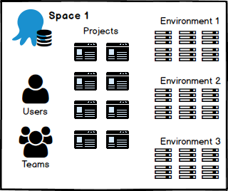

#### Connected Spaces

If you are happy for your Spaces to communicate, then we will be able to add a lot of sugar. Promoting a release to a remote Space will be as simple as pushing a button (or hitting the API). Likewise you could have the deployment results flow back automatically so your dashboard is always up to date.

#### Disconnected Spaces

We will also support isolated Spaces, as this is a common security scenario. Things will by necessity have to be more manual; you may have to do a little more typing (and even some walking!).

### Trusting other Spaces

We already have the concept of establishing trust between [Octopus Server and Tentacle](https://octopus.com/docs/reference/octopus-tentacle-communication): it will only execute commands sent from a trusted Octopus Server. We also think it's important that a trust relationship is established between two Spaces before they start sharing things like _everything required to deploy a release_ and _the results of deploying a release_. We talked about [sharing](/blog/2017-05/odcm-rfc.md#sharing) in our recent blog post introducing the concept of spaces and the Octopus Data Center Manager (ODCM).

At its core this relationship will consist of a _Name_ and an _X.509 Public Key Certificate_. This will enable each Space to uniquely identify the source of information, and validate the integrity of the information, just like [Octopus Server and Tentacle do today](https://octopus.com/docs/reference/octopus-tentacle-communication). We think the best way to configure this relationship is using [ODCM](https://octopus.com/blog/odcm-rfc) since its core capability is managing Spaces.

This means you are in control of which information flows between different Spaces, and you can audit it all in one place.

### Lifecycles

We think Lifecycles should be _defined_ within a Space and able to be _composed_ across multiple Spaces - you can think of it like chaining together Lifecycles from different Spaces.

**Define within a Space:** This gives the teams in each Space the ability to manage their own environments and Lifecycles how they see fit. For example, a member of one Space might decide to introduce an environment into their Lifecycle. We don't want the decision to introduce an environment into a Lifecycle in one Space to have any impact on any other Spaces.

**Compose across Spaces:** This gives you the ability to model your overall deployment pipeline as a **Composite Lifecycle** made by connecting together Lifecycles which are defined in different Spaces. For example:

1. You might want to promote a release through your test environments, then promote the release to one or more Spaces that manage the production environments.

    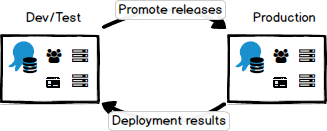

    

1. You might want to promote a release through your Dev team's test environments, then promote the release to another Space managed by a QA team. When they are finished testing you want the Dev team to promote that same release to yet another Space where the Operations team manages your production environments.

    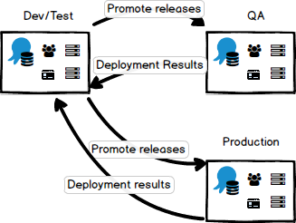

1. You might want to do the same as #2, but once the QA team is finished they promote the release directly to the Operations team's Space without going back through the Dev team.

    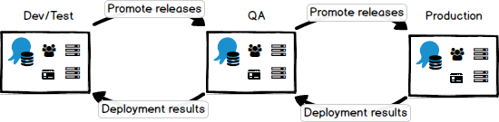

## Definitions

In the rest of this RFC we are going to introduce some new terms. Let's define them here so we don't all get horribly confused.

- **Space:** Contains a set of projects, environments, variables, teams, permissions, etc, bounded by a single Octopus database. Learn more in our recent [RFC](/blog/2017-05/odcm-rfc.md).
- **Release Bundle:** A package containing everything required to deploy a specific release of a project.
- **Deployment Receipt:** A document containing everything required to show the result of deploying a specific release of a project.
- **Source Space:** The Space that owns the project and its releases, and where release bundles are created if you decide to cross Space boundaries.
- **Target Space:** The Space where a release bundle will be imported. The release extracted from the release bundle can then be deployed to environments in this Space.
- **Remote Environment:** A reference to an environment owned by another Space.
- **Remote Project:** A reference to a project owned by another Space.
- **Remote Space:** A reference to a Space managed by a different ODCM, usually in a different secure network zone. The concept of a **Remote Space** will enable you to promote releases across secure network boundaries.
- **Variable Template:** We introduced this concept with multi-tenant deployments. In this context you could express that a variable value is required for each environment a project can be deployed into.

## Example: Secure Environments

Let's explore this concept using the **Secure Environments** example we mentioned earlier, where you want strict separation between your development and production environments. In this case we will model this separation using two Spaces:

- `DevTest Space`: where your application is deployed for development and testing purposes
- `Prod Space`: where the production deployments of your application will be deployed and strict compliance controls are required

Let's consider how each different person in your organization might interact with Octopus to promote a release across these two Spaces all the way to production.

### Configuring Spaces

> TL;DR Use ODCM to configure relationships between Spaces, both connected and disconnected.

A good place to start is by configuring your Spaces and establishing a trust relationship between them. In cases like the Secure Environments scenario, we think you will end up installing an instance of ODCM inside each secure network zone. This will allow your teams to independently manage the Spaces inside each zone, and configure trusts between Spaces in the same zone or across different zones as required.

We think the overall process will look something like this:

1. Configure your secure network zones
1. Configure an instance of ODCM in each zone for managing the Spaces in that zone
1. Use ODCM in the **production zone** to create the `Prod Space`
1. Use ODCM in the **development zone** to create the `DevTest Space`
1. Use ODCM in each zone to configure a trust relationship between your Spaces

Since there is strict separation between the zones you will have to configure two **Remote Spaces** to trust each other manually, by exchanging the X.509 Public Key Certificates for each Space:

1. Use ODCM in your **development zone** to download the X.509 Public Key Certificate for the `DevTest Space`.
1. Go to the ODCM in your **production zone** and create a new **Remote Space** called `DevTest Space` giving it the X.509 Public Key Certificate you downloaded for the `DevTest Space`.
1. Use ODCM in your **production zone** and download the X.509 Public Key Certificate for the `Prod Space`.
1. Go to the ODCM in your **development zone**, create a new **Remote Space** called `Prod Space` giving it the X.509 Public Key Certificate you downloaded for the `Prod Space`.

Now the `DevTest Space` knows about the existence of the `Prod Space` you will be able to promote releases to that Space. Additionally, since you've exchanged public keys, the `Prod Space` can trust Release Bundles promoted from the `DevTest Space`, and `DevTest Space` can trust Deployment Receipts from the `Prod Space`!

### Working with projects

> TL;DR Nothing much changes - everything will feel very familiar.

We don't see very much changing - life will pretty much go on just like before. You will still be able to change the deployment process, manage variables, and create and deploy releases to environments in the `DevTest Space` just like normal. However in this example the `Production` environment is owned by the `Prod Space`, meaning the `DevTest Space` has no concept of this environment:

- How do you provide variable values that will be used when deploying to the `Production` environment?
- How do you configure special steps of your deployment process so they only execute when deploying to the `Production` environment?
- How do you show the result of deployments to the `Production` environment on your dashboards?

Please welcome **Variable Templates** and **Remote Environments**!

#### Variable Templates

> TL;DR Extending variable templates to enable per-environment variable values.

Imagine if you are the person importing a release bundle into your Space - how do you know which variables need values for each environment in your Space? And even if you know which variables you need to set, what should you set the value to?

Now imagine as a project contributor if you could express that a variable value is required for each environment a project can be deployed into. And imagine you could define a data type for the variable, provide help text, decide whether the value is mandatory or optional, or even provide a default value.

Variable templates could make it much easier for a person importing a release bundle into their Space to "fill in the blanks".

:::hint
This would also be really handy even if you are only promoting releases within your own Space. Using variable templates, if you introduce a new environment into your own Space, Octopus will prompt you for those variable values.
:::

We introduced the concept of [Variable Templates](https://octopus.com/docs/deploying-applications/variables/variable-templates) for multi-tenant deployments in Octopus 3.4. We would like to build on this concept further as part of this set of features.

_Note_: This will also allow tenant variables to vary per environment (a [much requested feature](https://github.com/OctopusDeploy/Issues/issues/2710)).

#### Remote Environments

> TL;DR Optionally add environments owned by other Spaces for scoping deployment steps and variable values, and display on the dashboards.

We want to enable scenarios where you promote releases to other Spaces without needing to know anything about the environments in that Space. However, we can see scenarios where you will want to know about environments in other Spaces:

- you want certain steps to be executed when deploying a release to the `Production` environment
- you already know a handful of variable values required when deploying a release to the `Production` environment (perhaps they aren't secret)
- you want to see the results of deploying a release to the `Production` environment on your own dashboard

The problem here is that the `Production` environment is owned by the `Prod Space`, so your `DevTest Space` doesn't know the `Production` environment exists! Imagine if you could add a **Remote Environment** to the `DevTest Space`. This remote environment would be like a placeholder for the real `Production` environment. Octopus could even name it `Prod Space: Production` so we are all clear about the ownership of this environment. _Think of this like namespaces: so you can have a `Production` environment in multiple Spaces._

We think the process would be something like this:

1. Go to the Environments page and click the `Add environment` button
1. Octopus could show a list of Spaces it knows about, in this case the `Prod Space`
1. Select `Prod Space` as the owner of the environment (indicating this is a remote environment)
1. Name the environment `Production` so it matches

Now that you have configured the `Prod Space: Production` environment:

- you could scope steps to `Prod Space: Production`, and those steps will be run when a release is eventually deployed to that environment.
- you could set variable values in your `DevTest Space`, scope them to `Prod Space: Production`, and they will be used when a release is eventually deployed to that environment.

### Configuring a Lifecycle including other Spaces

> TL;DR Other Spaces and Remote Environments can be added to Lifecycles.

In order to promote a release to the `Production` environment, you will need to configure a Lifecycle with the ability to target the `Prod Space`. We think you should be able to add Spaces into the Phases of your Lifecycle just like you can add environments in Octopus today. This would work quite nicely for our example scenario where you just want the release promoted to the `Prod Space`.

What if you wanted to create a more complex Lifecycle? For example, you promote releases to a `QA Space` for testing by the QA team, and wait for them to finish testing it before Octopus will allow you to promote that release to the `Prod Space`? We think you should be able to add **Remote Environments** to your Lifecycles making Octopus behave just like that environment was part of the same Space.

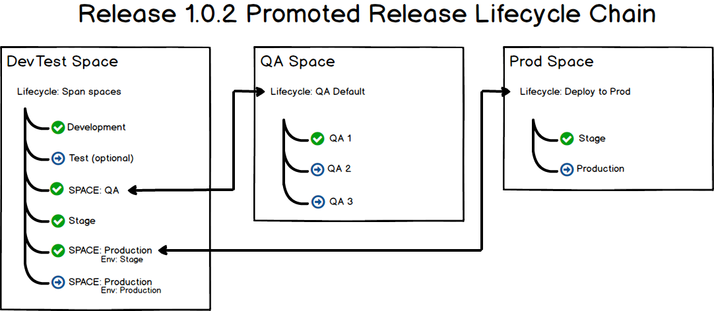

#### Dashboards and Remote Environments

> TL;DR Remote Environments can be displayed on dashboards.

By adding a **Remote Environment** to your Lifecycle, Octopus could add that environment to your dashboards. We are planning a way to flow the result of your deployments back to their Source Space. This means you could see a summary of the deployments across your entire deployment lifecycle even if it crosses multiple Space boundaries.

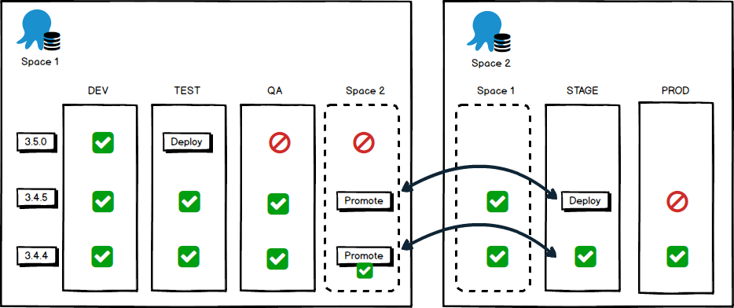

### Promoting releases to other Spaces

Eventually you want to deploy a release to the `Production` environment! Since you have added the `Prod Space` to your Lifecycle, you could promote your release to the `Prod Space`. At this point Octopus would create what we are calling a **Release Bundle**: a set of files including everything required to deploy that release to environments owned by other Spaces.

In our example somebody would have to manually transfer the Release Bundle to the `Prod Space` and import it. If your Spaces are connected, Octopus could automate a lot of this process for you.

#### Release bundles

> TL;DR Contains everything required to deploy a release into the environments owned by another Space. Sensitive parts encrypted. Signed to validate integrity and trust.

Up to this point we've talked about a Release Bundle but we haven't gone into much detail. We are still figuring out the details, and would welcome your feedback.  Here are a few of our current thoughts:

- Essentially, the Release Bundle will contain everything required to promote the release to the remote Space.  This will include:
  - Release Details: Version, Notes, Channel
  - Deployment Process
  - Variables

- The Release Bundle will _not_ include the packages themselves, but instead it will include a manifest of all the packages required by the release, including the ID, Version, and Hash:
    - This will enable the packages to be transferred or replicated to the other Spaces in the most efficient manner possible, perhaps using delta compression, or you might want to take care of this yourself.
    - This will also enable the _Target Space_ to validate the identity and integrity of the packages being deployed - they are guaranteed to be the same ones that were tested.

- The Release Bundle will contain a summary of the completed deployments in previous Spaces, allowing them to be optionally displayed on the dashboard in the remote Space.
- When building the Release Bundle the _Source Space_ will encrypt any sensitive information with the certificate of the _Target Space_ so it can only be decrypted by the _Target Space_.
- When building the Release Bundle the _Source Space_ will digitally sign the bundle with the private-key of the _Source Space_ so the _Target Space_ can validate the source and integrity of the bundle before importing it.
- The Release Bundle will have a schema version. Bundles can be transferred between Spaces with compatible schema versions. Our hope is that the Release Bundle schema version will change far less frequently than Octopus Server versions, allowing compatibility between a range of Octopus Server versions.

### Importing releases into your Space

> TL;DR Imports remote project, release, process and variable snapshot. You choose the Lifecycle for the release.

Once the **Release Bundle** has been transferred to the `Prod Space` you will need to import it. There will be a lot of details to figure out, but at the highest level we expect the process to look something like this:

1. You could be shown a list of **Release Bundles** ready to be imported and you choose to import one.
1. You could be shown a display including the packages required for the release, bundled variable values, variable templates, and the deployment process.
1. The project will be imported as a **Remote Project**. Similar to a **Remote Environment** your project would be namespaced like `DevTest Space: My Project`. We also think the **Remote Project** should be largely read-only, and will probably use a fairly different UI to normal projects.
1. The release itself will be imported along with the deployment process snapshot and variable snapshot that were frozen when the release was created.
1. You will need to choose the Lifecycle you want to use for promoting this release through the environments in the `Prod Space`. If your project only uses a single Lifecycle it could be chosen automatically.
1. Octopus will prompt you to set any missing variable values for your environments and tenants before the release can be deployed.

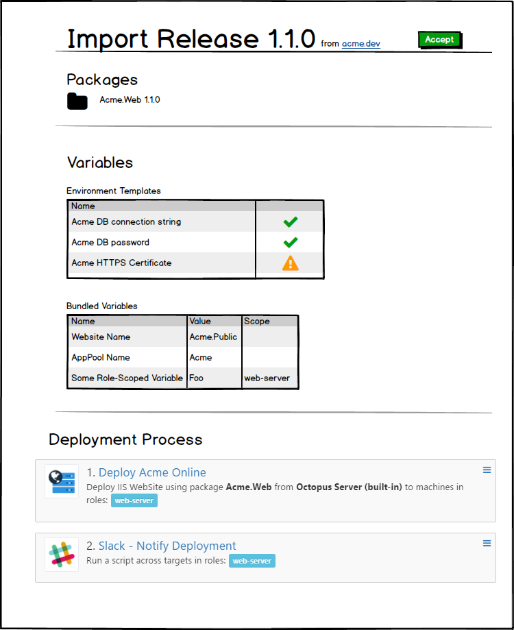

:::hint
The person importing **Release Bundles** will need to be granted all the permissions to create and edit projects, variables, packages, etc.
:::

#### Mostly read-only

> TL;DR Things owned by other Spaces will generally be read-only.

We think it's worth calling out: almost everything that will be imported will be read-only, and some concepts won't even be transferred across Space boundaries. The end goal is to reliably deploy a release into your environments avoiding as much manual intervention as possible. There are still a lot of details to sort out, but we think a good rule of thumb will be:

- Anything used to build a release will be read-only in remote Spaces
- Anything used to customize a deployment will be editable in remote Spaces

For example, we expect you will want the deployment to use the process as it was when the release was created (repeatability) but have the chance to set the correct database connection string for your environments/tenants (variability). Here are some other examples:

- **Project Triggers** are all about automatically triggering deployments - they should be configured where the deployments are happening
- **Tenants** are about allocating deployment targets and defining deployment variable values - they should be configured where the deployments are happening
- **Channels** only really matter up to the point where you create a release, and you will need to choose a Lifecycle when importing - channels should be configured where the releases are created

#### Deployment process and variable snapshots

> TL;DR View the deployment process and project variables for specific releases, and even view the differences between two releases.

We think an important part of this feature will be the ability to view and understand the deployment process and project variables that were frozen into a snapshot when the release was created. Imagine trying to import and approve a release for deployment without being able to see the process and variable values that will be used during deployment?

This is actually a problem we've wanted to solve for quite some time: in Octopus today, you can see the variable snapshot (if you can find the correct link) but you cannot see the deployment process as it was defined when the release was created. Imagine if you could even view releases side-by-side to compare them with each other!

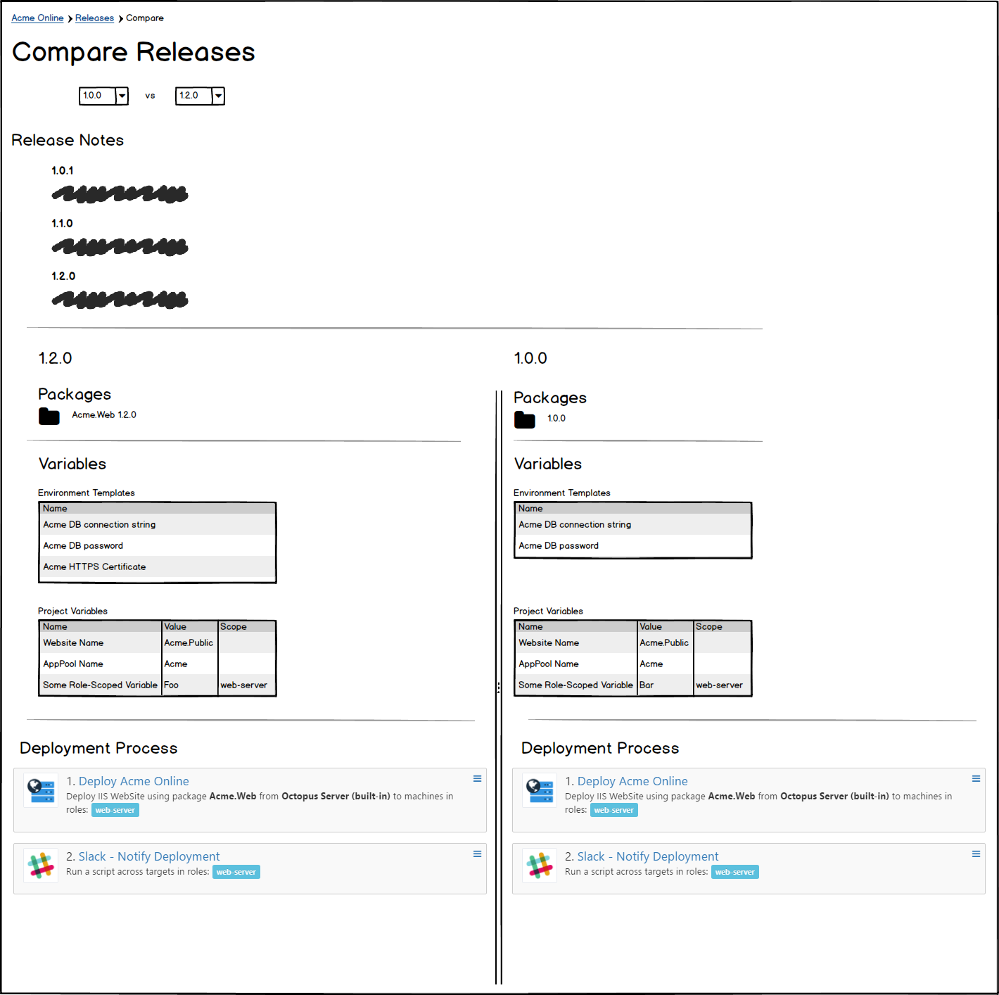

### Approving releases

> TL;DR Approve releases as part of your lifecycle.

Depending on your scenario you may require a multi-team approval before a specific release can be deployed to an environment. In Octopus today you can configure your deployment process to use a [manual intervention step](https://octopus.com/docs/deploying-applications/manual-intervention-and-approvals) as a way of approving the *deployment of a release to an environment*.

As an alternative, imagine if you could add an **Approval Phase** to your Lifecycles? In this way you could configure Octopus to require approval for a specific *release* before it can progress to the next phase of the Lifecycle. This way the approval becomes a key component of your Lifecycle, and once a release has been approved you could deploy it as many times as you want without manual intervention in your deployment process.

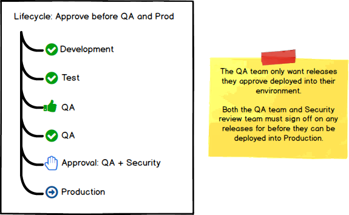

### Deploying releases

> TL;DR Deploy the release just like it was created in this Space.

Now the release has been accepted it can be deployed to the environments in the `Prod Space`. For all intents and purposes this would work just like the release was created in the `Prod Space`: all the same rules would apply for deploying this release including:

- Project permissions: teams could be restricted to **Remote Projects** just like normal projects - after all, they are just normal projects but owned by another Space
- Environment permissions: teams in the `Prod Space` could be granted appropriate permissions to environments in the `Prod Space`, just like normal
- Lifecycle progression: Octopus will ensure each release progresses through the appropriate Lifecycle in the `Prod Space`, just like normal

## Tenants

> TL;DR Tenants are a deployment-time concern and will not cross over Space boundaries.

We wanted to call out tenants specifically because they could arguably be treated similarly to environments. At this point we are not 100% certain about how we will handle tenants, but our current thinking is:

- Tenants will be owned by the Space where their deployments will be performed.
- Tenants in one Space cannot be connected to environments owned by another Space.

## Superseded Solutions

- Octopus Migrator import
- Offline Drops
- `octo.exe` export/import
- Custom scripting using the Octopus REST API
- Manually migrating everything

The intention of this feature is to supersede the current methods used to migrate or deploy to remote machines. If you have used either the migrator or `octo.exe` import/export to move releases between Octopus instances you know that there are benefits for both methods, but also that it still requires a fair amount of scripting or interaction to use either for your purposes. Both of these will be deprecated and replaced by Remote Release Promotions. We are aware of customers who instead of either of these features wrote their own migration to avoid all the limitations they found in either feature. We have tried to address anything we knew about in the remote releases feature, so please let us know if you think anything was missed that you currently do via your own process. Migrator export will still exist for those using the JSON files in source control to detect changes and backup processes.

It was also decided that we will be replacing Offline Drops with this feature. While it may not seem a direct correlation, and you will require an Octopus Server on the other side to catch the release bundle, many of the suggestions and limitations around Offline Drops are the missing pieces that are provided by Octopus Server. These include basic orchestration, output variables, logging, and deployment status to name a few. It will allow you to move the release to a centralized Octopus Server within the network boundary and make use of the extended orchestration by deploying to the local Tentacles.

## Octopus 4.0 architectures

In a post-Octopus 4.0 world you will be able to model lots of interesting scenarios using multiple Spaces with releases flowing between them, even if the Spaces are connected or disconnected.

### Example: Connected architecture

This is an example architecture where you have multiple teams working in their own Spaces, then pushing releases to production Spaces that are hosted on-premises in the US, and in the public cloud in Australia and Europe. All of the Spaces are managed by the same ODCM which makes it easy to manage teams and trusts across everything. Since all of the Spaces are connected you can achieve a high level of automation for your deployments, even across multiple Spaces.

### Example: Disconnected architecture

This is an example architecture where you have multiple teams working in their own Spaces, then pushing releases to production Spaces hosted in other data centers. The important difference here is that the Spaces in each data center are managed by their own ODCM. You can still have the exact same end result as the connected architecture, the only downside being you won't be able to achieve the same level of automation across the disconnected Spaces.

## Roll-out

Remote Release Promotions will form part of Octopus 4.0, along with the [Spaces/ODCM feature](https://octopus.com/blog/odcm-rfc) (and likely a bunch of other goodies too).

Some components of this feature are quite independent, and we feel they will add value outside of Remote Promotions. For example: per-environment variable-templates and comparing releases. 
Wherever possible, we intend to implement these and get them into your hands as quickly as we can.  You can expect to see them trickling out in the coming months.

## Feedback

Hopefully you can tell we have put a lot of thought into this set of features. We have tried to cover all of the scenarios and nuances we've encountered in our relationship with a variety of customers. There is a lot to digest here, but if you are in one of these kinds of scenarios it's quite likely you very quickly associated with parts of this RFC.

**We would really like to hear from you!** Which features resonate with you and will make your situation better? Perhaps there are some pieces of the puzzle we are missing for your scenario?

Feel free to leave a comment below, or if you really want to get involved in the nitty gritty of the design, head over [here](https://github.com/OctopusDeploy/specs) to join in the conversation!