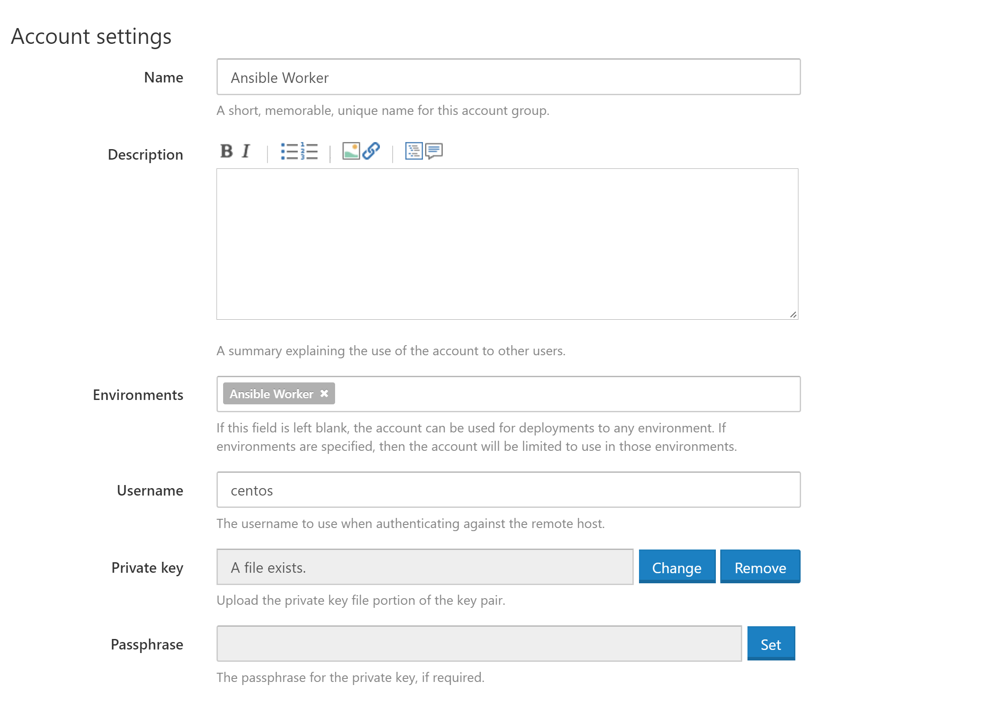
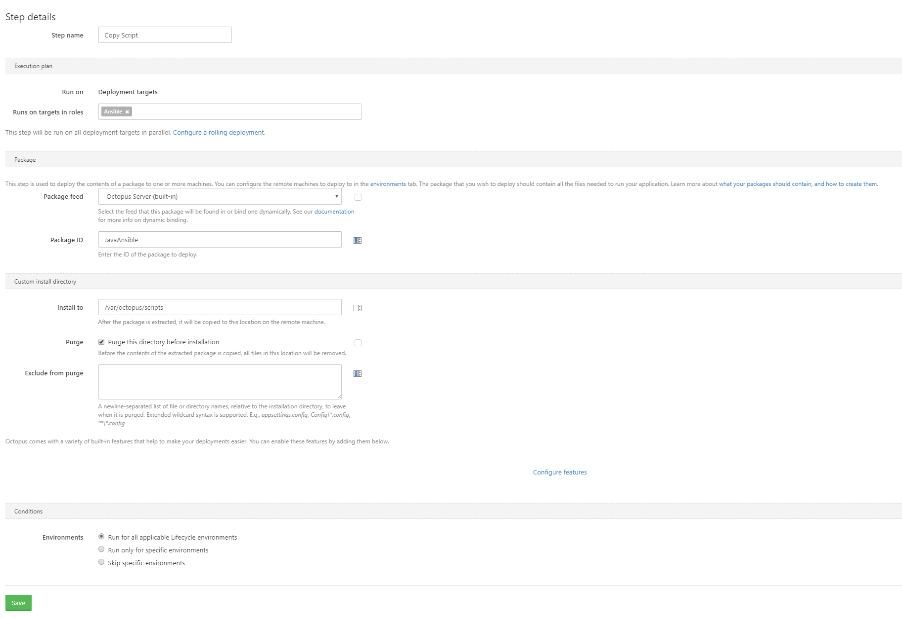

Chances are you are familiar with the features Octopus provides to manage and deploy your code.  These days cloud services like AWS and tools like Ansible turn your infrastructure into code too, so why not deploy your Ansible, Chef or Puppet scripts with Octopus?

In this blog post I'll run you through the process of creating a simple Windows instance in AWS using Ansible and Octopus Deploy.

## Why Use Octopus with Ansible?

Before we get into the details of running Ansible scripts in Octopus, a natural question is why would you do this? There are a couple of benefits to using Octopus for infrastructure deployments.

* You can now progress infrastructure through environments (like dev -> test -> prod) like you do today with your application code.
* Your infrastructure deployments are audited, so you can see exactly who deployed what and when.
* Wrapping up Ansible code in versioned packages makes it easy to revert back to a previous version of your infrastructure.
* The Ansible logs are saved by Octopus, and are easy to review at a later date.
* Your infrastructure deployments can take advantage of the Octopus security features, making it easy to define who can deploy what infrastructure where.

## Getting the Source Code

The Ansible code used in this blog post can be found in [GitHub](https://github.com/OctopusDeploy/AnsibleDemo).

## Preparing the AWS Resources

While Ansible has support for configuring Windows targets, it is not designed to be run from a Windows host. The [documentation says that](http://docs.ansible.com/ansible/intro_windows.html):

> Running Ansible from a Windows control machine directly is not a goal of the project.

This means we need to create a Linux instance that will run the Ansible scripts on behalf of Octopus.

Of course we can use Ansible to create this Linux host!

But before we start creating instances, we first need an IAM role called `AnsibleWorker` that we can assign to EC2 instances that will be running Ansible on our behalf.

This role will need the ability to create, query and destroy EC2 instances. In this case we are only working in the `us-east-1` region, so we'll only give the role permissions in that region. This IAM policy will grant these permissions.

```
{
    "Version": "2012-10-17",
    "Statement": [
        {
            "Action": "ec2:*",
            "Effect": "Allow",
            "Resource": "*",
            "Condition": {
                "StringEquals": {
                    "ec2:Region": "us-east-1"
                }
            }
        }
    ]
}
```

:::hint
Something that always trips me up with these IAM policies is when to use `"Resource": "*"` and when to use an ARN.

[Supported Resource-Level Permissions for Amazon EC2 API Actions]( http://docs.aws.amazon.com/AWSEC2/latest/UserGuide/ec2-supported-iam-actions-resources.html) contains a list of actions that support resource-level permissions. If an Amazon EC2 API action does not support resource-level permissions, you can grant users permission to use the action, but you have to specify a * for the resource element of your policy statement.
:::

We'll also need to allow this role to assume itself using the [AWS Security Token Service](http://docs.aws.amazon.com/IAM/latest/UserGuide/id_credentials_temp.html). We'll make use of STS in Ansible to generate the tokens (i.e. the access token, secret token and session token) that Ansible AWS steps require to function.

:::hint
Replace `accountid` in the policy below with your AWS account ID.
:::

```
{
    "Version": "2012-10-17",
    "Statement": [
        {
            "Effect": "Allow",
            "Action": [
                "sts:AssumeRole"
            ],
            "Resource": [
                "arn:aws:iam::accountid:instance-profile/AnsibleWorker"
            ]
        }
    ]
}
```

Finally the role will need to trust itself in order for the STS tokens to be generated. You can configure this trust via the AWS web console by clicking the `Trust relationships` tab in the IAM role and allowing the role trust itself to run the `sts:AssumeRole` action.

```
{
  "Version": "2012-10-17",
  "Statement": [
    {
      "Effect": "Allow",
      "Principal": {
        "Service": "ec2.amazonaws.com"
      },
      "Action": "sts:AssumeRole"
    },
    {
      "Sid": "",
      "Effect": "Allow",
      "Principal": {
        "AWS": "arn:aws:sts::accountid:assumed-role/AnsibleWorker/i-abcdef01234567890"
      },
      "Action": "sts:AssumeRole"
    }
  ]
}
```

## Configuring the AWS Credentials

To start with we have something of a chicken/egg situation where we want to run some Ansible to create the instance that will be used to run some Ansible.

To work around this we will be running the Ansible script that creates the Ansible worker locally. So you will need a Linux instance to run this initial Ansible playbook. See the [Ansible Installation docs](http://docs.ansible.com/ansible/intro_installation.html) to get your local environment up and running.

:::hint
Although the Windows Linux Subsystem (i.e. Bash on Windows) is not officially supported by either Microsoft or Ansible, I have used it pretty extensively with Ansible without any issues.
:::

You will also need to install the [AWS CLI tools](https://aws.amazon.com/cli/).

Ensure that you have configured your AWS credentials with an account that has permissions to create EC2 instances using the command:

```
aws configure
```

## Creating the Worker

The Ansible YML file shown below defines the tasks run by a role that will create a Centos 7 EC2 instance in AWS and configure it with everything we need to run Ansible scripts.

In this example I am placing the EC2 instance into the default VPC. If you have a custom VPC, you'll need to set the `vpc_subnet_id` option, and maybe also add the `assign_public_ip` option.

:::hint
I got the AMI ID from the list from [https://wiki.centos.org/Cloud/AWS](https://wiki.centos.org/Cloud/AWS).
:::

:::hint
Some EC2 instance types are only available inside a VPC. See [this documentation](http://docs.aws.amazon.com/AWSEC2/latest/UserGuide/using-vpc.html#vpc-only-instance-types) for a list that require a VPC.
:::

```
---
- name: Create Linux Server
  ec2:
    key_name: ThePrivateKeyName
    instance_type: m3.medium
    image: ami-ae7bfdb8
    wait: yes
    instance_profile_name: AnsibleWorker
    group: TheSecurityGroupName
    count: 1
    region: us-east-1
    wait_timeout: 3000
    volumes:
      - device_name: /dev/sda1
        volume_size: 80
        volume_type: gp2
        delete_on_termination: true
    instance_tags:
      Name: Ansible Worker
  register: linux_server_ec2

- name: Add Host to Inventory
  add_host:
    name: "{{ item.public_ip }}"
    groups:
      - centos_server
  with_items: "{{linux_server_ec2.instances}}"

- name: Wait for SSH to answer on all hosts
  wait_for:
    port: 22
    host: "{{ item.public_ip }}"
    timeout: 600
  with_items: "{{linux_server_ec2.instances}}"

- name: Pause for a bit
  pause:
    seconds: 30
```

Once the Centos instance is up and running, we then need to install the packages required by Octopus and Ansible.

You will notice that this role adds a SSH key called `ansible_rsa.pub`. You can generate this file using the command:

```
ssh-keygen -f ansible_rsa -t rsa -N ''
```

Keep both the `ansible_rsa` and `ansible_rsa.pub` files, because we'll need them later on.

:::hint
The example GIT repo includes the `ansible_rsa.pub` file, but you won't actually be able to use this public key as doesn't include the `ansible_rsa` private key file. You'll need to generate your own key pair and replace the public key to log into the Linux instance.
:::

```
---
- name: Add EPEL repository
  yum:
    name: https://s3.amazonaws.com/bamboo-support/epel-release-7-9.noarch.rpm
    state: present

- name: Install useful packages
  yum:
    name: wget,elinks,telnet,htop,mlocate,python-pip,vim,nano,jq,java-1.8.0-openjdk-devel,unzip,maven,libunwind,libicu,git,patch,zip

- name: Install mono key
  get_url:
      url: http://keyserver.ubuntu.com/pks/lookup?op=get&search=0x3FA7E0328081BFF6A14DA29AA6A19B38D3D831EF
      dest: /tmp/GPG-KEY-mono
      mode: 0440

- name: import mono key
  rpm_key:
    state: present
    key: /tmp/GPG-KEY-mono

- name: Add mono repo
  yum_repository:
    name: mono
    description: Mono repository
    baseurl: http://download.mono-project.com/repo/centos7/
    gpgkey: http://keyserver.ubuntu.com/pks/lookup?op=get&search=0x3FA7E0328081BFF6A14DA29AA6A19B38D3D831EF
    gpgcheck: yes
    enabled: yes

- name: Install mono
  yum:
    name: mono-devel

- name: Set JAVA_HOME
  lineinfile: dest=/etc/environment state=present regexp='^JAVA_HOME' line='JAVA_HOME=/usr/lib/jvm/jre-1.8.0'

- name: Install the 'Development tools' package group
  yum:
    name: "@Development tools"
    state: present

- name: Install python pip and other development libraries
  yum:
    name: python-pip, python-devel, python-lxml, openssl-devel

- name: Install Ansible and the AWS boto library
  pip:
    name: ansible, boto, boto3, pywinrm, requests-credssp
    state: latest

- name: Creates directory for ansible scripts
  file:
    path: "/var/octopus/scripts"
    state: directory
    owner: centos
    group: centos
    mode: 0775

- name: Set authorized key
  authorized_key:
    user: centos
    state: present
    key: "{{ lookup('file', 'roles/linux-ansible-target/files/ansible_rsa.pub') }}"
```

To actually communicate with the new Linux instance, Ansible needs to know what SSH private key file to use. This is defined in the `group_vars\centos_server.yml` file. You'll need to point the `ansible_ssh_private_key_file` setting to the location of the PEM file that matches the `key_name` that was defined in the `roles\centos-7-server-instance\tasks\main.yml` file.

```
---
ansible_ssh_private_key_file: /tmp/aws.pem
```

We then need to run both these roles from a playbook.

```
---
- name: Linux Server
  hosts:
    - 127.0.0.1
  become: false
  gather_facts: false

  roles:
    - centos-7-server-instance

- name: Ansible setup
  hosts: centos_server
  remote_user: centos
  become: true
  become_user: root

  roles:
    - linux-ansible-worker
```

Run the playbook with the command:

```
 ansible-playbook ansible-worker.yml
```

The end result of this Ansible script will be an EC2 instance running Centos that has Mono and Ansible installed ready to be used as a worker in Octopus.

## Creating a Windows EC2 Instance

For the purposes of this demo we will use Octopus and Ansible to construct a Windows 2016 server EC2 instance.

The process here is much the same as creating a Centos EC2 instance, but the user data has some interesting steps that make using the Windows instance easier.

```
---
  - name: Assume AWS Role
    sts_assume_role:
      role_arn: "arn:aws:iam::accountid:role/AnsibleWorker"
      role_session_name: "AnsibleBuild"
      region: us-east-1
    register: assumed_role

  - name: Create Windows Server
    ec2:
      aws_access_key: "{{ assumed_role.sts_creds.access_key }}"
      aws_secret_key: "{{ assumed_role.sts_creds.secret_key }}"
      security_token: "{{ assumed_role.sts_creds.session_token }}"
      key_name: OctopusVirginia
      instance_type: m3.large
      image: ami-f1b5cfe7
      wait: yes
      wait_timeout: 600
      group: SecurityGroupName
      count: 1
      region: us-east-1
      user_data: "{{ lookup('template', 'templates/userdata.txt.j2') }}"
      volumes:
        - device_name: /dev/sda1
          volume_size: 80
          volume_type: gp2
          delete_on_termination: true
      instance_tags:
        Name: Windows Server
    register: windows_server_ec2

  - name: Add Host to Inventory
    add_host:
      name: "{{ windows_server_ec2.instances[0].public_ip }}"
      groups: windows_server

  - name: Wait for WinRM to answer on all hosts
    wait_for:
      port: 5986
      host: "{{ windows_server_ec2.instances[0].public_ip }}"
      timeout: 6000
```

The `userdata.txt.j2` template contains a Powershell script that is run by the Windows instance as it is being created. We use this script to prepare the Windows instance to be managed by Ansible, and set the initial Administrator password.

You can find more details about the preparation of a Windows system for Anisble [here](http://docs.ansible.com/ansible/intro_windows.html#windows-system-prep).

We've also enabled server-side SSP for winrm (i.e. [CredSSP for second-hop remoting](https://blogs.msdn.microsoft.com/powershell/2008/06/05/credssp-for-second-hop-remoting/)), which is required when installing applications like SQL Server.


:::hint
Change `TheWindowsPassword` to something that conforms to the required password complexity rules. If you leave the password as this default, the Powershell script won't work as expected.
:::

```
<powershell>
Enable-WSManCredSSP -Role Server -Force
Set-Item -Path "WSMan:\localhost\Service\Auth\CredSSP" -Value $true
Invoke-Expression ((New-Object System.Net.Webclient).DownloadString('https://raw.githubusercontent.com/ansible/ansible/devel/examples/scripts/ConfigureRemotingForAnsible.ps1'))
$user=[adsi]"WinNT://localhost/Administrator,user"
$user.SetPassword("TheWindowsPassword")
$user.SetInfo()
</powershell>
```

There are some additional group variables that need to be defined to allow Ansible to interact with the newly created Windows instance. These are defined in the `group_vars\windows_server.yml` file.

```
---
ansible_user: Administrator
ansible_port: 5986
ansible_connection: winrm
ansible_password: TheWindowsPassword
ansible_winrm_server_cert_validation: ignore
ansible_winrm_transport: credssp
```

We'll install Chrome onto this server, because I really hate trying to get anything done in IE on a fresh Windows Server install.

```
---
- name: Install Chrome
  win_chocolatey:
    name: googlechrome
    state: present
```

This role is run with the `windows-server.yml` playbook.

```
---
- name: Create Windows Server
  hosts:
    - 127.0.0.1
  become: false
  gather_facts: false

  roles:
    - win-server-instance

- name: Configure Windows
  hosts: windows_server
  become: false
  gather_facts: false

  roles:
    - configure-windows
```

This playbook can be run with the command:

```
ansible-playbook windows-server.yml
```

## Creating an Ansible Package

Now that we have our Ansible scripts in place, we can create a versioned package that can be pushed to Octopus Deploy.

Because these scripts are hosted in GIT, we can use GIT to create a ZIP file. This has the benefit of not including the `.git` directory, as well as excluding any files not tracked by GIT.

```
git archive -o AnsibleInfrastructure.1.0.0.0.zip HEAD
```

This package can then be pushed to Octopus using the CLI tool.

```
octo push --package AnsibleInfrastructure.1.0.0.0.zip --apiKey API-YOURAPIKEYGOESHERE --server https://octopus.hostname
```

## Adding the Ansible Worker

The EC2 instance we created at the start of the blog now needs to be configured in Octopus. We'll add it as a [SSH target](https://octopus.com/docs/deployment-targets/ssh-targets), using the `ansible_rsa` private key to establish a connection.



:::hint
With a CI server like Bamboo you would typically have a pool of workers, and a job could be sent to any free worker instance. So one unit of work (usually an application build in Bamboo) is assigned to one worker.

Being primarily concerned with deployments, Octopus will take a package and install it on all targets. So one unit of work (a deployment in Octopus) is assigned to **all** targets.

Here we are creating a Octopus target and calling it a "worker". This works because we have one target, and Octopus will queue up deployments (or executions of Ansible playbooks in this case) to this one target.

Today Octopus doesn't have the notion of a pool of workers, one of which can be selected to run an individual unit of work. But if we only have one "worker" target then jobs will be queued as we expect.
:::

## Running the Ansible Playbook

Running the Ansible playbook is a 2 step process.

### Extract the Ansible Code

First we extract the package that contains the Ansible code that was pushed to Octopus in a previous step. This is done via the `Deploy a package` step, where the Ansible package is extracted into the `/var/octopus/scripts` directory on the worker.



### Run the Playbook

Next we run the Ansible playbook. This is done via a `Run a Script` step.

```
cd /var/octopus/scripts
ANSIBLE_HOST_KEY_CHECKING=False ansible-playbook windows-server.yml
```

:::hint
`ANSIBLE_HOST_KEY_CHECKING=False` is used to prevent SSH from prompting to trust the SSL target. It is not actually used with a Windows target, but you'll want to use it with Linux targets.
:::

## Conclusion

The end result of this process is a EC2 "worker" instance that can be used to run Ansible scripts on behalf of Octopus, and an example of an Ansible script that deploys a Windows server instance.

I hope you can see how easy it is to deploy your infrastructure as code, and how you can then build on this to take advantage of all the management features in Octopus that developers take for granted.
