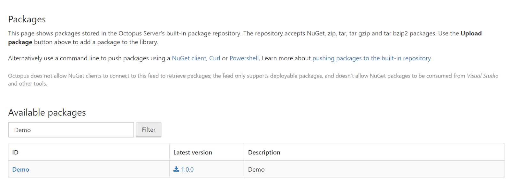
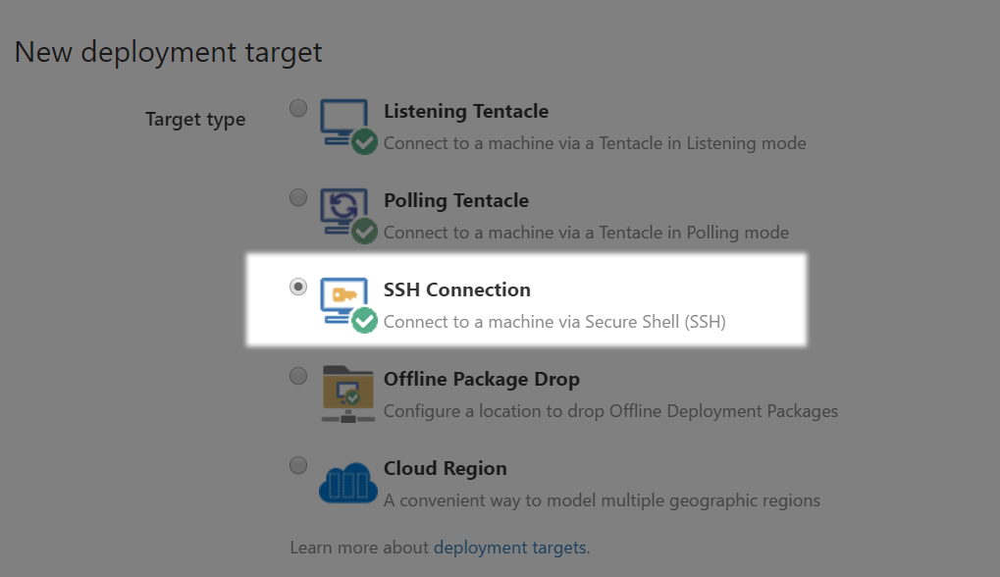

Octopus Deploy has a large collection of useful steps (both included and community provided) that can be used to deploy packages to a variety of different destinations and via different methods.
 
Fortunately these same deployment steps can be used to deploy Java packages to Java web servers running in Linux out of the box. 

There are some caveats, which I will call out. The Octopus Deploy team is actively investigating how to improve support for Java, so expect to see improvements for Java developers in coming releases.
 
The following steps provide an example of the process that can be implemented with Octopus Deploy to deploy a WAR file to a Tomcat server running in Linux.

## Building the WAR file
First, I am going to assume that you have a Maven project building a WAR file handy. If not, there is a small demo 
application at [https://github.com/OctopusDeploy/ThymeleafSpringDemo](https://github.com/OctopusDeploy/ThymeleafSpringDemo) 
that will be used for this example.
 
This project uses the [Maven wrapper](https://github.com/takari/maven-wrapper), so all Maven commands are passed through 
the `mvnw` script. This script will download and install the appropriate version of Maven for you if it is not already 
locally available, and then pass the arguments 
to the `mvn` executable.
 
To build the WAR file, run the command:
```
./mvnw clean package
```
 
This will result in the file `demo##<timestamp>.war` (e.g. `demo##201705290808.war`) being created in the `target` directory.
 
The timestamp component of the WAR file is used by the 
[Tomcat parallel deployment feature](https://tomcat.apache.org/tomcat-8.0-doc/config/context.html#Parallel_deployment). 
It allows Tomcat to drain connections to old versions of the web application, while directing new traffic to the latest version.
 
## Packaging the WAR file
This is where some of the conventions required by Octopus Deploy differs from those typically used by Java.
 
To upload a package to Octopus Deploy, it must follow a number of 
[versioning rules](https://octopus.com/docs/packaging-applications/versioning-in-octopus-deploy). In practice this means 
creating a zip or tar.gz archive with a file name like `demo.0.0.1.zip`.
 
In Java, versioning is mostly done by way of [Maven](https://docs.oracle.com/middleware/1212/core/MAVEN/maven_version.htm#MAVEN8855). 
Additionally the WAR file created above embeds a timestamp version into the WAR file name itself that is recognised by Tomcat. 
Octopus Deploy on the other hand uses [SemVer](http://semver.org/). All these versioning scheme are mostly incompatible, and the built 
in repository currently does not support WAR files, which means we can't upload the WAR file as is.
 
The solution is to pack the WAR file into an appropriately named ZIP file, which can then be uploaded to Octopus Deploy. 
This “WAR in a ZIP” package allows us to have the WAR file managed by Octopus Deploy, but does have some drawbacks, which 
I will mention later.
 
To package up the WAR file, use the 
[Octopus Deploy CLI tool](https://octopus.com/docs/octopus-rest-api/octopus-cli). The CLI tool is a 
[.NET Core](https://github.com/dotnet/core) application that exposes a number of common operations that can be performed 
in Octopus Deploy, along with some handy features like creating ZIP archives with the correct naming conventions.
 
If you are not familiar with .NET Core, for the purposes of this blog post it is enough to know that it allows .NET 
applications to be run across operating systems, including Linux. The Octopus Deploy CLI tool is a self contained package that 
includes the .NET Core runtime, and so when you [download](https://octopus.com/downloads) the version for your Linux distribution, 
you get (almost) everything you need to run the CLI.

You may need to install a few additional dependencies to run the CLI tool from Linux environments installed using “minimal” installation options. 
The documentation at the [Get Started with .NET Core](https://www.microsoft.com/net/core#linuxcentos) page lists the packages 
required for various Linux distributions.
 
To create the package, run the command:
```
octo pack --id=Demo --version=1.0.0 --basePath=target --include=*.war --format=zip
```
 
This will create the file `Demo.1.0.0.zip` which contains the WAR file.

:::hint
Using the CLI tool is not required for creating the ZIP file. Any ZIP tool will do. However the tools provided by Octopus Deploy are designed to yield high size reductions based on the actual content of your packaged files. See [Delta compression for package transfers](https://octopus.com/docs/deployments/packages/delta-compression-for-package-transfers#OptimizingDeltaCompression) for more information.
:::

## Pushing the Package
To push the package, use the [push command](https://octopus.com/docs/octopus-rest-api/octopus-cli/push):
```
octo push --package Demo.1.0.0.zip --server http://my.octopus.url --apiKey API-XXXXXXXXXXXXXXXX
```

You can find information on API keys at [How to create an API key](https://octopus.com/docs/how-to/how-to-create-an-api-key).

This adds the package to the Octopus Deploy built-in package repository so it can be used in deployments.  See [Package repositories](https://octopus.com/docs/packaging-applications/package-repositories) for more information.



## Creating the Octopus Deploy Environment
In Octopus, an environment is a group of machines that you will deploy to at the same time; common examples of 
environments are Test, Acceptance, Staging or Production. The 
[Getting Started](https://octopus.com/docs/getting-started#Gettingstarted-Createenvironments) documentation details the 
process of creating a new environment in Octopus Deploy.
 
## Creating an Octopus Deploy Deployment Target
Deployment targets represent the servers, machines and cloud services where your application and services will be deployed. 
The [Getting Started](https://octopus.com/docs/getting-started#Gettingstarted-Adddeploymenttargets) documentation details 
the process of creating a new deployment target in Octopus Deploy.
 
In this example we’ll create a deployment target to represent the Tomcat server running on a Linux host. Almost all Linux 
servers run SSH as a means of remote administration, and 
[Octopus Deploy supports SSH natively](https://octopus.com/docs/deployment-targets/ssh-targets), so this is the means of 
communication that we will use to deploy the WAR file.
 

 
Octopus uses a component called [Calamari](https://octopus.com/docs/octopus-rest-api/calamari) as the engine to execute deployments on deployment targets.
Calamari currently requires [Mono](http://www.mono-project.com/) as a dependency to provide a .NET environment to operate on Linux. 
You will need to install Mono onto the Tomcat server to allow the Calamari to run.  In the future, this will be simplified to use .NET Core without needing an additional dependency.
 
This can be confusing to people new to Octopus so I'll review this.  You just need to know that:

* The Octopus Deploy CLI tool uses .NET Core, and is self contained, although you may need to install additional dependencies. 
The CLI tool is run either on your own PC or on a CI server like TeamCity or Bamboo.
* Calamari, the Octopus deployment execution engine, uses .NET, and .NET is provided by Mono under Linux. Calamari is run on the host you are deploying to, 
like the Tomcat Server, which means the Tomcat Server also needs to have Mono installed.
 
:::hint
One thing to keep in mind with SSH deployment targets is that the user that makes the SSH connection needs to have permissions to deploy to the Tomcat `webapps` directory. Later on we’ll define some deployment steps that will copy the WAR file from the package that was uploaded earlier into the webapps directory, and this step will fail if the SSH user does not have the correct permissions to copy files into this location.
:::

:::hint
It is possible to deploy to a Linux server from Octopus Deploy without installing Mono.  This is handy however the tradeoff is that you lose a lot of the power that Calamari provides in executing deployments.  See [Trying Raw Octopus](https://octopus.com/blog/trying-raw-octopus) for more information.
:::

## Creating a Octopus Deploy Project
Projects define a set of deployment steps that you want Octopus to perform, and their configuration variables. The 
[Getting Started](https://octopus.com/docs/getting-started#Gettingstarted-Createaproject) documentation details the process 
of creating a new deployment target in Octopus Deploy.
 
Inside the project we need to open the Process section, and add the `Deploy a package` step.
 


The `Deploy a package` step provides a way for us to take a package and extract it to the desired location on the deployment targets. 
In our case, we are taking the ZIP package and extracting the WAR file to the Tomcat `webapps` directory.

:::hint
The `Configuration Variables` and `Configuration transforms` sections provide a lot of power that unfortunately we can’t use whiledeploying a Java application. These options assume that certain XML files are available directly inside the package. This is not the case when the package contains a WAR file, and any configuration files contained in the WAR file are not available to be modified during deployment. This is a limitation of using Octopus Deploy with Java artifacts, but is something that the Octopus team is looking into in order to better support Java in future releases.
:::
 
In order to define the location where the WAR file is extracted, click the `Configure features` link. Select the `Custom 
installation directory` option and click `Apply`.
 
A `Custom install directory` section will be added to the screen. Set the `Install to` field to the local path of the `webapps`
folder e.g. `/opt/apache-tomcat-8.5.15/webapps`.
 
You most likely want to leave the `Purge` option unselected, as Tomcat may be hosting other WAR files that you do not 
want to delete when extracting the `demo##<timetstamp>.war` file.
 

 
## Create an Octopus Deploy Release
A release captures all the project and package details so it be deployed over and over in a safe and repeatable way. The 
[Getting Started](https://octopus.com/docs/getting-started#Gettingstarted-Createareleaseanddeployit) documentation details 
the process of creating a new release in Octopus Deploy.
 
## Deploy an Octopus Deploy Release 
A deployment is the execution of the steps to deploy a release to an environment. An individual release can be deployed 
numerous times to different environments. The [Getting Started](https://octopus.com/docs/getting-started#deploy-a-release) 
documentation details the process of deploying a new release in Octopus Deploy.
 
In our case deploying the release means taking the package that was pushed to Octopus Deploy, installing Calamari on the 
Tomcat server, sending the package to the Tomcat server, and using the Calamari to extract the WAR file in the package 
into the Tomcat `webapps` directory.
 
## Summary
At this point Tomcat now has the WAR file extracted into the `webapps` directory, and the Java application will be 
deployed by Tomcat and run.
 
We’re currently working on add-ons for CI servers like Bamboo that will automate the process of packing, pushing and 
releasing deployments, and there is already a plugin for [TeamCity](https://octopus.com/docs/packaging-applications/build-servers/teamcity).
 
In future we are looking at ways to bring features like Configuration transforms to Java packages, which will mean that 
environment specific configuration like database connection strings will be applied to JAR, WAR and EAR files as they 
are applied to new environments.
 
 
