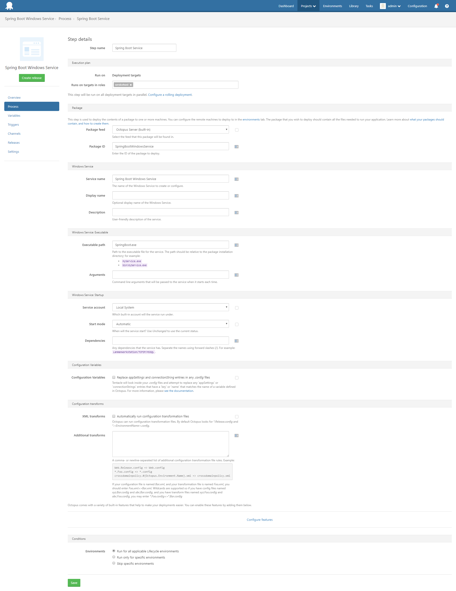
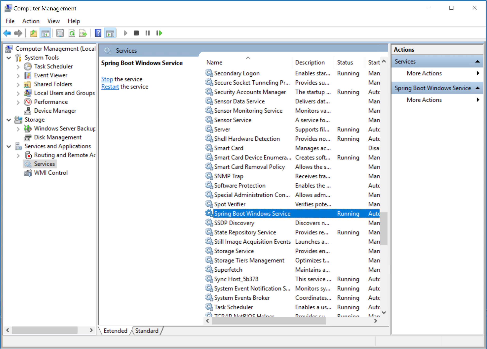

A customer recently asked if it was possible to deploy a Spring Boot application as a Windows Service using Octopus Deploy. The [Spring documentation](https://docs.spring.io/spring-boot/docs/current/reference/html/deployment-install.html#deployment-windows) does briefly mention a method for running Spring Boot applications as Windows services, but a lot of the details are left to the reader to figure out.  So in this blog post I'll show you how to quickly run a standard Spring Boot application as a service.

## Java and Windows services

There are two things we need to run a Spring Boot UberJAR as a Windows service.

The first thing is an executable that Windows can actually run as the service. This is provided by the [winsw](https://github.com/kohsuke/winsw) project.  Winsw is not specifically tied to Java, but it can be used to execute `java.exe`, which is all we need in order to start our Spring Boot JAR file.

The second thing is some way to gracefully shutdown a Java application running in the background. For that we have a simple project called the [Spring Boot Stopper](https://github.com/OctopusDeploy/SpringBootStopper) (based on the [Spring Boot Daemon](https://github.com/snicoll-scratches/spring-boot-daemon) project linked to from the Spring documentation). This application will communicate with a Spring Boot application via JMX and instruct it to shut down.

## Putting it all together

This [demo project](https://github.com/OctopusDeploy/SpringBootWindowsService) is a fairly stock Spring Boot REST MVC application generated using the [Spring Initializr](https://start.spring.io/) web site. The project hasn't been configured in special way, and when built will produce a stock Spring Boot JAR file.

In the `dist` folder of the project you will find a number of files.

* SpringBoot.exe - the winsw executable renamed.
* SpringBoot.exe.config - the [winsw EXE configuration file](https://github.com/kohsuke/winsw/blob/master/doc/exeConfigFile.md)
* SpringBoot.xml - the [winsw XML configuration file](https://github.com/kohsuke/winsw/blob/master/doc/xmlConfigFile.md)
* SpringBootStopper.jar - the [Spring Boot Stopper](https://github.com/OctopusDeploy/SpringBootStopper) JAR file
* SpringBootWindowsService.jar - the Spring Boot JAR file

The XML configuration file is where most of the magic happens. Inside you will find the following settings:

```
<executable>java</executable>
<startargument>-Dspring.application.admin.enabled=true</startargument>
<startargument>-Dcom.sun.management.jmxremote.port=50201</startargument>
<startargument>-Dcom.sun.management.jmxremote.authenticate=false</startargument>
<startargument>-Dcom.sun.management.jmxremote.ssl=false</startargument>
<startargument>-jar</startargument>
<startargument>SpringBootWindowsService.jar</startargument>
```

These settings define what the winsw executable will run when the Windows service is started. In this case we are starting the Spring Boot UberJAR `SpringBootWindowsService.jar` with some additional system properties that configure JMX. These system properties enable the [Spring Boot admin features](https://docs.spring.io/spring-boot/docs/current/reference/html/boot-features-spring-application.html#boot-features-application-admin), set the JMX port to `50201`, disable SSL and disable JMX authentication.

:::hint
Since there is no authentication and no SSL on the JMX port, as a security measure the port should be blocked by the firewall.
:::

We then have some additional settings to define what the winsw executable will run when the Windows service is stopped.

```
<stopexecutable>java</stopexecutable>
<stopargument>-jar</stopargument>
<stopargument>SpringBootStopper.jar</stopargument>
<stopargument>50201</stopargument>
```

Here we run the `SpringBootStopper.jar` application passing in the same JMX port that was used when starting the Spring Boot application. These settings allow `SpringBootStopper.jar` to connect to the running Spring Boot instance and gracefully shut it down.

## Packing up the service

To package these files up for Octopus Deploy, use the [CLI tool](https://octopus.com/docs/packaging-applications/create-packages/octopack).

```
octo pack --format=zip --id=SpringBootWindowsService --version=1.0.0
```

This will produce a file called `SpringBootWindowsService.1.0.0.zip`, which you can then push to the Octopus server with the command:

```
octo push --server=http://my.octopus.server --apiKey=API-xxxxxxxxxxxxx --package=SpringBootWindowsService.1.0.0.zip
```

## Deploying the service

At this point you can deploy the package as a traditional Windows service executing the `SpringBoot.exe` executable.



Once deployed, the service will appear like any other Windows service.



## Conclusion
Start the service up, and open a browser to http://localhost:8080/greeting. Your Spring Boot application is now running as a Windows service!

## Learn more

* Deep Dive: [How to deploy Spring Boot fully executable JAR files to EC2 Linux instances as services](https://hubs.ly/H0gyGw90)
* Documentation: [Java Applications](https://hubs.ly/H0gyHct0)
* Video: [Deploying a Spring Boot web application with Octopus Deploy](https://hubs.ly/H0gyGwX0)