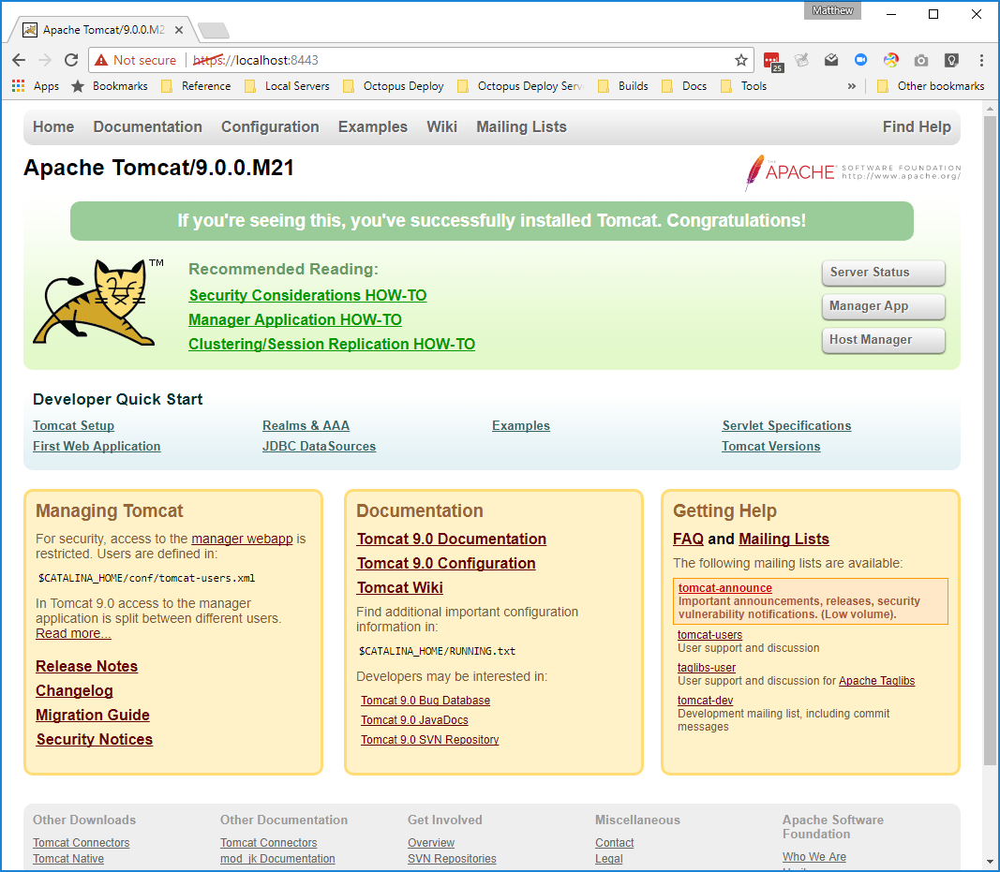

In a [previous post](https://octopus.com/blog/wildfly-https) I showed you how to export a certificate managed by Octopus Deploy into a Java keystore, and then configure WildFly to make use of the keystore to provide HTTPS access to web applications and management ports.

In this post I am going to show you how to do the same for Tomcat in Windows.

## Prerequisites

To run the commands and scripts in this blog post, you will need install some tools.

The first is an OpenSSL client.  I have used the Windows OpenSSL binaries made available from [Shining Light Productions](https://slproweb.com/products/Win32OpenSSL.html).

The second is the Groovy SDK.  You can download installers from the [Groovy downloads page](http://groovy-lang.org/download.html).

These steps were tested with [Tomcat 8](https://tomcat.apache.org/download-80.cgi), but should work with all versions of Tomcat over 6.

Finally you will also need [Java 8 JDK](http://www.oracle.com/technetwork/java/javase/downloads/jdk8-downloads-2133151.html) installed.

## Creating and Distributing Certificates

Because both WildFly and Tomcat use Java keystores, the instructions under [Creating the Certificate Store](https://octopus.com/blog/wildfly-https#creating-the-certificate-store) and [Exporting the Certificate Store](https://octopus.com/blog/wildfly-https#exporting-the-certificate-store) in the WildFly blog post can be applied exactly the same way with Tomcat.

If you follow those steps, your Tomcat instance will have a file called `C:\keystore.jks`.

## Configuring HTTPS in Tomcat

Configuring HTTPS support for Tomcat is actually pretty easy. We need to do two things:

1. Add a `<Connector>` element to the `server.xml` file that references the keystore, like so:
```xml
<Connector SSLEnabled="true"
    keystoreFile="C:\keystore.jks"
    keystorePass="Password01"
    port="8443"
    protocol="org.apache.coyote.http11.Http11NioProtocol"
    scheme="https"
    secure="true"
    sslProtocol="TLS"/>
```  
2. Ensure that the existing HTTP connector `redirectPort` attribute points to the HTTPS port, like so:
```xml
<Connector
   connectionTimeout="20000"
   port="8080"
   protocol="HTTP/1.1"
   redirectPort="8443"/>
```

To facilitate these changes, we have written a [Groovy script](https://github.com/OctopusDeploy/JBossDeployment/blob/master/tomcat-deploy-certificate.groovy) that will update the `server.xml` file with the necessary changes.

## Running the Script

To update Tomcat with HTTPS support, run the script like this:
```bash
groovy tomcat-deploy-certificate.groovy --tomcat-dir C:\apache-tomcat-8.5.15 --https-port 8443 --http-port 8080 --keystore-file C:\keystore.jks --keystore-password Password01
```

And that is it! Restart Tomcat and you will be able to access it over a secure connection.



## Next Steps
These Groovy scripts are being developed as a proof of concept for what will eventually be migrated into steps provided directly in Octopus Deploy.

If you have any questions about the script, please leave a comment. And if there are some Java features that you would like to see Octopus Deploy  support in future, join the discussion on the [Java RFC post](https://octopus.com/blog/java-rfc).
