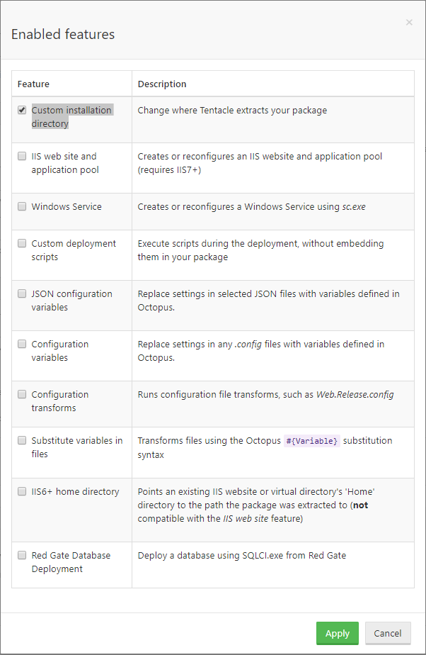
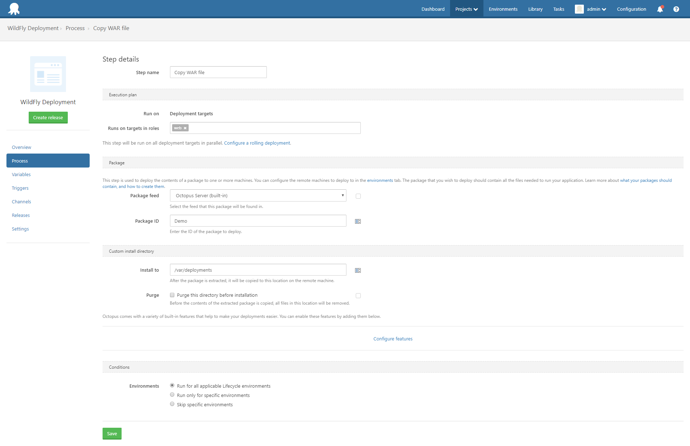

:::hint
This post was written for an old version of Octopus, before native Wildfly support was added.

Please visit the [Octopus Guides](https://octopus.com/docs/guides?destination=WildFly) for up to date instructions on deploying to Wildfly.
:::

At Octopus we have started a project to investigate how to better support Java developers.  In a previous blog post I talked about how to [deploy a WAR file to Tomcat using Octopus Deploy](https://octopus.com/blog/octopus-tomcat).  Tomcat is easily the most popular Java application server in production today (with stats from [Plumbr](https://plumbr.eu/blog/java/most-popular-java-application-servers-2017-edition) and [Rebel Labs](https://zeroturnaround.com/rebellabs/java-tools-and-technologies-landscape-for-2014/8/) putting Tomcat at over 50% market share).  The next most popular application server is JBoss/Wildfly, and in this post I'll show you how to deploy a WAR file to Wildfly 11 (currently in Alpha).

Like Tomcat, deploying a WAR file to Wildfly can be as simple as copying it to a special directory. In the case of Wildfly, copying a WAR file in to the `standalone/deployments` directory will trigger Wildfly to deploy and run the application. This is a perfectly valid deployment method, and if this works for you then the blog post on deploying to Tomcat applies equally as well to Wildfly.

However there are cases where simple file copies won't work in Wildfly. In particular, deployments to Wildfly domain controllers are often done via the JBoss CLI tool.

## Challenges With CLI Deployments

When deploying a WAR file from Octopus Deploy, ideally we want the steps to be idempotent. Idempotent is just a fancy way of saying that the deployment can be run any number of times, and the end result is the same.

This is not how the deployment operations in the JBoss CLI tool work out of the box. You can not execute a CLI command like

```
deploy myApplication.war --all-server-groups
```

multiple times, because once the file `myApplication.war` is in the Wildfly content repository, it can not be overwritten without an option like `--force`. Which naturally leads you to try and run a command like

```
deploy myApplication.war --all-server-groups --force
```

which doesn't work; you can not force the upload of the file and deploy it to a server group in one command.

What this means is that if you want to be able to deploy and redeploy an application into a domain environment, you need to do some extra work to ensure that the commands being run will work regardless of whether the application exists in the Wildfly content repository or not, if it is assigned to a server group or not, and if it is enabled or disabled.

## A Groovy Solution

When we talk about deploying to a Wildfly domain, we want to do two tasks:

* Create or update the contents of the WAR file in the Wildfly content repository.
* Optionally assign the WAR file to a server group in either an enabled or disabled state.

[This Groovy script](https://github.com/OctopusDeploy/JBossDeployment/blob/master/deploy-app.groovy) exposes these tasks via a few command line arguments. Behind the scenes a lot of work is done to allow deployments to be rerun as many times as necessary, as well as making use of the Spring retry framework to ensure that the deployment really does make it to the Wildfly server.

## Leveraging the Power of Octopus Deploy

There are two approaches we can use to get files into a Wildfly domain controller.

The first approach is to upload the files to the Wildfly server directly via the management interface. In this scenario the Wildfly server would expose its management port on a public IP address, and Octopus Deploy server itself would run scripts that uploaded files to the Wildfly server.

This solution has some drawbacks.
* These files uploads are not optimized, meaning when you upload a 100 MB WAR file, you will have to send every byte of that data each time you redeploy.
* Your Wildfly server needs to have the management interface exposed on a public IP address.
* The burden of running scripts is placed on the Octopus Deploy server

The second approach is to distribute the files to the Wildfly server via the Octopus deploy package step, and then upload the files using a local copy of the CLI tool to the Wildfly server running on the same instance.

This solution addresses the drawbacks of the first scenario.
* Files distributed via Octopus Deploy can take advantage of [delta copying](https://octopus.com/docs/deploying-applications/delta-compression-for-package-transfers). This means that potentially only the parts of the package that have changed are copied, reducing network traffic and improving deployment times.
* The Wildfly server only needs to expose its management interface to the localhost adapter, as all CLI commands will be run from the local server.
* The Octopus Deploy server is only responsible for copying files and scripts, while the Wildfly server itself will run the scripts locally.

Given the clear benefits of the second approach, this is how we will proceed.

## Prerequisites

The Wildfly domain controller server needs to have the following packages installed:
* Groovy, used by the script that will deploy the WAR file.
* Mono, used by the Octopus Deploy Calamari.

:::hint
Use [SDKMAN](http://sdkman.io/) to install Groovy. It will often do a better job than the packages that come with your Linux distribution.
:::

You will need to have a WAR file packaged and pushed to the Octopus Deploy server. See the blog post on [deploying to Tomcat](https://octopus.com/blog/octopus-tomcat) to learn how to package up a WAR file and push it to Octopus.

You will also need to add the Wildfly domain controller to an Octopus environment. As we did in the Tomcat example, the Wildfly server will most likely use a SSH connection.

Finally the Wildfly server will need to have the Groovy script and `jboss-cli.xml` file copied to a location that is accessible to the SSH user that Octopus uses to connect to the Wildfly server. I cloned the https://github.com/OctopusDeploy/JBossDeployment.git repo to `/opt`, so all the files are available under `/opt/JBossDeployment`.

## Deploying to a Wildfly Domain Controller

Deploying a package to Wildfly will be a two step process.

### Deploy the package
The first step will make use of the `Deploy a package` step to get the WAR file onto the Wildfly domain controller filesystem. Click the `Configure features` link, and check the `Custom installation directory` option.



Then define the directory that will hold the WAR files in the `Install to` field. I've used the directory `/var/deployments`.



:::hint
Make sure the SSH user that Octopus is connecting to the Wildfly server with has the permissions to copy files to this directory, otherwise the step will fail.
:::

### Run the script
The second step will make use of the `Run a Script` step to launch the Groovy script from Bash.

Set the `Run on` option to `Deployment targets`, select `Bash` as the script type, and enter the following as the script body:

```
cd /opt/JBossDeployment
./deploy-app.groovy --controller=localhost --user=user --password=password --application=/var/deployments/demo.war --enabled-server-group=main-server-group
```

It might take a few minutes for the script to run the first time, as it will download the Maven dependencies (referenced by the `@Grab` annotations in the Groovy script) and store them in a local cache.

:::hint
If you want to see the download progress, run the script like this:

```
cd /opt/JBossDeployment
groovy -Dgroovy.grape.report.downloads=true deploy-app.groovy --user=user --password=password --application=/var/deployments/demo.war --enabled-server-group=main-server-group
```
:::

Once all the dependencies are downloaded, the deployment script will upload the WAR file to Wildfly, add it to the `main-server-group` server group, and enable it.

## Deploying to a Standalone Wildfly Instance
The process of deploying a package for a standalone Wildfly instance is much the same as deploying to a domain controller. The only difference are the arguments passed to the Groovy script.

Because standalone servers don't have the concept of server groups, the `enabled-server-group` argument is removed. Otherwise all steps stay the same.

```
cd /opt/JBossDeployment
./deploy-app.groovy --controller=localhost --user=user --password=password --application=/var/deployments/demo.war
```

## Next steps
We will use experiments like the script here to guide the future support Octopus will have for Java and application servers like Wildfly. Over the next few weeks we will be putting together an RFC for the planned Java support, and if Java support is something that interests you then your feedback will be most appreciated.
