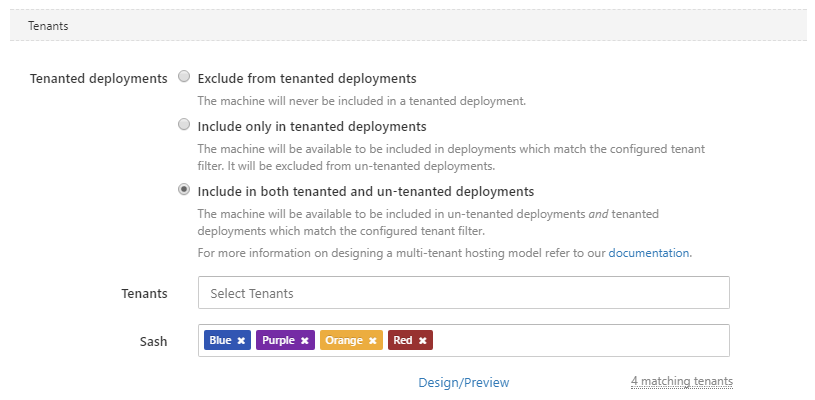
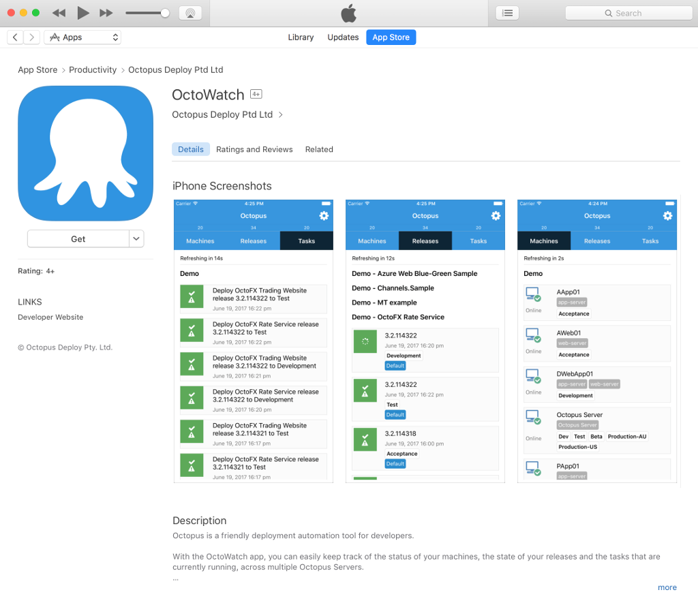

This month's release includes a big improvement to multi-tenant deployments, Octopus Server Let's Encrypt integration, the OctoWatch mobile app and some great smaller improvements! 

## In this post

!toc

## Release Tour

<iframe width="560" height="315" src="https://www.youtube.com/embed/mPhwHndEEzk" frameborder="0" allowfullscreen></iframe>

## Let's Encrypt Integration

We're a big fan of security here at Octopus, and we want to make it easy for you to be secure too.  To that end, we've added support for automatically managing the SSL certificate used by the Octopus Portal, using [Let's Encrypt](https://letsencrypt.org).  With a few simple steps, you can configure Octopus to register, request a certificate, and apply it to the Portal. Even better, it will automatically be renewed when the certificate approaches its expiry date, so you wont have to worry about manual renewals and re-configurating your Octopus Server. If you've currently got your server on the internet over HTTP, it couldn't be easier - [move to HTTPS](https://octopus.com/docs/administration/lets-encrypt-integration) today.

## Allow un-tenanted projects to be deployed to tenanted machines

During the development of multi-tenant deployments, we decided to make a clear distinction between tenanted and un-tenanted deployment targets. As such we prevented un-tenanted projects from being deployed to tenanted machines. Our reasoning was essentially safety-first; we didn't want to ever leak tenanted deployments or variables.

However this prevented a number of valid scenarios. For example, deploying a common component (e.g. a telemetry service) to tenanted machines, or simply sharing a development server between tenanted and un-tenanted projects.

_Note: this also applies to accounts and certificates, as they can also be scoped to tenants._

You let us know that we got this decision wrong (or at least incomplete). You told us via our support, via [UserVoice](https://octopusdeploy.uservoice.com/forums/170787-general/suggestions/16616209-allow-non-tenant-and-multi-tenant-deployments-to-t) and via the [GitHub issue](https://github.com/OctopusDeploy/Issues/issues/2722).

So, as of Octopus 3.15, how machines, accounts, and certificates participate in tenanted-deployments is explicitly configurable.

## OctoWatch iOS app

For iOS users who've been following along with [recent TLDR videos](https://www.youtube.com/watch?v=mZTLzcdHpwA&list=PLAGskdGvlaw39U9Ed9HhAHEr_AI3xNg56&index=8&t=569s), we have now released our first native iOS app, [OctoWatch](https://itunes.apple.com/us/app/octowatch/id1232940032?ls=1&mt=8) to the App Store.

With [OctoWatch](https://itunes.apple.com/us/app/octowatch/id1232940032?ls=1&mt=8), you can easily keep track of the status of your machines, the state of your releases and the tasks that are currently running, *across multiple Octopus Servers*.

[OctoWatch](https://itunes.apple.com/us/app/octowatch/id1232940032?ls=1&mt=8) is open-source and was designed as a weekend exercise in React-Native. If you're running Octopus and you find this app useful (or if you have any ideas on how to make this app more useful), please reach out and let us know. If you'd like to contribute any ideas, we'd be happy to review a [pull request](https://github.com/OctopusDeploy/OctoWatch).

## Command-line interface improvements

In this release we have added some improvements to our command-line interface (CLI) for Octopus and Tentacle:

- we've reworked and cleaned up our logging so `stdout` can be used more reliably
- errors are now written to `stderr` paired with reliable exit codes
- `--help` works everywhere making it easier than ever to get command-specific help
- we've added a version command so you can get detailed version information
- we've added support for `--format=json` to make the Octopus CLI queryable, which is especially useful for automation
  - even the help is queryable so you can do feature detection
- we've started moving the database configuration from the overloaded `configure` command to the `database` command
- we've deprecated a handful of options and switches that are no longer required, like `--noconsolelogging` and `--thumbprintonly`
  - these are still supported and will be removed in Octopus 4.0
- lots of other small, but helpful features

We think these improvements will be a welcome addition for teams who automate the installation of Octopus and Tentacle.

## Breaking changes

As part of the command-line interface improvements we have cleaned up what is written to `stdout`, redirected errors to `stderr`, and deprecated a handful of switches that are no longer required. We have tried to maintain backwards compatibility wherever practical. If you automate the installation of Octopus or Tentacle we recommend testing your automation scripts when upgrading to make sure they still work as expected, and to see which commands and options will be removed in Octopus 4.0.

## Upgrading

This release contains a post-install data fix that may take some time (depending on the size of your Events table), so please ensure you allow time for this to complete. If you are running the [watchdog service](https://octopus.com/docs/administration/service-watchdog), please ensure this is stopped during the upgrade.

All of the usual [steps for upgrading Octopus Deploy](https://octopus.com/docs/administration/upgrading) apply. Please see the [release notes](https://octopus.com/downloads/compare?to=3.14.0) for further information.

## Wrap up

That’s it for this month. We hope you enjoy the latest features and our new release. Feel free to leave us a comment and let us know what you think!  Happy deployments!
