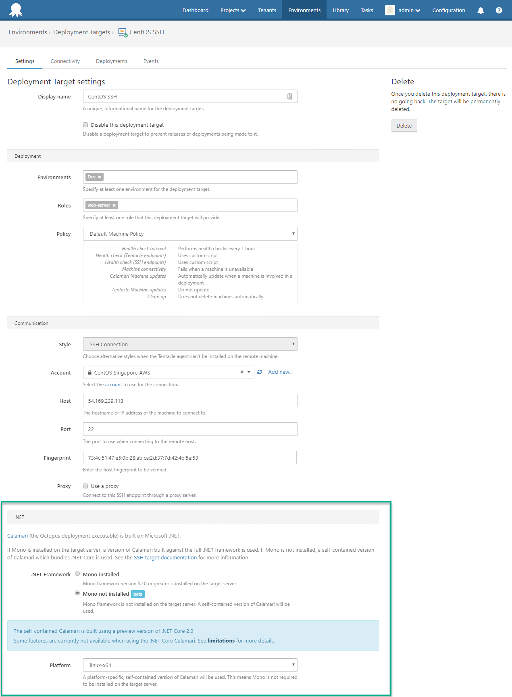

This month's release is a bit smaller but it still has some awesome features. We've made it far easier to deploy to SSH deployment targets, like Ubuntu, CentOS or macOS, without the need to install Mono.  We've also upgraded 

## In this post

!toc

## Release Tour

<iframe width="560" height="315" src="https://www.youtube.com/embed/TODO" frameborder="0" allowfullscreen></iframe>

## SSH Targets sans Mono 

Octopus Deploy supports deploying to Linux and MacOS via [SSH Targets](https://octopus.com/docs/deployment-targets/ssh-targets).

Because [Calamari](https://octopus.com/docs/api-and-integration/calamari) (the Octopus deployment executable) is built with .NET, [Mono](http://www.mono-project.com/) was required to be installed on SSH Target servers.

As of Octopus 3.16, Mono is no longer required!

SSH Targets now provide an option to use a self-contained Calamari.   

The self-contained Calamari is built with .NET Core 2.0.

Because .NET Core 2.0 is currently a preview release, we felt obliged to mark this feature as _beta_.  But be assured, this is a fully supported feature.  We believe that .NET Core will provide the foundation of Octopus Deploy's cross-platform support in the future, and we will likely at some point deprecate the Mono-based option. 

## ScriptCS upgraded to 0.17.1

Octopus supports customs scripts written in C# and this is powered by [ScriptCS](http://scriptcs.net/).  In this release, we've upgraded the library so you get the most modern ScriptCS support available.  

Our [custom scripts}(https://octopus.com/docs/deploying-applications/custom-scripts) documentation covers everything you need to get up and running with writing C# scripts or any of our other supported languages.

## Okta authentication provider

Octopus now includes an Okta authentication provider so you can easily authenitcate with this service.  Thanks to [Brent Montague](https://github.com/brentm5) for submitting a PR to add this support.  

Our [authentication providers](https://octopus.com/docs/administration/authentication-providers) documentation, provides more information on how to get up and running with this new provider or any of the existing ones.

## Let's Encrypt required update

Let's Encrypt recently deployed an update, returning more data from a specific API call. Unfortunately the library we use to communicate with Let's Encrypt was unable to handle this, meaning both new registrations and renewals were unable to complete successfully. If you have setup the Let's Encrypt integration, please upgrade to ensure that your Portal certificate renews correctly.

## Breaking changes

We need to point out that the latest ScriptCS has introduced some breaking changes so it's important to review their [release notes](https://github.com/scriptcs/scriptcs/releases/tag/v0.17.0) before upgrade.  This only affects projects with script steps written using C# which are powered by ScriptCS under the hood.  

## Upgrading

This release contains a post-install data fix that may take some time (depending on the size of your Events table), so please ensure you allow time for this to complete. If you are running the [watchdog service](https://octopus.com/docs/administration/service-watchdog), please ensure this is stopped during the upgrade.

All of the usual [steps for upgrading Octopus Deploy](https://octopus.com/docs/administration/upgrading) apply. Please see the [release notes](https://octopus.com/downloads/compare?to=3.16.0) for further information.

## Wrap up

That’s it for this month. We hope you enjoy the latest features and our new release. Feel free to leave us a comment and let us know what you think!  Happy deployments!
