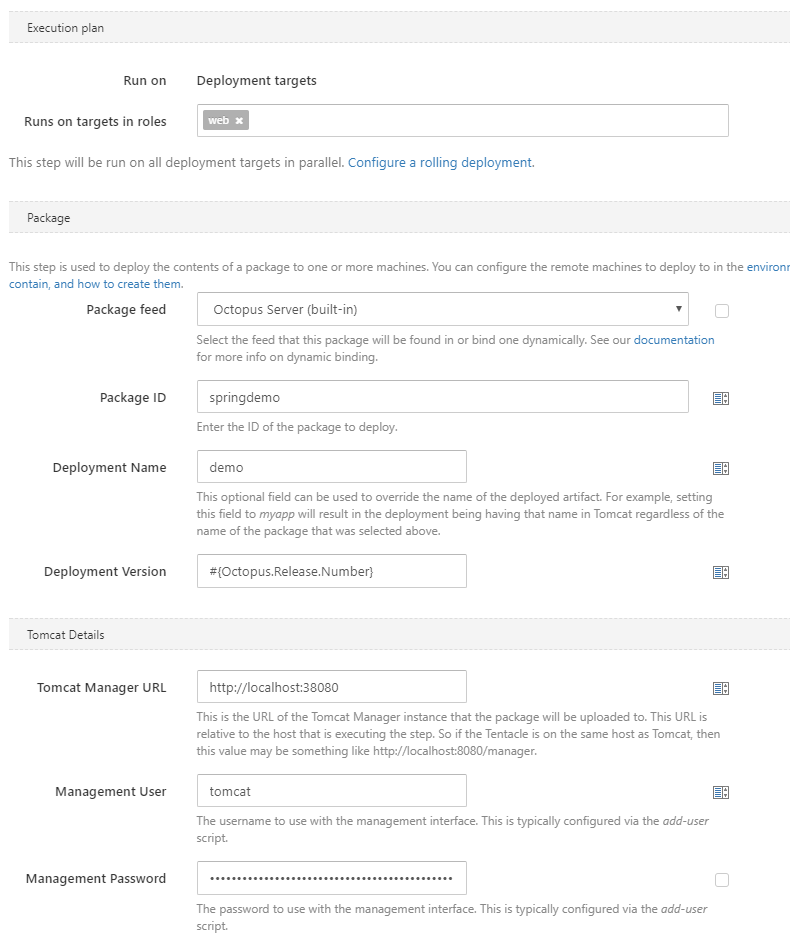
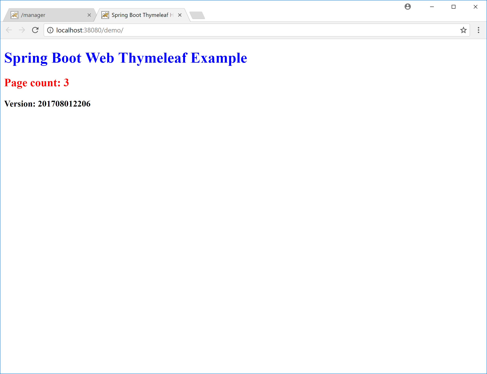
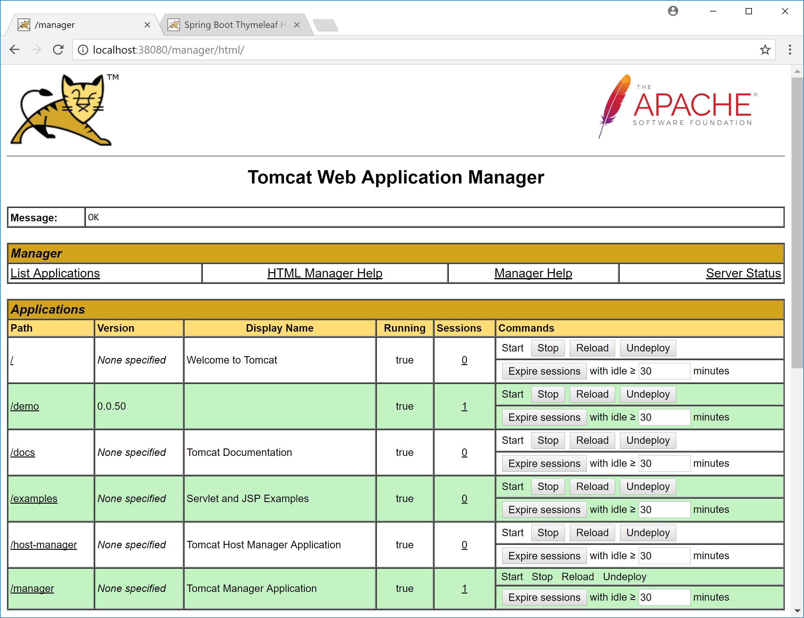
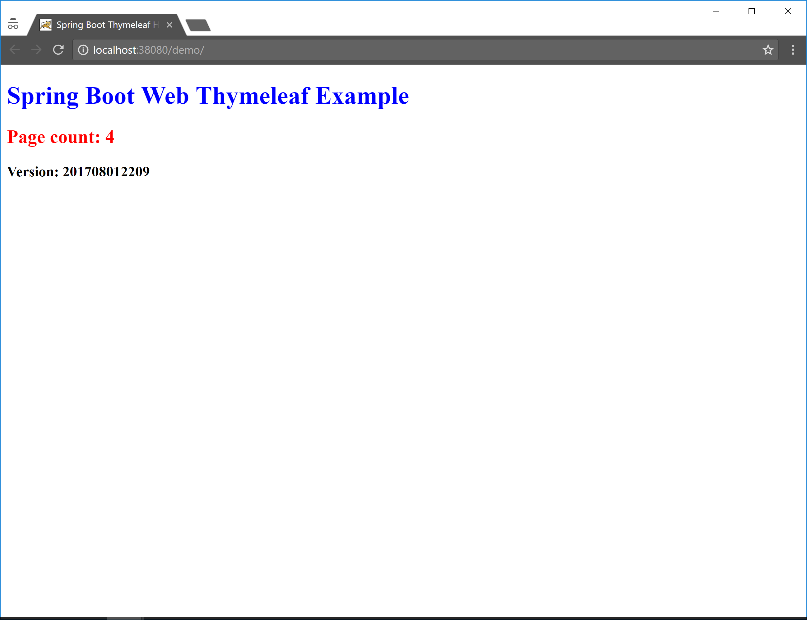
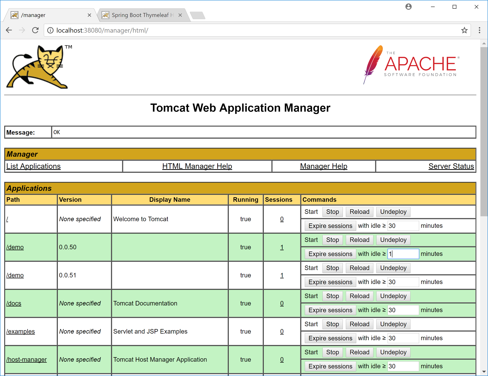
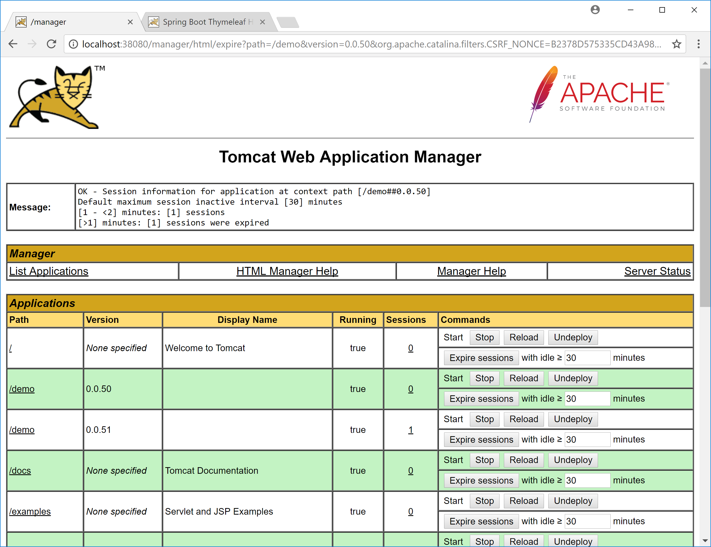

Here at Octopus we are hard at work building support for Java and servers like Tomcat.  Although this work is still in progress, I wanted to shared a neat feature of Tomcat that you will be able to utilize through Octopus Deploy when this Java work is released. 

:::warning
The screenshots in the blog post are from development versions of Octopus Deploy, and will change in the final release.
:::

## Parallel Deployments

Consider this fairly typical scenario. You have a Tomcat instance serving up a web application, and you want to deploy a new release. What happens to those users currently working with the application? Usually deploying a new version of an application will invalidate the sessions that were established for the old version of the application. What that means for the user experience depends a lot on the application involved, but it is almost never going to be fun being one of those customers whose session was just terminated.

Tomcat comes with a nice feature called parallel deployments that make these upgrades much easier for administrators and much more pleasant for customers. Parallel deployments allow two or more versions of an application to run side by side, allowing existing sessions to complete naturally, while directing new traffic to the newly deployed version of the app.

:::warning
Parallel deployments don't solve issues around changes to shared resources like databases. If your database schema changes with the new release of an application, old versions of the application may no longer work as expected. Keep these limitations in mind when deciding to implement parallel deployments.
:::

Parallel deployments are easy to configure, so let's take a look at a simple example.

## Tomcat Deployment Through Octopus Deploy

Here is a screenshot of the work in progress steps that we are building into Octopus Deploy.



This should look familiar to anyone who has deployed an app to IIS via Octopus Deploy. You pick the package to deploy and define some details of the server that you are deploying to.

In order to make use of parallel deployments, you only need to define a value for the `Deployment Version` field. The only requirement is that newer deployments get a higher version. In this example we have use the Octopus release number as the version, which satisfies the requirement of an increasing version number with each deployment.

## Deploying the First Version

Once this deployment has completed, you will see something like this in the Tomcat Manager. In this example, the demo application has been deployed with version `0.0.50`. Also notice that it has no sessions yet. This is because no one has started using the app.


Here is a screenshot of the demo application that was just deployed. Take notice of the version number at the bottom of the screen. This is the timestamp generated when the application was built.

:::hint
The timestamp in the application and the version it is assigned in Tomcat don't need to be the same. It would be beneficial to make these versions the same, but for this example we only use this timestamp to differentiate between two versions of the application deployed in parallel.
:::



Now that the app has been used, Tomcat will show that it has a session associated with it. You can see this under the `Sessions` column.



## Deploying the Second Version

Now we have a new version of the application to be deployed. The deployment is handled by Octopus Deploy, this time giving us a second version of the same application, now at version `0.0.51`.

Here I have opened up the app in an incognito window. Doing so means I am not sharing the session started in the regular Chrome window, which means Tomcat sees this request as a new session. As you can see from the screenshot, the timestamp displayed by the application is different, because it is a different WAR file built at a later date.



Now the Tomcat Manager shows us two versions of the demo application: `0.0.50` and `0.0.51`. Both have active sessions, and both will operate independently. Existing users continue to use version `0.0.50`, while new traffic is directed to version `0.0.51`.


## Removing Old Deployments

At some point all the sessions against of the old version of the application will end. When this happens, we can take advantage of a feature in Tomcat that will automatically undeploy old application versions with no users.

To enable this feature, you need to edit the `server.xml` file, and set `undeployOldVersions="true"` in the `<Host>` element.

```
<Host
  name="localhost"  
  appBase="webapps"
  unpackWARs="true"
  autoDeploy="true"
  undeployOldVersions="true">
```

Normally sessions will expire after 30 minutes or so, but you can speed up the process by expiring sessions that have been idle for a minute using the `Expire sessions` button in the `commands` column, and decreasing the idle time to one minute.



With the sessions manually expired, version `0.0.50` of the application no longer has any active users.



After a few seconds, this old version will be automatically undeployed.


## Conclusion

If you are looking for an easy way to manage rolling deployments of Java applications, the parallel deployment feature in Tomcat is a very convenient way to direct users to new versions while eventually cleaning up older versions when they are no longer being used.
