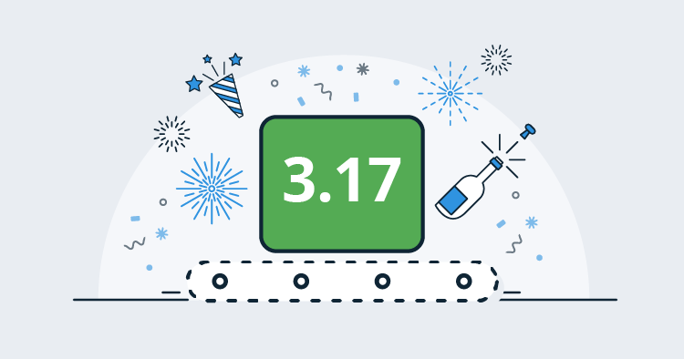
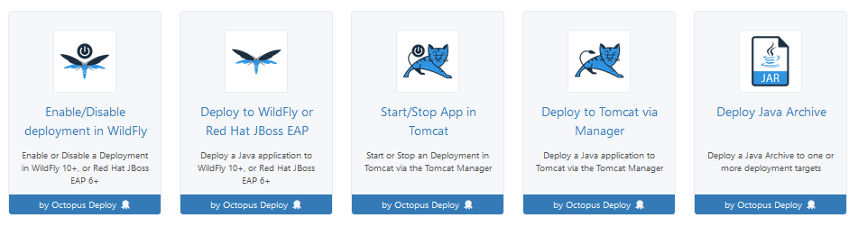
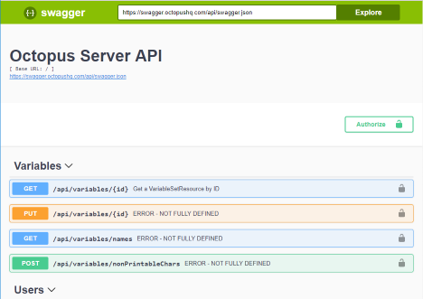

This months release is big and we're very happy to ship Octopus 3.17 with first-class Java support! This is exciting because it enables teams building apps with the Java platform to deploy their applications in a safe, reliable and repeatable way. We’re also shipping Swagger support for the Octopus API. Octopus is an API first system so anything you can do via our web portal or command line tools, you can do via our REST API. Now, we’ve added Swagger support so it’s more discoverable and easier to work with. Finally, we’ve improved user administration and authentication performance. Read on for all the exciting details!

## In this post

!toc

## Release Tour

<iframe width="560" height="315" src="https://www.youtube.com/embed/2vpxRy2yXAI" frameborder="0" allowfullscreen></iframe>

## First-class Java deployments

3.17 introduces a number of new steps for deploying and managing applications against Java application servers, as well as providing support for managing `jar`, `war`, `ear` and `rar` files in the built-in Octopus library.

These new steps allow Java applications to be deployed to WildFly 10+ and Red Hat JBoss EAP 6+ application servers, as well as Tomcat 7+. In addition, the `Deploy Java Archive` step allows Java applications to be copied to a custom location on the target machine, allowing Java applications to be deployed in any Java application server capable of using file copy deployments.

See the [documentation](http://g.octopushq.com/JavaAppDeploy) for more information on these new steps.

## Swagger support for the Octopus API

Swagger (also called OpenApi) is a standard for describing a REST API. Many companies have adopted it for describing their public API. Now in 3.17 Octopus Deploy has started documenting it's API using Swagger.

There are 2 variants of the swagger document, a JSON formatted one available at `[server]/api/swagger.json`, and a YAML formatted version at `[server]/api/swagger.yaml`.

3.17 also now includes the default Swagger UI for displaying the Swagger document in a nice human readable way. That UI is available at `[server]/swaggerui/`

## User administration and authentication performance improvements

We are introducing several changes around user administration to fix some performance issues and better model users within Octopus. The key performance fix relates to when the security groups are checked when the Active Directory provider is in use. In previous versions the groups were retrieved when the user logged in. In large/complex directory scenarios this could take a while and the user would experience a long delay when logging in. To fix this we now check the groups in the background on an hourly schedule (it initially runs shortly after startup, so a restart can be used to force it to run if you need). This change also fixes an issue where groups previously wouldn't be loaded for service account users, because they don't log in.

The other big change related to user modelling is the introduction of Logins, which allows multiple Logins to be associated with a given user. For example, you could now create a user and associate an Active Directory account and a GoogleApps account (assuming you had them both enabled). It also removes the need to force the username to be UPN for the Active Directory provider (it will default to UPN if a user is automatically created on login, but doesn't have to be if creating users manually). To add a Active Directory login for a user there is also no need to guess UPNs anymore, you go through a search dialog similar to when editing a team and looking for security groups.

And one final note, automatic user creation can now be disabled. It still defaults to being enabled, but you can now chose to disable it. Enabling/disabling is done via the `configure` command line and can be set per authentication provider.

See the updated [documentation](http://g.octopushq.com/AuthenticationProviders) for more information.

## Breaking changes

There are no breaking changes in this release.

## Upgrading

All of the usual [steps for upgrading Octopus Deploy](https://octopus.com/docs/administration/upgrading) apply. Please see the [release notes](https://octopus.com/downloads/compare?to=3.17.0) for further information.

## Wrap up

That’s it for this month. We hope you enjoy the new features and our latest release. Feel free to leave us a comment and let us know what you think! Happy deployments!
