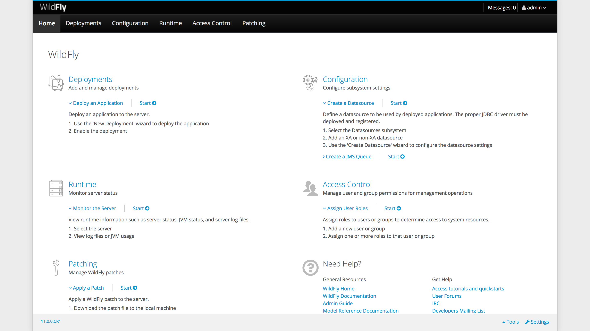

WildFly and Red Hat JBoss Enterprise Application Platform are [amongst the most popular Java EE application servers available today](https://www.jetbrains.com/research/devecosystem-2017/java/).  WildFly is available for free for development and production purposes, and this blog post takes a look at steps required to get WildFly up and running.

## Relationship Between WildFly and JBoss EAP

WildFly and Red Hat JBoss Enterprise Application Platform (JBoss EAP for short) are both open source Java EE application servers.

WildFly is made freely available with community support from the [WildFly website](http://wildfly.org/). WildFly releases major updates quite frequently, and releases have a short support window.

:::hint
WildFly has typically seen a major release every year, and after WildFly 11 is planning [to move to a faster, more incremental release model, starting with WildFly 12](http://wildfly.org/news/2017/10/23/WildFly11-Final-Released/).
:::

JBoss EAP is made available as part of a subscription with Red Hat. JBoss EAP is based on the same technology that goes into WildFly, although there is not a one-to-one mapping between JBoss EAP versions and WildFly versions. JBoss EAP releases have much longer support windows than WildFly, and are supported by Red Hat.

:::hint
I have not been able to find any official documentation around the support window for WildFly, although [this forum post](https://developer.jboss.org/thread/267585) does indicate that only the current major release is "supported", with all previous versions being considered legacy releases.
:::

## Java EE Terminology

The terminology around the enterprise Java platform has changed over the years, and is a source of much confusion, especially for non-developers.

Java 2 Platform, Enterprise Edition (J2EE) was introduced in 1999 with J2EE 1.2, and the J2EE name was used until 2003 with J2EE 1.4.

In 2005 the name was changed to Java Enterprise Edition (Java EE) with the release of Java EE 5. The Java EE name has been used until 2017 with Java EE 8.

In 2017 Oracle open sourced the Java EE platform, and it is now managed by the [Eclipse Foundation](https://www.eclipse.org/downloads/packages/) under the name Eclipse Enterprise for Java (EE4J).

## Servlet-Only vs Java EE

WildFly is made available as a Servlet-Only or full Java EE application server distribution.

The Serlvet-Only distribution is a good choice for those looking to deploy applications that don't have any dependency on the Java EE standards. For example, applications written with the Spring library only require a servlet application server to run.

The full application server distribution includes support for the complete Java EE specification, and is a superset of the Servlet-Only distribution.

:::hint
Older Java EE app servers incurred a memory cost from loading libraries that may not have been used by any deployed application, but these days WildFly does a good job of only loading libraries that are required. So while the full application server distribution is a larger package, this may not necessarily mean that it consumes more memory at run time.
:::

For this blog post we'll be using the full application server distribution.

## Install Java

Being a Java web server, WildFly requires Java to be installed before it can be run.

WildFly 11 requires at least Java 8 to run.

### JRE or JDK?

Java installations are provided either as the Java Runtime Environment (JRE) or the Java Development Kit (JDK).

The JRE provides all the functionality required to run Java applications, including WildFly. The JDK provides the JRE, as well as some additional tools that developers use to compile and manage Java applications.

WildFly will work with either the JRE or JDK. Typically the JDK is used by developers, and is a larger package, so if you are in doubt install the JRE.

### OpenJDK or Oracle JDK?

OpenJDK is an open source implementation of the Java platform. It is often included in Linux package managers with package names like `openjdk-8-jre` or `openjdk-8-jdk`.

OpenJDK is the name of the project, and while it includes the acronym "JDK" in its name, the OpenJDK project provides both a JRE and a JDK.

The Oracle JDK is an implementation of Java provided by Oracle. Typically you have to download and install the Oracle JDK manually from the [Oracle website](http://www.oracle.com/technetwork/java/javase/downloads/index.html).

Wether you use OpenJDK or Oracle JDK is a matter of personal choice. I'll use OpenJDK in Linux distributions because of the ease of installation using the package manager. In Windows or MacOS I'll install the Oracle JDK.

## Downloading WildFly

WildFly is made available as a zip or tar.gz package. Either is fine for Windows users. For Linux users, the tar.gz package is preferred as it will retain the executable flag for shell scripts.

At the time this blog post was written, WildFly 11.0.0 was the last major release, and this is the version that will be referenced in this blog.

## Standalone vs Domain

WildFly can be run in two different modes: standalone or domain.

Standalone mode is used when running a WildFly instance that manages its own configuration and deployments.

Domain mode is used to configure and deploy applications to multiple WildFly instances. In domain mode the Domain Controller distributes configuration and applications to Domain Slaves.

:::hint
A domain should not be confused with a cluster. Domains exist only to distribute settings and applications, and those settings may or may not build a clustered environment. Likewise standalone instances can participate in a cluster if they are individually configured with the required settings.
:::

## Manually Running WildFly

WildFly can be started in either domain or standalone mode. Each mode is launched with a separate script.

To start WildFly in standalone mode, run the `bin\standalone.bat` script in Windows and `bin/standalone.sh` script in Linux.

To start WildFly in domain mode, run the `bin\domain.bat` script in Windows and `bin/domain.sh` script in Linux.

## Configuring WildFly Memory Settings

The memory settings used by WildFly are defined in the `JAVA_OPTS` environment variable. In the absence of this environment variable, default values are defined in the `bin/standalone.conf.bat` and `bin/domain.conf.bat` files for Windows, or the  `bin/standalone.conf` and `bin/domain.conf` files for Linux.

In the Windows configuration files you will see commands like this:

```
if not "x%JAVA_OPTS%" == "x" (
  echo "JAVA_OPTS already set in environment; overriding default settings with values: %JAVA_OPTS%"
  goto JAVA_OPTS_SET
)
rem # ...
set "JAVA_OPTS=-Xms64M -Xmx512M -XX:MetaspaceSize=96M -XX:MaxMetaspaceSize=256m"
```

In the Linux configuration files you will see commands like this:

```
if [ "x$JAVA_OPTS" = "x" ]; then
   JAVA_OPTS="-Xms64m -Xmx512m -XX:MetaspaceSize=96M -XX:MaxMetaspaceSize=256m -Djava.net.preferIPv4Stack=true"
   JAVA_OPTS="$JAVA_OPTS -Djboss.modules.system.pkgs=$JBOSS_MODULES_SYSTEM_PKGS -Djava.awt.headless=true"
else
   echo "JAVA_OPTS already set in environment; overriding default settings with values: $JAVA_OPTS"
fi
```

To override the default values assigned to `JAVA_OPTS` in these configuration files, you can define the `JAVA_OPTS` environment variable. The environment variable takes precedence over the defaults. Otherwise you can edit the default values in the configuration files directly.

You can find more information on the settings shown here by viewing the Oracle documentation. For example, [this documentation](https://docs.oracle.com/javase/8/docs/technotes/tools/windows/java.html) lists the options for Java 8.

:::hint
Some Java settings are version specific. Be sure to use settings that are specific to the version of Java you are running WildFly with.
:::

## Configuring Admin Users

In order to log into the admin console or configure WildFly as a Windows service, you first need to define a management user. Users are added with the `bin\add-user.bat` script for Windows, or the `bin/add-user.sh` script for Linux.

:::hint
You can run the add-user script will WildFly is running. New users will be picked up automatically.
:::

Once the script is run you will be asked a number of questions:

* What type of user to add - Management User
* The username
* The password
* What groups the user will belong to - Leave this blank
* Whether the user is used for AS process interconnection - no

I've pasted the output of the `add-user` script below. Notice that I updated the existing disabled user of `admin` with a new password.

```
$ ./add-user.sh

What type of user do you wish to add?
 a) Management User (mgmt-users.properties)
 b) Application User (application-users.properties)
(a): a

Enter the details of the new user to add.
Using realm 'ManagementRealm' as discovered from the existing property files.
Username : admin
User 'admin' already exists and is disabled, would you like to...
 a) Update the existing user password and roles
 b) Enable the existing user
 c) Type a new username
(a): a
Password recommendations are listed below. To modify these restrictions edit the add-user.properties configuration file.
 - The password should be different from the username
 - The password should not be one of the following restricted values {root, admin, administrator}
 - The password should contain at least 8 characters, 1 alphabetic character(s), 1 digit(s), 1 non-alphanumeric symbol(s)
Password : <enter password>
Re-enter Password : <enter password>
What groups do you want this user to belong to? (Please enter a comma separated list, or leave blank for none)[  ]:
Updated user 'admin' to file '/Users/matthewcasperson/Downloads/wildfly-11.0.0.CR1/standalone/configuration/mgmt-users.properties'
Updated user 'admin' to file '/Users/matthewcasperson/Downloads/wildfly-11.0.0.CR1/domain/configuration/mgmt-users.properties'
Updated user 'admin' with groups  to file '/Users/matthewcasperson/Downloads/wildfly-11.0.0.CR1/standalone/configuration/mgmt-groups.properties'
Updated user 'admin' with groups  to file '/Users/matthewcasperson/Downloads/wildfly-11.0.0.CR1/domain/configuration/mgmt-groups.properties'
Is this new user going to be used for one AS process to connect to another AS process?
e.g. for a slave host controller connecting to the master or for a Remoting connection for server to server EJB calls.
yes/no? no
```

This script will modify the `mgmt-users.properties` and `mgmt-groups.properties` files for both the domain and standalone modes (i.e. the properties files under the `standalone\configuration` and `domain\configuration` directories). This means that regardless of which mode you intend to use WildFly in, the user will be available.

## Installing WildFly as a Service

Production WildFly instances are typically started as a service. This allows WildFly to be started when the operating system boots, shutdown when the OS is shutdown, and managed with the service management tools built into the OS.

### Installing WildFly as a Windows Service

WildFly ships with a script called `service.bat` that can be used to add Windows services. The services are managed via the WildFly management interface, which is listening on port `9990` by default. The `jbossuser` and `jbosspass` fields need to match the credentials that were created with the `add-user.bat` script.

This command will configure a standalone instance as a Windows service.

```
bin\service\service.bat install /jbossuser admin /jbosspass password /controller localhost:9990 /startup /name "WildFly 11 Standalone"
```

This command will configure a domain controller as a Windows service.

```
bin\service\service.bat install /jbossuser admin /jbosspass password /controller localhost:9990 /startup /host /hostconfig host-master.xml /name "WildFly 11 Domain Controller"
```

This command will configure a domain slave as a Windows service.

```
bin\service\service.bat install /jbossuser admin /jbosspass password /controller localhost:9990 /startup /host /hostconfig host-slave.xml /name "WildFly 11 Domain Slave"
```

### Installing WildFly as a Linux Service

WildFly ships with init.d and systemd service definition files in the `docs/contrib/scripts/init.d` and `docs/contrib/scripts/systemd` directories.

Before we configure any Linux services, we need to add a user that will run WildFly. This user will be called `wildfly`, and can be created by running the command `sudo useradd wildfly`.

Next make sure that WildFly has been extracted to `/opt/wildfly`. The `/opt` directory ["is reserved for all the software and add-on packages that are not part of the default installation"](http://www.tldp.org/LDP/Linux-Filesystem-Hierarchy/html/opt.html), which describes our WildFly installation nicely (and is the default path in the supplied service scripts too).

Finally, make sure that the `wildfly` user is the owner of the `/opt/wildfly` directory with the command `sudo chown wildfly:wildfly -R /opt/wildfly`.

#### Configuring the systemd Service

The following steps will configure WildFly to be managed by systemd.

1. Copy the `launch.sh` script into the `bin` directory with the command `cp /opt/wildfly/docs/contrib/scripts/systemd/launch.sh /opt/wildfly/bin`.
2. Copy the WildFly systemd unit into `/etc/systemd/system` with the command `sudo cp /opt/wildfly/docs/contrib/scripts/systemd/wildfly.service /etc/systemd/system`.
3. Create the `/etc/wildfly` directory with the command `sudo mkdir /etc/wildfly`.
4. Copy the config file into `/etc/wildfly` with the command `sudo cp /opt/wildfly/docs/contrib/scripts/systemd/wildfly.conf /etc/wildfly`.
5. Enable the WildFly service with the command `sudo systemctl enable wildfly`.
6. Start the WildFly service with the command `sudo systemctl start wildfly`.

At this point WildFly will be running, which you can verify with the command `sudo systemctl status wildfly`.

```
$sudo systemctl status wildfly
● wildfly.service - The WildFly Application Server
   Loaded: loaded (/etc/systemd/system/wildfly.service; enabled; vendor preset: enabled)
   Active: active (running) since Tue 2017-10-24 16:48:53 AEST; 1min 38s ago
 Main PID: 5448 (launch.sh)
    Tasks: 68 (limit: 4915)
   CGroup: /system.slice/wildfly.service
           ├─5448 /bin/bash /opt/wildfly/bin/launch.sh standalone standalone.xml 0.0.0.0
           ├─5449 /bin/sh /opt/wildfly/bin/standalone.sh -c standalone.xml -b 0.0.0.0
           └─5502 java -D[Standalone] -server -Xms64m -Xmx512m -XX:MetaspaceSize=96M -XX:MaxMetaspaceSize=256m -Djava.net.preferIPv4Stack=true -Djboss.

Oct 24 16:48:53 matthew-VirtualBox systemd[1]: Started The WildFly Application Server.
```

#### Configuring the init.d Service

The following steps will configure WildFly to be managed by init.d.

1. Copy the appropriate init script from either `wildfly-init-redhat.sh` or `wildfly-init-debian.sh` to `/etc/init.d/wildfly`. For example, if you have a Red Hat based distribution, you can copy the file with the command `sudo cp /opt/wildfly/docs/contrib/scripts/init.d/wildfly-init-redhat.sh /etc/init.d/wildfly`. If you have a Debian based distribution, copy the file with the command `sudo cp /opt/wildfly/docs/contrib/scripts/init.d/wildfly-init-debian.sh /etc/init.d/wildfly`.
2. Copy the file `wildfly.conf` to `/etc/default` with the command `sudo cp /opt/wildfly/docs/contrib/scripts/init.d/wildfly.conf /etc/default`.
3. Start the service with the command `sudo service wildfly start`.

At this point WildFly will be running, which you can verify with the command `sudo service wildfly status`. In this example, taken from Centos 7, the init.d script is being managed by systemd.

```
$ sudo service wildfly status
● wildfly.service - LSB: WildFly Application Server
   Loaded: loaded (/etc/rc.d/init.d/wildfly; bad; vendor preset: disabled)
   Active: active (running) since Tue 2017-10-24 19:34:44 AEST; 8min ago
     Docs: man:systemd-sysv-generator(8)
  Process: 3071 ExecStart=/etc/rc.d/init.d/wildfly start (code=exited, status=0/SUCCESS)
   CGroup: /system.slice/wildfly.service
           ├─3102 /bin/sh /opt/wildfly/bin/standalone.sh -c standalone.xml
           └─3151 java -D[Standalone] -server -Xms64m -Xmx512m -XX:MetaspaceSize=96M -XX:MaxMetaspaceSize=256...

Oct 24 19:34:40 localhost.localdomain systemd[1]: Starting LSB: WildFly Application Server...
```

## Opening the Admin Console

When WildFly has been launched, either manually or as a service, the admin console is available from http://localhost:9990.

When you first load the admin console, you will be required to enter the credentials you created with the `add-user` script.

:::hint
For reasons I do not understand, Chrome will not prompt you to save the credentials used to access the admin console unless you refresh the page.
:::



The admin console provides features for deploying web applications, changing settings, monitoring performance, viewing log files and more.

:::hint
The admin user we created earlier has access to all aspects of the admin console. If you need fine grained control, consider using Role Based Access Controls (RBAC). 
:::

## Conclusion

In this post we have seen how to run WildFly manually and as a service in both Windows and Linux, configured an admin user, and opened the admin console.

If you are interested in automating the deployment of your Java applications to WildFly, [download a trail copy of Octopus Deploy](https://octopus.com/downloads), and take a look at [our documentation](https://octopus.com/docs/deployments/java/deploying-java-applications).

## Learn more

* Documentation: [Java Applications](https://hubs.ly/H0gyFkB0)
* [Configuring WildFly via XML Templates or CLI Scripts](https://hubs.ly/H0gyFHR0)
* [CloudFormation, WildFly and Deploying Maven Artifacts](https://hubs.ly/H0gyFkQ0)
* [How to create your own WildFly Cluster in AWS](https://hubs.ly/H0gyFJ40)
* [Deploying Certificates to WildFly](https://hubs.ly/H0gyFJ70)
* Video: [Deploying a Spring Boot web application with Octopus Deploy](https://hubs.ly/H0gyFld0)
* Tutorial: [Deploying Spring Boot Applications as Windows Services](https://hubs.ly/H0gyFJ80)
* Getting Started 101: [Installing Tomcat for your next Java project](https://hubs.ly/H0gyFlY0)
* [Get up to speed on how Tomcat defines the context path of your web application](https://hubs.ly/H0gyFJ90)
