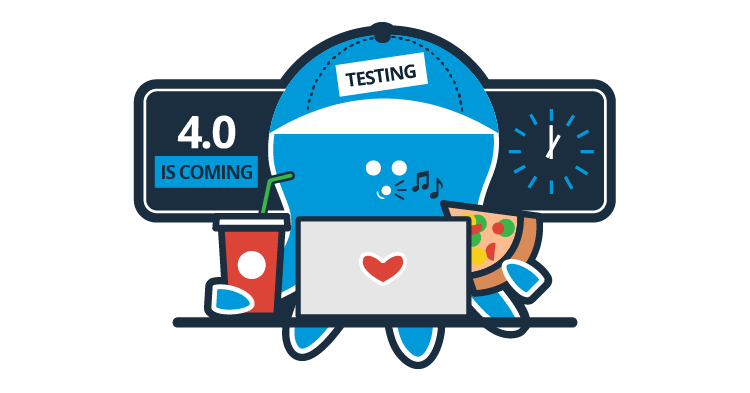

Octopus Deploy 4.0 is nearing completion! Everyone at Octopus HQ is super excited to ship this release. Currently, we’re in alpha testing (internally we call this a bug bash) and will soon have a polished release ready for our customers to get their hands on. Octopus 4.0 is our biggest release in over two years. It includes hundreds of changes and improvements including a new UI/UX. More than a fresh coat of paint, we re-wrote the Octopus web portal, moving from Angular 1.4 to React+Redux. We’ve also completely revamped our environments page, redesigned our variable editor and more!

We’re kicking off this short blog series to highlight some of the new features that we will be shipping with Octopus 4.0. Our aim is to provide some behind the scenes insight into our journey from concept to production.  

There's some great posts coming so be sure to check out our blog each week.  

---

Blog series posts:

* [Octopus Deploy 4.0 - History](/blog/2017-10/octopus-v4-history.md)
* [Octopus Deploy 4.0 - UX and UI](/blog/2017-10/octopus-v4-uxui.md)
* [Variable Editor Redesign](/blog/2017-10/octopus-v4-variable-editor.md)
* [Infrastructure Redesign](/blog/2017-11/octopus-v4-infrastructure.md)
* [Deploy Release Page Redesign](/blog/2017-11/octopus-v4-create-deployments.md)
* [Why we chose React over Angular when rewriting the Octopus 4.0 UI](/blog/2017-11/octopus-v4-angular-to-react/index.md)
