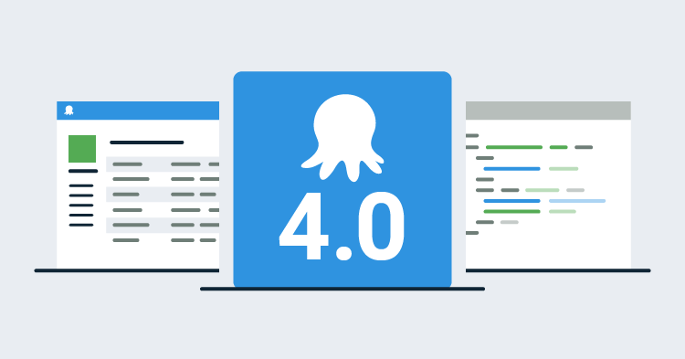

This post is a part of our Octopus 4.0 blog series.  Follow it on our [blog](https://octopus.com/blog) or our [twitter](https://twitter.com/octopusdeploy) feed.

**Octopus Deploy 4.0 has shipped! Read the [blog post](/blog/2017-11/octopus-release-4-0.md) and [download](https://octopus.com/downloads) it today!**

---

I know that some of you wonder why we've decided to rewrite Octopus UI and this blog post tries to provide a high level answer to this question. We will explain the details of each significant change in future blog posts.

The UI in Octopus `3.x` is built on top of Angular `1.x ` which a year or so ago was superseded by Angular `2.0`. Migration from `1.4` to `2.0` would require a significant effort so instead of just asking how/when we should migrate `1.4` to `2.0` we asked ourselves what the next version of Octopus UI should look like. And this is how `v4` was born.

## User experience

Octopus UI hasn't changed significantly since `2.0` was released in December 2013 and we felt that it was time to modernize it and fix several long lasting problems. This couldn't be done just by applying a new stylesheet because we wanted to introduce new interactions, remove a lot inconsistencies and remodel some of the most used pages. Variable Editor, Deployment Page or Environments Dashboard couldn't be significantly improved just by fixing bugs. They needed to be completely redesigned.

When you visit Octopus UI for the very first time you need to wait for over 1MB of static assets to be downloaded. This is not a great first impression. To solve this problem we've restructured UI code in such a way that we load synchronously only what's absolutely necessary and then we load all other areas asynchronously in the background. This effectively halved the amount of code we need to send to the browser before the user can start interacting with the application.

## Developer experience

From a development perspective we wanted an environment where we could use modern JavaScript that we can safely maintain and extend in the future. There is more than one technology stack that satisfies these requirements and we've experimented with quite a few of them. At the end of that exercise we've picked [TypeScript](https://www.typescriptlang.org/), [React](https://reactjs.org/) and [CSS Modules](https://github.com/css-modules/css-modules) as our basic building blocks.

TypeScript let us make our JavaScript strongly typed which helped eliminate many manual refactorings that can now be done automatically by our code editors.  TypeScript also converted several common runtime errors into compile time errors. I don't remember the last time I saw an error caused by a typo :). 

The TypeScript compiler is [a transpiler](https://en.wikipedia.org/wiki/Source-to-source_compiler) which means we can use modern JavaScript (e.g. `arrow functions`, `async/await`) without worrying about browsers that don't yet support it. 

Our move from Angular to React requires a post on its own but I should provide at least a high level summary here. We've picked React because it's conceptually simple and it heavily uses modern JavaScript (e.g. `Array.map`) instead of relying on custom syntax (e.g. `ng-repeat`  in Angular `v1` or `*ngFor` Angular `v2`) .  The conclusion of the [React vs Angular 2](http://merrickchristensen.com/articles/react-vs-angular-2.html#my-conclusion) post by Merrick Christensen nicely summarises the main difference between these two. Effectively, React makes you a better JavaScript developer and Angular makes you a better Angular developer.

CSS Modules let us keep styling of our components fully isolated from each other. We could go all in and specify our CSS in JavaScript but we were happy with LESS and the only missing thing was isolation. 

As you can see we've decided to tackle quite a few complex problems at the same time which required a lot of coordinated effort but we treat Octopus UI as an essential part of Octopus Deploy ecosystem and are willing to invest in it. 