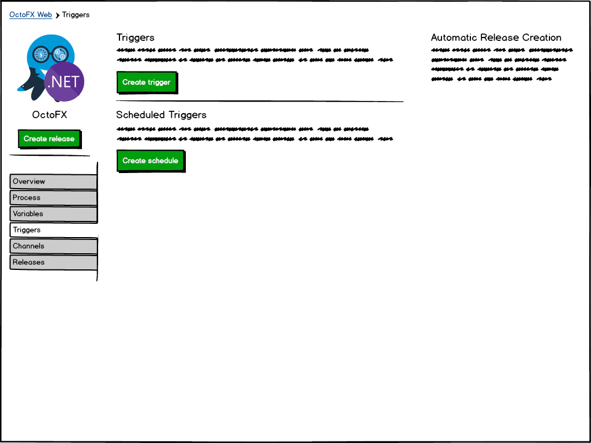
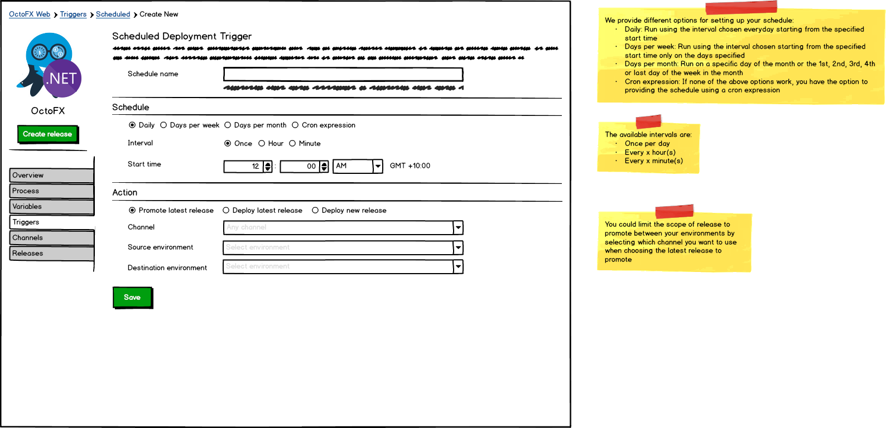
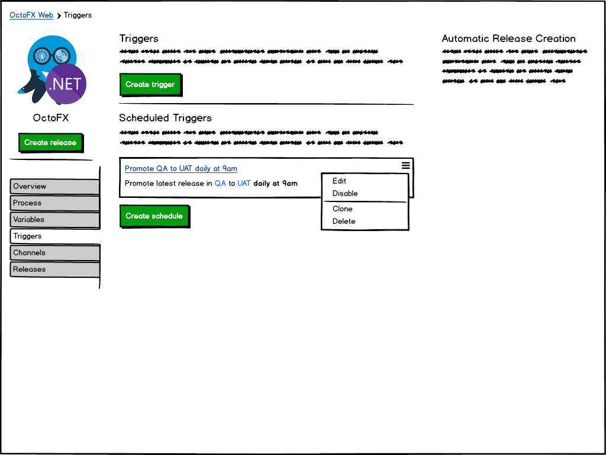
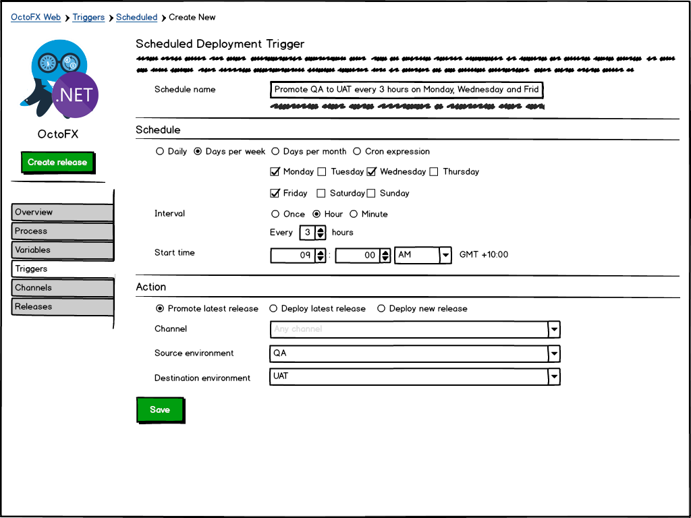
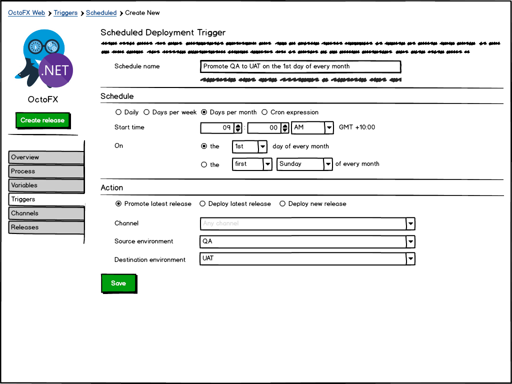
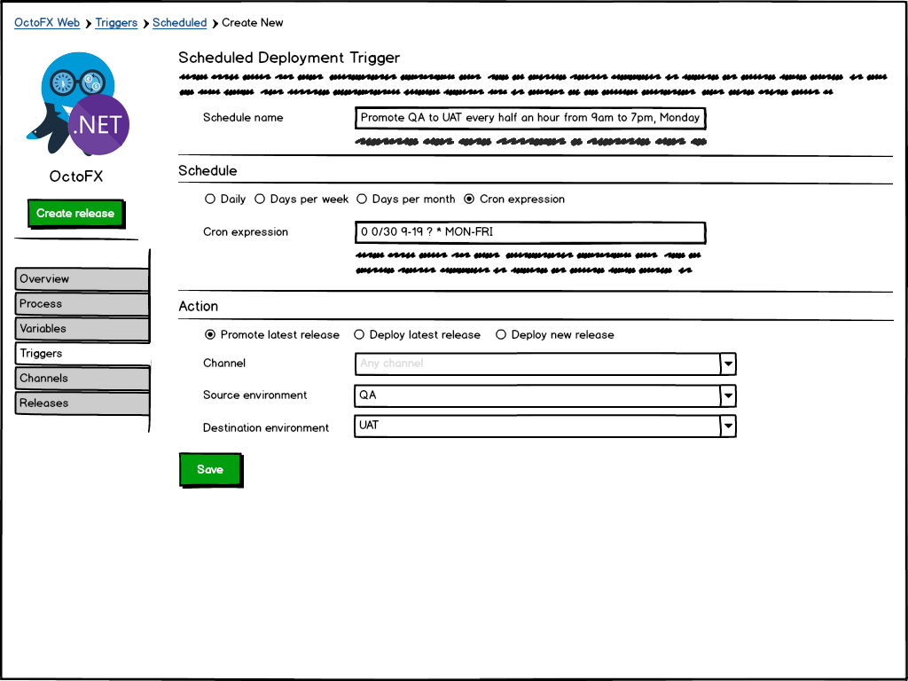
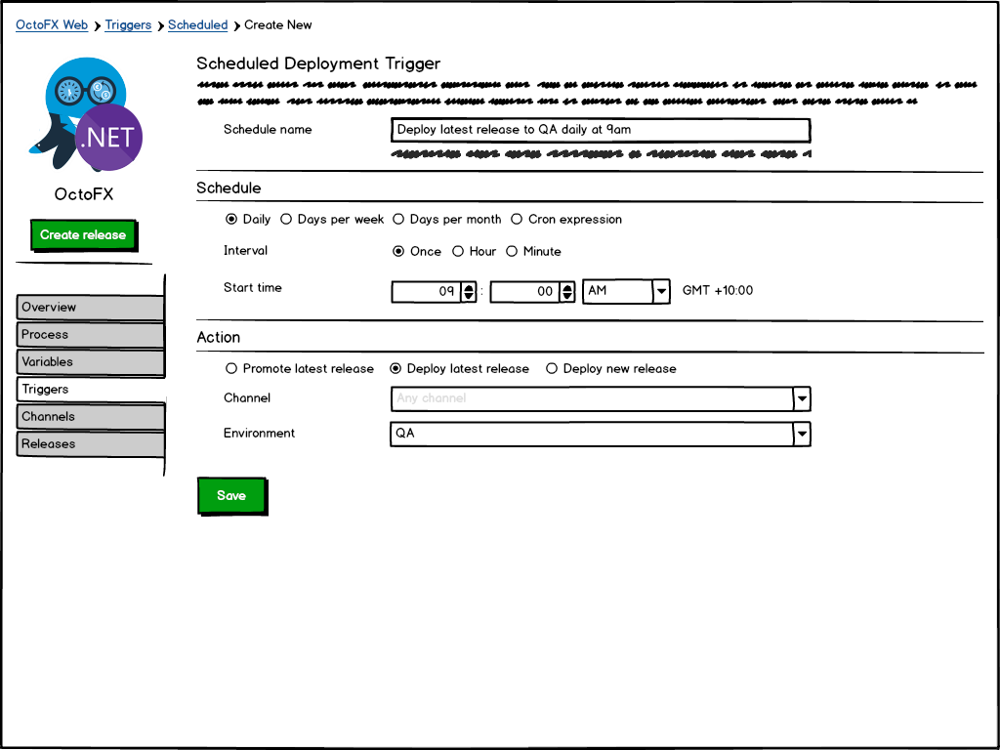
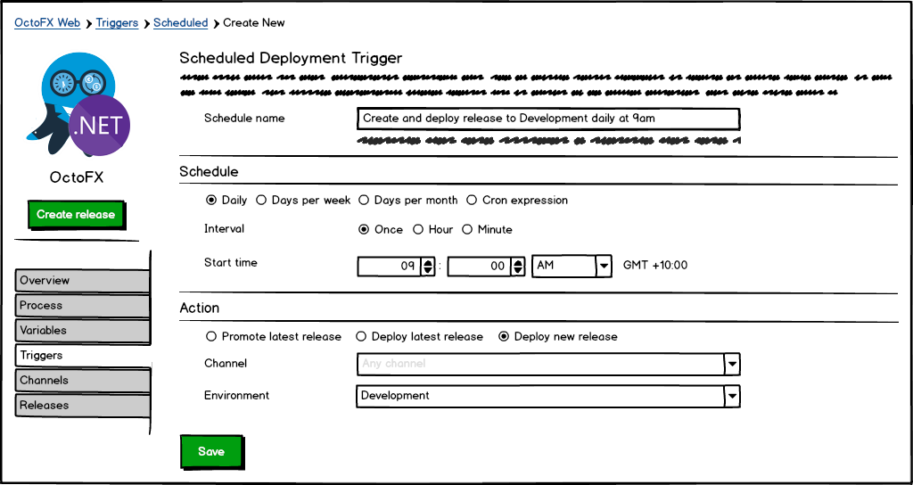
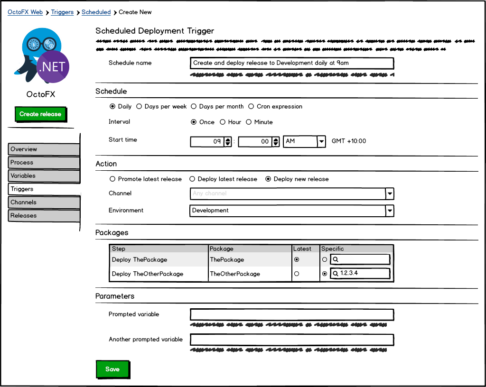

> The #5 highest voted item in our UserVoice is to be able to **schedule recurring deployments**.

This post is a request-for-comments on our thoughts at this stage.

!toc

## What are we trying to solve?

We have had a lot of customers tell us that they want to be able to setup a schedule where Octopus would automatically promote, or deploy, a release to an environment.

There are ways to do this at the moment by using our comprehensive API. But it involves setting up a scheduled task that calls a script (or creating an Azure Function) that calls the Octopus API to promote/deploy the release in question. This can be quite a cumbersome solution for something that many other CI/CD tools provides out-of-the-box.

From our internal discussions and the customers that have commented on the UserVoice item, we've determined that we have a couple of options on how we can implement this feature.

### Project triggers

The advantage of project triggers is that you can specify which channel should be used when determining which release to promote, or deploy, and the available environments would also be determined by the lifecycle used in the channel.
Project triggers come with a downside though in that you would have to specify the trigger on each of your projects.

The scheduled recurring deployments configuration would live under the `Triggers` tab of your project:

Creating a new scheduled deployment trigger will take you to a new page where you configure the schedule details and what action should take place when the trigger is run.

Once you've added your new trigger it will show up in the list of configured triggers and allow you to edit, disable, clone or delete the trigger.

### Lifecycle triggers

If your projects use channels, lifecycle triggers will only be able to deploy to the default channel (as channels are project specific). On the other hand, the advantage of lifecycle triggers is that you can share the same schedule across many projects, instead of having to specify it on each project.

The scheduled recurring deployments configuration would live in the right sidebar of your lifecycle.

Creating a new scheduled deployment trigger will open up a dialog where you configure the schedule details and what action should take place when the trigger is run.

### Trigger schedules

The following trigger schedules to configure when a trigger should be run
- Daily
- Days per week
- Days per month
- Custom `CRON` expression

The daily and days per week schedules allow for an interval to be chosen, and the available intervals are:
- Once per day
- Every x hour(s)
- Every x minute(s)

#### Daily schedule

Run using the interval chosen every day starting from the specified start time.

#### Days per week schedule

Run using the interval chosen on the days specified starting from the specified start time.

#### Days per month schedule

Run on a specific day of the month, or the Nth particular weekday of the month, at the specified start time.

#### Custom `CRON` expression

Run according to a [CRON expression](https://en.wikipedia.org/wiki/Cron#CRON_expression).

> A CRON expression is a string comprising five or six fields separated by white space that represents a set of times, normally as a schedule to execute some routine.

### Trigger actions

The following trigger actions will be available to configure what should happen when the scheduled deployment is run:
- Promote latest release
- Deploy latest release
- Deploy new release

#### Promote latest release

Promotes the latest **successful** release in the chosen source environment to the chosen destination environment.

#### Deploy latest release

Deploys the latest **successful** release in a project to the chosen environment.

#### Create and deploy new release

Creates a new release and deploys this to the chosen environment.

**Deploying a new release with prompted values (such as package versions and prompted variables)**

## Feedback

**We would really like to hear from you!** Perhaps there are some pieces of the puzzle we've missed for your scenario?

If you have any other thoughts or opinions on how scheduled recurring deployments should look, please add your comments below or comment on and follow the open [GitHub ticket #3363](https://github.com/OctopusDeploy/Issues/issues/3633).