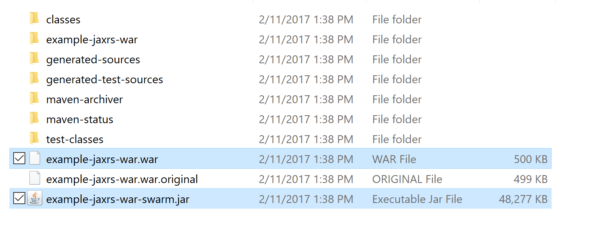

Not too long ago if you wanted to deploy a Java web application, you compiled a WAR file and hosted it in an application server. Today though Java web applications can just as easily be deployed as self contained UberJARs.

What is an application server like [WildFly](http://wildfly.org/), what is an UberJAR, and how to projects like [WildFly Swarm](http://wildfly-swarm.io/) change how Java deployments are performed?

## What is a Java EE Application Server?

Consider the following code:

```java
public class HelloWorld {
    public static void main(String[] args)  {
        System.out.println("Hello, World");
    }
}
```

This is your traditional "Hello World" application written in Java. As a developer I can run this code anywhere a Java Runtime Environment (JRE) is available. I also don’t need to bundle any additional class libraries because all of the classes referenced here are provided by any JRE, whether it is from Oracle, OpenJDK, Zulu, IBM etc.

It doesn’t matter what vendor supplied the JRE, nor does it matter what OS the Java application is eventually run on. Because this code uses the standard Java classes, it will run anywhere.

Now consider this code:

```java
package com.octopus;

import javax.ws.rs.ApplicationPath;
import javax.ws.rs.core.Application;

@ApplicationPath("/")
public class MyApplication extends Application {

    public MyApplication() {
    }
}
```

```java
package com.octopus;

import javax.ws.rs.GET;
import javax.ws.rs.Path;
import javax.ws.rs.Produces;

@Path("/")
public class MyResource {

    @GET
    @Produces("text/plain")
    public String get() {
        return "Hello World";
    }
}
```

What we have here is a simple REST API based on the [JAX-RS](https://en.wikipedia.org/wiki/Java_API_for_RESTful_Web_Services) standard. JAX-RS is part of the Java EE specification, which means that as a developer I can deploy this application to any Java EE application server.

More importantly I don’t need to bundle any of the libraries that implement the JAX-RS standard. Depending on the application server, the JAX-RS standard may be provided by libraries like [RESTEasy](http://resteasy.jboss.org/) or [Jersy](https://jersey.github.io/). But as long as the underlying libraries conform to the specification, my application will function as expected.

Of course Java EE provides far more than just specifications for creating RESTful services. It includes specifications for database access, messaging, mailing, MVC frameworks, management APIs and [much more](http://www.oracle.com/technetwork/java/javaee/tech/index.html).

Multiple vendors provide implementations for the Java EE specification, with WildFly being just one example. You also have [WebSphere, WebLogic, Payara, GlassFish, TomEE and others](https://en.wikipedia.org/wiki/List_of_application_servers#Java).

But it doesn’t matter which vendor’s application server I deploy to. As long as my code and the app server conform to the Java EE specification, I can run my code in any app server.

:::hint
In practice with real world situations it is not this easy to build Java EE apps that can be deployed to multiple Java EE application servers. But for the sake of this discussion we’ll assume this is the case.
:::

So, generally speaking, a Java EE application server provides an environment where applications written using the Java EE specifications can be deployed and run.

Importantly, Java EE application servers usually host multiple applications side by side. For example, you may deploy multiple websites, each compiled as a separate WAR file, side by side in an app server. The individual applications can be deployed, started, stopped and undeployed independently without having to start and stop the application server itself.

## What is a WAR?

A Web ARchive (WAR) is a archive format used by Java web applications.

Take a look at [Exploded Deployments vs WAR Packages](https://octopus.com/blog/defining-tomcat-context-paths#exploded-deployments-vs-war-packages) for a discussion around WARs and Exploded WARs.

## What is an UberJAR?

UberJAR is not an official term, and has other names like FatJAR and ShadowJAR. All these terms refer to a single JAR file that contains all the classes and resources necessary to run an application.

Consider this [trivial code](https://github.com/OctopusDeploy/UberJARDemo), which makes use of the Apache Commons library.

```java
package com.octopus;

import org.apache.commons.lang3.StringUtils;

public class Main {
    public static void main(String[] args) {
        System.out.println(StringUtils.trim(" hello world "));
    }
}
```

In order to generate an executable JAR from this code, the Maven build has added a manifest file with the following content:

```
Manifest-Version: 1.0
Archiver-Version: Plexus Archiver
Built-By: mcasperson
Class-Path: libs/commons-lang3-3.6.jar
Created-By: Apache Maven 3.5.0
Build-Jdk: 1.8.0_131
Main-Class: com.octopus.Main
```

The important line here is the `Class-Path`, which is referencing a second JAR file under `libs/commons-lang3-3.6.jar`.

When we list the contents of our JAR file, we will see that it only contains the `Main.class` file.

```
$ jar tf target/original-uberjardemo-1.0-SNAPSHOT.jar
META-INF/
META-INF/MANIFEST.MF
com/
com/octopus/
com/octopus/Main.class
META-INF/maven/
META-INF/maven/com.octopus/
META-INF/maven/com.octopus/uberjardemo/
META-INF/maven/com.octopus/uberjardemo/pom.xml
META-INF/maven/com.octopus/uberjardemo/pom.properties
```

To run this "traditional" JAR file, both it and its library JAR files need to be present. In this trivial case this means the application is comprised of two JAR files. But it would not be uncommon for an application to require dozens of JAR files.

The UberJAR version of this application creates a single JAR file that is the merged result of all the individual dependencies. UberJAR files can be quite large, but since they are a single file they are easy to distribute.

If we list the contents of the UberJAR we can see that our `Main.class` file is present, along with the classes that make up the Apache Commons library.

```
$ jar tf target/uberjardemo-1.0-SNAPSHOT.jar
META-INF/
META-INF/MANIFEST.MF
com/
com/octopus/
com/octopus/Main.class
META-INF/maven/
META-INF/maven/com.octopus/
META-INF/maven/com.octopus/uberjardemo/
META-INF/maven/com.octopus/uberjardemo/pom.xml
META-INF/maven/com.octopus/uberjardemo/pom.properties
META-INF/LICENSE.txt
org/
org/apache/
org/apache/commons/
org/apache/commons/lang3/
org/apache/commons/lang3/BitField.class
... and many more apache classes
```

:::hint
UberJAR files are similar to WAR files in that both are single, self contained files that can be used to run an application. They differ in that WAR files need an app server to run, whereas UberJAR files can be run from the JRE.
:::

### What is WildFly Swarm?

[WildFly Swarm](http://wildfly-swarm.io/) is a project that provides the ability to bundle the same Java EE libraries provided by the WildFly application server into an UberJAR. The end result is a single JAR file that, when executed, will start a web server and run the Java EE application.

The actual mechanics of how WildFly Swarm embeds the required classes and resources into an UberJAR is a more complicated than the example I gave above, but the end result is the same: you get a single, executable JAR file that can be run from any JRE.

The WildFly Swarm team provide a bunch of examples, and they [JAX-RS example](https://github.com/wildfly-swarm/wildfly-swarm-examples/tree/master/jaxrs/jaxrs) is quite similar to the hello world example I showed above.

Once compiled, the WildFly Swarm UberJAR file can be executed from the command line using the standard `java` executable.

```
$ java -jar example-jaxrs-war-swarm.jar
2017-11-02 03:43:29,747 INFO  [org.wildfly.swarm] (main) WFSWARM0013: Installed fraction:                  Logging - STABLE          org.wildfly.swarm:logging:2017.11.0-SNAPSHOT
2017-11-02 03:43:29,756 INFO  [org.wildfly.swarm] (main) WFSWARM0013: Installed fraction:          Bean Validation - STABLE          org.wildfly.swarm:bean-validation:2017.11.0-SNAPSHOT
2017-11-02 03:43:29,757 INFO  [org.wildfly.swarm] (main) WFSWARM0013: Installed fraction:                   JAX-RS - STABLE          org.wildfly.swarm:jaxrs:2017.11.0-SNAPSHOT
2017-11-02 03:43:29,757 INFO  [org.wildfly.swarm] (main) WFSWARM0013: Installed fraction:                 Undertow - STABLE          org.wildfly.swarm:undertow:2017.11.0-SNAPSHOT
2017-11-02 03:43:29,758 WARN  [org.wildfly.swarm] (main) WFSWARM0013: Installed fraction:                  Swagger - UNSTABLE        org.wildfly.swarm:swagger:2017.11.0-SNAPSHOT
2017-11-02 03:43:32,158 INFO  [org.jboss.msc] (main) JBoss MSC version 1.2.6.Final
2017-11-02 03:43:32,250 INFO  [org.jboss.as] (MSC service thread 1-1) WFLYSRV0049: WildFly Swarm 2017.11.0-SNAPSHOT (WildFly Core 2.2.1.Final) starting
2017-11-02 03:43:32,340 INFO  [org.wildfly.swarm] (MSC service thread 1-1) WFSWARM0019: Install MSC service for command line args: []
2017-11-02 03:43:33,172 INFO  [org.jboss.as.naming] (ServerService Thread Pool -- 18) WFLYNAM0001: Activating Naming Subsystem
2017-11-02 03:43:33,175 INFO  [org.jboss.as.security] (ServerService Thread Pool -- 12) WFLYSEC0002: Activating Security Subsystem
2017-11-02 03:43:33,193 INFO  [org.jboss.as.security] (MSC service thread 1-2) WFLYSEC0001: Current PicketBox version=4.9.6.Final
2017-11-02 03:43:33,200 INFO  [org.wildfly.extension.io] (ServerService Thread Pool -- 17) WFLYIO001: Worker 'default' has auto-configured to 2 core threads with 16 task threads based on your 1 available processors
2017-11-02 03:43:33,355 INFO  [org.jboss.as.naming] (MSC service thread 1-2) WFLYNAM0003: Starting Naming Service
2017-11-02 03:43:33,365 INFO  [org.wildfly.extension.undertow] (MSC service thread 1-2) WFLYUT0003: Undertow 1.4.11.Final starting
2017-11-02 03:43:33,432 INFO  [org.xnio] (MSC service thread 1-1) XNIO version 3.4.3.Final
2017-11-02 03:43:33,447 INFO  [org.xnio.nio] (MSC service thread 1-1) XNIO NIO Implementation Version 3.4.3.Final
2017-11-02 03:43:33,524 INFO  [org.wildfly.extension.undertow] (MSC service thread 1-1) WFLYUT0012: Started server default-server.
2017-11-02 03:43:33,585 INFO  [org.wildfly.extension.undertow] (MSC service thread 1-2) WFLYUT0006: Undertow HTTP listener default listening on [0:0:0:0:0:0:0:0]:8080
2017-11-02 03:43:33,765 INFO  [org.jboss.as] (Controller Boot Thread) WFLYSRV0025: WildFly Swarm 2017.11.0-SNAPSHOT (WildFly Core 2.2.1.Final) started in 1667ms - Started 70 of 77 services (14 services are lazy, passive or on-demand)
2017-11-02 03:43:34,002 WARN  [org.wildfly.swarm.swagger] (main) WFSSWGR0002: Ignoring package: org.wildfly.swarm.generated
2017-11-02 03:43:34,003 WARN  [org.wildfly.swarm.swagger] (main) WFSSWGR0002: Ignoring package: org.wildfly.swarm.generated
2017-11-02 03:43:34,004 INFO  [org.wildfly.swarm.swagger] (main) WFSSWGR0004: Configure Swagger for deployment example-jaxrs-war.war with package org.wildfly.examples.swarm.jaxrs
2017-11-02 03:43:34,309 INFO  [org.wildfly.swarm.runtime.deployer] (main) deploying example-jaxrs-war.war
2017-11-02 03:43:34,351 INFO  [org.jboss.as.server.deployment] (MSC service thread 1-1) WFLYSRV0027: Starting deployment of "example-jaxrs-war.war" (runtime-name: "example-jaxrs-war.war")
2017-11-02 03:43:35,307 INFO  [org.wildfly.extension.undertow] (MSC service thread 1-1) WFLYUT0018: Host default-host starting
2017-11-02 03:43:35,660 INFO  [org.jboss.resteasy.resteasy_jaxrs.i18n] (ServerService Thread Pool -- 2) RESTEASY002225: Deploying javax.ws.rs.core.Application: class org.wildfly.examples.swarm.jaxrs.MyApplication
2017-11-02 03:43:35,692 INFO  [org.wildfly.extension.undertow] (ServerService Thread Pool -- 2) WFLYUT0021: Registered web context: /
2017-11-02 03:43:35,800 INFO  [org.jboss.as.server] (main) WFLYSRV0010: Deployed "example-jaxrs-war.war" (runtime-name : "example-jaxrs-war.war")
2017-11-02 03:43:35,808 INFO  [org.wildfly.swarm] (main) WFSWARM99999: WildFly Swarm is Ready
```

### Application Server or UberJAR?

From the point of view of the application, there is little difference between deploying to an application server or running as a standalone UberJAR. You get access to the same libraries and can expose the same functionality. In fact you may be able to take a project that builds a traditional Java EE WAR file and convert it to an WildFly Swarm UberJAR without touching the code and only adding a few lines to the Maven or Gradle project files.

:::hint
Building the WildFly Swarm JAX-RS example project actually produces both the UberJAR and WAR files. The WAR file could be deployed to a WildFly application server, and would run the same code as the UberJAR. This highlights the fact that the code doesn’t change when building a WAR file for deployment to an application server or an UberJAR that can be run standalone.


:::

The differences between these approaches lies more in how the applications are deployed and managed once they are compiled.

Application servers have evolved over the years to provide rich management tools, allowing applications to be deployed, started, stopped, undeployed and upgraded through web interfaces or from the command line.


Application servers can also provide centralised configuration of resources like database connections and message queues. This separation of resources and applications works well in environments where the ops personnel control things like database threads and credentials.

You can also reduce memory consumption with an application server by having multiple applications share common libraries. I’ve seen application servers running hundreds of individual web apps where the application server has hosted the shared libraries, which reduces the web apps to just a few MB each.

However, application servers have fallen out of fashion as paradigms like microservices, immutable infrastructure and PaaS have gained popularity. In these situations, self contained UberJARs are the more natural choice.

Scaling applications deployed as UberJARs is easy, as each individual application can be deployed to new instances as demand increases and shut down as demand fades.

All PaaS solutions that support Java will support running an UberJAR, because UberJARs only require the presence of a JRE. While some PaaS solutions support application servers, they tend to only support one or two vendors, or rely on community contributions to build the application server environment.

UberJARs also have the effect of moving infrastructure into a Java build tool. For example, when building an UberJAR, the developer is responsible for adding the database connection drivers and configuration instead of relying on the configuration held by the application server.

UberJARs have no management layer though. It is up to you to deploy, start and shutdown the application; you do not get the kind of native management tools that an application server provides. PaaS solutions will often provide tools for managing UberJARs though.

If you are interested in automating the deployment of your Java applications, [download a trial copy of Octopus Deploy](https://octopus.com/downloads), and take a look at [our documentation](https://octopus.com/docs/deployments/java/deploying-java-applications).
