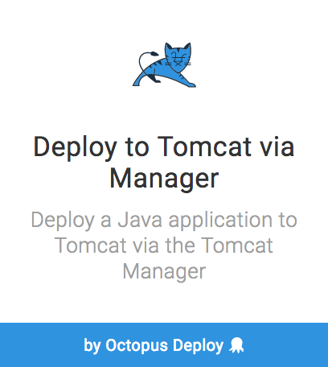
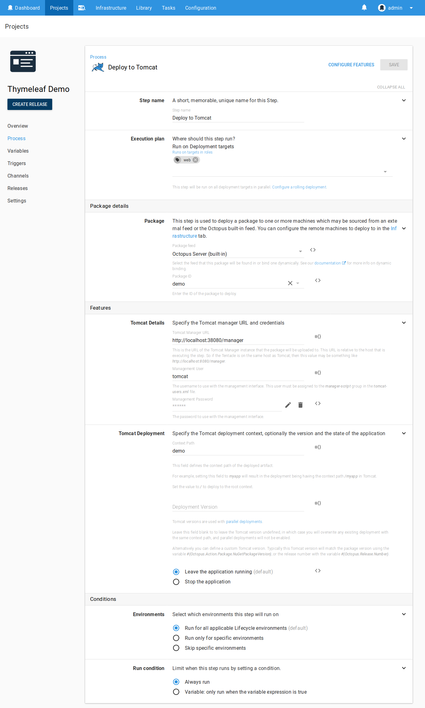
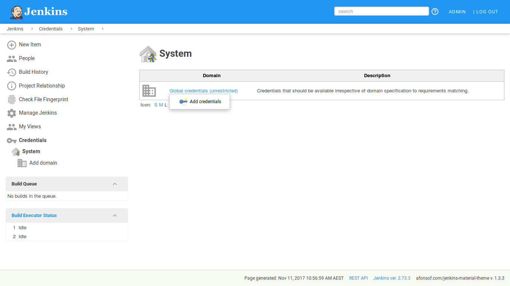
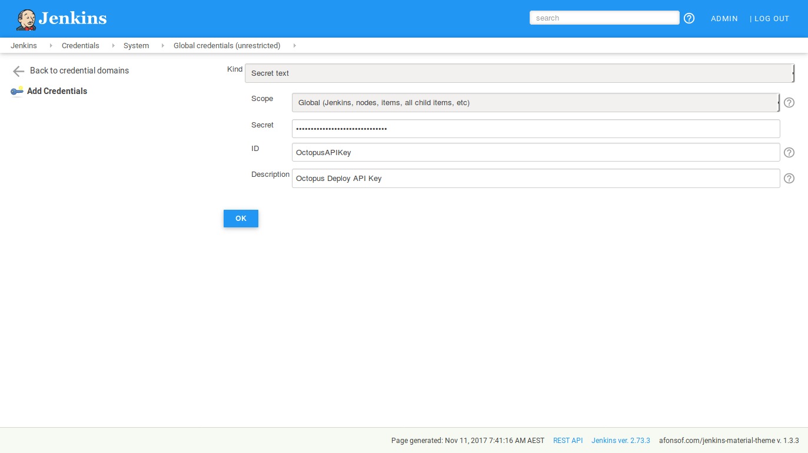
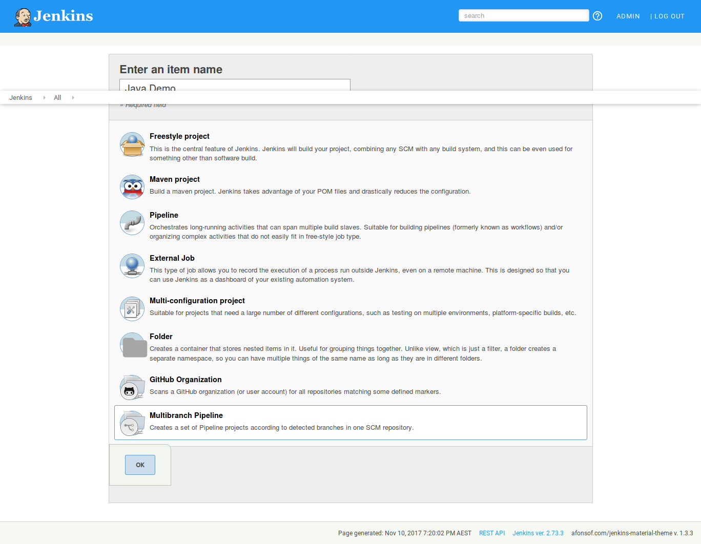
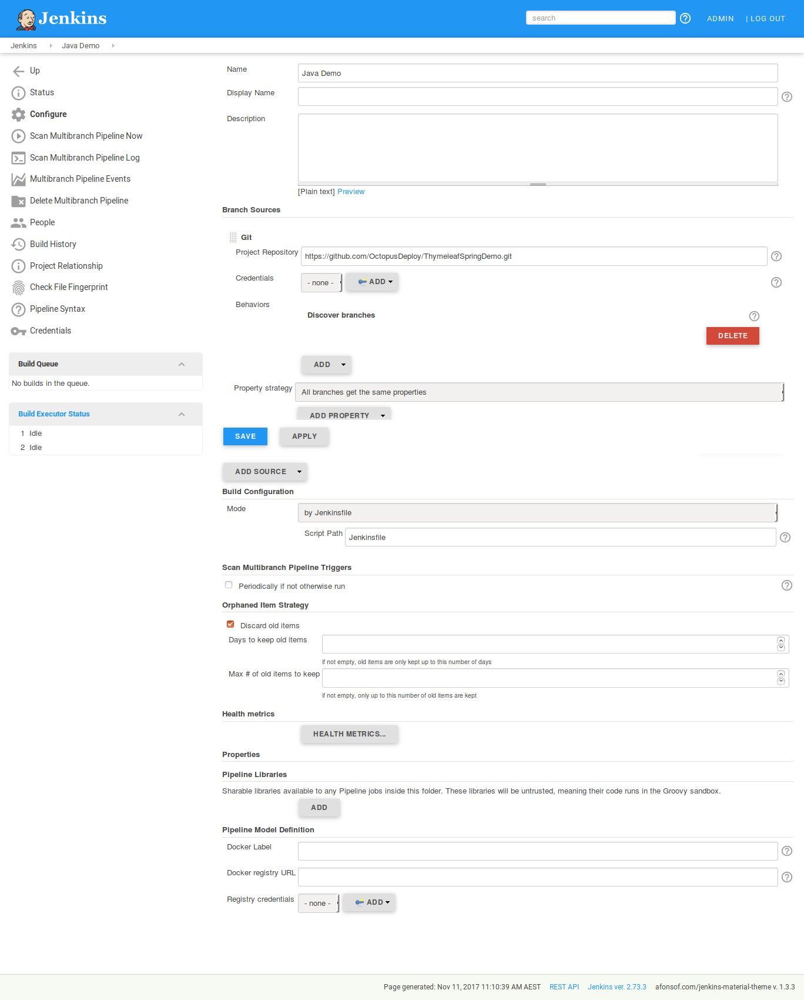
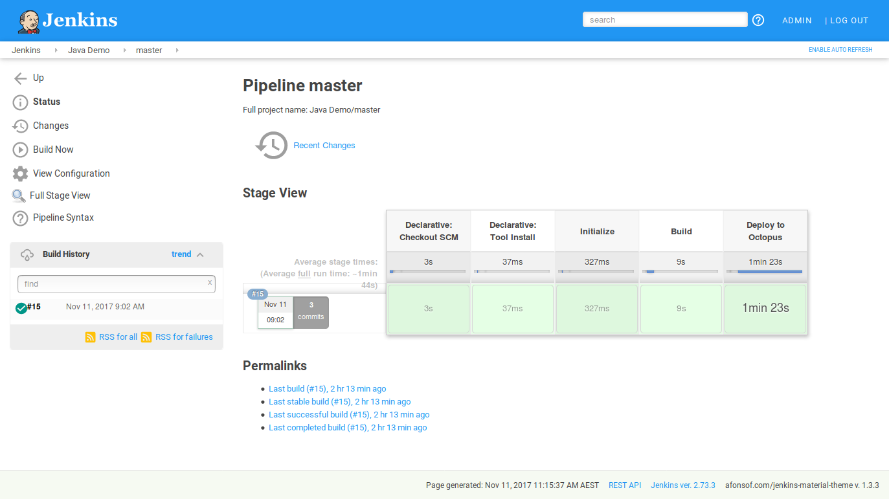
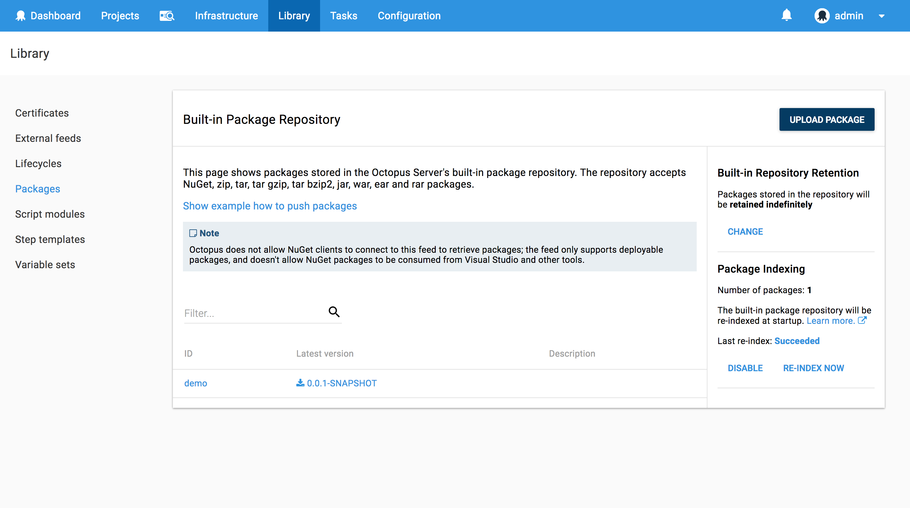
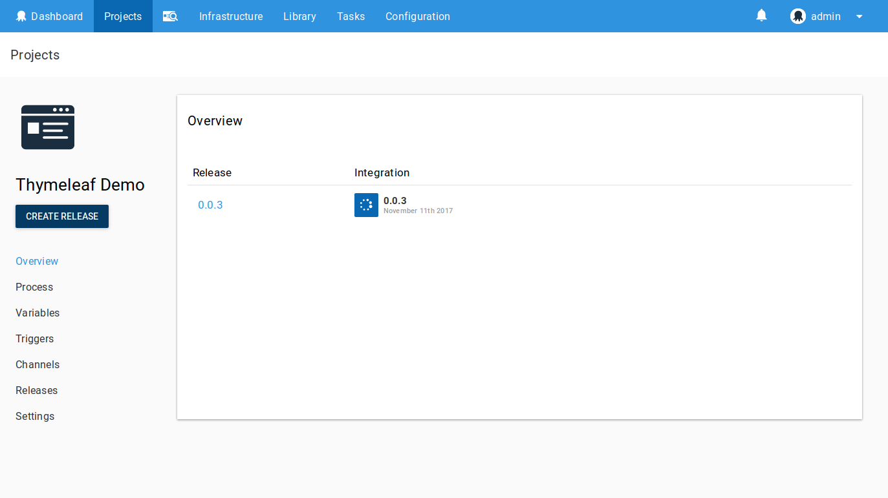
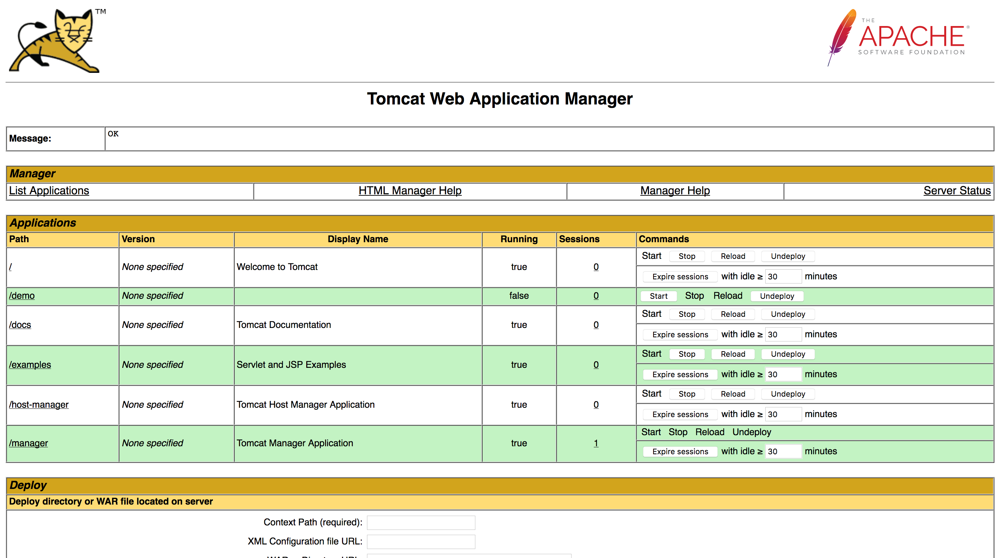

In the [previous blog post](/blog/2017-11/installing-jenkins-from-scratch.md) I showed you how to get a basic instance of Jenkins up and running with the tools required to build a Maven project and publish it to Octopus.

In this blog post we'll take a look at how to use [Jenkins Pipelines](https://jenkins.io/doc/book/pipeline/)  to construct a `Jenkinsfile` that will use these tools to build a WAR file, push it to Octopus, and deploy it to a Tomcat server.

## Creating a Tomcat Deployment Project in Octopus

The first step will be to create a new project in Octopus that deploys a Java web application to Tomcat.

For this we will have an Octopus project called `Thymeleaf Demo` with a single `Deploy to Tomcat via Manager` step.



This step will deploy a package called `demo` from the built in feed to a Tomcat instance found at `http://localhost:38080/manager`.

Note that at this point we may or may not actually have a package called `demo` in the built in library. We can reference a package before it is available when creating a step.

:::hint
The `Tomcat Manager URL` is relative to the tentacle that is performing the deployment. Since the tentacle will usually be installed on the machine hosting Tomcat, the URL hostname is usually `localhost`.
:::



## Saving API Keys

Our `Jekninsfile` will use an Octopus API key when working with the Octo CLI tool. However we do not want to save the API key into the `Jenkinsfile`, since this file is expected to be checked into source control.

Fortunately we can save secret information like API keys in Jenkins itself and reference it from the `Jenkinsfile`.

Click {{Credentials>System}}, then click {{Global Credentials>Add Credentials}}.



Select `Secret Text` from the `Kind` list, paste in the API key in the `Secret` filed, and enter `OctopusAPIKey` in the `ID` field.



## Creating the Jenkinsfile

A `Jenkinsfile` describes the process that Jenkins will follow to build and deploy a project. In our case the `Jenkinsfile` will describe how to build a project with Maven, how to push the resulting WAR file to Octopus, and then how to create and deploy a release in Octopus.

Let's take a look at the complete `Jenkinsfile`.

```groovy
pipeline {
    agent any
    tools {
        maven 'Maven 3.5.2'
        jdk 'Java 9'
    }
    stages {
        stage ('Initialize') {
            steps {
                sh '''
                    echo "PATH = ${PATH}"
                    echo "M2_HOME = ${M2_HOME}"
                '''
            }
        }

        stage ('Build') {
            steps {
                sh 'mvn package'
            }
        }

        stage ('Deploy to Octopus') {
            steps {
                withCredentials([string(credentialsId: 'OctopusAPIKey', variable: 'APIKey')]) {
                    sh """
                        ${tool('Octo CLI')}/Octo push --package target/demo.0.0.1-SNAPSHOT.war --replace-existing --server https://youroctopusserver --apiKey ${APIKey}
                        ${tool('Octo CLI')}/Octo create-release --project "Thymeleaf Demo" --server https://youroctopusserver --apiKey ${APIKey}
                        ${tool('Octo CLI')}/Octo deploy-release --project "Thymeleaf Demo" --version latest --deployto Integration --server https://youroctopusserver --apiKey ${APIKey}
                    """
                }
            }
        }
    }
}
```

First we need to expose the tools that our build will make use of. In our case we need to use the Java and Maven tools that were defined in the [previous blog post](/blog/2017-11/installing-jenkins-from-scratch.md).

:::hint
The names used in the `Jenkinsfile` need to match the names we gave the tools in Jenkins.
:::

```
tools {
    maven 'Maven 3.5.2'
    jdk 'Java 9'
}
```

We can see that these tools have modified the environment variables `PATH` and `M2` in the `Initialize` stage.

```
stage ('Initialize') {
    steps {
        sh '''
            echo "PATH = ${PATH}"
            echo "M2_HOME = ${M2_HOME}"
        '''
    }
}
```

These `echo` commands display the following text in the output when the build is executed. You can see how the `Java 9` and `Maven 3.5.2` tools have been added to the `PATH` environment variable.

```
[Java_Demo_master-MGS2PX56MOUS3SDGT4NCJIWUFLV7GTCUYZIZ6SVGHQVXJPBCSCFA] Running shell script
+ echo PATH = /var/lib/jenkins/tools/hudson.model.JDK/Java_9/bin:/var/lib/jenkins/tools/hudson.tasks.Maven_MavenInstallation/Maven_3.5.2/bin:/var/lib/jenkins/tools/hudson.model.JDK/Java_9/bin:/var/lib/jenkins/tools/hudson.tasks.Maven_MavenInstallation/Maven_3.5.2/bin:/usr/local/bin:/usr/bin:/bin:/usr/local/games:/usr/games:/snap/bin
PATH = /var/lib/jenkins/tools/hudson.model.JDK/Java_9/bin:/var/lib/jenkins/tools/hudson.tasks.Maven_MavenInstallation/Maven_3.5.2/bin:/var/lib/jenkins/tools/hudson.model.JDK/Java_9/bin:/var/lib/jenkins/tools/hudson.tasks.Maven_MavenInstallation/Maven_3.5.2/bin:/usr/local/bin:/usr/bin:/bin:/usr/local/games:/usr/games:/snap/bin
+ echo M2_HOME = /var/lib/jenkins/tools/hudson.tasks.Maven_MavenInstallation/Maven_3.5.2
M2_HOME = /var/lib/jenkins/tools/hudson.tasks.Maven_MavenInstallation/Maven_3.5.2
```

In the `Build` stage we perform the Maven build.

```
stage ('Build') {
    steps {
        sh 'mvn package'
    }
}
```

The final `Deploy to Octopus` stage is where we push the WAR file built by Maven, create a release in Octopus, and deploy the release to the `Integration` environment.

```
stage ('Deploy to Octopus') {
    steps {
        withCredentials([string(credentialsId: 'OctopusAPIKey', variable: 'APIKey')]) {
            sh """
                ${tool('Octo CLI')}/Octo push --package target/demo.0.0.1-SNAPSHOT.war --replace-existing --server https://youroctopusserver --apiKey ${APIKey}
                ${tool('Octo CLI')}/Octo create-release --project "Thymeleaf Demo" --server https://youroctopusserver --apiKey ${APIKey}
                ${tool('Octo CLI')}/Octo deploy-release --project "Thymeleaf Demo" --version latest --deployto Integration --server https://youroctopusserver --apiKey ${APIKey}
            """
        }
    }
}
```

Notice that we have exposed the Octopus API key saved in Jenkins as `OctopusAPIKey` as the variable `APIKey` using `withCredentials`. Any script we run inside this `withCredentials` block can get access to secrets maintained by Jenkins.

```
withCredentials([string(credentialsId: 'OctopusAPIKey', variable: 'APIKey')]) {
    sh """
        ...
    """
}
```

Inside the `withCredentials` block we execute three commands against the Octo CLI: `push`, `create-release` and `deploy-release`.

If you will recall from the [previous blog post](/blog/2017-11/installing-jenkins-from-scratch.md), `Octo CLI` was defined as a custom tool. We can reference that tool by calling `${tool('Octo CLI')}/Octo`.

With this `Jenkinsfile` checked in alongside our Java code, we are ready to create a Jenkins project to use it.

## Creating a Jenkins Pipeline Project

To make use of our Java project and its associated `Jenkinsfile`, we need to create a new `Multibranch Pipeline` project in Jenkins.



The only setting we need to change in this project is the `Project Repository`, which I have set to `https://github.com/OctopusDeploy/ThymeleafSpringDemo`. That repo holds a demo Spring Java web application, and has a copy of the `Jenkinsfile` described above.



## Building and Deploying

This is the result of our `Jenkinsfile` once a build has completed.



In Octopus, the WAR file has been pushed to the built in library.



And a release has been created and deployed.



Which in turn deploys the application to Tomcat.



## Conclusion

Jenkins Pipelines are a powerful way to describe your build process, and by using the Octo CLI as a custom tool it is quite easy to integrate Octopus into your build pipeline.

If you are interested in automating the deployment of your Java applications, [download a trial copy of Octopus Deploy](https://octopus.com/downloads), and take a look at [our documentation](https://octopus.com/docs/deployments/java/deploying-java-applications).
