In the [2017 JetBrains developer ecosystem survey](https://www.jetbrains.com/research/devecosystem-2017/team-tools/) Jenkins topped the list of CI systems. With a wealth of plugins and a huge user base, Jenkins is a powerful solution for building your software projects, and in this blog post we'll take a look at how to get a basic Jenkins instance up and running.

## Installing Linux Tools

To start, I have a fresh install of Ubuntu 17.10.

We need to install a bunch of handy tools that don’t come with the standard Ubuntu installation. Only `git` and `openjdk-8-jdk` are required for Jenkins, but I use the other tools commonly enough to warrant installing them as a matter of course.

```
sudo apt-get install htop vim iftop git openssh-server openjdk-8-jdk
```

## Installing Jenkins

To install Jenkins, we’ll use the custom repo documented [here](https://wiki.jenkins.io/display/JENKINS/Installing+Jenkins+on+Ubuntu).

```
wget -q -O - https://pkg.jenkins.io/debian/jenkins-ci.org.key | sudo apt-key add -

sudo sh -c 'echo deb http://pkg.jenkins.io/debian-stable binary/ > /etc/apt/sources.list.d/jenkins.list'

sudo apt-get update

sudo apt-get install jenkins
```

## Initial Jenkins Configuration

Open up http://localhost:9080 in your web browser. You’ll see a message from Jenkins asking you to enter a password found in the file `/var/lib/jenkins/secrets/initialAdminPassword`.

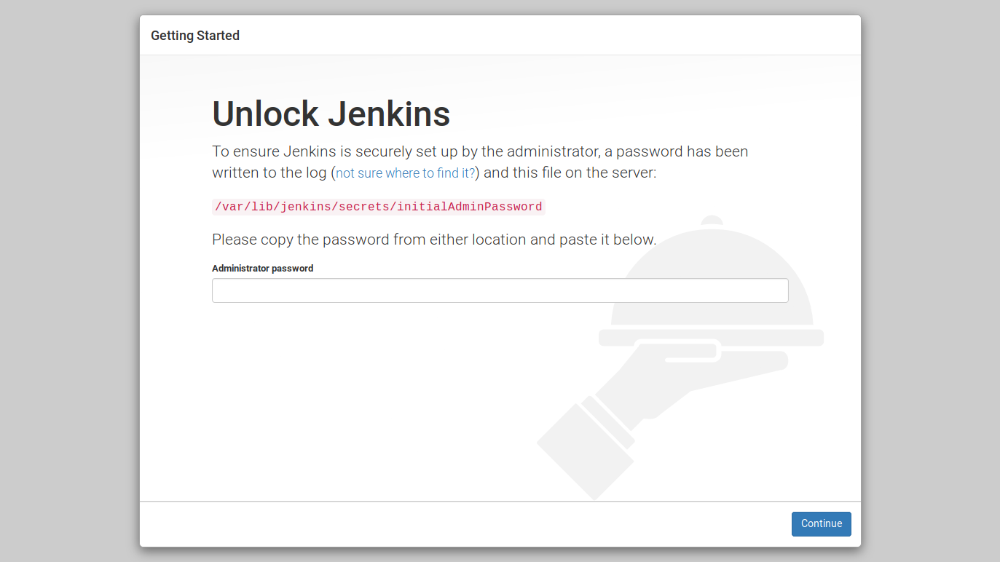

You’ll then be prompted for the plugins that you want to install. At this point, I install the suggested plugins. We’ll add some more later.

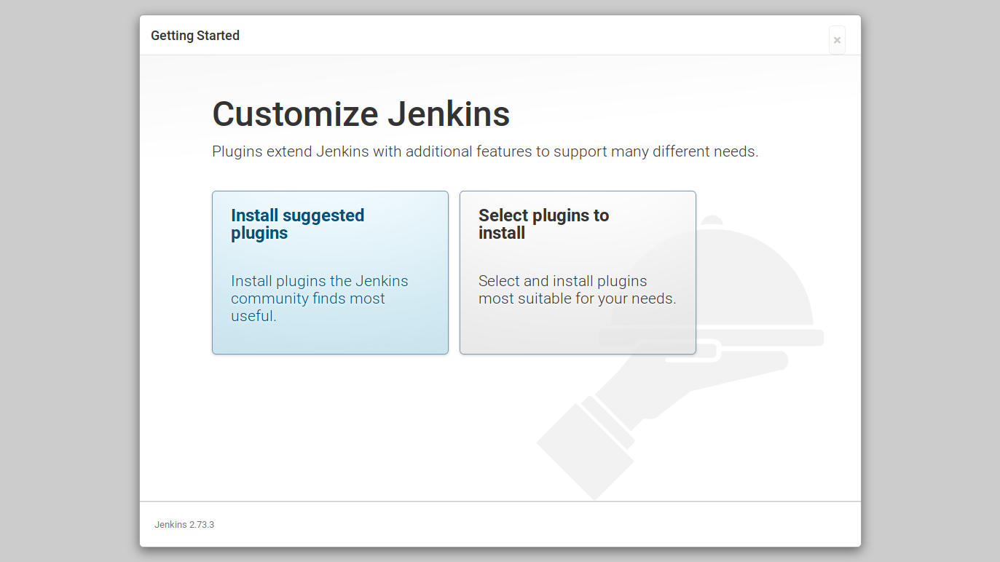

Give Jenkins a few minutes to install the suggested plugins.

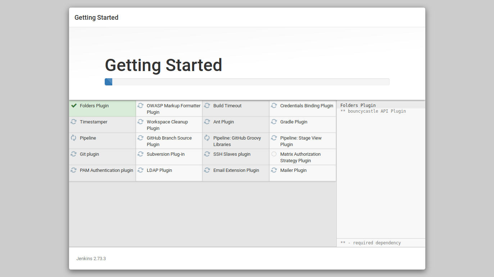

Create your first admin user.


And you’re done!

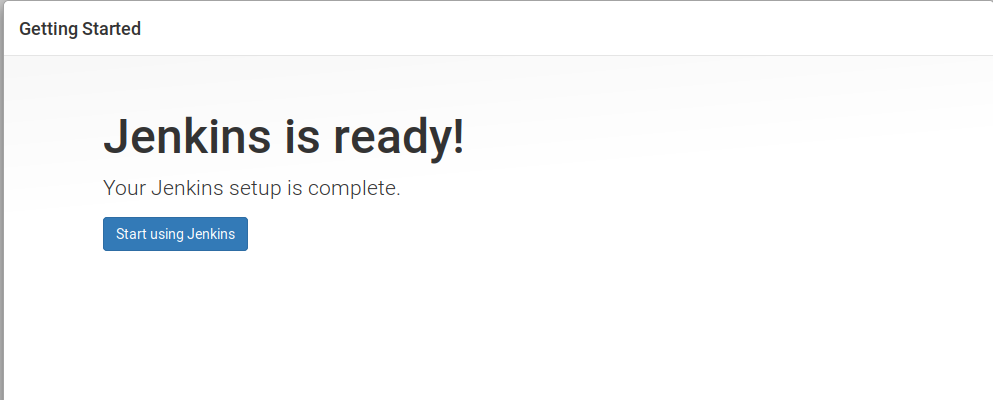

## Installing Additional Plugins

Click Manage Jenkins > Manage Plugins.

Click the Available tab.

Tick the following plugins:

* Maven Integration Plugin
* Simple Theme Plugin
* Custom Tools Plugin

Click Download now and install after restart.

Tick the Restart Jenkins when installation is complete and no jobs are running option.

After Jenkins restarts, you’ll have all the plugins you’ll need.

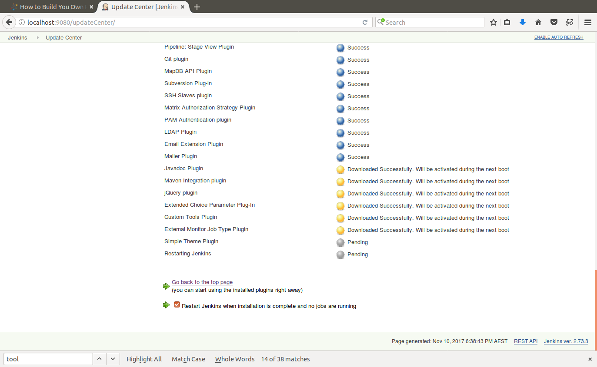

## Applying a Custom Jenkins Theme

The Simple Theme Plugin we installed earlier allows us to modernize the look of Jenkins with a simple CSS file.

Click Manage Jenkins > Configure System, and add the URL `http://afonsof.com/jenkins-material-theme/dist/material-<color>.css` to the URL of theme CSS field. You can find a list of colors on the [Jenkins Material Themes website](http://afonsof.com/jenkins-material-theme/) to replace the <color> marker with. I went with blue, so the URL I entered was `http://afonsof.com/jenkins-material-theme/dist/material-blue.css`

[Jenkins CSS theme](jenkins-theme-css.png)

## Preparing Jenkins

Open up http://localhost:8080 in the browser. Then click Manage Jenkins > Global Tool Configuration.

On this page, we can install a number of tools that we’ll make use of when building our projects. In particular, we want to add a Maven installation to use in our builds, a Java installation to run Maven, and an Octopus CLI custom tool for pushing and deploying files. I find it easier to let Jenkins download and install these tools for me.

### Configuring Java

We need a copy of Java in order to build our application. Under the `JDK` section click the `ADD JDK` button.

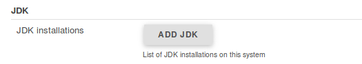

Give the tool a name.

:::hint
We'll refer to the name of these tools in the next blog post where we build and deploy a Java app using a Jenkinsfile.
:::

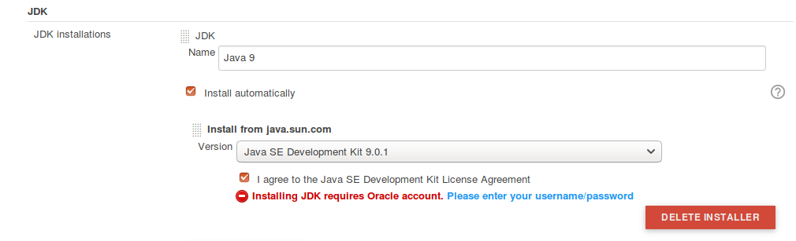

Enter in your Oracle credentials, which are required to download the JDK.

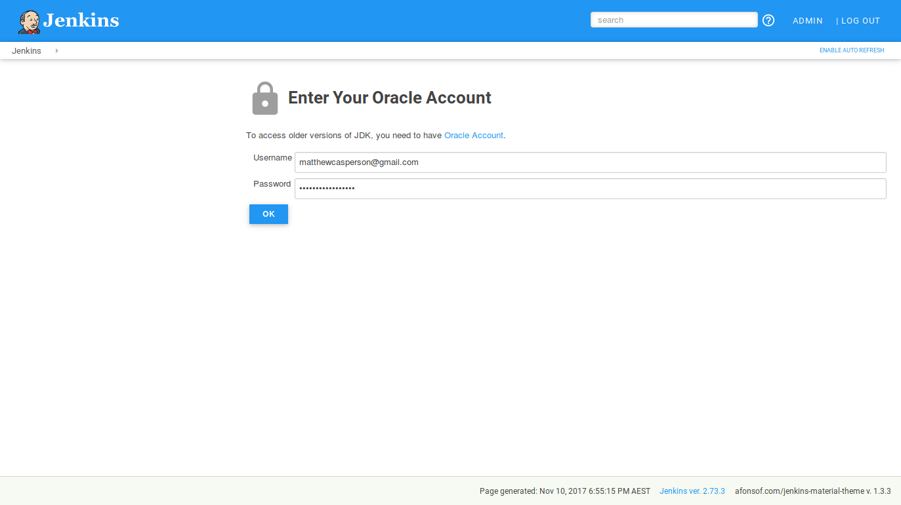

### Configuring Maven

Our Java project will be configured to use Maven, so we need an instance of Maven available to build the Maven project. Under the `Maven` section click the `ADD MAVEN` button.

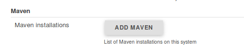

Give the tool a name, and select the latest version of Maven.

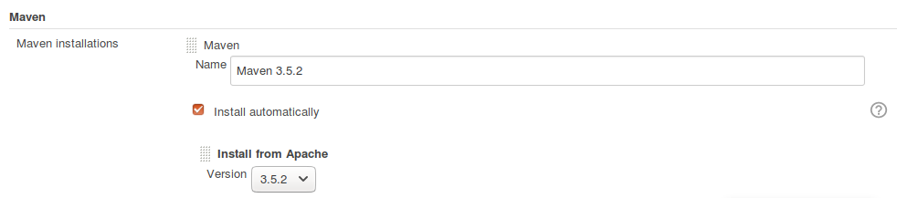

### Configuring the Octopus CLI

Although the Octopus CLI tool is not available natively in Jenkins, the Custom Tools Plugin we installed does allow us to expose the CLI as a Jenkins tool quite easily.

Under the `Custom Tools` section, create a new tool called `Octo CLI` and enter the URL to the Ubuntu CLI in the `Download URL for binary archive` field. You can get the download link for Octo CLI from the [Octopus download page](https://octopus.com/downloads).

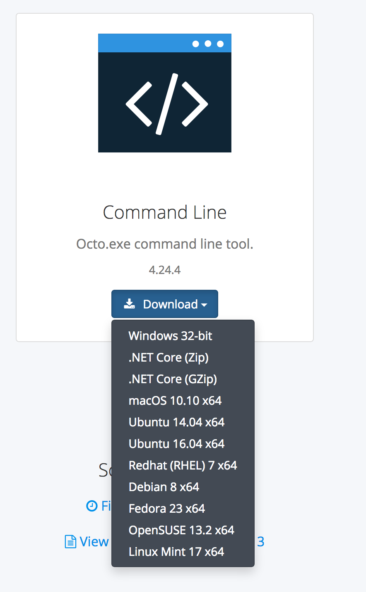

:::hint
Make sure you leave the `Label` field blank.
:::

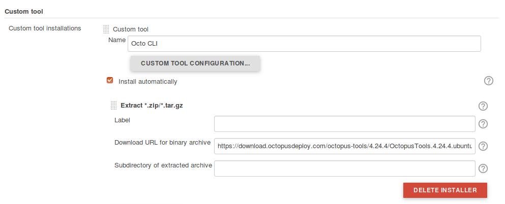
