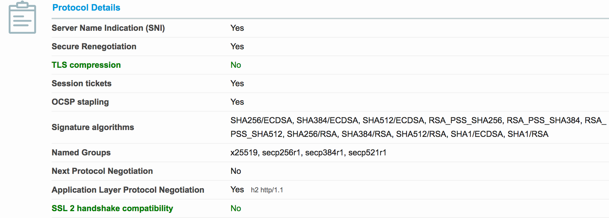
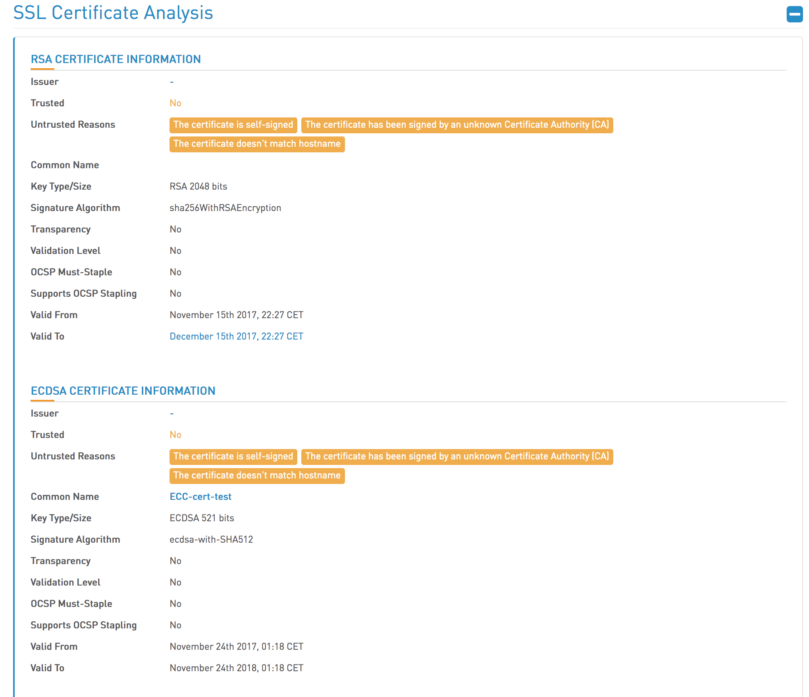

In a [previous blog post](/blog/2017-11/sni-in-tomcat.md) we looked at how Tomcat 8.5+ uses SNI to map certificates to the hostname of a request.

Tomcat 8.5+ can go one step further and supports multiple certificate types for each host. This is most useful for supporting RSA with older browsers, while supporting ECDSA with compatible browsers.

In this blog post we'll take a look at how to configure Tomcat with multiple certificate types.

## Creating Self Signed RSA Keys

To generate an RSA private key and self signed certificate, use the following command:

```
openssl req -x509 -newkey rsa:4096 -keyout rsa.key -out rsa.crt -days 365
```

## Creating Self Signed ECDSA Keys

To create a ECDSA private key, use the following command:

```
openssl ecparam -genkey -out ecdsa.key -name prime256v1
```

The `name` parameter is one from the list returned by the command:

```
openssl ecparam -list_curves
```

:::hint
OpenSSL supports a large number of curves, but browsers typically only support a very small number. [SSL Labs](https://www.ssllabs.com/ssltest/clients.html) allows you to test your browser's support for named curves. In the screenshot below you can see the curves supported by Firefox 57: `x25519`, `secp256r1`, `secp384r1`, `secp521r1`.

`secp256r1` is the OpenSSL `prime256v1` curve.


:::

A certificate is then created from the private key with the command:

```
openssl req -x509 -new -key ecdsa.key -out ecdsa.crt
```

## Configuring Tomcat with Multiple keys

To support both certificate types, multiple `<Certificate>` elements can be added to a `<SSLHostConfig>` element. When multiple `<Certificate>` elements are defined, each must have a unique `type` attribute. The RSA certificates have the `RSA` type, and the ECDSA certificates have the `EC` type.

This is a snippet of the Tomcat `server.xml` configuration file with the two self signed certificates and private keys created using the OpenSSL commands above.

```xml
<Connector SSLEnabled="true" port="62000" protocol="org.apache.coyote.http11.Http11AprProtocol">
  <SSLHostConfig>
    <Certificate certificateFile="${catalina.base}/conf/ecdsa.crt" certificateKeyFile="${catalina.base}/conf/ecdsa.key" type="EC"/>
    <Certificate certificateFile="${catalina.base}/conf/rsa.crt" certificateKeyFile="${catalina.base}/conf/rsa.key" type="RSA"/>
  </SSLHostConfig>
</Connector>
```

:::hint
This snippet uses the APR protocol, which accepts the PEM files that were created by OpenSSL. See [Building the Apache Portable Runtime](/blog/2017-11/building-apr-for-tomcat.md) for more information on enabling APR in Tomcat.
:::

## Verifying the Configuration

[High-Tech Bridge](https://www.htbridge.com) has an online service for verifying the security configuration of a web server.

In this screenshot we can see that the Tomcat server has exposed both the RSA and the ECDSA certificates.



## Conclusion

Tomcat is quite unique in its ability to support both RSA and ECDSA certificates for a single HTTPS port. This allows Tomcat to provide HTTPS to a wide range of clients without sacrificing security. This configuration can be achieved simply by defining two `<Connector>` elements with different `type` attributes.

If you are interested in automating the deployment of your Java applications, [download a trial copy of Octopus Deploy](https://octopus.com/downloads), and take a look at [our documentation](https://octopus.com/docs/deployments/java/deploying-java-applications).
