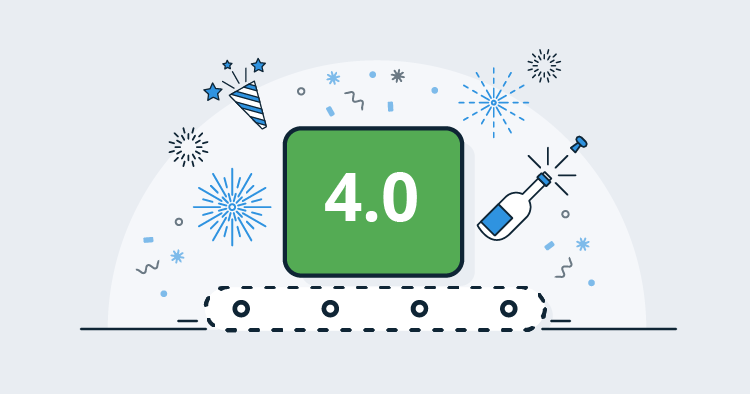
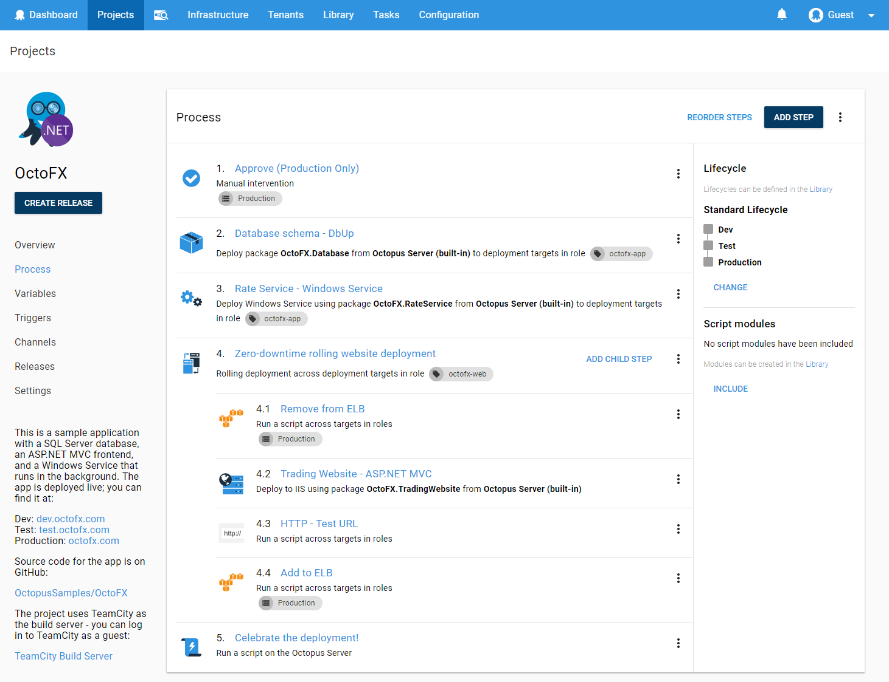
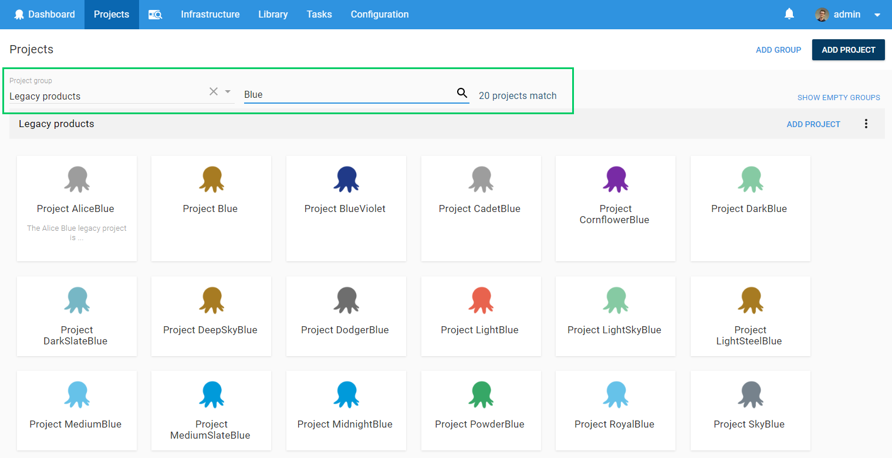
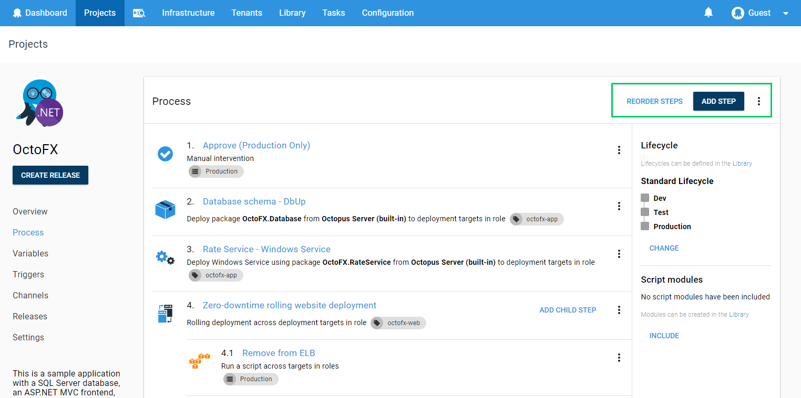
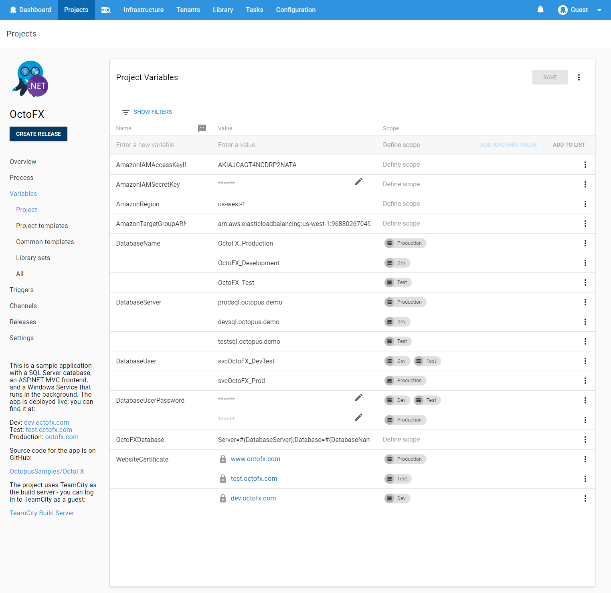
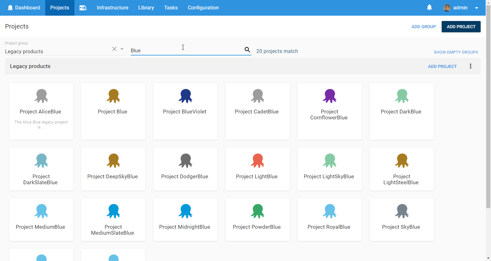
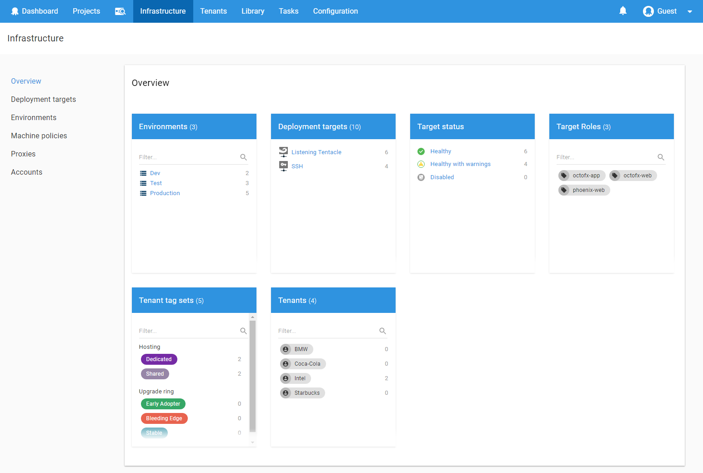

---

We’re very happy to ship Octopus Deploy 4.0, and the entire team is thrilled to share it with the world! [Download](https://octopus.com/downloads) it today! In this release, the biggest change is the [improved UI and user experience](/blog/2017-10/octopus-v4-uxui.md). Octopus now has a modern look and feel, and we redesigned some key areas of the app. From a technical perspective, this involved a complete re-write of our frontend, migrating from [Angular 1.4 to React and Redux](/blog/2017-11/octopus-v4-angular-to-react/index.md).

We [kicked off this process for technical reasons](/blog/2017-10/octopus-v4-history.md), but two themes emerged as we progressed. The first was to make Octopus easier to use and more consistent, and the second was designing for scale.

## In this post

!toc

## Release Tour

<iframe width="560" height="315" src="https://www.youtube.com/embed/i-NdrYnmhNU" frameborder="0" allowfullscreen></iframe>

## Ease of use

Octopus has always been easy to use, but now it’s better than ever. We worked hard to make sure each page was as intuitive and consistent as possible. 

  
We refreshed our look using Google's material design guidelines, but we also kept things simple to retain Octopus's personality. 

  
We added filters and search controls throughout the user interface so that you can focus on what's important to you and get your work done quickly and easily.

  
Octopus actions and buttons are consistent, so you shouldn't have to hunt for that save button anymore!

  
We completely [redesigned and rewrote our variable editor](/blog/2017-10/octopus-v4-variable-editor.md) so it's simpler and easier to manage large numbers of variables. We also included full keyboard support.

  
We [redesigned and simplified our deployment release page](/blog/2017-11/octopus-v4-create-deployments.md) to allow you to specify when and where you want to deploy your projects as well as see a preview and customize it further. 

## Designing for scale

We want Octopus to be a great experience whether you’re a small team with a single instance or a large enterprise with high availability nodes! Some of our largest customers have thousands of projects and thousands of machines. In the past, we’ve made targeted changes to Octopus server to improve performance, but in Octopus 4, we rethought the UI to give customers with large installs a better experience.  

  

The updated project page now has a card layout, and you can access your favorite projects quickly and easily using filters and the project switcher.

  

We [redesigned our environments page](/blog/2017-11/octopus-v4-infrastructure.md) and it's now called the infrastructure page to better suit its purpose and intent. It's far simpler to work with hundreds or thousands of environments and deployment targets. The new overview page gives you a summary of your infrastructure and selecting a summary item takes you to a filtered view of the relevant deployment targets.

## Breaking changes

There are breaking changes in this release and we recommend you review the following list to see if anything is relevant.

* [Octopus UI supports the latest versions of major web browsers](https://github.com/OctopusDeploy/Issues/issues/3938)
* [By default Octopus will only attempt to run a step on up to `10` deployment targets at the same time, instead of attempting to run on every matching deployment target simultaneously](https://github.com/OctopusDeploy/Issues/issues/3861)
* [Removed the `SynchronizationStatus` and `IndexingStatus` properties returned by the `/api/serverstatus/nuget` API](https://github.com/OctopusDeploy/Issues/issues/3842)
* [The `NancyCookie AuthCookieService.CreateAuthCookie()` used by custom authentication providers has been replaced with `NancyCookie[] AuthCookieService.CreateAuthCookies()`](https://github.com/OctopusDeploy/Issues/issues/3834)
* [The `--thumbprint-only` option has been removed from the `Octopus.Server.exe show-thumbprint` command since it is no longer needed](https://github.com/OctopusDeploy/Issues/issues/3833)
* [`Octopus.Server.exe regenerate-certificate` has been replaced with `Octopus.Server.exe new-certificate`](https://github.com/OctopusDeploy/Issues/issues/3832)
* [Removed previously deprecated `Octopus.Server.exe configure`  options `--masterKey`, `--storageConnectionString` and `--webAuthenticationMode`.](https://github.com/OctopusDeploy/Issues/issues/3831)
* [Authentication provider information is now treated as a resource and served through its own API](https://github.com/OctopusDeploy/Issues/issues/3803)
* [The `get_octopusvariable` bash function now returns an empty string if the variable does not exist](https://github.com/OctopusDeploy/Issues/issues/3747)
* [Removed the `/api/letsencryptconfiguration/disable` API](https://github.com/OctopusDeploy/Issues/issues/3720)
* [Removed `ResourceCollection.IsStale`](https://github.com/OctopusDeploy/Issues/issues/3658)
* [Removed unused properties from the `BuiltInFeedStats` API](https://github.com/OctopusDeploy/Issues/issues/3647)
* [Removed the `Page.N` entries from the `Links` list of collection responses and replaced them with some alternatives](https://github.com/OctopusDeploy/Issues/issues/3417)
* [Auto deploy now always re-deploys the most recent successful deployment](https://github.com/OctopusDeploy/Issues/issues/3358)
* [Root document in Octopus API now returns all links](https://github.com/OctopusDeploy/Issues/issues/3916)

## Upgrading

This release contains a few post-install data fixes that may take some time (depending on the size of your `DeploymentProcess` and `User` tables), so please ensure you allow time for this to complete. If you are running the [watchdog service](https://octopus.com/docs/administration/service-watchdog), please ensure this is stopped during the upgrade.

As always, read the [upgrade guide](https://octopus.com/docs/administration/upgrading) for more details on upgrading to Octopus 4.0.

## Wrap up

We're very proud to ship Octopus 4.0 to all of our customers and we hope you enjoy it as much as we do.  [Download](https://octopus.com/downloads) it today!