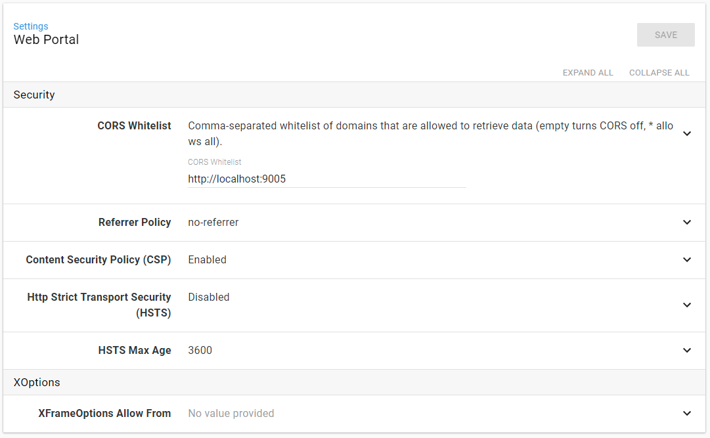

This post is a part of our Octopus 4.0 blog series.  Follow it on our [blog](https://octopus.com/blog) or our [twitter](https://twitter.com/octopusdeploy) feed.

**Octopus Deploy 4.0 has shipped! Read the [blog post](/blog/2017-11/octopus-release-4-0.md) and [download](https://octopus.com/downloads) it today!**

---

For most Octopus users, their day to day interaction with Octopus involves designing and defining awesome deployment processes and then monitoring deployments based on those processes. They live in the beautiful world of the Octopus portal, which as you've already seen in this series is getting even more beautiful in v4.0.

There are another smaller group of users who live in a very different world. They are the group responsible for provisioning the Octopus server itself and keeping it humming along happily such that it can provide the beautiful world in which all of the other users live.

The world this group of users lives in today looks a bit more like this

```bash
Octopus.Server.exe stop --instance=master
Octopus.Server.exe configure --instance=master --corsWhitelist=http://opsthing.mycompany
Octopus.Server.exe start --instance=master
```

Now we know that world is beautiful to some, but it can present a couple of problems.

## Understanding the problems

The problems we're talking about here impact us, as Octopus developers, as well as our customers. We're frequently setting up new instances to try to reproduce issues, test releases before they go out, and develop new features, so we've experienced all of these first hand.

In this section, we're just going to talk about the two biggest problems. The first is understanding what options you can even set. The second is the actual editing of the settings.

### There are how many configuration options?

For those who've never had the pleasure of using the `configure` command, take a minute to either run `Octopus.Server.exe configure --help` (you may want to bump up the height of your Screen Buffer before you do ;) ) or check out our [documentation page](https://g.octopushq.com/ConfigureCommand).

Understanding which of those options relate to each other is sometimes decipherable through the naming, but not always. Sometimes it's decipherable through proximity, but not always.

It's a big wall of text and finding what you're after is way too hard.

### Console access

To change the Octopus configuration, you need access to the server's console. This usually involves physical access to the server or Remote Desktop, Remote PowerShell, or something similar that will let you run commands remotely.

This one is a particular pain point when we're doing things like testing releases before they go out. We have automation in place to spin up a test environment in the cloud, using a base configuration. Now let's say I've been working on something like an authentication related fix and I want to enable the Azure AD authentication provider to test my change.

The instance is up and running, I can log in with username/password, but the first thing I actually have to do is look up the details for the VM that got spun up, then I need to get the address of that server and its admin credentials so I can Remote Desktop to it. Once I'm eventually connected, I have to get to the installation folder and run something like the following:

```bash
Octopus.Server.exe configure --instance=xyz --azureADIsEnabled=true --azureADIssuer=https://login.microsoftonline.com/xxxxxxxx-xxxx-xxxx-xxxx-xxxxxxxxxxxx --azureADClientId=zzzzzzzz-zzzz-zzzz-zzzz-zzzzzzzzzzzz

```

## The solution

We've had these problems on our mind for a while now, and allowing editing of the configuration through an API seems like the obvious answer. So in 4.0 that's what we're doing.

### API first

Allowing reading and writing of the configuration through an API means that we can surface the values in a more meaningful way in the UI and also allow editing like any other resource.

Configuration via API also means that all of the data for reads and writes is exactly the same shape. If you're doing things like automated installation and drift detection, this should make life considerably easier than it has been.

### Bringing things together

As you may have noticed when you looked at the `configure` command, the settings are treated as a list; they aren't structured data. Having an API helps us with this too. 

Given the API uses a JSON document, it can use objects to represent configuration sections and related values. For example, Web Portal configuration can be represented something like this:

```json
{
  "Id": "webportal",
  "Security": {
    "CorsWhitelist": "http://localhost:9005",
    "ReferrerPolicy": "no-referrer",
    "ContentSecurityPolicyEnabled": true,
    "HttpStrictTransportSecurityEnabled": false,
    "HttpStrictTransportSecurityMaxAge": 3600,
    "XOptions": {
      "XFrameOptionAllowFrom": ""
    }
  }
}
```

Or for Azure AD, something like this:

```json
{
  "Id": "authentication-aad",
  "IsEnabled": true,
  "Issuer": "https://login.microsoftonline.com/xxxxxxxx-xxxx-xxxx-xxxx-xxxxxxxxxxxx",
  "ClientId": "zzzzzzzz-zzzz-zzzz-zzzz-zzzzzzzzzzzz",
  "Scope": "openid%20profile%20email",
  "RoleClaimType": "roles",
  "NameClaimType": "name",
  "AllowAutoUserCreation": null
}
```

### A new UI

With the updates that are being made to the portal, it is now considerably easier for us to dynamically generate the forms for editing the configuration.

Why's that important? In a word, Extensions. We wanted a way to allow the extensions to contribute UI to the portal without them having to understand the technology involved. In v3.5+, the extensions were able to contribute Angular modules, and this worked for what we needed at the time, but it always felt risky.

So we're moving away from that model and instead using a model based on how we handle Step Templates. I.e., we describe the UI we want using some metadata and then generate it. This means there are actually two new APIs, one for getting/setting the values and one for getting the metadata related to the values.



##  Some fine print

There are some things to note with these changes when you're using Octopus in a HA configuration.

### Node specifics

First and foremost, the only configuration settings you can see and edit via the API and UI are those that relate to every node in a HA node set.

Settings like ListenPrefixes, ForceSSL, and RequestLoggingEnabled are node specific, for a variety of reasons, and therefore cannot be edited via the API.

### Performance and caches

One of the reasons those node specific settings are problematic is that changing them requires a restart of the Octopus service. In a single node configuration this isn't too hard to manage but in a load balanced HA configuration it's a much trickier proposition, and tackling that is beyond the scope of what we are aiming for at the moment.

Of the values we are making editable, some are being cached by all of the nodes for performance reasons. In v3.x any change to those values would also require a service restart, but we're working to avoid that in 4.0.

In 4.0, the node that receives the API request for the update will immediately reset its in-memory cache. All other nodes will reset the next time they heartbeat (which can be between 5 and 30s depending on whether they are the leader node or not). So it could take up to 30s for some changes to propagate across the nodes. We'd love for this to be more immediate across the cluster, but introducing a distributed cache is again beyond the scope of what we're aiming for at the moment.

In a non-HA configuration you are really just running a single node, so will get the immediate reset behavior.

One final point, the command line implementation isn't being changed. It still supports all of the settings it used to, including the node specific ones. This means that it also still runs in a separate process to the Octopus service and cannot trigger the cache reset immediately. HA or not, you have to wait for the next heartbeat for the changes to come into effect. This may get changed in a future update, but for now, the best way around it is to configure via the new API ;)

## Feedback welcome

We've certainly been finding life easier during our testing of these changes, and we're hoping you do too. As always, we're keen for your feedback so please leave any comments below.

Happy configuring and Happy Deployments!


UPDATE (24 Nov 2017): We've added some examples of how to interact with the new API programmatically over in our [administration documentation](https://g.octopushq.com/ManagingConfig).