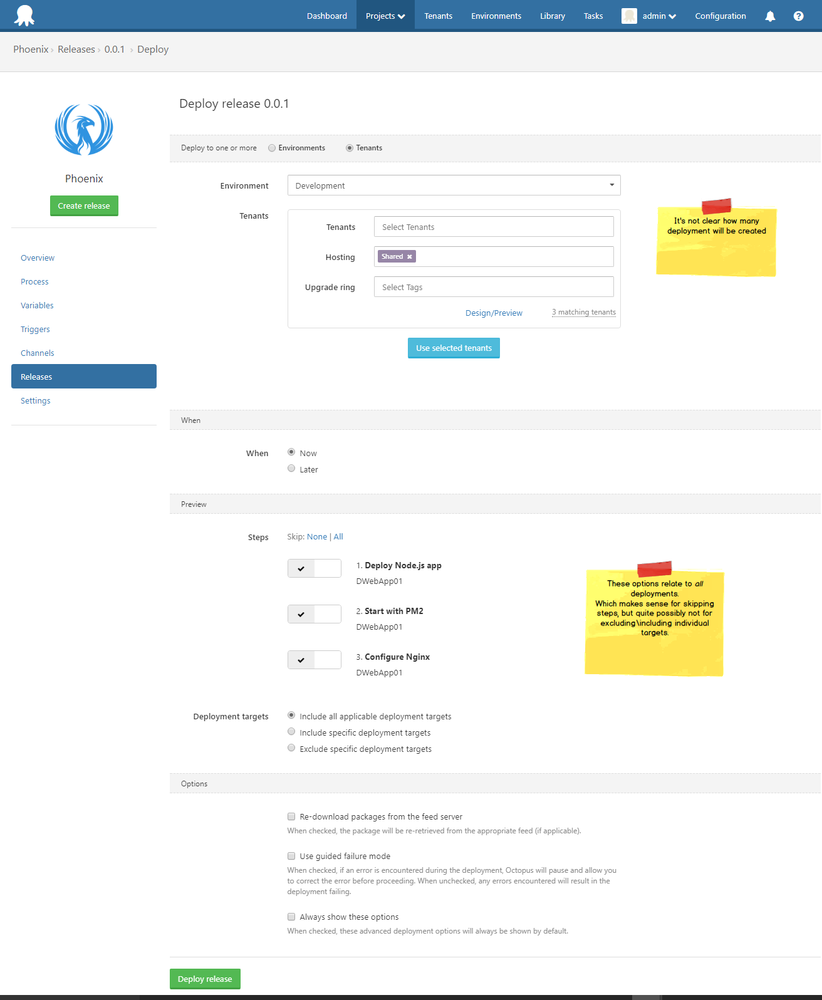
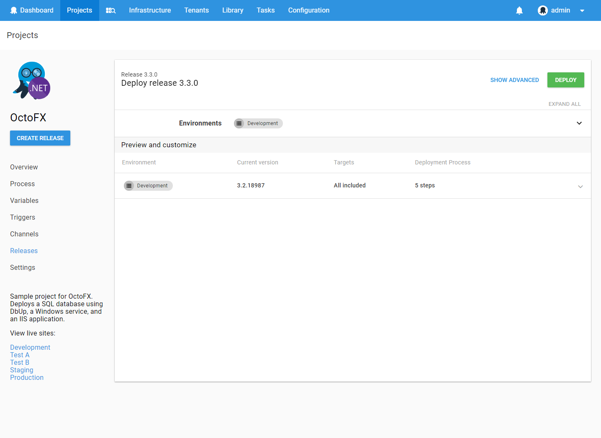
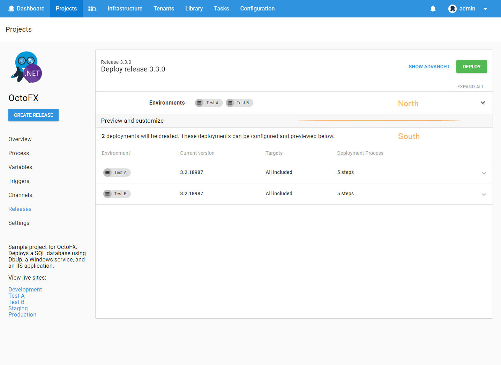
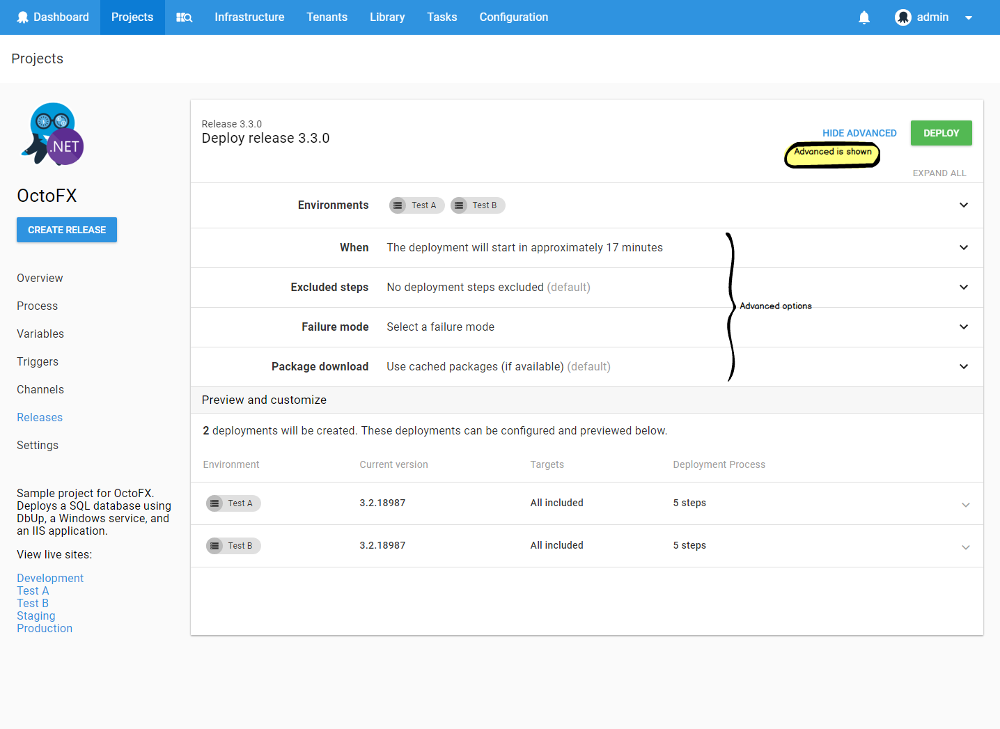
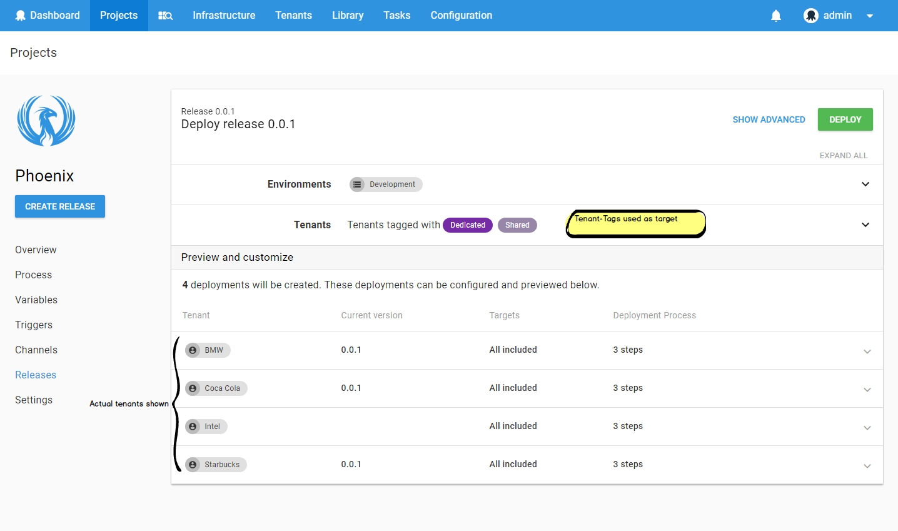
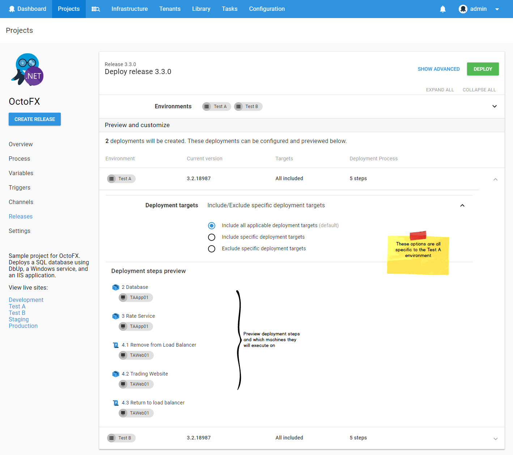
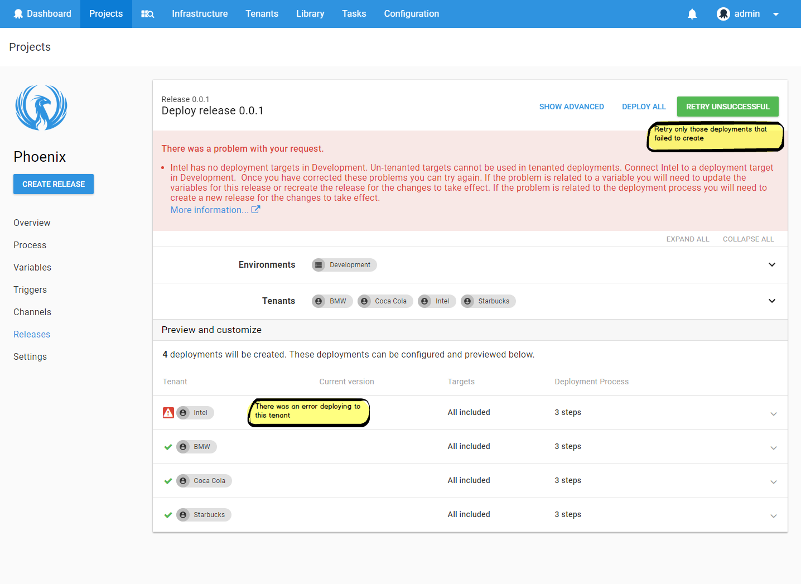

While working on Octopus v4, many pages were essentially a direct port to the new look-and-feel.    
But there were a few where we took the opportunity to re-think the design. 

One of the latter was the page to create a deployment.

The existing page was originally created to deploy a release to a single environment.  It was later extended to allow deploying to multiple environments. Then the multi-tenancy feature came along, and we bolted on the ability to create deployments for one or more tenants. 

If we're honest, it was overdue for a re-design.

## Introducing the new create deployment page

The most significant changes are seen when deploying a release to multiple environments or tenants. 

We conceptually split the page into two sections: the **North** and the **South**.

In the image below, the _Preview and Customize_ separator forms the Equator.

The North is where you select _where_ the release will be deployed (Environments and Tenants). It also allows you to configure some options which apply to _all_ the deployments that will be created.

The South displays the deployments that will be created, and provides the ability for additional _per-deployment_ configuration.

### North

In the North, you select the environments and tenants (if it is a multi-tenant project) you wish to deploy to.

The _Show Advanced_ button reveals additional options, such as:

- Scheduling the deployments for a future time  
- Excluding steps from the deployment

### South

The South section hopefully clearly shows the deployments which will be created. This was something the existing design did not communicate effectively.

This becomes particularly important if tenant-tags are used as the target  in the North.  In this case the South will resolve the tags, and display exactly which tenants will be deployed to.

Expanding a deployment allows you to preview which deployment steps will be executed, and on which targets. 

You can also include\exclude specific deployment targets here.   

### When it's not rainbows and lollipops 

Sometimes creating a deployment fails.

You may not have any matching targets in an environment.  You may be missing a required variable.

If you are deploying to a single environment (or a single tenant), then this wasn't a problem:  The error message would be displayed, you would resolve it, and try again.

When deploying to many environments\tenants, and some deployments failed to be created while others succeeeded, it gets more complicated. 

The previous version of this page would display the error messages, but left it to the user to reconfigure their deployment options so that the deployments that were successfully created would not be re-created. 

The new version provides a _Retry Unsuccessful_ button.  

For example, in the image below, the deployment to the _Intel_ tenant failed to be created.  Clicking _Retry Unsuccessful_ will re-attempt for only that tenant (there is also a _Deploy All_ button).   

## Tell us what you think 

We always love your feedback. 

Tell us what you think about the new design?  We'd especially love for you to leave a comment if you had issues with the previous version.  Did we address them? 

Happy Deployments!   
_(Hopefully created via Octopus v4)_
