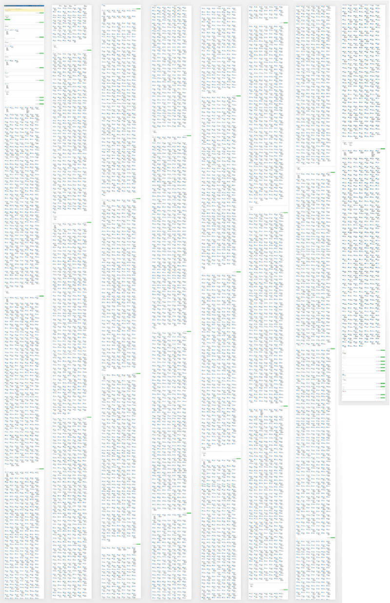
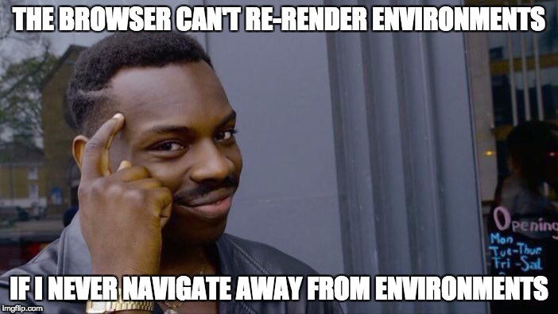
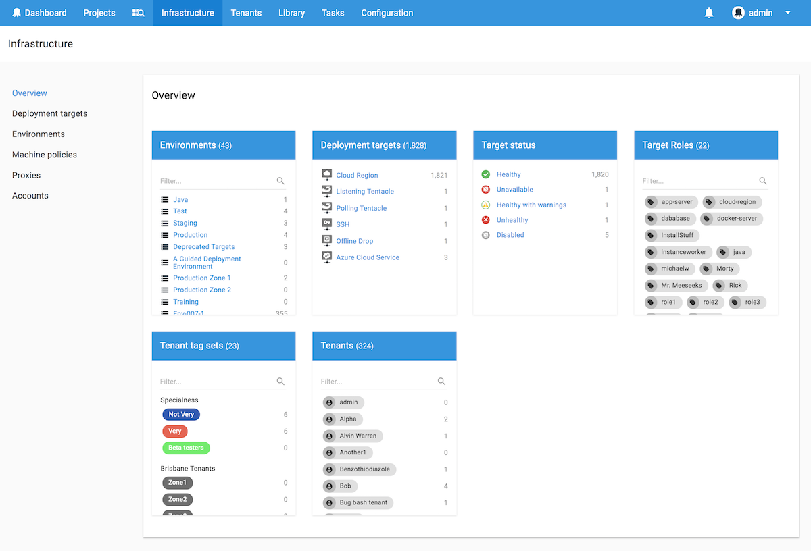
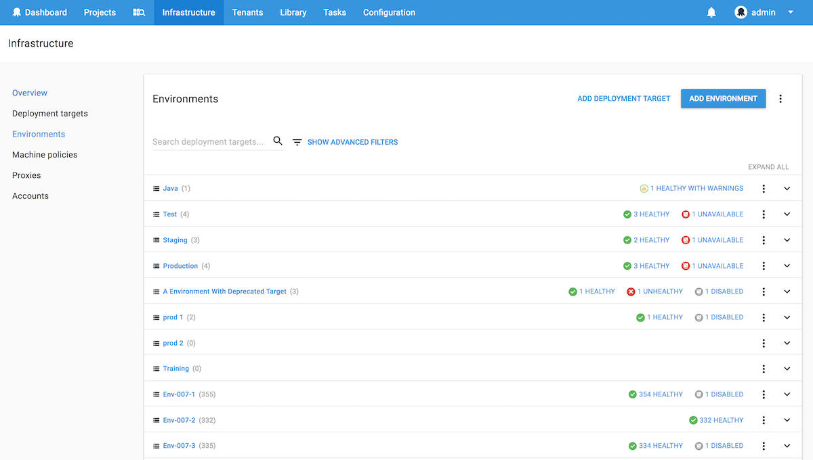
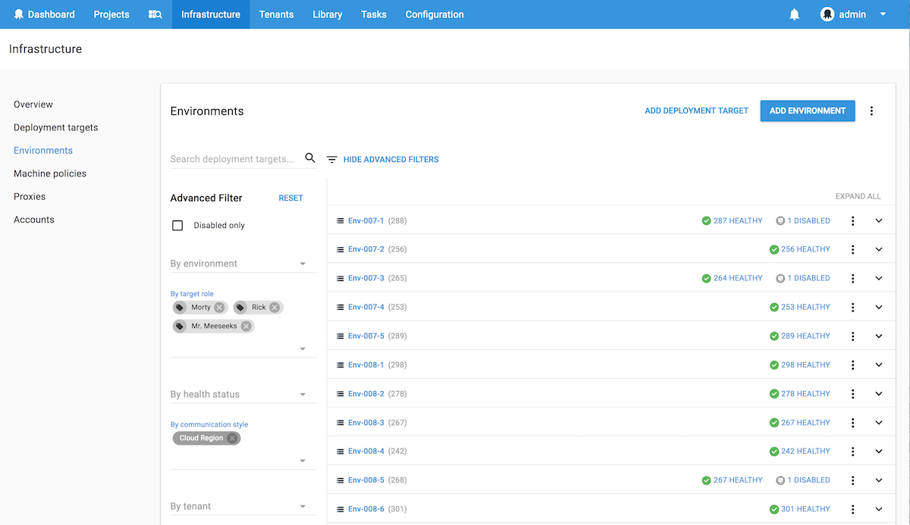
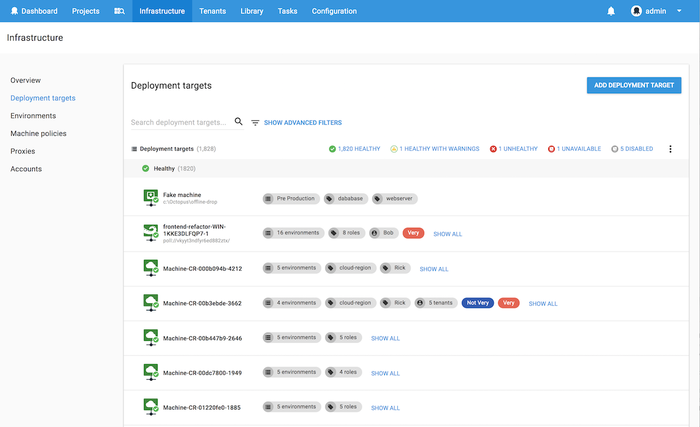

This post is a part of our Octopus 4.0 blog series.  Follow it on our [blog](https://octopus.com/blog) or our [twitter](https://twitter.com/octopusdeploy) feed.

**Octopus Deploy 4.0 has shipped! Read the [blog post](/blog/2017-11/octopus-release-4-0.md) and [download](https://octopus.com/downloads) it today!**

---

For those who've used Octopus with more than a few hundred deployment targets, you'll know the frustrations of the current environments screen all too well :)

Some customers use Octopus with thousands of deployment targets, some with tens of thousands of deployments targets. For customers operating at this scale, the rendering time to present all those targets is not great, it's not even good ... it's table-flipping material (as the page will often time-out during rendering once it reaches a certain memory limit). Add to that an inability to search, filter or page through results, and it simply does not scale.

There are also customers who only have the need for a handful of deployment targets, who do not want to be crippled by a solution that caters _only_ for customers operating at scale.

So we had a high-level checklist of things we wanted to improve, namely:

- Improving the rendering time for large numbers of environments and deployment targets
- Adding the ability to search and filter by various criteria
- Switching to a list layout, to make things easier to find at a glance
- Adding an overview page that provides a useful summary, so you can get to what you want, fast

We were also aware of the distinction between wanting to manage environments (and deployment targets _within_ those environments) and just wanting to manage deployment targets. The point is, different customers have differing needs, and trying to condense all requirements into one screen was just not proving feasible, so we decided to give our users options, and do both :)

## Understanding the problem

To get into this mindset, we wrote a script and loaded up 2000+ deployment targets with randomised data and opened up the (current) web-portal...

Yes, that's a long-and-wrapped version of what the environments page was rendering (each of those little blue dots is a machine icon). To put this into perspective, my “full-screen screenshot” plugin ran out of memory and crashed when trying to capture all of them on my retina iMac, so I had to capture that from a VM with lesser DPI settings :)

Obviously the first thing we noticed was a significant amount of time being spent on rendering. No paging is implemented on this screen, so if you have, say, over 9000 deployment targets, that's over 9000 HTML line-items that your web-browser needs to generate and render (not to mention all the grouping of environments and health statuses that also needs to happen).

The second thing we noticed is how difficult it is to find anything. You're left with having to Ctrl-F in your browser, because the grid-layout makes it very difficult to scan and find things quickly.

What's worse is, if you clicked through to a target then clicked back, you have to wait for everything to load all over again (the rendering, the Ctrl-F to find your place again ... you just wanted to scream or cry, often both). After some time of living in this state, you learn to adapt and `right-click > open deployment target in new tab` to avoid having to reload the environments page...

But this is exactly what we wanted by scripting so many deployment targets, because now we were experiencing the pain first-hand. Now we had a problem to solve and the motivation to see what we could come up with :)

## The 4.0 Solution

### Introducing the new Infrastructure Overview

Previously, all environments and deployment targets were located in an area called “Environments”. This environments area also had links to machine policies, proxies and accounts in the top-menu, which always felt a bit "tacked on" and not really related to environments at all. So firstly we decided to clean house and create a brand new area called **Infrastructure** where all things infrastructure would now live (and don't worry if you have any environment-related bookmarks, we've added redirects from the old v3 routes ;) ).

At a glance, you now get a summary of your environments, deployment targets and how they're being used with combinations of things like roles and tenants. We've found this view to be incredibly useful for knowing when some targets may be unhealthy or unavailable, and it's made the process of getting to specific _types_ of deployment targets much easier.

For example:

- _Want to quickly click through to your targets tagged with a "docker-server" role?_ Click the link and it'll take you right to them.
- _Want to only see your Polling Tentacles, or maybe just your Disabled targets?_ That's very easy now.

Also, for customers working with multi-tenancy, we've got you covered. You can now very quickly find deployment targets by tenant or tenant tag set.

### Introducing the new Environments screen

The new environments screen takes advantage of the advanced filters available with the Octopus 4.0 redesign (and then adds even more filters per environment _"We have ~~fake doors~~ filters like you wouldn't believe!"_), making it much faster to load environments and see a summary of the deployment targets contained within. 

This screen will be especially useful for customers operating at scale, who don't want Octopus to start loading and rendering thousands of targets until they've specified exactly what they're looking for.

For example, if you're looking for Cloud Region targets with specific roles, simply expand and assign your filters and the list will refresh with the relevant environments.

You can then click an environment to expand and see the deployment targets that match the criteria.

### Introducing the new Deployment Targets screen

For customers who just want to quickly get to their deployment targets (and don't want to go through an extra click via the environments screen to get there), we've made a Deployment Targets area just for you :)

This screen contains the same search and filtering mechanisms that the environments screen has, but it shows you your deployment targets straight away.

Whichever way to choose, we've added paging support on the client to cut down on rendering thousands of unnecessary targets and client-side caching support on selected endpoints to make loading as fast as possible. 

The filtering on these screen also includes deep links, so when you click through to a deployment target and click back, those filters will still be applied when you return to the list #NoMoreTableFlipping.

## That's all, folks!

We're really excited to get this in your hands soon. Feel free to leave us a comment and let us know what you think :)

Thanks for reading, and happy deployments!
