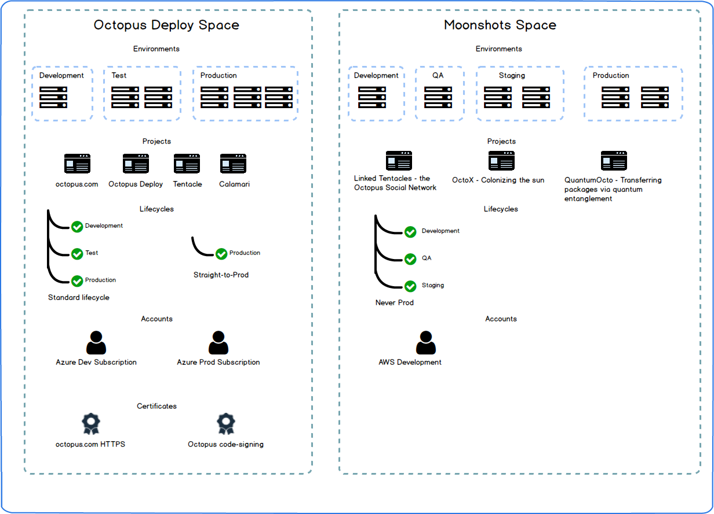
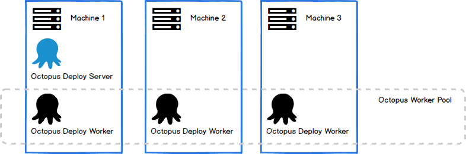

A key focus of our thoughts over the past year has been how to best allow Octopus to scale, to gracefully cater for our biggest customers.
We spent some time designing; we published a few posts to get your feedback (Octopuses, Spaces\ODCM, Remote Release Promotions); and we experimented with some ideas.   

But we also made a mistake. We left our customers unsure of our direction. 

Hopefully this post will rectify that.  It will outline the changes we plan to make in the immediate future to better allow Octopus to ... 

## Summary

- **Spaces:** Provide a better ability for teams to have their own space within Octopus.  This means less will be at the global level. For example, environments, projects and lifecycles will live within a space. 
- **Octopus Worker Pool:** Your build server probably has the concept of build agents\workers.  In a similar concept, Octopus will have a pool of workers for executing tasks.  
- **Remote Release Promotions:** This will allow a release to be promoted between Octopus servers.
- **Octopus Data Center Manager (ODCM):** We are not planning to implement this in the short-term future. We feel the above features will provide most of the benefits that ODCM would have, but in a more accessible way. 

We'll talk about each of these in more detail.

## Spaces

We introduced the concept of Spaces in our [Managing Spaces with ODCM](https://octopus.com/blog/odcm-rfc#giving-teams-their-own-space) post.  

The general idea is better segration for teams within Octopus. For example, currently Environments are global within an Octopus instance; they are shared between all projects. As are Lifecycles, Accounts, Certificates, and just about everything else. 

We believe this is not ideal, as in our experience disparate teams within an organization typically share very little. Even where Environments are shared (e.g. two teams may both have a Test environment), it is often simply a shared name rather than shared infrastructure. By pushing everything down a level, we believe it will improve the usability of the UI, and improve performance. 

**Note:** In the ODCM post, Spaces were synonymous with an Octopus server instance. This will not be the case. Spaces will exist within an Octopus server instance.   

## Octopus Worker Pool

Today, the Octopus Server has dual responsibilities:

- HTTP server: hosting the Octopus Web UI and API
- Task runner: executing jobs (deployments, health-checks, etc). 

Currently, if the combined workload of these two functions exceeds the server's capacity, the only option (other than upgrading the server hardware) is to scale out into multiple Octopus servers in a [High Availability](https://octopus.com/docs/administration/high-availability) configuration. 

In general, an organization is far more likely to nudge the limits for executing tasks, than it is for hosting the HTTP server. This makes sense, Octopus is a task-automation server. And serving HTTP responses scales more naturally than executing long-running IO and CPU intensive tasks. 

Our solution is to introduce the Octopus Worker Pool. We will split the worker process out from the Octopus Server. By default a single worker will be installed on the same machine as the Octopus Server, and for most customers this will be all they ever need. But larger customers will have the ability to add additional machines to the pool, allowing them to scale their capacity as required. 

This approach should be familiar, as it is probably similar to your build server. For example TeamCity has the concept of Agents, which are responsible for executing jobs. 

As we build a hosted Octopus SAAS offering, this is something we require.  It makes sense to expose the same feature to our existing customers. 

## Remote Release Promotions

We published a [detailed design for this feature](https://octopus.com/blog/remote-release-promotions-rfc) earlier this year, and we plan to implement this pretty much as specified. 

## ODCM

Earlier this year, our proposed solution for scaling was to faciliate the installation and management of multiple Octopus Server instances, via Octopus Data Center Manager (ODCM).

We originally felt this was killing two birds with one stone:

- Need to add a new space to better segregate your server: Spin up a new instance with ODCM. 
- Is your server struggling with the amount of tasks it has to run: Spin up a new instance with ODCM. 

But we realized that rather than addressing both scenarios, ODCM wasn't quite the right tool for either.
If you simply want to segregate your data, and your server is otherwise under no stress, then creating an entire new instance feels rather like cracking a nut with a sledge-hammer. And in the reverse, if you don't want to segregate your teams\projects, but rather simply to add more task-running capacity, then you don't need another Octopus Server, you need more workers. 

We are not saying we will never build ODCM.  In fact, there is a good chance we will need something similar for building our hosted solution.  It is just no longer an immediate priority as a feature to offer to customers.
