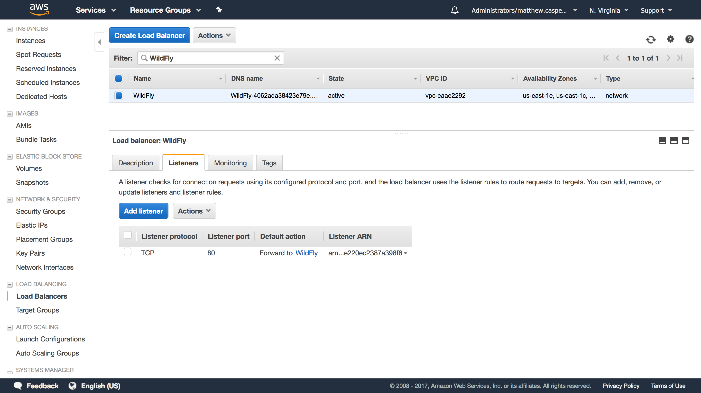
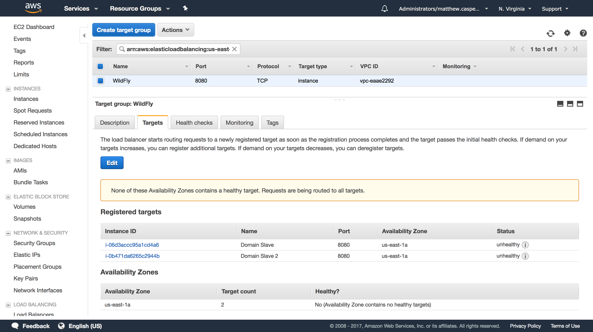
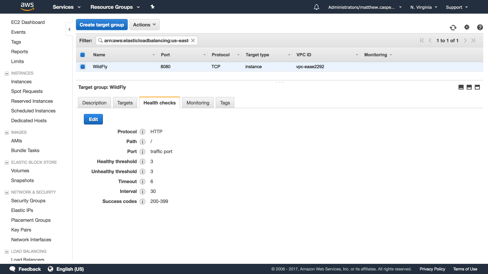
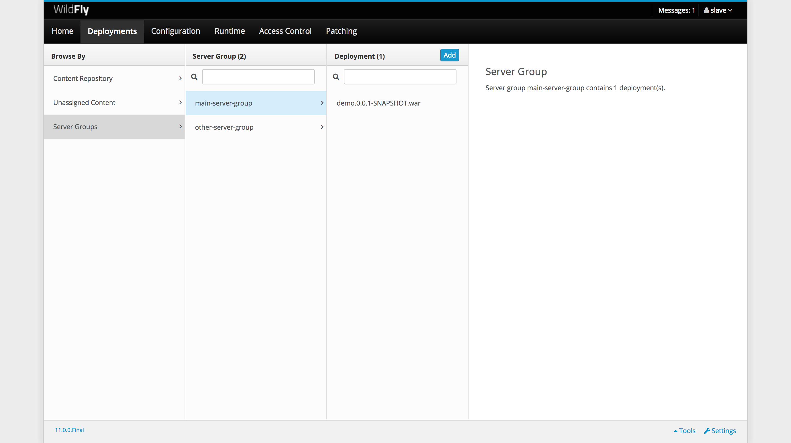
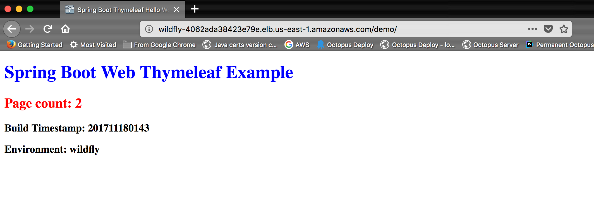
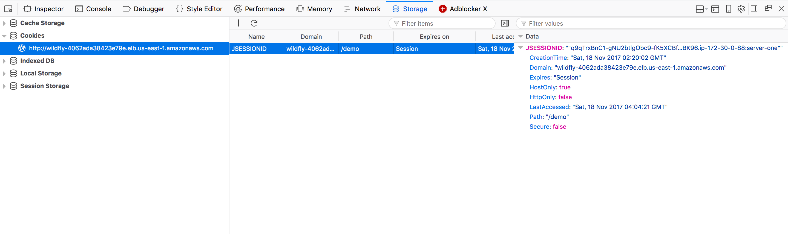

In the [previous blog post](https://octopus.com/blog/wildfly-s3-domain-discovery), we looked at how WildFly domains can be configured in an AWS environment with no fixed IP addresses or network broadcasts by centralizing configuration settings in an S3 bucket.

In this blog post, we’ll take this configuration one step further by configuring a cluster of WildFly instances in AWS.

## Domain vs cluster

Before we start configuring a cluster, it’s worth spending some time discussing the difference between a domain and a cluster.

A domain is made up of a domain controller and one or more domain slaves. The domain controller distributes settings and applications to the domain slaves, as well as provide a way to start, stop, and restart slave instances.

A domain is simply a management tool. You do not get any additional functionality, beyond simplified management, because instances are part of a domain. In fact, you can replace a domain using tools like the [JBoss Operations Network (JON)](https://www.redhat.com/en/technologies/jboss-middleware/operations-network).

The term cluster can be ambiguous, so for the purpose of this blog post, a cluster means two or more WildFly instances that share Servlet session state. Sharing this state means that server-side web applications can be provided by any node in the cluster, and if one of those nodes goes down, requests will be fulfilled by another node that has a copy of the session state.

:::hint
Although, in theory, a cluster allows for any node to respond to a request for a stateful web application, in practice, you’ll usually implement sticky sessions to direct traffic from a session to a single server (as long as it’s available). The [Infinispan documentation](http://infinispan.org/docs/8.2.x/user_guide/user_guide.html#asynchronous_options) talks about the performance benefits of using sticky sessions.
:::

A domain can be used to configure slave instances as part of a cluster, or a domain can be comprised of multiple independent nodes that do not form a cluster. Likewise, multiple standalone instances of WildFly can be configured to form a cluster.

So while both a domain and a cluster are groups of WildFly instances coordinated in some way, the two terms refer to different things.

## Configuring a cluster

Although we don’t need a domain to configure a cluster, a domain is a convenient way to distribute common settings to multiple WildFly slaves, so we will use a domain to build our cluster. We’ll build on the work already done as part of the [previous blog post](https://octopus.com/blog/wildfly-s3-domain-discovery) to build a WildFly domain.

Extending the domain to support a cluster requires a number of steps.

### Define a central configuration database

When building the domain, we used a shared S3 bucket to facilitate the discovery of the domain controller. In a similar fashion, we’ll use a shared database to facilitate the discovery of cluster nodes.

Since we are deploying our WildFly instances in AWS, we’ll use an Aurora database as our central point of cluster configuration. Aurora is MySQL compatible, which means we’ll configure WildFly as if it is communicating with a MySQL database.

### Adding the schema

Using the MySQL client tools, log into the RDS instance, and create a schema called `jgroups`. This is done with the command `create database jgroups;`:

```
[ec2-user@ip-172-30-0-89 configuration]$ mysql -ujgroups -p -hyour-rds-hostname.cluster-c1ufrgizkeyf.us-east-1.rds.amazonaws.com
Enter password:
Welcome to the MySQL monitor.  Commands end with ; or \g.
Your MySQL connection id is 15
Server version: 5.6.10 MySQL Community Server (GPL)

Copyright (c) 2000, 2017, Oracle and/or its affiliates. All rights reserved.

Oracle is a registered trademark of Oracle Corporation and/or its
affiliates. Other names may be trademarks of their respective
owners.

Type 'help;' or '\h' for help. Type '\c' to clear the current input statement.

mysql> create database jgroups;

Query OK, 1 row affected (0.04 sec)
```

### Adding the MySQL drivers

On each WildFly slave, we need to add a module that contains the MySQL drivers. A module is just a collection of JAR files and some metadata WildFly can use to load them.

Start by creating a directory called `modules/system/layers/base/com/mysql/driver/main`. Inside this directory, create a file called `module.xml` with the following contents:

```xml
<module xmlns="urn:jboss:module:1.3" name="com.mysql.driver">
    <resources>
        <resource-root path="mysql-connector-java-5.1.44.jar" />
    </resources>
    <dependencies>
        <module name="javax.api"/>
        <module name="javax.transaction.api"/>
    </dependencies>
</module>
```

Then save the [MySQL driver JAR file](https://mvnrepository.com/artifact/mysql/mysql-connector-java/5.1.44) `mysql-connector-java-5.1.44.jar` to the directory.

### Adding the DataSource

The RDS instance will be accessed via a datasource. This is defined in the `domain/confguration/domain.xml` file under the `ha` profile. All the children of the `<profile name="ha">` element make up the `ha` profile.

To define our datasource we need both a `<datasource>` element (to define the database connection) and a `<driver>` element (to define the MySQL JDBC driver details).

In this case, we are pointing the datasource to a schema called `jgroups`, and connecting with a user called `jgroups` (although these two values don't need to be the same):

```xml
<subsystem xmlns="urn:jboss:domain:datasources:5.0">
  <datasources>
      <datasource jndi-name="java:jboss/datasources/JGroups" pool-name="JGroupsDS">
          <connection-property name="url">
              jdbc:mysql://your-rds-hostname.cluster-c1ufrgizkeyf.us-east-1.rds.amazonaws.com/jgroups
          </connection-property>
          <driver>mysql</driver>
          <security>
              <user-name>jgroups</user-name>
              <password>yourpassword</password>
          </security>
      </datasource>
      <drivers>
          <driver name="mysql" module="com.mysql.driver">
              <xa-datasource-class>com.mysql.jdbc.jdbc2.optional.MysqlXADataSource</xa-datasource-class>
              <datasource-class>com.mysql.jdbc.jdbc2.optional.MysqlDataSource</datasource-class>
          </driver>
      </drivers>
  </datasources>
</subsystem>
```

### Define the JGroups stack

[JGroups](http://www.jgroups.org/) is the library used by WildFly to connect members of a cluster. By default, JGroups is configured to use UDP and multicasting, but neither UDP or multicasting are supported by Amazon.

Instead, we’ll configure WildFly to use TCP and make use of the central database as a way of discovering peers.

In the JGroups subsystem we will switch to the `tcp` stack by changing the `stack` attribute on the `<channel>` element:

```xml
<channel name="ee" stack="tcp" cluster="ejb"/>
```

We then need to replace the `MPING` protocol with `JDBC_PING`:

```xml
<protocol type="org.jgroups.protocols.JDBC_PING">
    <property name="datasource_jndi_name">
        java:jboss/datasources/JGroups
    </property>
</protocol>
```

This is what the complete stack now looks like:

```xml
<subsystem xmlns="urn:jboss:domain:jgroups:5.0">
    <channels default="ee">
        <!-- We are now using the tcp stack -->
        <channel name="ee" stack="tcp" cluster="ejb"/>
    </channels>
    <stacks>
        <stack name="udp">
            <transport type="UDP" socket-binding="jgroups-udp"/>
            <protocol type="PING"/>
            <protocol type="MERGE3"/>
            <protocol type="FD_SOCK"/>
            <protocol type="FD_ALL"/>
            <protocol type="VERIFY_SUSPECT"/>
            <protocol type="pbcast.NAKACK2"/>
            <protocol type="UNICAST3"/>
            <protocol type="pbcast.STABLE"/>
            <protocol type="pbcast.GMS"/>
            <protocol type="UFC"/>
            <protocol type="MFC"/>
            <protocol type="FRAG2"/>
        </stack>
        <stack name="tcp">
            <transport type="TCP" socket-binding="jgroups-tcp"/>
            <!-- MPING has been replaced with JDBC_PING -->
            <protocol type="org.jgroups.protocols.JDBC_PING">
                <property name="datasource_jndi_name">
                    java:jboss/datasources/JGroups
                </property>
            </protocol>
            <protocol type="MERGE3"/>
            <protocol type="FD_SOCK"/>
            <protocol type="FD_ALL"/>
            <protocol type="VERIFY_SUSPECT"/>
            <protocol type="pbcast.NAKACK2"/>
            <protocol type="UNICAST3"/>
            <protocol type="pbcast.STABLE"/>
            <protocol type="pbcast.GMS"/>
            <protocol type="MFC"/>
            <protocol type="FRAG2"/>
        </stack>
    </stacks>
</subsystem>
```

### Use the `ha` profile

To take advantage of our changes to the `ha` profile the slave instances need to be configured to use it. This is configured in the `<server-groups>` element.

Change the `main-server-group` to use the `ha` profile:

```xml
<server-group name="main-server-group" profile="ha">
```

Also change the server group to use the `full-ha-scokets` socket binding group:

```xml
<socket-binding-group ref="full-ha-sockets"/>
```

The complete `<server-groups>` element now looks like this:

```xml
<server-groups>
    <!-- main-server-group uses the ha profile -->
     <server-group name="main-server-group" profile="ha">
         <jvm name="default">
             <heap size="64m" max-size="512m"/>
         </jvm>
         <!-- main-server-group uses the full-ha-sockets socket binding group -->
         <socket-binding-group ref="full-ha-sockets"/>
     </server-group>
     <server-group name="other-server-group" profile="full-ha">
         <jvm name="default">
             <heap size="64m" max-size="512m"/>
         </jvm>
         <socket-binding-group ref="full-ha-sockets"/>
     </server-group>
 </server-groups>
```

## Open the firewall

The `full-ha-sockets` socket binding group uses port `7600` for JGroups, so this port needs to be opened on our firewall.

## Starting the slaves

To register the correct address in the database the WildFly slave instances need to bind the `private` interface to the IP address of the external NIC. This is done by passing the `-bprivate=<ip address>` argument to `domain.sh`.

And because these slave instances need to serve traffic to the outside world, we also need to bind the `public` interface to the IP address of the external NIC. This is done by passing the `-b=<ip address>` argument to `domain.sh`.

For example, this command starts a slave on an EC2 instance with the IP address of `172.30.0.88`:

```
[ec2-user@ip-172-30-0-88 bin]$ ./domain.sh --host-config host-slave.xml -bprivate=172.30.0.88 -b=172.30.0.88
```

:::hint
We are not binding to the public IP address of the EC2 instance (if it even has a public IP address). A load balancer will take public internet traffic and direct it to the local subnet IP addresses that WildFly has been bound to.
:::

## Creating a load balancer

At this point, we now have a domain that configures a cluster. The WildFly slave instances will take their configuration from the domain controller (discovered via a shared S3 bucket), and that configuration includes a JGroups stack that allows a cluster to be formed (by querying a shared database).

In order to actually take advantage of the cluster, we need a centralized load balancer to distribute requests between the slaves. This is important because the cookie that represents the session will be bound to the address of the load balancer and not the address of any individual node. In this way, a single session, represented by a single cookie, is shared amongst members of the cluster.

AWS provides a load balancer that will do the job.

Our load balancer will target the `WildFly` target group:



This target group has two WildFly slave instances, and will direct traffic to port `8080` (the default HTTP port for WildFly):



We’ll just use the default WildFly welcome page as a health check:



## Deploying a distributable web application

To take advantage of a replication session state, our Java web app needs to be marked as distributable. This is done in the `web.xml` file with the `<distributable/>` element. This [example web app](https://github.com/OctopusDeploy/ThymeleafSpringDemo/blob/master/src/main/webapp/WEB-INF/web.xml#L6) has been configured to be distributable.

This example app maintains a page count in the session storage, and we can use this value to ensure that our session data is in fact, replicated across the cluster.

We’ll build this app and deploy it across the domain:



## Opening the app

With the app deployed and our load balancer in place, we can open the app. Each time we refresh the page, the `Page count` will increase. This is done by incrementing a value in the session storage, which is the storage that our cluster is replicating:



If we look at the `JSESSIONID` cookie, we can see that it is bound to the load balancer domain. This is important because this cookie is how we track our session, and because of the way browsers work, this cookie will only be sent to the domain that created it. By hiding the WildFly servers behind a load balancer, the browser is unaware of which instance of the cluster is responding to the request.

However, if we look closely at the value of the cookie, we can see the IP address of the slave instance that initiated the session is `172.30.0.88`. This value only represents the cluster member that started the session, and does not change if different cluster members respond to subsequent requests:



We can use this information to shut down the slave that is hosting our session, forcing traffic onto the second slave.

:::hint
Leaking the IP address of the slave can be avoided by defining the `name` attribute of the `<host>` element in the `host-slave.xml` file:

```xml
<host name="Slave Name" xmlns="urn:jboss:domain:5.0">
```
:::

With the cluster node that initiated the session now shut down, all traffic moves to another member of the cluster. But the page count will continue to climb from its previous value, and not reset to 1, because the replicated session means the end-user can continue on like nothing happened.

## Verifying the cluster configuration

After a distributable app has been deployed, JGroups will start registering information in the shared database. Using the MySQL client, we can log back int the database and list the tables in our `jgroups` schema with the `show tables;` command.

Here we ca see that the `JGROUPSPING` table has been created:

```
[ec2-user@ip-172-30-0-88 log]$ mysql -u jgroups -p -hyour-rds-hostname.cluster-c1ufrgizkeyf.us-east-1.rds.amazonaws.com
Enter password:
Welcome to the MySQL monitor.  Commands end with ; or \g.
Your MySQL connection id is 22
Server version: 5.6.10 MySQL Community Server (GPL)

Copyright (c) 2000, 2017, Oracle and/or its affiliates. All rights reserved.

Oracle is a registered trademark of Oracle Corporation and/or its
affiliates. Other names may be trademarks of their respective
owners.

Type 'help;' or '\h' for help. Type '\c' to clear the current input statement.

mysql> use jgroups;
Reading table information for completion of table and column names
You can turn off this feature to get a quicker startup with -A

Database changed
mysql> show tables;
+-------------------+
| Tables_in_jgroups |
+-------------------+
| JGROUPSPING       |
+-------------------+
1 row in set (0.00 sec)

mysql>

```

## Conclusion

In this post, we saw how to configure a domain to create a cluster, and how to allow that cluster to identify peers via a shared database. This cluster is then exposed via an AWS load balancer.

We then deployed a distributable web app to the domain, and we forced traffic onto a new cluster node by shutting down the instance that created the original session.

If you are interested in automating the deployment of your Java applications, [download a trial copy of Octopus Deploy](https://octopus.com/downloads), and take a look at [our documentation](https://octopus.com/docs/deployments/java/deploying-java-applications).

## Learn more

* Documentation: [Java Applications](https://hubs.ly/H0gCMkg0).
* [Configuring WildFly via XML Templates or CLI Scripts](https://hubs.ly/H0gCMGQ0).
* [CloudFormation, WildFly and Deploying Maven Artifacts](https://hubs.ly/H0gCMH70).
* [Deploying Certificates to WildFly](https://hubs.ly/H0gCMH70).
* Tutorial: [Deploying Spring Boot Applications as Windows Services](https://hubs.ly/H0gCMH90).
* Getting Started 101: [Installing Tomcat for your next Java project](https://hubs.ly/H0gCMkP0).
* [Get up to speed on how Tomcat defines the context path of your web application](https://hubs.ly/H0gCMHk0).
* Video: [Deploying a Spring Boot web app](https://hubs.ly/H0gCMkT0).
