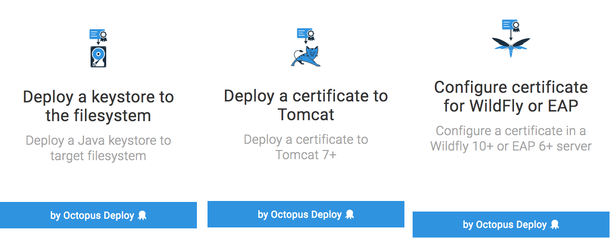
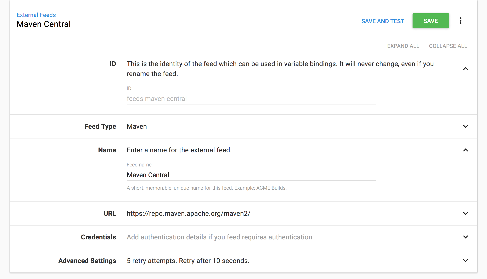
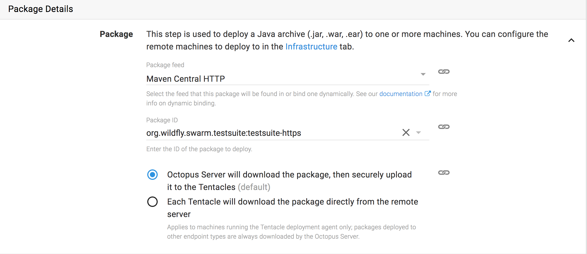
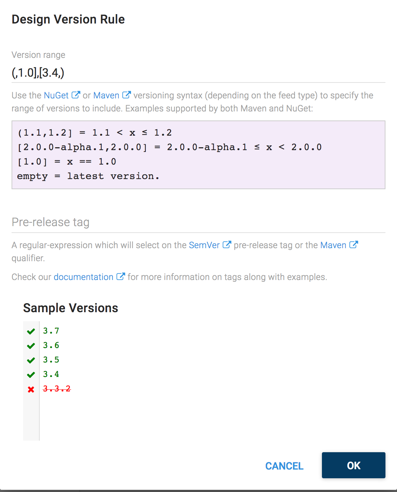

This December release of Octopus continues the support for Java that was [introduced back in 3.17](/blog/2017-09/octopus-release-3-17.md), with the ability to export certificates as Java KeyStores, as well as configuring certificates directly within existing Tomcat 7+, WildFly 10+ and Red Hat JBoss EAP 6+ application servers. This release also allows Maven repositories to be configured as external Octopus feeds, meaning Octopus can now consume Maven artifacts as part of a deployment.  Read on for all the exciting details!

## In this post

!toc

## Release Tour

<iframe width="560" height="315" src="https://www.youtube.com/embed/vKwv56oYSyY" frameborder="0" allowfullscreen></iframe>

## Export Certificates as Java KeyStores and to WildFly, JBoss EAP and Tomcat

Octopus already has the ability to [manage your certificates](https://octopus.com/docs/deployments/certificates), and now those certificates can be directly configured within an existing WildFly 10+ or Red Hat JBoss EAP 6+ application server with the `Configure certificate for WildFly or EAP` step, or, within an existing Tomcat 7+ application server with the `Deploy a certificate to Tomcat` step. For those wishing to configure their certificates manually, the new `Deploy a keystore to the filesystem` step allows a certificate managed by Octopus to be saved as a Java KeyStore.

You can find out more by viewing the documentation for these steps:

* [Exporting a Certificate to a Java Keystore](https://octopus.com/docs/deploying-applications/certificates/java-keystore-export)
* [Importing Certificates into Tomcat](https://octopus.com/docs/deployments/certificates/java-keystore-export)
* [Importing Certificates into WildFly and JBoss EAP](https://octopus.com/docs/deployments/certificates/wildfly-certificate-import)

## Maven Repositories as External Feeds

Maven repositories are extremely popular with Java developers, and with this release Maven repositories can be configured as external feeds in Octopus.

This means that Maven artifacts can now be downloaded as part of a deployment like any other feed.

All your favorite features like channels and version rules also work with Maven feeds, and you can use the standard [Maven version range syntax](https://g.octopushq.com/MavenVersioning) too!

Get more details about using Maven repositories as external feeds in our [documentation](https://octopus.com/docs/packaging-applications/package-repositories/maven-feeds).

## More configuration enhancements

Building on the configuration enhancements we made in 4.0, we've added a couple of new features in this release.

First up is an adjustment to how the directory paths for task logs, artifacts and the package repository are handled. These were previously being defaulted to paths relative to the server's HomeDirectory, but were stored as the absolute paths. This made it difficult if you needed to move the entire folder structure for some reason because you had to change all of the paths individually. We now store the paths as relative values by default and calculate the absolute path at runtime. If you override any of the paths and they aren't relative to the HomeDirectory, e.g. like you would when using a shared location for HA, then we store them as the absolute values.

The second new feature also relates to these paths. You can now see them in the Settings UI and in the output of the `show-configuration` command.

## Breaking changes

There are no breaking changes in this release.

## Upgrading

All of the usual [steps for upgrading Octopus Deploy](https://octopus.com/docs/administration/upgrading) apply. Please see the [release notes](https://octopus.com/downloads/compare?to=4.1.0) for further information.

## Wrap up

That’s it for this month. We hope you enjoy the new features and our latest release. Feel free to leave us a comment and let us know what you think! Happy deployments!
