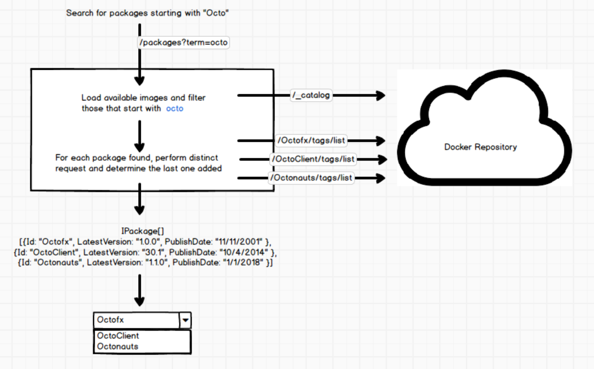
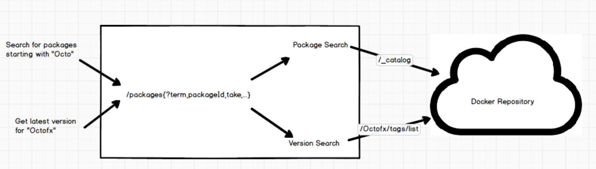
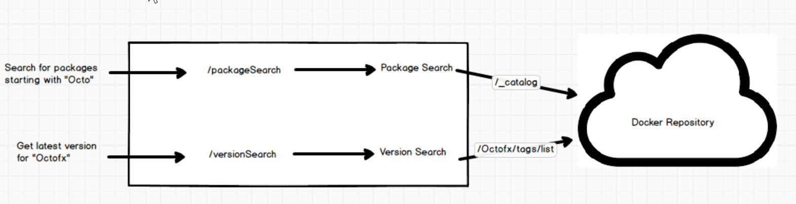

Building APIs are hard and in our case, _all_ user interaction with Octopus is through our API. Whether that's through the built-in web portal, the `Octopus.Client` libraries, the various 3rd party CI plugins or even directly through a curl request, the Octopus Server API is the common language that all these clients speak. Because some of these tools might 

## TL;DR
dsf

## Monolith API endpoint
Old API looked like
> ~/api/feeds/{id}/packages{?packageId,partialMatch,includeMultipleVersions,includeNotes,includePreRelease,versionRange,preReleaseTag,take,descriptionsOptional}

Take a look at that list of query string parameters. Thats because the old packages API was used for two different things.

1. Search For Package
    * Package autocomplete input field for package steps.
    * Testing external feeds

2. Search For Package Version
    * Getting the _latest_ version for a package when creating a release, potentially within a version range specified by a channel rule.
    * Paging through and searching the available versions when creating a release.

While we might have decided to expose the results of these two operations with a resource of the same shape, an `IPackage` resource, both the usage and source of this information is completely dissimilar.

Searching for a package involves using a search term and looking up a package index for packages that partially match that name. The intended result of that is to find and use the relevant package name. 
 
When searching for a package version on the other hand you (typically) have the package name that is of interest, and you want to search through all the versions available for that specific package, potentially filtering using a version range or pre-release prefix. The expected result of _this_ search is information about the _specific version instances_ which could include publish dates, release notes, descriptions, etc depending on the package type. 

From the implementation point of view however, all we know is that we need to return an `IPackage` resource, which includes all this information. So even if we are just looking to find a package to populate an auto-complete drop down, we still expect to return an objects with deep version information. This was ok in the past when we only supported NuGet feeds, since our APIs largely just sat on top of their existing ones, however as we start providing support for more feed types this pattern is unsustainable. 

Adding support for Docker and Maven feeds (and soon a GitHub feed) means that these package search API calls need to potentially perform N+1 calls to the external providers to get all the information to properly populate the `IPackage` DTO. When performing a package search request one request would retrieve the packages that match that name, and another would need to go out and get the latest version number _for each package_. 

The simple solution to this is to internally check if you are searching for a package as opposed to searching for a version, and if we cant get the relevant version from the first call, then just send back dummy data. But this just sounds like internally we are recognizing that there could be two different types of requests.

When sharing a common entry point but using query string parameters to overload its operation we could get into some unexpected scenarios. What would you expect if you provided `take=10` and `includeMultipleVersion=false`? When you say `take=10` do you expect it to return the last 10 versions for _each package_ or return just 10 matches? In the process of trying to always return standard `IPackage` resources 

## The Break up
Given that we are effectively already treating the two different types of requests as two different API calls internally it makes sense to actually bite the bullet and break the single monolith API endpoint into two separate endpoints. This way the code internally can be a bit more confident about what information the consumer really _needs_ given the operation, and the consumer can be confident that the shape of the return type doesn't change as a result of changes to the query string. 

Another result of this split is that the actual data being passed over the wire will also be much smaller since we no longer need to return a whole bunch of version specific information when just looking for a list of package names.

The old API will remain largely as-is for the time being until the next major bump in the future to ensure backwards compatibility for anyone using the HTTP API directly. At the same time since these package search APIs are effectively just wrappers that sit on top of the provided external feed APIs if these changes do not sure user's requirements a better solution may be to interact with those external feeds directly.