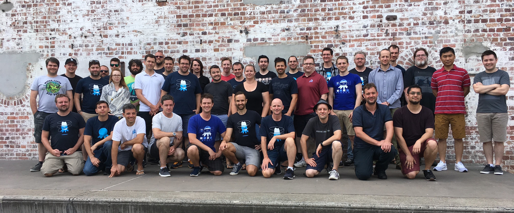
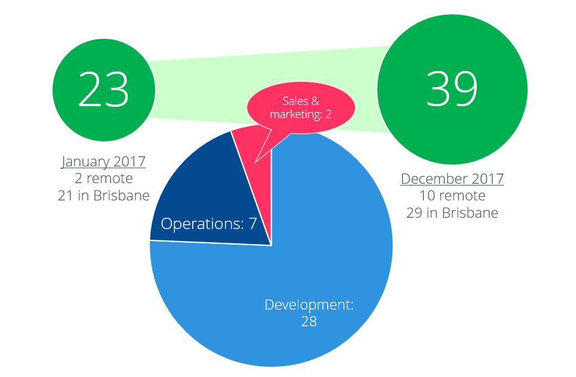
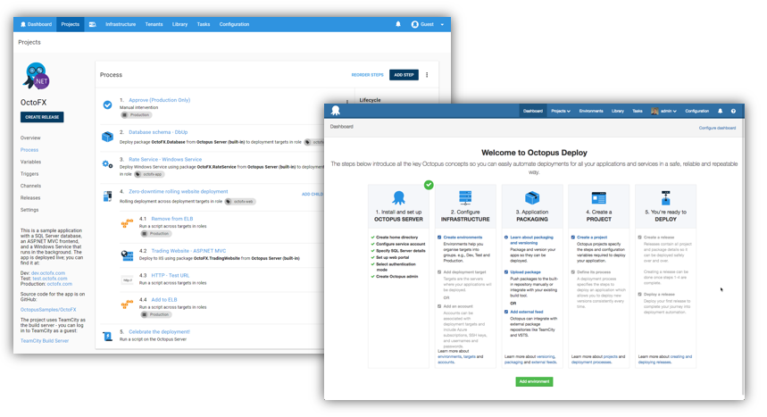
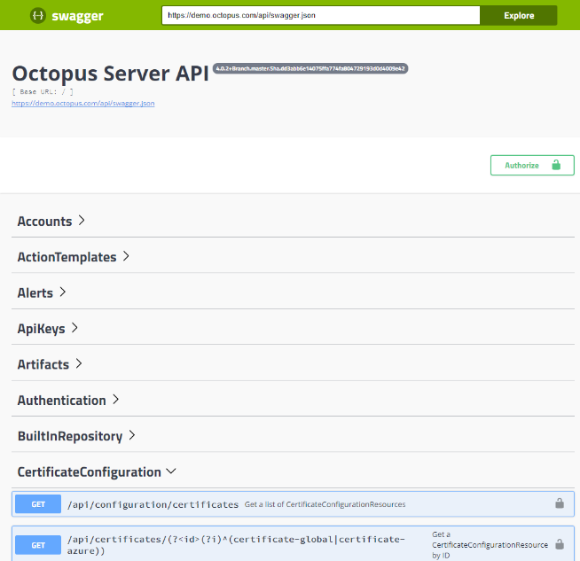

In January 2017 I outlined our [product roadmap for 2017](https://octopus.com/blog/roadmap-2017). With 2017 firmly in the rear view mirror, I wanted to take some time to reflect upon our progress for the year. This post won't just be about the roadmap though - I also want to give you some insight into Octopus as a company and how we've grown over the year, and share some of the challenges we've had. 

## Kicking off

We start each year with a "kick off" event, and in 2017 it was held in our office in Brisbane. At the time we were 23 people (21 in Brisbane, Dalmiro in Argentina, and Matt Richardson in Melbourne). We use the Kick Off event to try to get everyone on the same page for the year. We started a few new things this year: 

 - A roadmap for the year (previously, we made it up as we went)
 - Some goals and KPI's for the year
 - We split the company into teams, giving each team an area of the product to own

## Growing the team

One decision we made midway through the year was to expand towards hiring people from other cities in Australia. Most people at Octopus work from home, but we have an office in Brisbane that is used one or two days a week. Many conversations take place in the office, and we were worried that remote folks would feel left out. We conducted an experiment where we locked the office for a few weeks, which went well. 

The result is that we were able to hire a good number of incredibly smart and professional people throughout 2017, many of which weren't based in Brisbane. Here's a photo from our 2018 Kick Off event with everyone together. It makes me so proud to work with such a fantastic group of folks. 

If you're curious, here's how the roles break down. 

As you can see, Octopus is an incredibly engineering-heavy company - only two people out of 39 aren't working in areas of product development, design, operations or support. That's a deliberate choice; it's our belief that we can build and sell a world-class product by focusing on building a great product and supporting it well. Whether that's something we can maintain in 2018 isn't so clear. 

## Monthly feature releases

In April 2017 we introduced another change - we started shipping monthly feature releases. Previously, we'd ship new features and bug fixes whenever they were ready, with no real planning. From April, we changed how we plan releases:

- One monthly feature release (major/minor - e.g., 4.1). This contains new features and improvements. We make a bit of noise about these on the blog, newsletters, and so on. 
- Bug fixes and minor improvements (e.g., 4.1.1, 4.1.2). We release multiple of these through the month. 

For customers, this seems to have generally worked very well. You know to expect a release each month and can plan Octopus server upgrades around that. You know you can ignore most bug fix releases unless a particular bug affects you or you are on that major/minor release. For us, it's made it much easier to plan, document and test releases. 

## Roadmap progress

In the [2017 roadmap](https://octopus.com/blog/roadmap-2017) I called out a number of things we planned to do. As you might expect, our ideas around what is important change throughout the year, and unfortunately we didn't accomplish everything on the list. Below is a breakdown of some of the progress we made. 

###  UserVoice

I said we'd commit to trying to address all UserVoice suggestions with over 200 votes. Here's how the list stood at the time I wrote the post, and whether we achieved it or not. 

 - **714 votes**: **Improve the variables UI**
   *Done. We shipped a big overhaul of this in 4.0 and improved it with 4.1.*
 - **566 votes**: **Composite step templates** 
   *Not done. We're still trying to work out the best way to go about this.* 
 - **562 votes**: **Update step templates across all projects**
   *Done. This shipped in 3.12 in April.*
 - **460 votes**: **Dry run a deployment**
   *Not done. Dry run a whole deployment isn't practical and doesn't really seem to be what this is about. There are some underlying stories/goals we need to uncover from this. I suspect everyone who voted on this has a different idea of what they actually need.* 
 - **459 votes**: **Support Azure Service Fabric**
   *Done. We shipped this in 3.13 in May.* 
 - **345 votes**: **Environment and machine conditions should support both "and" and "or" conditions**
   *Done. This shipped in 3.7.* 
 - **277 votes**: **Permission attributes for variable sets**
   *Not done. We're planning a permissions overhaul as well as a new feature called Spaces which limits how widely variable sets can be shared - I think these might solve most of these isssues.* 
 - **272 votes**: **Cloning of steps**
   *Done. This shipped in March.* 
 - **242 votes**: **Allow step run condition to be based on a variable**
   *Done. This also shipped in 3.7.* 
 - **235 votes**: **Version control of Octopus configuration**
   *Not done. We're still debating the best way to go about this. Expect an RFC on this this year.* 
 - **213 votes**: **Output variables for offline drops**
   *Not done.
 - **210 votes**: **Project dependencies**
   *Not done. We'll make progress on this in 2018* 
 - **200 votes**: **Allow polling Tentacles to communicate on port 443**
   *Done. We shipped this in April.* 

Overall, that's 7 out of 13 done. Of the items that aren't done, they're typically either not entirely clear, or something that we think will be obsoleted by another bigger change in the future. 

### Octopus Ops

In the 2017 roadmap, I said we'd build first-class operations functionality into Octopus. 

> The Octopus dashboard shows you whether your last production deployment was successful. What if it also showed you whether what you deployed is still running? ... It wouldn't just be limited to monitoring status though: you could also start/stop these services. Did the Windows Service that you deployed yesterday to 30 machines suddenly crash on 7 of them? No problem, just click the button, choose the 7 you want to restart, and hit the execute button. Sure beats using remote desktop! Plus, there would be a nice audit trail.

Unfortunately, we didn't make any progress on this in 2017. When we split up the teams for 2017, this one fell in the middle, and no team really owned it nor did we have anyone to champion it. 

In 2018 we'll be focusing heavily on this, but that's a subject for another post. 

### Octopus Slack App 

In the 2017 roadmap we planned to build a first-class "ChatOps" experience for Octopus with Slack. Bots were all the rage in 2017, and we have one that we use internally for our own deployments with Octopus. Unfortunately again, there was no owner for this, so it fell through the cracks. 

### New Step Builder and a lot more IIS options

In the 2017 roadmap we planned to make some changes to how we present deployment steps:

> For deployment steps that configure things like Windows Services, there's only a handful of options anyway. But some steps, like those that configure IIS, have potentially hundreds of different settings you might want to set. For now, this has meant that we only expose the most common settings, and you have to write PowerShell to do the rest.

I think we mostly achieved this. We overhauled the UI in 4.0 and collapsed settings - this allows us to provide a lot more options for steps. We did increase the number of options for IIS throughout the year, including supporting certificates and a number of other settings, but you'll still need PowerShell for more advanced settings. 

### Lower the learning curve

This is something we made solid progress on, partly with a new onboarding guide that we added early in the year, and then again with the UI overhaul for 4.0. 

Existing customers probably didn't benefit from this directly, but it helped a lot of larger customers indirectly through making it easier for new teams in those organizations to get started. 

### Mono-free Linux (SSH) deployments

We made good progress here too. In August, we added options to SSH targets to not require Mono. So long as we know what platform you are running, we push a .NET Core version of Calamari, our deployment runner, to the machine and run the deployment without relying on Mono. Our goal will be to obsolete the Mono approach in favor of the .NET Core model. 

### Octopus Release Promotions

Unfortunately, aside from planning, we haven't made any progress on this so far. 

### "Swaggerize" our API

Swagger was added to Octopus in September. Just go to 

### Tighter AWS integration

We started this very late in 2017, and expect to ship some initial support quite soon. Watch this space!

### PaaS Octopus

This is a big project, and one that we found ourselves putting off, waiting for other things, and essentially talking ourselves out of starting for most of 2017. I convinced myself that we couldn't start this project until that project was done, or some other project, or some big architecture change, and so on. Essentially we had to eat an elephant, but were procrastinating about taking the first bite.  

A few months ago we realized just how much our procrastination on this was sending some prospective customers towards VSTS (more on that in a moment). Instead of over-thinking it and re-architecting Octopus in the process, we've focused on building something that will be as close to on-premises Octopus as possible, at a reasonable price, and that we can host reliably. Once that's shipped we can find ways to cloud-optimize it later. 

## Non-roadmap progress

We also made progress in a number of areas not directly related to our roadmap. 

### Frontend refactor - Angular to React

Octopus 4.0 was a complete UI overhaul, as we converted it from an aging AngularJS (1.0) UI to React. We started it in earnest with a smaller team in around April/May, and didn't ship it until early November - and by then half the developers at the company were involved in it. 

This is a project that was governed by Hofstader's law:

> Hofstadter's Law: It always takes longer than you expect, even when you take into account Hofstadter's Law.

One of the things I enjoy about running a software company is getting to "put my money where my mouth is". As a consultant, I'd often suggest it was time to rewrite this or that. It's hard to point to a particular "business reason" for needing to commit half of our development time for about half a year, or to justify the decision, beyond simply "we think that it will make the product better over the long-term". 

At Octopus, we've done this several times in the past:

- Octopus 1.0: Switched from SQL Server (EF) to RavenDB. 
- Octopus 2.0: Rewrote the UI (ASP.NET MVC to AngularJS 1.0), rewrote the Server/Tentacle communication stack
- Octopus 3.0: From RavenDB back to SQL Server, rewrote the communication stack again

Each of those turned out to be good investments that improved the product dramatically, even though 6 months in you start to worry that it's a gigantic waste of time, money and has a very high opportunity cost. Fingers crossed it will work out for us again! 

### Java

At the start of 2017 I hadn't planned for Octopus to do much in the way of Java (or non-.NET support), but this changed about 6 months in. In 2017, we:

- Built a plugin for Atlassian Bamboo
- Added a number of Java deployment steps to Octopus
- (4.1) Added Maven feeds and certificate support for Java deployments

### Stability

This isn't as exciting as other topics, but much of our focus in early 2017 went into stability. We fixed a large number of small bugs and issues, and we made some big performance improvements and security enhancements. 

## Business progress

Stepping away from the product for a bit, I want to reflect on the progress Octopus Deploy made as a business in 2017, and some of the challenges we're facing. If you mostly follow this blog for technical/product content, this might not be so interesting, but it might give you some context that will help you to understand our decisions to date. 

Octopus is privately owned, profitable, and has grown dramatically since I started it in 2012. We've grown from being a simple deployment tool developed in my spare time, to a company of 39 people. I don't think it's misleading to say that Octopus is the most popular deployment automation tool for .NET developers - we know that about 20,000 companies have an Octopus server installation online today, and those Octopus servers do millions of deployments a year to hundreds of thousands of deployment targets. 

We celebrated a number of successes this year. Octopus was the #3 fastest growing company in Australia over the past 3 years, according to [BRW Fast 100](http://www.afr.com/leadership/afr-lists/fast-100/financial-review-fast-100-2017-the-full-list-20171103-gzeg47). It was brilliant to see Octopus in print in a newspaper - we posted copies to relatives, most of whom still aren't exactly sure what Octopus is. 

Our challenges this year fell into two main categories: internal and external. 

As far as internal challenges, these mostly related to how we organized & planned as we grew. As the company grew, so did our ambitions. We had four very big projects in mind this year:

- Some big changes around [how Octopus scales out across large enterprises](https://octopus.com/blog/octopuses)
- Cloud-hosted Octopus
- Remote release promotions
- UI refactor

Most of these were so big, that we convinced themselves they had dependencies on each other. We shouldn't start Cloud-hosted Octopus until we make the big architecture changes. We shouldn't start Remote release promotions until we finish the UI refactor. And the architecture changes should wait for the UI refactor too. 

Something I've learned is that we at Octopus are at our best when we focus on smaller projects that improve the product bit by bit in an agile, iterative way. That's how we did the onboarding work, that's how we added Java support. When it comes to bigger projects like this, we tended to drift and lose our way, and as a result wasted a lot of time. In previous years we might not have even attempted such projects; in 2017 we were confident we could, but it seems like we're just not quite there yet. 

The biggest external challenge we've faced in 2017 comes from Microsoft and the VSTS Release Management product. While I think Octopus is still far ahead of RM for complex deployments, RM is clearly catching up with us for simpler, Azure-heavy deployments. We've enjoyed the competition as far as product innovation goes, and VSTS have made a solid cloud offering which we've been far too slow to catch up on. 

What made it more difficult this year is that Microsoft have begun to leverage other parts of their ecosystem to support RM. RM is essentially now free, and they've bundled a right-click, "Configure Continuous Delivery" option into Visual Studio. The combination of built into TFS, free, and promoted from within VS puts Octopus at significant disadvantage in such a Microsoft-centric ecosystem. "Where does an 800-lb. gorilla sit? Wherever he pleases," as the saying goes.

We'll continue to compete with Microsoft in 2018, and together we'll push the whole industry forward as a result, but don't be surprised if you see us focusing equally on Java/AWS as we do on .NET/Azure. 

## Wrap up

In 2017, Octopus grew dramatically. We improved and matured how we work internally, and we made pretty good progress along our roadmap. We spent a lot of time rewriting the UI, something that slowed us down in the second half of the year, and we saw increased competition from Microsoft which had a real bottom-line impact. 

If you're interested in more behind-the-scenes stuff at Octopus, especially technical content, subscribe to our [YouTube channel](http://www.youtube.com/c/Octopusdeploy). Every week we post videos from our internal all-hands meetings where we demo what we've been working on. 

In my next post, I'll be sharing our roadmap for 2018. Happy deployments!