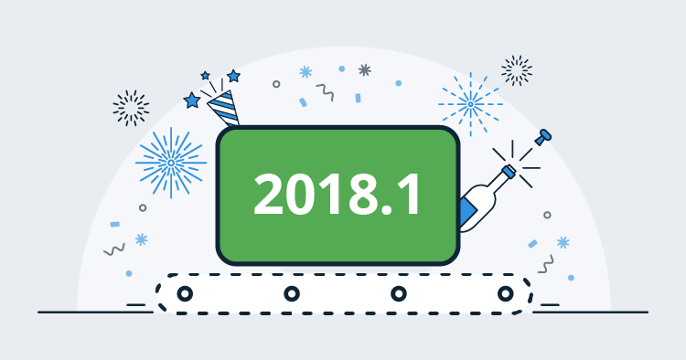
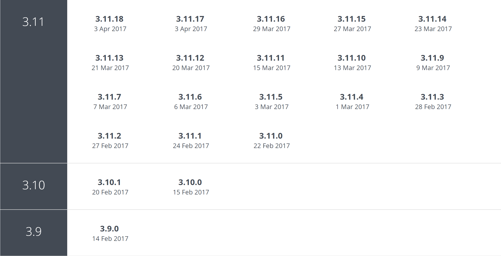

A few days ago Paul posted a [retrospective on Octopus Deploy in 2017](reflections-2017.md) followed by our [roadmap for 2018](roadmap-2018.md). In this post I'll discuss why we've decided to align our versioning strategy for Octopus Deploy with our monthly release cadence.

But rather than [spend too many keystrokes](http://keysleft.com/) on describing the reasons and benefits, I would like to describe how we arrived at this point - maybe it will help you too?

## What we are changing

Not much, really. Here's a quick summary of what we are planning to change:

- Instead of shipping Octopus `4.2` in a few days, we are going to ship Octopus `2018.1` - the first release in the calendar year 2018
- Even though the jump from `4.x` to `2018.x` may seem significant, the code hasn't changed significantly from Octopus `4.1` with the exception of the new features we were planning to ship as Octopus `4.2`
- **Pricing and licensing stays the same**
- We are still planning to ship on a monthly cadence
- We will bump the **major** part of the version (the first number) on the first release of each calendar year
- We will bump the **minor** part of the version (the second number) on our monthly release cadence; unless we end up skipping a month for some reason
- We will still ship **patches** throughout the month with small enhancements and bug fixes

## There and back again

The decision to change our versioning strategy is really a byproduct of our evolution as a software product company, and I think it's worth sharing some of that story in case it helps in your scenario.

We like to take an experimental approach to how we run our company. Rather than making decisions purely assuming the new way will be better than the old way, or blindly following in the footsteps of others, we take time to reflect on the changes we made in the past and decide how to iterate organically from there. Preferably we'd do this with some kind of quantifiable metric. It may take a while longer to find the best fit for us, but the big win: **we understand _why_ we do things the way we do them**. Paraphrasing the principal of [Chesterton's fence](https://en.wikipedia.org/wiki/Wikipedia:Chesterton%27s_fence):

> Before you pull down a fence, first understand why it was put there in the first place.

If G. K. Chesterton was a developer in 2018 he would probably have said:

> Don't pull down a fence until you've read the git history!

Maybe part of our story will help you with your own scenario?

### Versioning things

Deciding how to version things turns out to be a trickier problem than I first assumed. Along the way we've tried:

- start at `0.1` and go from there doing what feels right at the time
- Use strict [SemVer](https://semver.org) for all the things!
- Differentiate between "product versioning" (version is tied more to marketing and communication) and "component versioning" (follows semantic versioning)
- Let the version reflect a monthly and yearly cadence with patches in between

Each approach came with some benefits and some disadvantages along the way.

### Doing what feels right at the time

The bump from Octopus `1.x` to `2.x` and then `3.x` were all reasonable: we made large architectural changes, added major features, and sometimes broke compatibility along the way.

After `3.0` we shipped several feature releases up to `3.3` and finally committed to building [first-class support for multi-tenant deployments](https://octopus.com/docs/deployments/patterns/multi-tenant-deployments). At some point in time we committed to ship multi-tenant deployments in Octopus `3.4` and stuck with that version. In retrospect I think this release should have been Octopus `4.0`. It was a major change to the product and its capabilities which took six months from beginning to end.

In many ways this approach worked, but it also felt very ad-hoc, without a clear set of guidelines to drive our decision making. This caused some internal tension when it came to big version changes, and made our versioning unpredictable.

### High autonomy and SemVer

Multi-tenant deployments was such an invasive change it acted like a code dam, holding up other features until it was done because everything started to rely on those code changes. Following on from that experience we decided to let teams work with a high level of autonomy, shipping smaller features independently to each other as soon as they were completed.

We also wanted to use a form of semantic versioning to help guide our decisions on what the version should look like for each release. We landed on [this strategy](https://octopus.com/docs/administration/upgrading#Upgrading-HowweversionOctopusDeploy) for the Octopus Deploy product, and each of our libraries and other components (like Tentacle) would use semantic versioning.

Again this approach generally worked for versioning, but we discovered our teams were too independent. We ended up shipping Octopus `3.9` and `3.10` just days apart from each other, followed by Octopus `3.11` a week later.

In itself we didn't really see this as a problem - the code was fine, and the changes were important to us and our customers... but we had optimized to reduce friction internally at the cost of external predictability and our ability to tell a cohesive story about our product.

#### Marketing and communication suffered

We were working so autonomously and with so little friction that half of our team didn't even realize we were already up to `3.11` and that we had shipped the features for [managing and deploying X.509 certificates](https://octopus.com/certificates) - arguably one of the best things Octopus can do for you - and we didn't really make the most of that opportunity to shout it from the rooftops! At the same time we made a little mistake with typed variables where two teams took a slightly different approach to solving the same problem.

This wasn't a versioning problem, this was a **planning** problem! We were shipping really nice things, but we weren't doing it with a deliberate sense of cohesion and alignment.

### Starting the cadence

In April of 2017 we committed to shipping a new "feature" release of Octopus Deploy each month, starting with [Octopus Deploy 3.12](/blog/2017-04/octopus-april-release.md). From that post:

> This means we’ll ship a new release on a predictable schedule that you can count on. These releases will include new features, and a roll-up of all the patches from that month.  We are doing this experiment with the following goals in mind:

> - Make it easier for you to stay across new features and enhancements in Octopus Deploy
> - Make it easier for you to plan when and how to upgrade
> - Improve the quality and predictability of each monthly release by having a structured delivery schedule.

> **NOTE**: We’ll still continue to ship small enhancements and bug fixes in patches as soon as they’re ready.  We want to get those changes in your hands as soon as possible so that won’t change.

Since April 2017 we've shipped a new feature release at around about the same time each month. We think it's helped us get better at planning smaller, incremental, and valuable changes to the product.

This cadence helped us plan better, but it wasn't a silver bullet. Each team would autonomously find the highest value things they could build, and set about building them. At the beginning of each month we would look at what was nearly ready to ship, then look to build a cohesive story for that release. We had a few months where nothing was ready to ship, so we delayed the release by a couple of weeks.

Using this approach we shipped Octopus `3.12` - `3.17` all with valuable features, eventually bumping up to `4.0` when we shipped the [new user interface](/blog/2017-11/octopus-release-4-0.md) and a [whole lot of other valuable features](/blog/2017-10/octopus-v4-blog-series-kickoff.md) in one big release.

### A missing piece: deliberate alignment

I use the word deliberate deliberately. We ended up shipping some really nice releases along the way where the cohesiveness of the release was more of a happy accident than by deliberate design. Towards the end of 2017 we started thinking about our next organic step. We really want Octopus Deploy to tell a cohesive and relevant story to people who are embracing a DevOps culture in 2018.

Each of our teams are still working with a high level of autonomy, but we have iterated to a place where each team is working towards telling a cohesive story as we progress through 2018.

## Conclusion

Not too much is changing. **The pricing and licensing stays the same.** We're simply aligning our version number with our monthly and yearly cadence. This means we won't be using our major version number to communicate inferred meaning anymore, and that's about it. Now we are forced to make smaller, more incremental changes to the product, which is good for everyone.

With the boring bits over, I think the real conclusion of this post is: **continuous delivery is a highly effective agent of change**. By continuing to embrace one of our company's own core values, we revisited our versioning strategy several times, and fundamentally changed the way we plan, design, build, and ship our own software.