Over the last few months a number of new features have been added to Octopus which allow you to deploy Java applications, consume artifacts from Maven feeds, and deploy AWS CloudFormation templates. In this blog post we'll look at how all of these elements can be brought together to deploy Java applications in a cloud based environment.

## The Maven Feed

The application that we'll be deploying will be sourced from Maven central. To access this we need to have the Maven feed configured in Octopus. This is done in {{Library>External Feeds}}. The Maven Central URL is https://repo.maven.apache.org/maven2/.

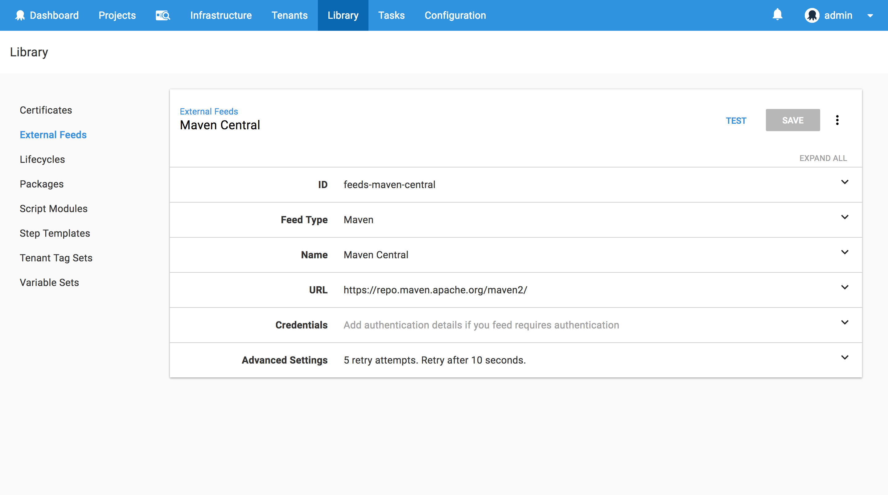

## The AWS Account

Octopus CloudFormation steps authenticate with AWS through an AWS Account. These accounts are managed under {{Infrastructure>Accounts>Amazon Web Services Account}}. You can find more information on creating AWS Accounts through our [documentation](https://octopus.com/docs/infrastructure/aws/creating-an-aws-account), keeping in mind that the account needs to have some [common permissions](https://octopus.com/docs/deployments/aws/permissions) to be effectively used to deploy CloudFormation templates.


## The SSH Account

We'll also need to configure an account that will be used to connect to the WildFly EC2 instances via SSH. These accounts are managed under {{Infrastructure>Accounts>SSH Key Pairs}}. Here we'll create an SSH account with the username `bitnami` (because this is the username configured by the Bitnami AMIs - more on that below) and the PEM file that you will need to have created in AWS that will be assigned to the EC2 image. You can find more information on creating AWS key pairs in their [documentation](https://docs.aws.amazon.com/AWSEC2/latest/UserGuide/ec2-key-pairs.html).

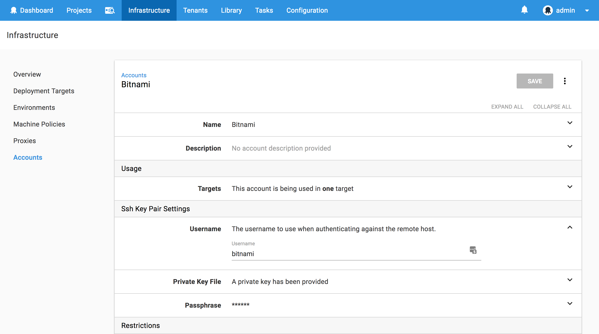

## The Machine Policy

The final global Octopus setting we need to configure is the machine policy, which is accessed under {{Infrastructure>Machine Policies}}.

Unlike polling tentacles, SSH targets must have an accurate IP address or hostname to participate in an Octopus deployment. However, the EC2 instances that will be created by the CloudFormation template do not have a fixed IP address, and the IP address they do have will change when the EC2 instance is stopped and started again. This means we need to do two things to ensure our EC2 instances are correctly configured in Octopus:

1. Add the EC2 instance to Octopus each time the EC2 instance boots (if it is not already registered).
2. Have Octopus clean up any deployment targets that fail a health check.

We'll tackle step 1 with some scripting in the CloudFormation template in a later section. Step 2 is configured by editing the `Clean Up Unavailable Deployment Targets` section in the default machine policy to enable `Automatically delete unavailable machines`.


## The WildFly AMI

We will take advantage of the AMIs provided by [Bitnami](https://bitnami.com/stack/wildfly) to use as the basis of our CloudFormation template. Bitnami provides a number of free and up to date images preinstalled with popular open source applications, which allows us to get an EC2 WildFly instance quickly up and running.

The easiest way I found to get the AMI ID was to search for `WildFly` under the `Public images` in the AWS console. Keep in mind these AMI IDs are region specific, so the ID of `ami-5069332a` is only valid in North Virginia.

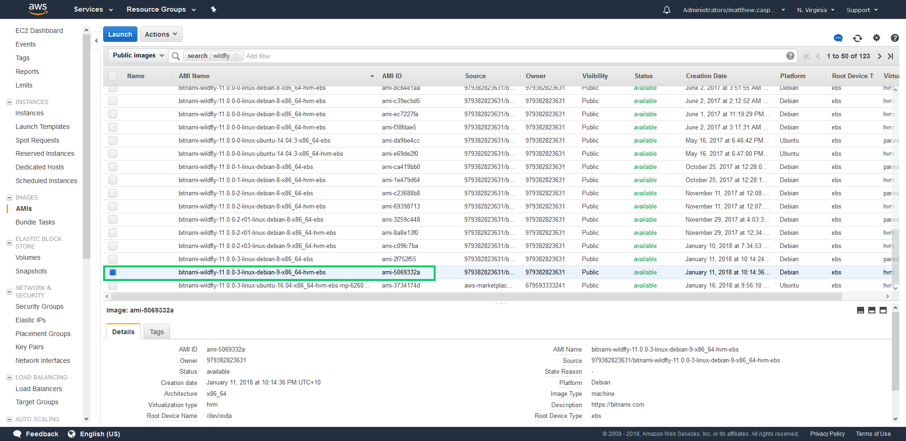

## The CloudFormation Template

Having an AMI is half the battle. The other half is building an EC2 instance from it, and for this we'll make use of the CloudFormation steps that were introduced in Octopus 2018.2.

This CloudFormation template has to perform a number of steps:

1. Deploy the AMI as an EC2 instance.
2. Configure some standard tags.
3. Install the packages required to support DotNET Core 2 applications.
4. Configure the file system permissions to allow WildFly silent authentication.
5. Register the EC2 instance with the Octopus server.

This is the complete template

```yaml
AWSTemplateFormatVersion: 2010-09-09
Resources:
  WildFly:
    Type: 'AWS::EC2::Instance'
    Properties:
      ImageId: ami-5069332a
      InstanceType: m3.medium
      KeyName: DukeLegion
      Tags:
        -
          Key: Appplication
          Value: WildFly
        -
          Key: Domain
          Value: None
        -
          Key: Environment
          Value: Test
        -
          Key: LifeTime
          Value: Transient
        -
          Key: Name
          Value: WildFly
        -
          Key: OS
          Value: Linux
        -
          Key: OwnerContact
          Value: "#{Contact}"
        -
          Key: Purpose
          Value: Support Test Instance
        -
          Key: Source
          Value: CloudForation Script in Octopus Deploy
        -
          Key: scheduler:ec2-startstop
          Value: true
      UserData:
        Fn::Base64: |
          #cloud-boothook
          #!/bin/bash
          echo "Starting" > /tmp/cloudhook
          sudo apt-get --assume-yes update
          sudo apt-get --assume-yes install curl libunwind8 gettext apt-transport-https jq
          getent group deployment || sudo groupadd deployment
          sudo usermod -a -G deployment wildfly
          sudo usermod -a -G deployment bitnami
          echo "Editing permissions" >> /tmp/cloudhook
          sudo chgrp deployment /opt/bitnami/wildfly/standalone/tmp/auth
          sudo chmod 775 /opt/bitnami/wildfly/standalone/tmp/auth
          role="WildFly"
          serverUrl="#{ServerURL}"
          apiKey="#{APIKey}"
          environment="#{Environment}"
          accountId="#{AccountID}"
          localIp=$(curl -s http://169.254.169.254/latest/meta-data/public-hostname)
          existing=$(wget -O- --header="X-Octopus-ApiKey: $apiKey" ${serverUrl}/api/machines/all | jq ".[] | select(.Name==\"$localIp\") | .Id" -r)
          if [ -z "${existing}" ]; then
            fingerprint=$(sudo ssh-keygen -l -E md5 -f /etc/ssh/ssh_host_rsa_key.pub | cut -d' ' -f2 | cut -b 5-)
            environmentId=$(wget --header="X-Octopus-ApiKey: $apiKey" -O- ${serverUrl}/api/environments?take=100 | jq ".Items[] | select(.Name==\"${environment}\") | .Id" -r)
            machineId=$(wget --header="X-Octopus-ApiKey: $apiKey" --post-data "{\"Endpoint\": {\"DotNetCorePlatform\":\"linux-x64\", \"CommunicationStyle\":\"Ssh\",\"AccountType\":\"SshKeyPair\",\"AccountId\":\"$accountId\",\"Host\":\"$localIp\",\"Port\":\"22\",\"Fingerprint\":\"$fingerprint\"},\"EnvironmentIds\":[\"$environmentId\"],\"Name\":\"$localIp\",\"Roles\":[\"${role}\"]}" -O- ${serverUrl}/api/machines | jq ".Id" -r)
          fi
Outputs:
  PublicIp:
    Value:
      Fn::GetAtt:
      - WildFly
      - PublicIp
    Description: Server's PublicIp Address
```

To deploy the AMI as an EC2 instance we configure a resource of type `AWS::EC2::Instance` with the `ImageId` set to the AMI ID that we are deploying.

```yaml
WildFly:
  Type: 'AWS::EC2::Instance'
  Properties:
    ImageId: ami-5069332a
```

Internally at Octopus we have a bunch of tags that need to be set on any EC2 instances. At a minimum you will want to set the `Name` tag, as this is the name that appears in the AWS console.

:::hint
Notice the `OwnerContact` tag value is being set using the [variable substitution](https://octopus.com/docs/deployment-process/variables/variable-substitution-syntax) in Octopus. We'll define this variable in a later step.
:::

```yaml
Tags:
  -
    Key: Appplication
    Value: WildFly
  -
    Key: Domain
    Value: None
  -
    Key: Environment
    Value: Test
  -
    Key: LifeTime
    Value: Transient
  -
    Key: Name
    Value: WildFly
  -
    Key: OS
    Value: Linux
  -
    Key: OwnerContact
    Value: "#{Contact}"
  -
    Key: Purpose
    Value: Support Test Instance
  -
    Key: Source
    Value: CloudForation Script in Octopus Deploy
  -
    Key: scheduler:ec2-startstop
    Value: true
```

In order for this EC2 instance to be used as an Octopus deployment target, it needs to either have Mono installed, or have the required packages installed to support DotNET Core 2. In this example I have choosen to support the later. Because the Bitnami AMI is running Debian, we use `apt-get` to install the dependencies listed in the [Prerequisites for .NET Core on Linux](https://docs.microsoft.com/en-us/dotnet/core/linux-prerequisites?tabs=netcore2x).

The `#cloud-boothook` marker is used by the `cloud-init` service to [identify scripts that should be run on each boot](http://cloudinit.readthedocs.io/en/latest/topics/format.html#cloud-boothook).

:::hint
In a production environment dependencies like this would be baked into the base AMI image rather than being installed when the instance is booted.
:::

```yaml
UserData:
  Fn::Base64: |
    #cloud-boothook
    #!/bin/bash
    sudo apt-get --assume-yes update
    sudo apt-get --assume-yes install curl libunwind8 gettext apt-transport-https jq
```

The Bitnami images create a random password for the WildFly management console when they are first booted. You can find these credentials using the [instructions provided by Bitnami](https://docs.bitnami.com/aws/faq/#find_credentials). However, we can avoid needing to know these credentials by enabling [silent authentication](https://access.redhat.com/documentation/en-us/red_hat_jboss_enterprise_application_platform/7.0/html-single/how_to_configure_server_security/index#silent_authentication). Silent authentication allows a process that has access to the `/opt/bitnami/wildfly/standalone/tmp/auth` directory to authenticate with WildFly without supplying a username and password. Because the code that is running the WildFly deployment will be doing so from the WildFly EC2 instance itself, we can grant permission to this directory and remove the need to know the random password generated by Bitnami.

Here we create a group called `deployment`, add the `wildfly` and `bitnami` users to that group, assign group ownership of the `/opt/bitnami/wildfly/standalone/tmp/auth` directory to the `deployment` group, and give the group full permission of the directory. This means that when Octopus connects to the EC2 instance using the `bitnami` user, it will have full control of the `/opt/bitnami/wildfly/standalone/tmp/auth` directory, and can therefore take advantage of silent authetication.

```bash
getent group deployment || sudo groupadd deployment
sudo usermod -a -G deployment wildfly
sudo usermod -a -G deployment bitnami
sudo chgrp deployment /opt/bitnami/wildfly/standalone/tmp/auth
sudo chmod 775 /opt/bitnami/wildfly/standalone/tmp/auth
```

Finally we need this EC2 instance to register itself with the Octopus server if it has not already done so. This part of the script queries the Octopus API to determine if a deployment target exists with this current hostname of the EC2 instance, and if a deployment target is not found, it will be added.

:::hint
A number of the variables in this script are provided using [variable substitution](https://octopus.com/docs/deployment-process/variables/variable-substitution-syntax). These will be defined in the next section.
:::

```bash
role="WildFly"
serverUrl="#{ServerURL}"
apiKey="#{APIKey}"
environment="#{Environment}"
accountId="#{AccountID}"
localIp=$(curl -s http://169.254.169.254/latest/meta-data/public-hostname)
existing=$(wget -O- --header="X-Octopus-ApiKey: $apiKey" ${serverUrl}/api/machines/all | jq ".[] | select(.Name==\"$localIp\") | .Id" -r)
if [ -z "${existing}" ]; then
  fingerprint=$(sudo ssh-keygen -l -E md5 -f /etc/ssh/ssh_host_rsa_key.pub | cut -d' ' -f2 | cut -b 5-)
  environmentId=$(wget --header="X-Octopus-ApiKey: $apiKey" -O- ${serverUrl}/api/environments?take=100 | jq ".Items[] | select(.Name==\"${environment}\") | .Id" -r)
  machineId=$(wget --header="X-Octopus-ApiKey: $apiKey" --post-data "{\"Endpoint\": {\"DotNetCorePlatform\":\"linux-x64\", \"CommunicationStyle\":\"Ssh\",\"AccountType\":\"SshKeyPair\",\"AccountId\":\"$accountId\",\"Host\":\"$localIp\",\"Port\":\"22\",\"Fingerprint\":\"$fingerprint\"},\"EnvironmentIds\":[\"$environmentId\"],\"Name\":\"$localIp\",\"Roles\":[\"${role}\"]}" -O- ${serverUrl}/api/machines | jq ".Id" -r)
fi
```

## The Default Security Group

The CloudFormation template above does not define a security group. This means the default one is used. In order to access the EC2 instance via SSH and to open the website hosted by WildFly, the default security group needs to have ports `22` and `80` opened.

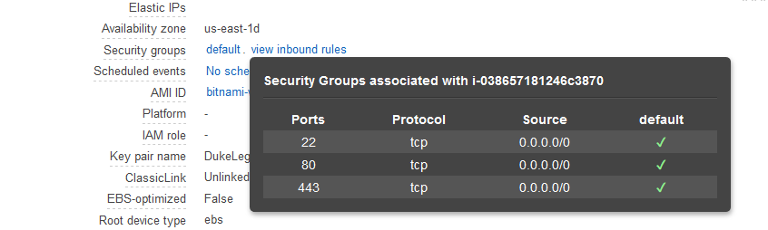

:::hint
In a production environment a dedicated security group should be used.
:::

## The Variables

The CloudFormation script has a number of variables that are defined using [variable substitution](https://octopus.com/docs/deployment-process/variables/variable-substitution-syntax). These variables are defined in the {{Variables>Project}} section of our Octopus project.

:::hint
The `AccountID` variable of `sshkeypair-bitnami` was found by taking the last element of the URL `https://octopusserver/app#/infrastructure/accounts/sshkeypair-bitnami`, which is the URL displayed when the Bitnami SSH Account is opened from {{Infrastructure>Accounts>SSH Key Pairs}}.
:::

Note that the `AWS Account` variable is set to the `AWS Account` that was created earlier. This variable is used by the Octopus steps, and not by the CloudFormation template directly.

You can get more information on creating Octopus API keys from the [documentation](https://octopus.com/docs/octopus-rest-api/how-to-create-an-api-key).

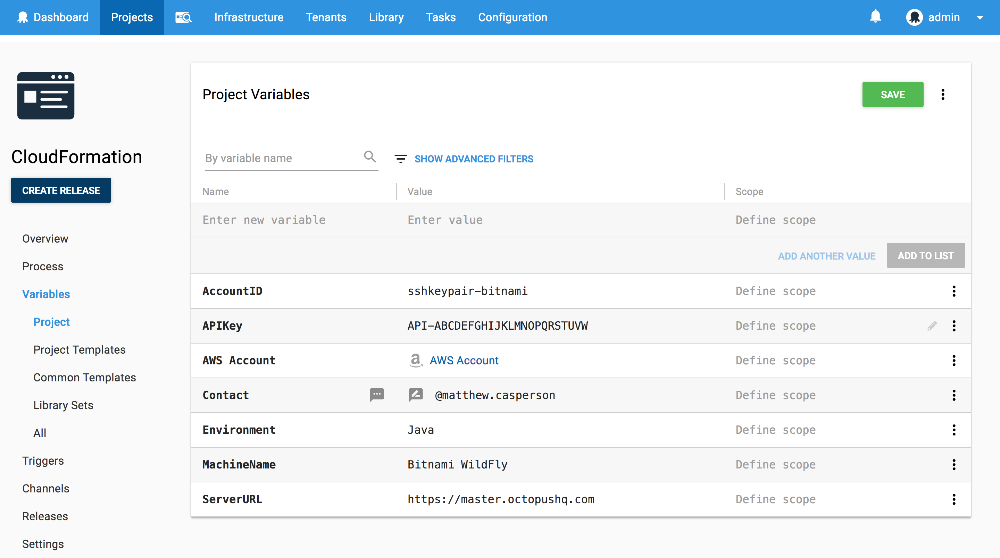

## Starting the Deployment with no Targets

Because we are creating the infrastructure that we will be deploying to as part of the Octopus project, we need to configure some settings to allow Octopus to start the deployment without any pre-existing valid targets. This is done in the project settings under `Deployment Targets`. Setting the value to `Allow deployments to be created when there are no deployment targets` means the project can start deploying even when there are no targets available yet.

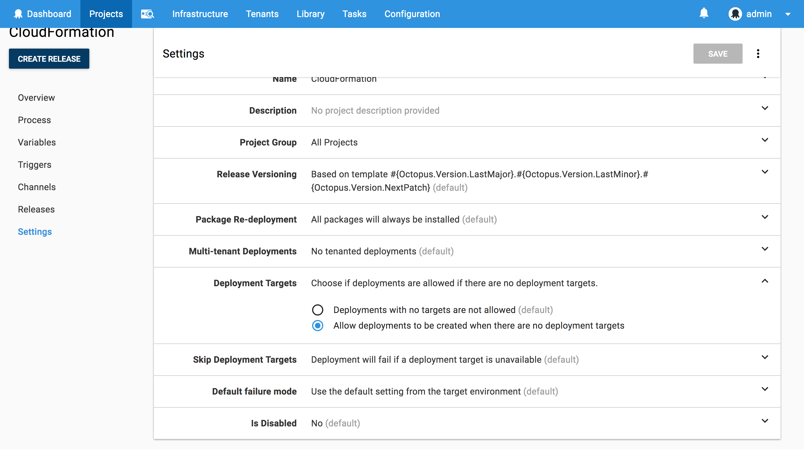

## The CloudFormation Step

Now it is time to start defining the project steps. We'll start by deploying the CloudFormation template, which is done with the `Deploy an AWS CloudFormation template` step.


Here is a screenshot of the populated step.

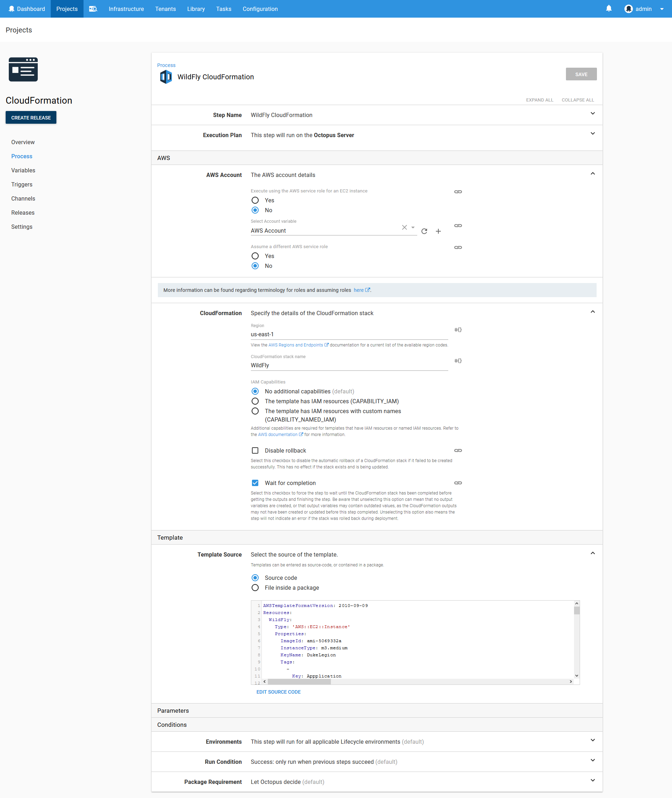

## The Health Check Step

Once the CloudFormation template has been deployed, the EC2 instance it created will have booted up and registered itself with Octopus as a deployment target. We now need to add this new target to the list of targets that the project will deploy to. This is done using the `Health Check` step.


Here is a screenshot of the populated step.

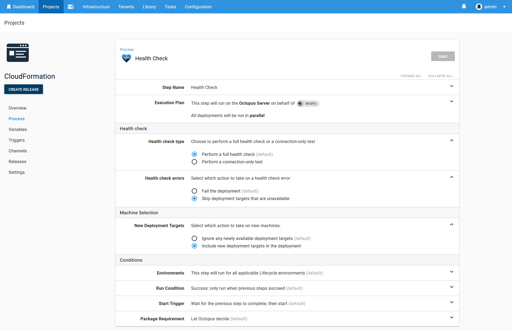

## The WildFly Deployment Step

Now that our newly created or updated EC2 instance is part of our list of deployment targets, we can deploy our Java application to it. This is done using the `Deploy to WildFly or EAP` step.

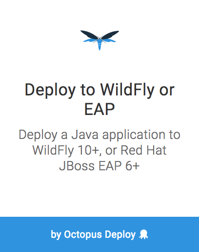

Here is a screenshot of the populated step.

:::hint
The `com.github.gwtmaterialdesign:gwt-material-demo` artifact is a WAR file published by the [gwt-material](https://github.com/GwtMaterialDesign/gwt-material) project. We use it here because it is a convenient sample project that is already hosted on Maven Central.
:::

:::hint
Note that we have not supplied the `Management user` or the `Management password`. This means we are relying on the WildFly silent authentication functionality.
:::

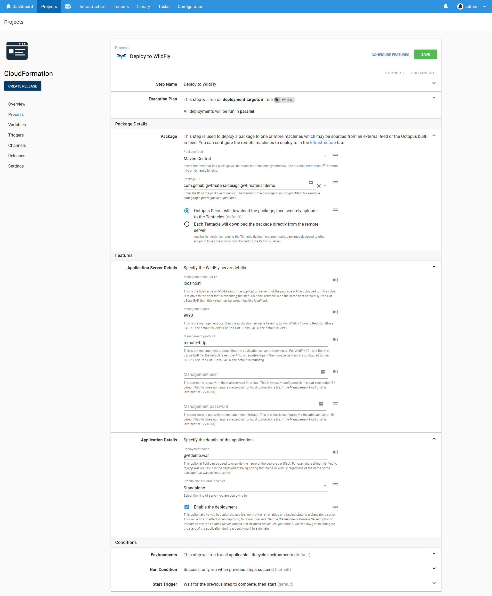

## The Final Output Step

For the convenience of those running this deployment we will display some useful summary information. This is done with the `Run a Script` step.


When the CloudFormation template is deployed, any output variables are captured by Octopus and made available to subsequent steps. We take advantage of this to build some URLs based on the public IP address of the EC2 instance.

```powershell
Write-Host "Open application at http://$($OctopusParameters["Octopus.Action[WildFly CloudFormation].Output.AwsOutputs[PublicIp]"])/gwtdemo"
Write-Host "Establish an SSH tunnel with:"
Write-Host "ssh -L 9990:localhost:9990 bitnami@$($OctopusParameters["Octopus.Action[WildFly CloudFormation].Output.AwsOutputs[PublicIp]"]) -i YourAWSKeyPair.pem"
Write-Host "Then open http://localhost:9990"
Write-Host "Find the credentials using the instructions from https://docs.bitnami.com/aws/faq/starting-bitnami-aws/find_credentials/"
```

Here is a screenshot of the populated step.

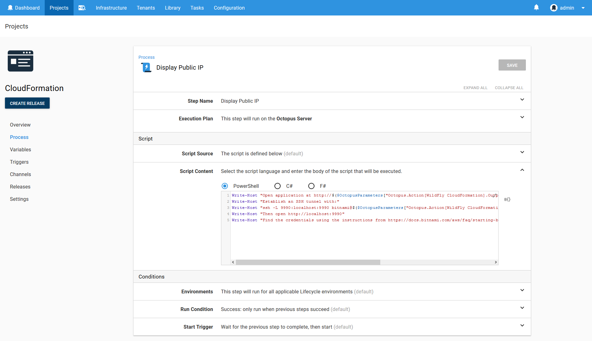

## Deploying the Project

Here is a screenshot of the result of a deployment of this project.

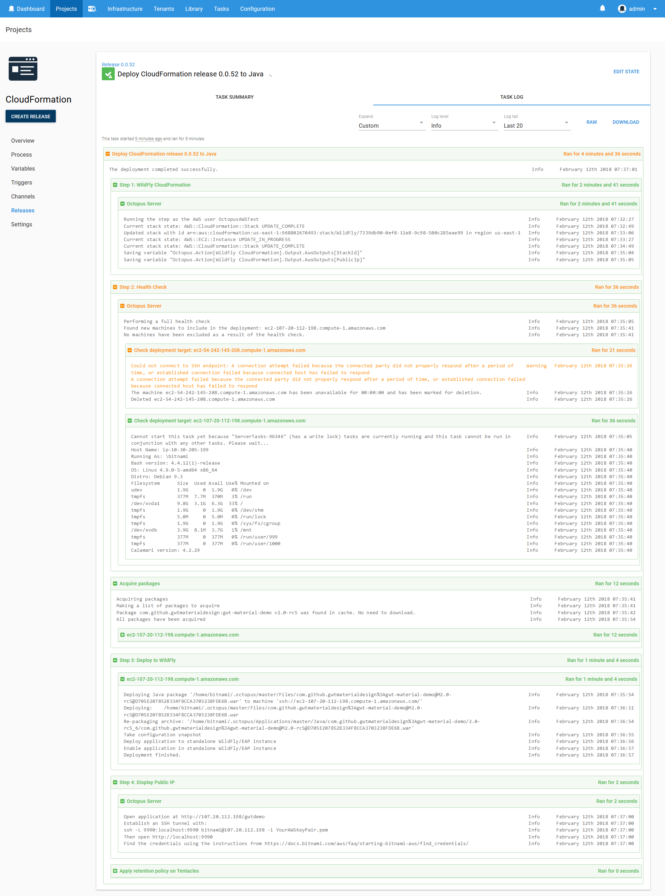

Notice these lines in the output of the CloudFormation template deployment:

```
Saving variable "Octopus.Action[WildFly CloudFormation].Output.AwsOutputs[StackId]"
Saving variable "Octopus.Action[WildFly CloudFormation].Output.AwsOutputs[PublicIp]"
```

These log messages provide an easy way to get the complete variable names for any output variables created as a result of the CloudFormation deployment.

Also note the output of the health check step. In this deployment I tweaked the CloudFormation template slightly by adding a comment to the UserData script. Although this change does not affect how the EC2 instance is deployed, CloudFormation sees it as a change to the existing stack and therefore shuts down and restarts the EC2 instance. This in turn gives the EC2 instance a new public IP, which means the EC2 instance will reregister itself with Octopus when it boots up. The health check step then checks both the old deployment target and the new one, determines that the old one is no longer valid and removes it, and successfully completes a health check on the new target and includes it in the list of targets used for the rest of the deployment.

## Open the Web Application

The output from the final script step generated a URL of `http://107.20.112.198/gwtdemo/`. Opening it up shows the GWT Material demo application.

:::hint
This URL won't actually work for you because this demo EC2 instance has been shutdown. The URL generated for you will have a different IP address.
:::

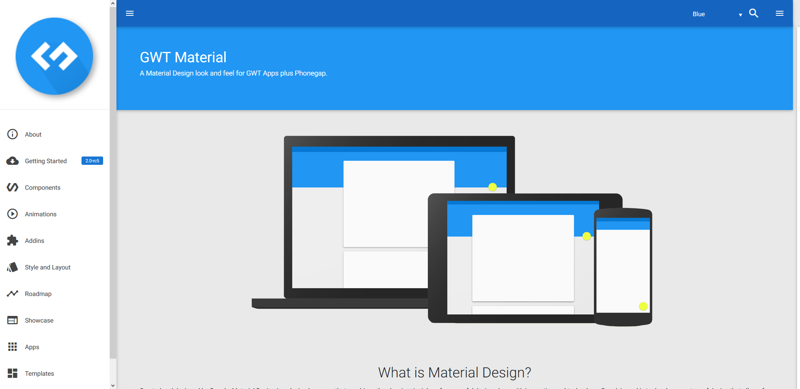

## Conclusion

By pulling together a number of new steps for deploying CloudFormation templates and Java applications, we can quite easily create an Octopus project that builds cloud infrastructure on the fly and deploys applications to it.

If you are interested in automating the deployment of your Java applications or creating cloud infrastructure, [download a trial copy of Octopus Deploy](https://octopus.com/downloads), and take a look at [our documentation](https://octopus.com/docs/deploying-applications).
