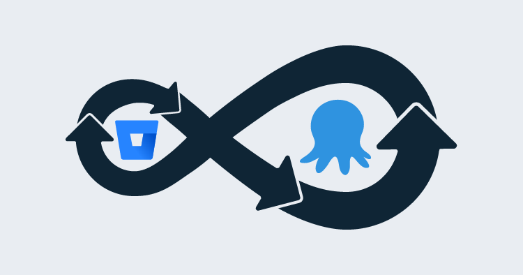
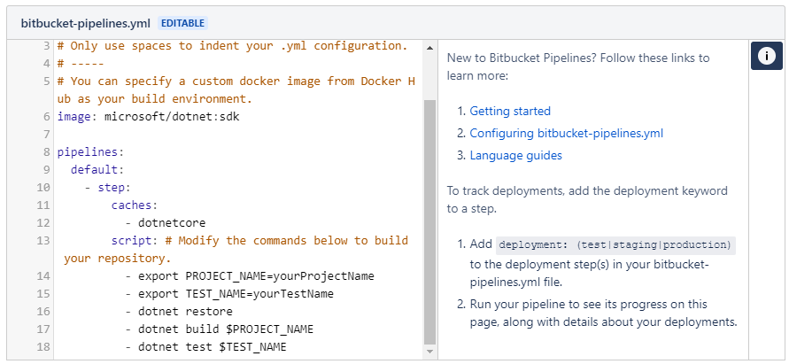
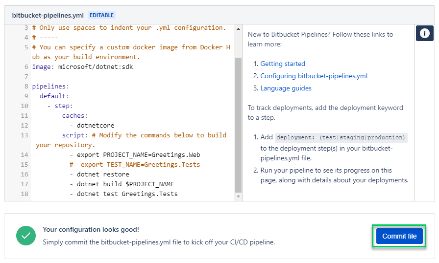
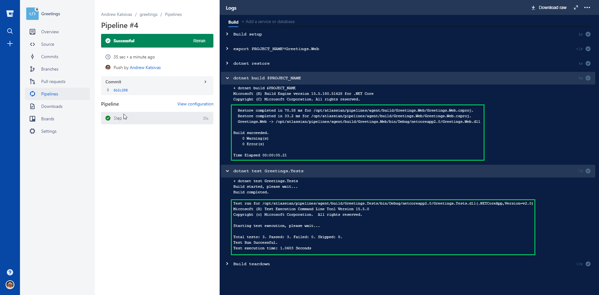
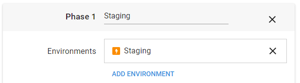

!include <octopus-cli>



Last week, my PowerShell-loving colleague [Jason Brown](https://octopus.com/blog/introducing-jason-brown) wrote a [fantastic piece](https://octopus.com/blog/continuous-delivery-powershell-octopus-takofukku) about using Octopus and [TakoFukku](https://github.com/stopthatastronaut/takofukku) to set up a continuous delivery pipeline for PowerShell modules.  In my evening hours, I've been tinkering with Bitbucket Pipelines to automate a few personal projects, so I thought I'd write a companion piece around setting up a continuous delivery pipeline for .NET core projects.

## A brief Introduction to the Characters

**[Bitbucket](https://bitbucket.org/)** is a git-based source-control platform made by Atlassian that serves as an alternative to GitHub with free unlimited private repos, so it's perfect for personal projects you don't want to have out in the wild.

**[Bitbucket Pipelines](https://bitbucket.org/product/features/pipelines)** is a new offering from Atlassian, it's a lightweight cloud continuous integration server using pre-configured docker containers. It's free for 50 build minutes per month, with the costs for additional minutes being very affordable (correct at time of writing). Setting up a CI server and build agents to run in the cloud can be a lengthy and expensive process, so this is a good way to hit the ground running.

## Prologue: The Plan

There are a few moving parts to this solution, so the process will work as follows:

1. New code is committed to a blessed branch on Bitbucket.
1. Bitbucket Pipelines kick off a build script when the commit is pushed to the remote repository.
1. The build script builds, tests, packages, and pushes the app code to an Octopus Deploy server.
1. Octopus automatically creates a release and deploys it to Azure (or wherever you want to deploy your code).

## Act 1: Setting It All Up

We've got a few accounts and services to create, and instructions for setting all of them up is beyond the scope of this article. The key things you will need to do are:

### Create a Bitbucket Account

Head over to https://bitbucket.org/account/signup/ and set up a Bitbucket account, if you don't already have one. This is where you will set up your remote repository and keep your source code.

### Create a New Repository

If you've just created a new Bitbucket account, you should also set up a repository you can push your source code to. The Bitbucket UI is fairly intuitive, (but you can [read this useful tutorial](https://confluence.atlassian.com/bitbucket/create-a-git-repository-759857290.html) if you'd prefer specific instructions). Once you've set up the repo, do an initial commit and push to it from your local source code (or whatever toy project you are testing this with) so you've got some code committed.

For this article, I will be using a toy project called "Greetings.Web", which has one unit test in it in a test project called "Greetings.Tests".

### Set up an Octopus Server

If you don't already have an Octopus server running, [start a trial](https://octopus.com/licenses/trial) and follow our [installation guide](https://octopus.com/docs/installation) to get up-and-running in no time. I'm using one of our shiny new [Octopus Cloud](https://octopus.com/cloud) preview servers; if you're interested in staying up-to-date with our progress, you can [register your interest](https://octopus.com/cloud/register-interest) and be notified when we release to RTM.

## Act 2: Configuring Pipelines to Run a Build on Commit

CI (continuous integration) typically works by integrating your build system into your source control repo(s), so that a new build is kicked-off automatically when new code is pushed to your remote repo. We will be using Pipelines (within Bitbucket) to do these builds, so we need to create a special file called `bitbucket-pipelines.yml` to let Bitbucket know what to do and how.

Open up your Bitbucket repository in a browser, and select the **Pipelines** menu option; this will bring you into the Pipelines interface, with a helpful GUI to getting your pipelines YAML file setup. As I'm going to be deploying a .Net Core app, I will use the **.NET Core** template (in the **More** menu) as a starting point. There are a number of templates you can use as starting points with other language types, so feel free to select whatever makes sense for you.

:::hint
If you're wondering why there is no **.NET** template available, the reason is because Pipelines uses Linux docker containers to run the build steps. As .NET Core is cross-platform, there is a template for use with the Microsoft .NET Core docker image; Windows and Mac/iOS builds are not supported at the time of writing.
:::

In the generated template we can tweak the commands to suit our build environment; each line is a **command-line** that you would run at a terminal. If you selected the .NET Core template, your file will look like this:



### The Commands

Each keyword is explained in detail in the help material linked to from this template, so have a read of those articles to get a broader understanding of how the YAML file should be structured. For our purposes, we are looking at the specific commands themselves:

- `export <name>=<value>` is a command to set up an **environment variable** called `<name>` (with the value of `<value>`) that we can refer to later in the file. This is a handy way to specify variables like `PROJECT_NAME`, and use the value in multiple places for build and test.
- `dotnet restore` is a .NET Core command to restore NuGet packages into your project. This ensures that any packages you are referencing are available locally, so your build can run (typically packages are not committed to source control, so need restoring on your build agent).
- `dotnet build <ProjectName>` will build the specified project; this is a good place to use a `PROJECT_NAME` variable. See [dotnet-build reference material](https://docs.microsoft.com/en-us/dotnet/core/tools/dotnet-build?tabs=netcore2x) for more information about options for this command.
- `dotnet test <TestProjectName>` will use the .NET test runner to run any unit tests in the specified test project. This is also a good place for a variable (e.g. `TEST_NAME`). See [dotnet-test reference material](https://docs.microsoft.com/en-us/dotnet/core/tools/dotnet-test?tabs=netcore2x) for more information about options for this command.

In a nutshell, this template file will **restore** your NuGet packages, **build** your project and run your **unit tests**. For now, just modify the `export` commands to point to your project and test project names respectively, and use a `#` to comment out any lines that don't apply.

I've set mine up with a project name variable, used by the `build` command, but I've removed the `TEST_NAME` variable to show how you can comment out lines you don't need, and that you don't _need_ to use variables if you don't want. My fully configured file looks like this:



Then we just need to hit `Commit file`, and the pipelines file will be committed to your repo in the correct place (the root of the project), and your first build will be kicked-off. If everything was configured correctly, you should see a screen like this:



Don't worry if it doesn't build the first time; read the output and make any corrections, and push your changes - a new build will kick off automatically on each push.

### Extending the Script

Now that you've happily got a basic pipelines build running, it's time to extend the script to package up your built code and push that to Octopus ready to deploy.

**Update 2018/06: Since writing this post we have started publishing `octo.exe` into a container to make this process even simpler. Check out our [updated blog post](https://octopus.com/blog/bitbucket-pipelines-redux) for details.**

#### Octopus API Key

First, we need to create an API key for our Octopus login so that Pipelines can use the Octopus API to push our code packages across. [This article](https://octopus.com/docs/octopus-rest-api/how-to-create-an-api-key) will walk you through creating an API key; make sure you save it somewhere you can retrieve later.

#### Pipelines Sensitive Variables

API keys (and other similar authentication tokens) are very powerful, as they grant the bearer the right to do anything you can do, without needing a password - so we need to keep them safe. Pipelines manages this through "secured variables", which are just like sensitive variables in Octopus - once you've set them, they are secured, and no-one can copy them back out again. This is perfect for our API key.

1. Open up your repository on Bitbucket, and open up the **Settings** page, then select **Environment variables** in the **PIPELINES** section.
1. On this page, enter `Octopus.ApiKey` as the variable name, and paste your API key in the value box. Tick `Secured`, and click `Add` to save the variable. We can now use this in our build scripts, just like `PROJECT_NAME` before.

#### Extending the Build Script

Now we need to adjust our build script to add in our extra commands - you can either make these changes locally and push the updated YAML file in a commit, or you can use the web GUI to find the file and edit it in the browser.

:::hint
As we are pushing to the built-in feed in Octopus, and not a NuGet feed, we can just zip up our published project output - no need for fancy NuGet packages or nuspec files. However, you could modify these steps to generate NuGet packages using `octo.exe pack` instead, if you wanted.
:::

With the edits made, the `script` section of our pipelines file now looks as follows, with comments explaining the new commands:

```yaml
# zip is not installed in the docker image, so we need to update apt-get and then install it so we can create our package later on
- apt-get update
- apt-get install zip -qq

# we use the PROJECT_NAME variable to generate our package name, as well as the in-built BITBUCKET_BUILD_NUMBER, which is the incrementing number of the build. This ensures we get incrementing unique package versions
- export PROJECT_NAME=Greetings.Web
- export VERSION=1.$BITBUCKET_BUILD_NUMBER
- export ZIP_FILE=$PROJECT_NAME.$VERSION.zip

- dotnet restore
- dotnet build $PROJECT_NAME
- dotnet test Greetings.Tests
# this will publish our app output into a subfolder so that we can package it up
- dotnet publish $PROJECT_NAME --output ../publish
# we need to make sure our app is at the root level of the zip file, or Azure will complain about it when we deploy. So we change into that directory
- cd ./publish
# we use the ZIP_FILE variable from above to generate the package
- zip -r $ZIP_FILE * -q

# curl comes installed in the image, so we just need to post the contents of the zip file to our Octopus instance, making sure we add an HTTP Header for our API key. This will be expanded by Pipelines from the environment variable we created previously
- curl -X POST https://cloud-perm.octopus.com/api/packages/raw -H "X-Octopus-ApiKey:$Octopus.ApiKey" -F "data=@$ZIP_FILE"
```

Make sure you change any variable names/values as appropriate and use the correct HTTP endpoint for your Octopus instance.

When this runs, provided the .NET commands run correctly (i.e. as long as our code compiles and our tests run successfully), our app will be published, packaged, and pushed to the built-in Octopus feed. Give it a test by pushing a commit to your repo and watching the process unfold. If everything works, you should see a package turn up under Library -> Packages, with a version matching the build that succeeded.

## Act 3: Setting up Octopus to Auto-deploy

Now that we have Pipelines building and packaging our code whenever we push, we have great confidence that we haven't introduced any bugs, so we want to push that to a deployment target - maybe a staging environment where you can test your changes. However, we don't want to have to manually deploy every time a build completes - that's crazy talk!

The key to automating this with Octopus involves two great (but oft-ignored) features:

1. **Automatic release creation** will do just what it says on the box; whenever a new package matching the project name is detected in the built-in package feed, a new release is automagically created, and
1. **Auto-deployment**, which will automatically deploy to an environment when a release reaches this phase of the deployment.

With these two handy features, all we need to do is push a new package to Octopus, and it will be automatically wrapped in a new release and deployed to the environment you've set up. How awesome is that?!

### 1. Create an Environment and Lifecycle for the Auto-deployment

If we are deploying to a Staging environment to continually test our work, we need an environment called "Staging" - if you don't already have one set up, create it now via Infrastructure -> Environments -> Add Environment.

Next, we need a special lifecycle that our project can use, that auto-deploys our new releases to this Staging environment (you could use this lifecycle in other projects, too), via Library -> Lifecycles -> Add Lifecycle. Call it something descriptive like "Auto-deploy to Staging", add a Phase called "Staging", and add your `Staging` environment to it. In the popup window, **make sure** you select the "Deploy automatically to this environment" option; this is the magic that makes it all work.

You can tell we have set up auto-deploy correctly by the orange lightening-bolt next to the environment name:



Now, any projects using this lifecycle will automatically deploy to `Staging` whenever a new release is created. Make sure to **Save** the lifecycle before leaving this page.

### 2. Set up Your Project

Next, we need a new Octopus project that executes the deployment steps we need. The process of the project will depend on what you're deploying, and where you need to deploy it to, and our documentation has a [great section on deploying](https://octopus.com/docs/deployment-process) with Octopus. For my toy project, I want to deploy it to an existing Azure web app, so I have a project with one step to deploy to Azure.

#### Create the Project

Create a new project via Projects -> Add Project, give it a name and make sure you expand the **Advanced Settings** section and select the new lifecycle we created above (remember mine is called "Auto-deploy to Staging"). If you're using an existing project, you can change the lifecycle under the "Process" page of the project settings.

#### Set up the Process

For automatic release creation to work, we need to have at least one step that deploys a package; that's how Octopus knows which packages to watch for in the built-in feed. If you have an Azure account set up already, have a read of [this article](https://octopus.com/docs/deploying-applications/azure-deployments/web-apps/getting-started-with-azure-web-apps) for information on setting up an Azure deploy step. Otherwise, consult the Octopus docs for more information on deploying to your environment.

#### Set up Automatic Release Creation

Now that we have a project set up with a process and in the right lifecycle, we need to turn on **Automatic Release Creation** - this is the magic that creates a new release whenever a new package is detected. Open up the "Triggers" page of the project, and click "Setup" on the right-hand side under **Automatic Release Creation**; you will need to select which step it should use to evaluate whether a new package should trigger a release. Select the step you created above, and save.

#### Create a Release and Test the Process

Lastly, create a release using the package that appeared after your first successful build, and as soon as you save the release, it should automatically deploy to Staging, thanks to the lifecycle settings you configured earlier. If this works correctly, then everything is ready to go! If you have any errors, have a read of the output logs to see what went wrong in your deployment and fix up any issues.

## Epilogue

It's time to try it all out! Make a change to your code that will be identifiable on your Staging host, and push this change to your Bitbucket repo. You should see Pipelines kick off the build and, once succeeded, Octopus should create a release and automatic deploy it to your Staging environment - all like magic!

Hopefully, this post empowers you to embrace a CD pipelines for your small personal projects, in a way that is cost-effective and lightweight enough to extend to other projects as they arise. If nothing else, maybe it has inspired you to adopt a part of the process, and given you some ideas about what's possible in the future.

Happy Deployments!

## Learn more

* [CI/CD with containers, Bitbucket and Octopus Deploy](https://hubs.ly/H0gCKLy0)
* DevOps best practice: [How Octopus handles rollbacks](https://hubs.ly/H0gCK-T0)
* [Octopus vs. Build Servers - Why should I use Octopus when I already have a CI Server?](https://hubs.ly/H0gCKLH0)
* Video: [Deploying an ASP.NET Core app](https://hubs.ly/H0gCKLN0)
* Video: [Deploying an ASP.NET Core web app to Linux](https://hubs.ly/H0gCLqZ0)