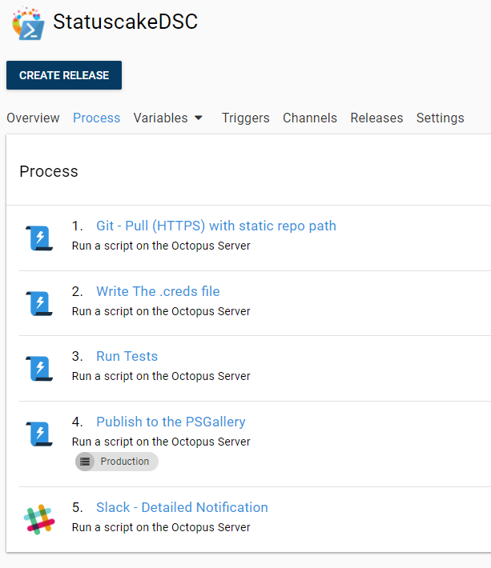
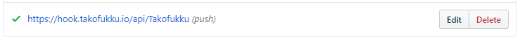
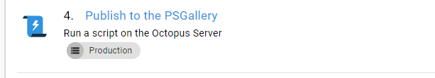

Classically, Octopus Deploy is an engine for pushing out applications - historically speaking, .NET applications - to servers.  But these days, it's a lot more than that. 

Because Octopus is an excellent distributed task runner with a rich set of pre-rolled templates, it can be used to drive many workloads and processes that might be otherwise done manually, or using painstakingly hand-rolled scripts run in a CI server. In fact, for PowerShell modules, which are often small, discrete chunks of functionality with no long compilation phase, Octopus is a perfect choice.

I have a few Open Source projects, and I use Octopus to drive testing and publishing on them, so today I'm going to run you through how that's done, using StatusCakeDSC as an example. StatusCakeDSC is a little Desired State Configuration module for setting up StatusCake monitoring. We use it here at Octopus, and I use it myself. It's available on the PowerShell Gallery, and when I want to publish a new version, it's Octopus that does that job for me.



## The project setup

It's just a standard Octopus Project, but you'll note everything here runs on the Octopus server. It doesn't have to; it's just cheaper in infrastructure terms. These steps will run on essentially any target with PowerShell installed so I could target a VM, a container, or even a polling tentacle on my home network. 

I have a few important, sensitive variables stored in the Project. My NuGet API key for the PowerShell Gallery, my StatusCake credentials so I can run tests and my Slack webhook endpoint. This allows me to keep these sensitive strings well away from GitHub, so I've got little chance of accidentally publishing them. I find using Octopus is a great way of keeping my secrets safe and away from public view for projects like this.

Then I have a fairly simple set of Octopus steps to get the job done, which I'll outline in a moment.

I have two environments for this project, `DevTest` and `Production`. When deploying to `Production`, all the steps are configured to run. But in DevTest, I explicitly exclude the 'Publish to PS Gallery' step. That's reserved for Production only because I don't want pre-release code making its way to the gallery by mistake.

## Triggering the project

The project triggers based on commits in Github using Webhooks, using a little project of mine called Takofukku. Takofukku is a lightweight, serverless webhook solution for Octopus deploy which is open for anyone to use. You simply drop a YAML document called a [takofile](https://github.com/stopthatastronaut/takofukku/blob/master/takofiles.md) into your GitHub repo, [configure a webhook](https://github.com/stopthatastronaut/takofukku#ok-so-how-do-i-hook-this-up) on the push event, and you're ready to go.



Every time a push event occurs, GitHub sends a POST request to the endpoint. Takofukku receives that hook, then grabs the takofile from the specified repo and, if it finds a valid mapping, triggers an Octopus deployment on your Octopus server. Full documentation for this is available [over at GitHub](https://github.com/stopthatastronaut/takofukku/blob/master/readme.md), and, of course, pull requests are accepted.

In this specific case, my takofile maps the GitHub `master` branch to the Octopus `production` environment, and the GitHub `develop` branch to the Octopus `DevTest` environment. Anytime we have a push/merge on those branches, Takofukku will create a new release, with the commit messages of the last push as the release notes, and deploy that release to the specified environment.

## Getting the code


The first thing it does is a git pull, using a (slightly tweaked) [Community Step Template from the Octopus Library](https://library.octopus.com/step-templates/5c08170d-e919-4afe-9da3-7616c797d42b/actiontemplate-git-pull-(https)). If we're deploying in `Production`, we clone the `master` branch. If in `DevTest`, we clone `develop`, using a simple scoped variable.

Following this step, you can see there's a step to write a .creds file. This is specific to the module, as StatusCakeDSC allows you to store credentials on the disk to make testing a little easier - that's explained [over at the module's repository](https://github.com/stopthatastronaut/StatusCakeDSC/blob/master/README.md#credentials), so I won't go into it here.

## Running the tests


StatusCakeDSC uses Pester to run tests, and this PowerShell Script step is pretty simple:

```
$error.Clear()             # make sure errors are empty
pushd c:\StatusCakeDSC     # make sure we're in the right working path
# invoke pester
$failcount = Invoke-Pester -EnableExit -Verbose
if($failcount -gt 0 -or $error.count -gt 0)  # if tests have failed _or_ the step has thrown errors, exit
{
    Fail-Step "Pester returned $failcount failed tests"
}
popd
```

One minor problem I found with Pester tests is that errors outside the immediate scope of the test didn't always fail the step as desired. So this step checks both the Pester failures AND general errors in the step, then uses Octopus's `Fail-Step` cmdlet to fail the deployment if something goes wrong.

## Publishing to the PowerShell Gallery



My esteemed colleague Chris van Dal, did a pull request a while back adding `publish.ps1` to this repo so that I could deploy to the PS Gallery easily. You can see the script [over at the GitHub repo](https://github.com/stopthatastronaut/StatusCakeDSC/blob/master/publish.ps1), and it's pretty much what most PowerShell module authors use to push their modules out. I just drive that from my Octopus step as follows:

```
Set-Location c:\StatuscakeDSC
.\publish.ps1 -nugetapikey $psgalleryapikey
```

The Run Condition on this step is set to run only if all previous steps ran successfully, and it only runs in the Production environment. 

To put this into Octopus, I made some simple tweaks to the original script. It now:

- Draws in the API key in as a parameter so that I can store it safely in Octopus.
- Checks the Module Manifest to find the version number.
- Checks the PowerShell gallery to see if that version has been published already.
- If successful, and the version has been incremented, it publishes the new module.
- In the most recent code, it pushes a git tag back into GitHub, marking the latest code with the version number from the gallery.

## Finishing it all up


The last step of all is a [Slack notification](https://library.octopusdeploy.com/step-template/actiontemplate-slack-notify-deployment), with a Run Condition of "Always Run". This step is smart enough to know when the deployment has failed and will adjust its message accordingly. I love this step template because it means I don't even have to log in to my Octopus Server to know if a deployment went OK after I push some commits. I just get a Slack notification on my phone, wherever I happen to be.


So the practical upshot of all this is that whenever I want to put in a change to StatusCakeDSC, all I really need to do is merge to the correct branch in git, and Octopus will take care of running my tests and publishing to the Gallery. It's continuous delivery for PowerShell modules, and I love it.

Do feel free to copy or enhance this process for your own ends, and do let us know if you add any enhancements. There are plenty of possibilities to improve this step scattered throughout the step library, and indeed virtually any script you can write can be accommodated in Octopus.

Happy Deployments!
