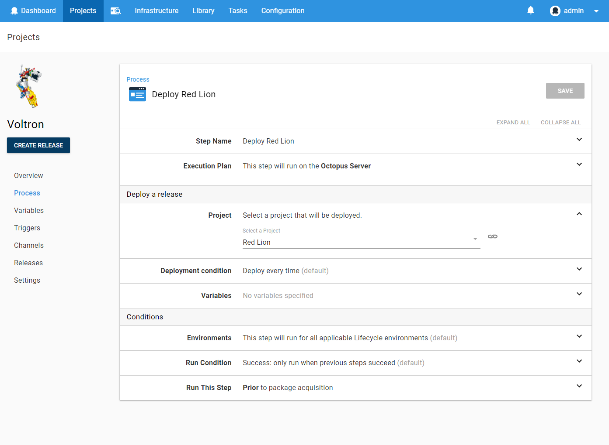
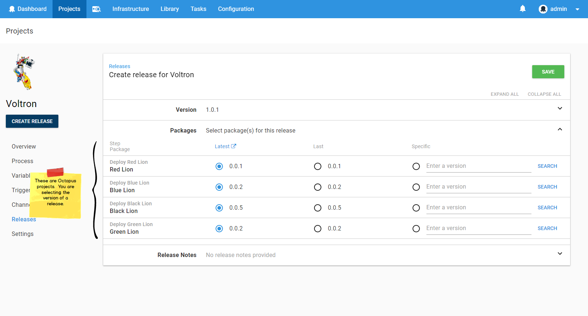
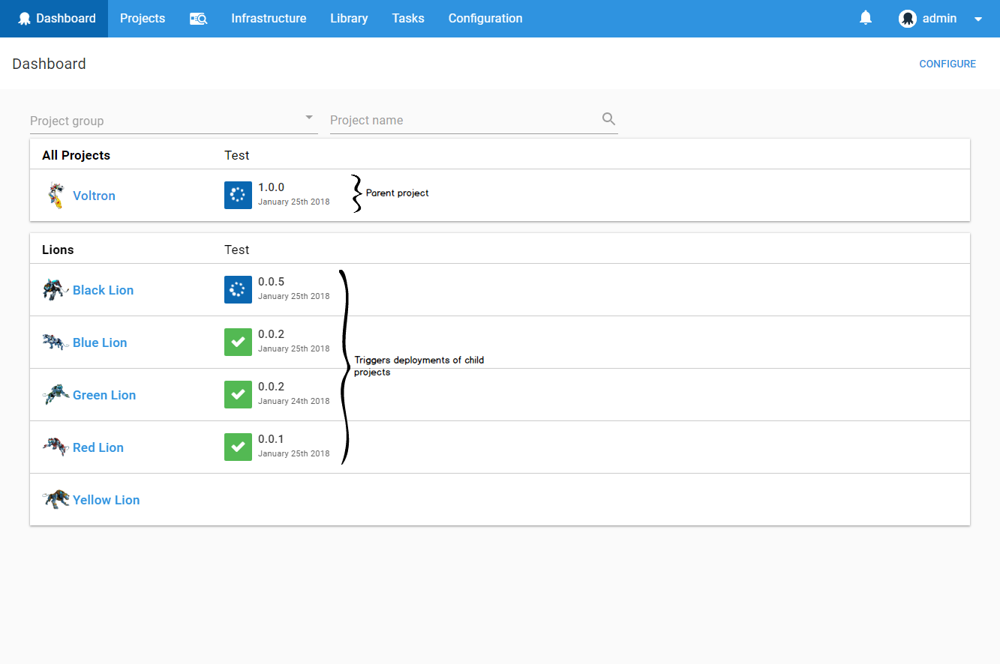
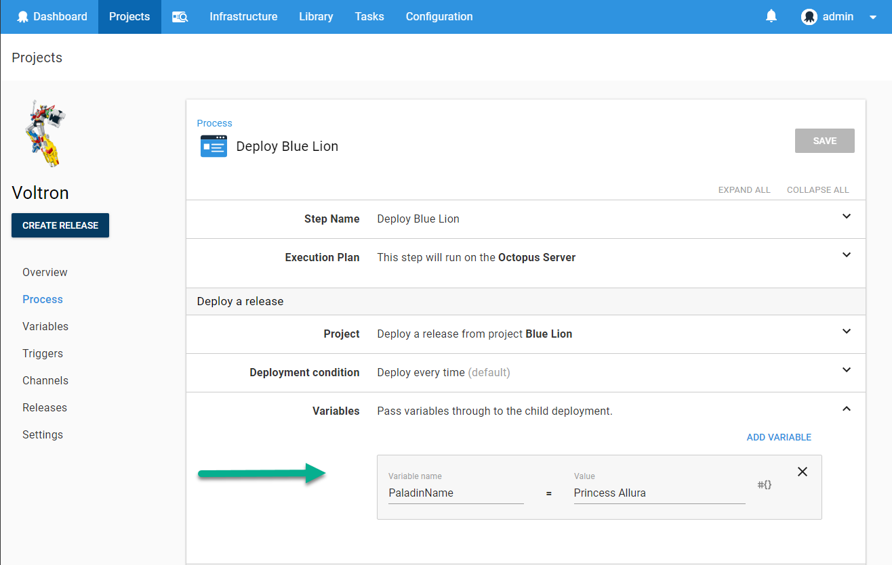

Unless you are building a genuine monolith, your projects don't exist in isolation. More and more our industry is moving in a direction where systems are composed of more granular components. Some call it service-oriented architecture, some call it microservices, but the key point from a release-management perspective is that it requires coordination.  

Here at Octopus HQ, we love this trend, because frankly, the more moving parts your release and deployment processes have, the more value Octopus brings to the table. 

As a natural consequence of this, users want to be able to coordinate the release of multiple projects in Octopus. This is one of our top UserVoice suggestions.

The two key scenarios are:

- **Bundle:** You want to create a "bundle" release to allow releases of multiple projects to progress together through your environments. 
- **Dependencies:** You want to explicitly model that Project A depends on a particular version of Project B having been deployed.

## Introducing the _Deploy a Release_ Step    

   

To solve this problem, we have a created a new step: [Deploy a Release](https://octopus.com/docs/deployment-process/coordinating-multiple-projects/deploy-release-step).  The _Deploy a Release_ step allows you to select another Octopus project to deploy.   

When you create a release of a project containing one or more _Deploy a Release_ steps, you can select the release versions of the child projects to be deployed.  Exactly as versions of packages are selected when creating a release of projects which contain steps which deploy packages.   

The nice thing about implementing this as a step is all the regular Octopus goodness works as expected. You can intersperse _Deploy a Release_ steps with other step types.  For example, if you are creating a bundle project then your first step may be a _Manual Intervention_ step (to approve the release), and your final step may be to send a Slack notification. _Deploy a Release_ steps can also be configured to run only for specific environments, channels, or tenants, just as any other step can. They can be configured to run in parallel or serial, just as any other step can.   

When a _Deploy a Release_ step is run, it triggers a deployment of the specified project. This deployment is no different from a deployment triggered directly.  It will be visible on the Octopus dashboard.   

### Conditional Deployment

You can configure the conditions under which the child project is deployed:

- Deploy Always (default).
- If the selected release is not the current release in the environment.
- If the selected release has a higher version than the current release in the environment.

This allows you to specify the relationship between versions of your components. 

#### Microservice Example

For example, you are deploying an application, _Acme.Shop_, which depends on a logging microservice, _Acme.Shipping_.   

The _Acme.Shop_ project could contain a _Deploy Release_ step which was configured to deploy _Acme.Shipping_ with the _Deployment Condition_ field set to `If the selected release has a higher version than the current release in the environment`.

This would allow the team working on the _Acme.Shipping_ microservice project to work independently, deploying to the Octopus environments when they are ready. 

When the team working on _Acme.Shop_ creates a release, they select a version of _Acme.Shipping_, for example `2.0.0`.  This effectively specifies the minimum version which must be in each environment. As the _Acme.Shop_ release progresses through the environments, it will trigger a deployment of _Acme.Shipping_ only if the environment doesn't already contain `>= 2.0.0` of _Acme.Shipping_.        

### Variables

Variables can be passed to the deployments triggered by a _Deploy a Release_ step. These are available to the child deployment process just as any other project variable.    

[Output variables](https://octopus.com/docs/deployment-process/variables/output-variables) from deployments triggered by a _Deploy a Release_ step are captured and exposed as output variables on the _Deploy a Release_ step.

This allows output from a child deployment to be used by the parent process and even passed into deployments triggered by subsequent _Deploy a Release_ steps.  Many coordination scenarios are enabled by this. 

## When Can I Get My Hands on It?

This feature will ship with Octopus version 2018.2, which will be released in early February.

_Happy (multi-project) Deployments!_

## Learn more

* Documentation: [How to deploy a release in Octopus](https://hubs.ly/H0gCMqV0)
* Documentation: [Creating a deploy release step as part of your deployment process in Octopus](https://hubs.ly/H0gCMSL0)
* Documentation: [AWS deployments](https://hubs.ly/H0gCMSP0)
* Documentation: [Azure deployments](https://hubs.ly/H0gCMqX0)
* Blog: [Azure PaaS targets with Octopus Deploy](https://hubs.ly/H0gCMq_0)