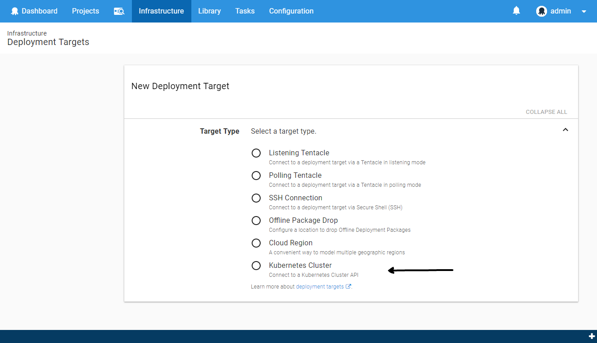
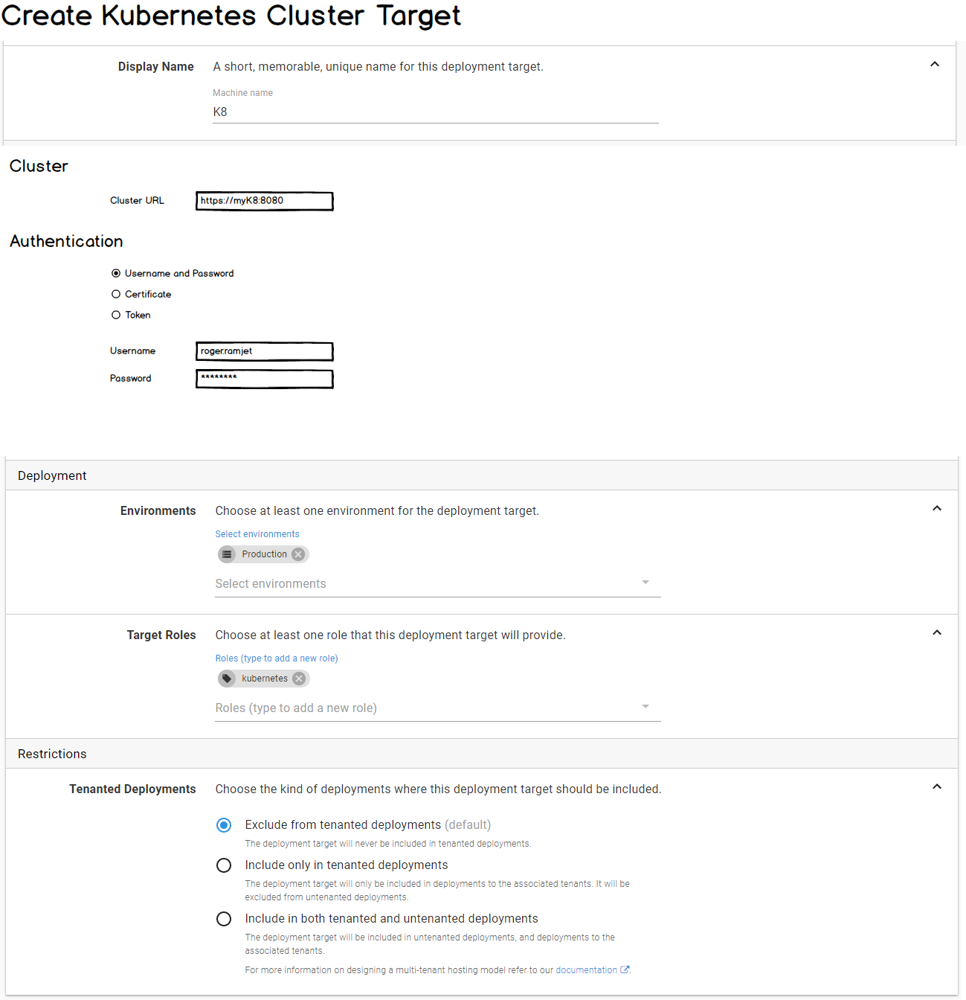
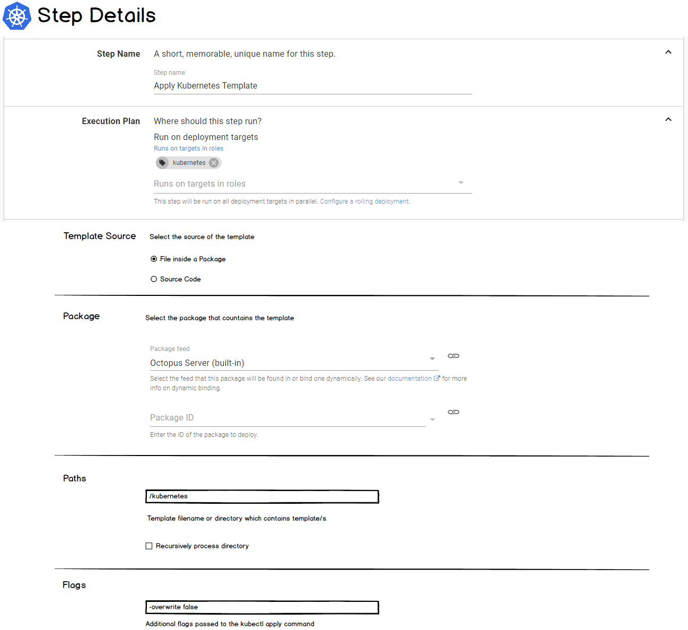
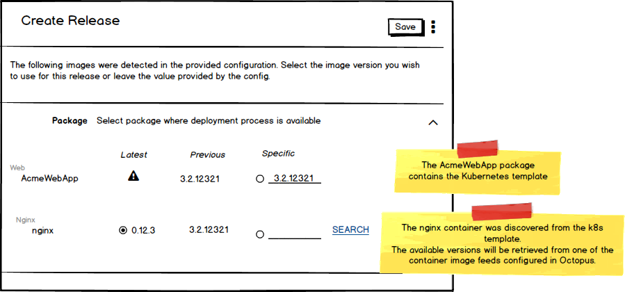
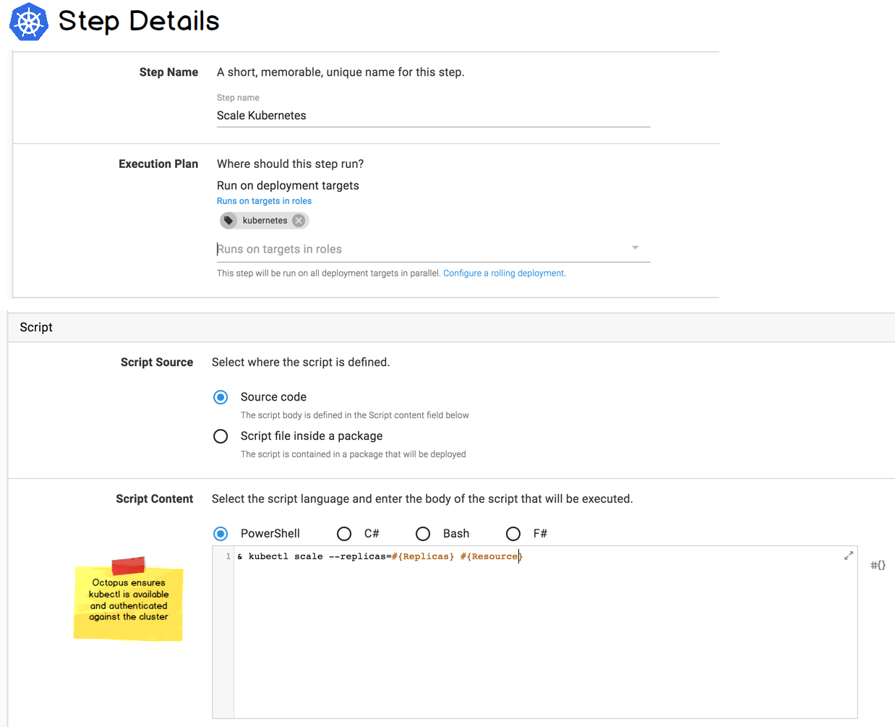

Kubernetes has won the container-orchestration wars (at least for this week). Perhaps unsurprisingly, **Kubernetes has rocketed to #7** on the list of our top UserVoice suggestions.  

We've been thinking about what Kubernetes support in Octopus might look like, and we'd love to hear your thoughts.  Often when we are designing features and we want to know what a typical user looks like, we need only to look in the mirror. With Kubernetes, this isn't the case.  We don't currently use k8s internally (though that may well change as we build our hosted product), so we definitely need your help with this one. 

Our current thinking is that Kubernetes support would take the following shape:
- A new [Kubernetes Cluster target](#Kubernetes-Cluster-Target).
- Two new deployment steps: [Kubernetes Apply](#Kubernetes-Apply-Step) and [Kubectl Script](#kubectl-Script-Step).

## Kubernetes Cluster Target

We will introduce a new _Kubernetes Cluster_ target type, to represent the cluster the new Kubernetes steps will execute against. 



The target will allow you to configure the URL of the Kubernetes Cluster and the authentication details.

We will possibly support the following authentication methods:

- Username + password
- Certificate
- API Token



## Kubernetes Apply Step

Kubernetes supports both [declarative and imperative modes of object management](https://kubernetes.io/docs/concepts/overview/object-management-kubectl/overview/#management-techniques). 

For Octopus, it seems a natural fit to support the declarative approach.  This is implemented via the [Kubernetes Apply command](https://kubernetes.io/docs/reference/generated/kubectl/kubectl-commands#apply). We will expose this via a dedicated _Kubernetes Apply_ step.



The Apply command accepts a template (JSON or YAML). This is conceptually similar to how the [AWS CloudFormation](https://octopus.com/docs/deployments/aws/cloudformation) or [Azure Resource Group](https://octopus.com/docs/runbooks/runbook-examples/azure/resource-groups) steps work in Octopus. The k8s template can be sourced from a package or configured directly in the Octopus UI.     

### Container Images 

The k8s templates specify container images. For example, the template below specifies version 1.7.9 of the nginx image.   

```
apiVersion: apps/v1beta1
kind: Deployment
metadata:
  name: nginx-deployment
spec:
  minReadySeconds: 5
  template:
    metadata:
      labels:
        app: nginx
    spec:
      containers:
      - name: nginx
        image: nginx:1.7.9
        ports:
        - containerPort: 80
```

When creating a release of a project which contains Kubernetes Apply steps, we will allow you to specify the version of the container images you wish to use.

When you deploy the release, we will substitute the correct version of the container images into your template before sending it to the Kubernetes cluster.

_This is the Octopus special-sauce._  It allows you to snapshot a specific combination of container image versions and progress these through your environments.



You can see in the UI-mock-up above that you are selecting two versions:
- The version of the package which contains your Kubernetes template (`AcmeWebApp` in the example above).
- The version of the container image _within_ the template (in this case `nginx`).

### Variable Substitution

We will perform [variable-substitution](https://octopus.com/docs/projects/variables/variable-substitutions) on the Kubernetes template. So you can use Octopus variables directly in it, and they will be replaced. 

Unfortunately, Kubernetes doesn't support parameter files for templates (as for example [CloudFormation](https://docs.aws.amazon.com/AWSCloudFormation/latest/UserGuide/parameters-section-structure.html) and [Azure RM](https://docs.microsoft.com/en-us/azure/azure-resource-manager/resource-manager-templates-parameters) templates do). This is unfortunate, as parameter files seem like the ideal way for the template author to tell tools like Octopus which values should be supplied as arguments.  

How would you want to supply variables to the Kubernetes Apply command?  

Some options might be:

1) **Variable substitution directly on the template**: You would include, for example, `#{Octopus.Environment}` in your template, which is replaced by the appropriate value at deployment time.  This is consistent with the approach of tools such as [helm](https://helm.sh/), but does have the downside of your templates not being valid outside of Octopus (and possibly not even valid JSON or YAML).  

2) **Transform files**: Similar to [Microsoft web.config transforms](https://msdn.microsoft.com/library/dd465326.aspx), you would sit a transform file beside your template. The transform file could then contain Octopus variables which would be substituted, and then the transform would be applied to the template. This approach would have the advantages that your template could remain valid, and your transform can live beside your template (in your git repo, for example).  For JSON templates, there are [existing implementations](https://github.com/Microsoft/json-document-transforms/wiki).  For YAML, we couldn't find much...

3) **Explicitly-configured substitutions**: We could also allow key-value pairs to be provided in the step UI, which would specify the properties in your template to be substituted. And we could support nested properties (see examples below). This has the downside that if your template structure changes you would have to update the deployment step in Octopus. 

| Key        | Value               | Comment            |
|------------|---------------------|--------------------|
| `foo`        | `#{Foo}`              | Top-level property `foo` would be substituted with the value of #{Foo}.|
| `foo::bar`   | `#{AnotherVariable}`  | Nested property `foo.bar` would be substituted.|

As mentioned, we would definitely implement option #1 (and if you didn't have any Octopus variable placeholders in your template, then it wouldn't  do anything).  But if you would prefer other methods of supplying variables (including any not mentioned above), then please leave a comment. 

## kubectl Script Step

There are many other [Kubernetes commands](https://kubernetes.io/docs/reference/generated/kubectl/kubectl-commands) you may wish to execute, other than `apply`.  For example: [deleting resources](https://kubernetes.io/docs/reference/generated/kubectl/kubectl-commands#delete), [scaling](https://kubernetes.io/docs/reference/generated/kubectl/kubectl-commands#scale), etc.

We will enable these by adding a new flavor of a Run a Script step: _Run a kubectl Script_. 

This step will allow you to write your own scripts, and we ensure the `kubectl` command-line is available and authenticated against the Kubernetes cluster the step is targeting.  This is conceptually similiar to our [Run an AWS CLI Script](https://octopus.com/docs/deployments/custom-scripts/aws-cli-scripts) or the  [Run an Azure PowerShell Script](https://octopus.com/docs/deployments/azure/running-azure-powershell) steps, which authenticate against and provide the SDK for AWS and Azure respectively. 



## We Need Your Help

We think this would fit nicely with the existing Octopus concepts and architecture, but we need you to tell us if this matches the way you would expect to interact with Kubernetes. 

If you currently use Kubernetes (or are planning to), we would love to hear about your scenario.  Help us bring k8s to o5s. 