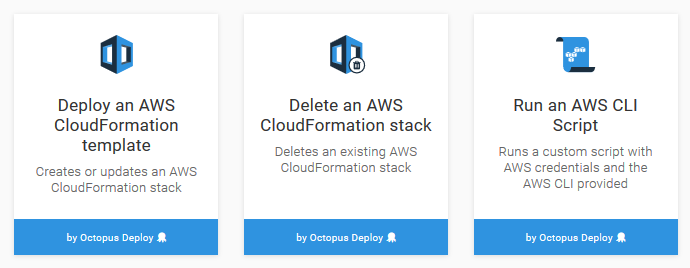
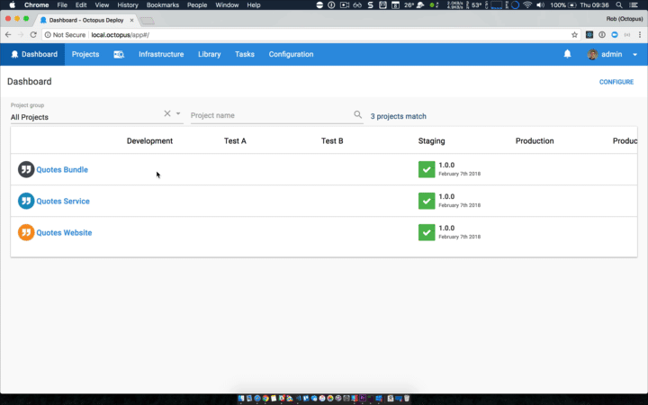

Octopus 2018.2 brings a number of exciting new features including the much requested **step to deploy a release**, the ability to deploy AWS CloudFormation templates, delete existing CloudFormation stacks, and run scripts with the AWS CLI.

## In this post

!toc

## Release Tour

<iframe width="560" height="315" src="https://www.youtube.com/embed/W2FMvpe3NyA" frameborder="0" allowfullscreen></iframe>

## AWS Support

This release introduces 3 new steps related to AWS.

The first allows custom scripts to be run against the AWS CLI. Octopus provides the AWS credentials and the AWS CLI itself, making it easy to interact with AWS resources as part of a deployment.

The two other steps allow you to deploy CloudFormation templates and delete existing CloudFormation stacks. Octopus takes care of the parameters and outputs, and allows you to deploy CloudFormation templates entered directly in the step or from an external package.

## Coordinating Projects with the Deploy a Release Step

   

One of our most popular UserVoice suggestions for a while now has been the ability to coordinate multiple Octopus projects, by having one trigger the deployment of another.

With this release we are proud to introduce the [Deploy a Release step](deploy-release-step/deploy-release-step.md).  

We hope this will enable many powerful multi-project scenarios.

## External workers

Until now, the scripts for run-on-server steps ran as a child process of the Octopus Server and under it's security context. Last month, we shipped the ability to [change the user account](https://octopus.com/docs/administration/security/built-in-worker) that those scripts are run under.

This month, we are introducing a second option, [external workers](https://octopus.com/docs/administration/workers). This feature allows you to install a Tentacle (or use an existing one) to run all run-on-server steps that involve user scripts or packages. Once configured, the ability for the Octopus Server to run scripts is disabled, and all user provided scripts and packages are run on that Tentacle.

This is part of our ongoing work for the [workers](https://github.com/OctopusDeploy/Specs/blob/master/Workers/index.md) feature. The next piece in the pipeline is the bundling of a worker with the server. This will act as the default worker (aka built-in worker) and will allow us to remove all the run-on-server script execution code.

## Improvements for large dashboards

We'd also like to highlight one small but significant change that is a great addition for large Octopus instances. If you had a large number of environments or tenants, your dashboards that were very hard to read and often you'd be need to scroll horizontally to see more content. The good news is that we've updated the dashboards with a fixed first column and headers so they so they far easier to read and work with. 

## Improvements to audit logs

When resources referenced by other resources are deleted we will now log how and why they changed, a key one being changes to Project Variables. There's also some other resource types are now being audited now and/or with more detail.

## Breaking Changes

If you are using an older version of `Octopus.Client.dll` to access `/api/feeds/all` then this will now error. You will need to update to >= 4.30.7 of [Octopus.Client](https://www.nuget.org/packages/Octopus.Client). The reason for this is that we have added a new feed type for releases of Octopus projects, to support the new [Deploy Release step](deploy-release-step/deploy-release-step.md).  

### Improving our Packages API
In anticipation of some upcoming new feed types we have hit the point where we were forced to revisit how we expose the packages API for external feeds, and how we store cached packages for deployments.
Unless you are hitting the Octopus API directly to search through your external feeds or rely on specific naming of the cached packages, then there should be almost no impact to you. One side effect of the change to package cache names is that the current packages cache on the server and tentacles will be no longer checked so new deployments will use the new package names.
More details about these changes are available in the GitHub tickets ["Packages API does not meet the requirements of our expanding feed types #4114"](https://github.com/OctopusDeploy/Issues/issues/4114) and ["Modify the cache naming format to allow for new feed formats #4211"](https://github.com/OctopusDeploy/Issues/issues/4211).

## Upgrading

As usual [steps for upgrading Octopus Deploy](https://octopus.com/docs/administration/upgrading) apply. Please see the [release notes](https://octopus.com/downloads/compare?to=2018.2.0) for further information.

## Wrap up

That’s it for this month. Feel free leave us a comment and let us know what you think! Go forth and deploy!
