Spring Boot supports building JAR files that can be executed like regular bash scripts in Unix environments. These files are called [fully executable JARs](https://docs.spring.io/spring-boot/docs/current/reference/html/deployment-install.html), and they make deploying Spring Boot applications as Linux services very convenient. In this blog post we'll take a look at how we can deploy a fully executable JAR file to an EC2 instance created via a CloudFormation template with Octopus.

## The AWS Account

Octopus CloudFormation steps authenticate with AWS through an AWS Account.  These accounts are managed under {{Infrastructure>Accounts>Amazon Web Services Account}}. You can find more information on creating AWS Accounts through our [documentation](https://octopus.com/docs/infrastructure/aws/creating-an-aws-account), keeping in mind that the account needs to have some [common permissions](https://octopus.com/docs/deployments/aws/permissions) to be effectively used to deploy CloudFormation templates.

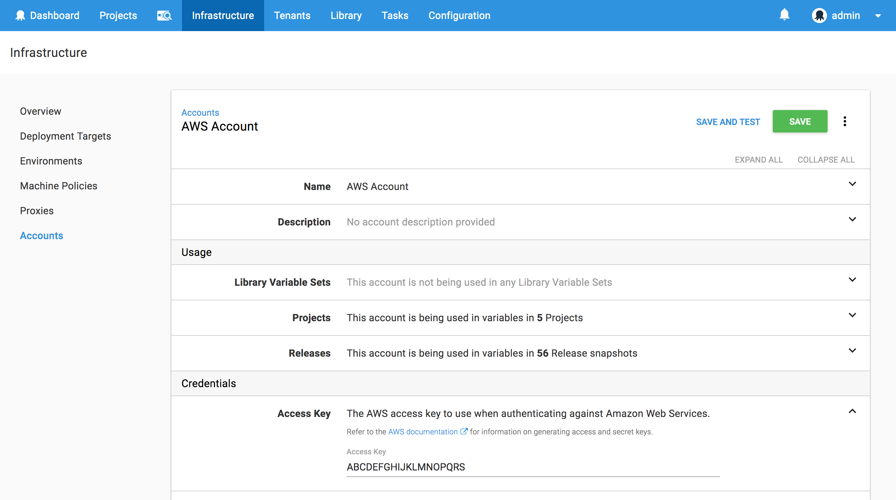

## The SSH Account

We'll also need to configure an account that will be used to connect to the Linux EC2 instances via SSH. These accounts are managed under {{Infrastructure>Accounts>SSH Key Pairs}}. Here we'll create an SSH account with the username `ec2-user` (which is the default username for Amazon Linux) and the PEM file that you will need to have created in AWS that will be assigned to the EC2 image. You can find more information on creating AWS key pairs in their [documentation](https://docs.aws.amazon.com/AWSEC2/latest/UserGuide/ec2-key-pairs.html).

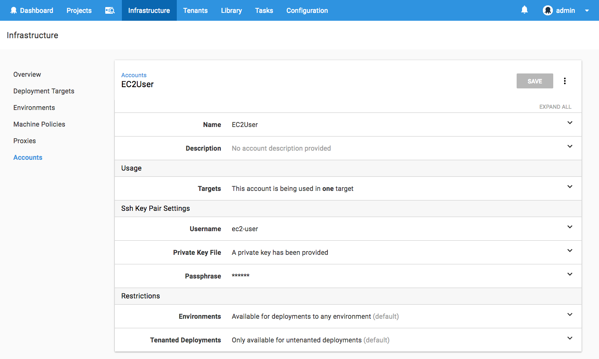

## The Machine Policy

The final global Octopus setting we need to configure is the machine policy, which is accessed under {{Infrastructure>Machine Policies}}.

Unlike polling tentacles, SSH targets must have an accurate IP address or hostname to participate in an Octopus deployment. However, the EC2 instances that will be created by the CloudFormation template do not have a fixed IP address, and the IP address they do have will change when the EC2 instance is stopped and started again. This means we need to do two things to ensure our EC2 instances are correctly configured in Octopus:

1. Add the EC2 instance to Octopus each time the EC2 instance boots (if it is not already registered).
2. Have Octopus clean up any deployment targets that fail a health check.

We'll tackle step 1 with some scripting in the CloudFormation template in a later section. Step 2 is configured by editing the `Clean Up Unavailable Deployment Targets` section in the default machine policy to enable `Automatically delete unavailable machines`.

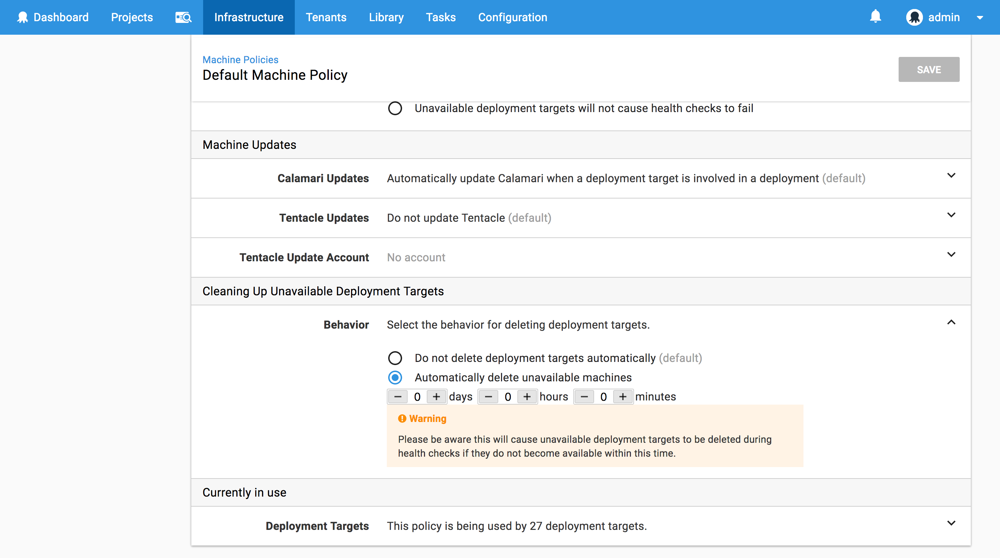

## Building a Fully Executable JAR File

Typically a JAR file is run with a command like `java -jar application.jar`. However Spring makes it possible to build [fully executable JARs](https://docs.spring.io/spring-boot/docs/current/reference/html/deployment-install.html), which can be run in Unix like systems like `./application.jar`.

For this blog post we'll be using a simple Thymeleaf Spring Boot application available from [GitHub](https://github.com/OctopusDeploy/ThymeleafSpringDemo/tree/executable-jar). Inside the Maven `pom.xml` we have the configuration:

```xml
<plugin>
  <groupId>org.springframework.boot</groupId>
  <artifactId>spring-boot-maven-plugin</artifactId>
  <configuration>
      <executable>true</executable>
  </configuration>
</plugin>
```

Setting `<executable>true</executable>` instructs the Spring Boot Maven plugin to build a fully executable JAR.

If we look at the actual contents of the JAR file, we can see that it starts out with a Bash script that includes the [Comment Conventions for Init Scripts](http://refspecs.linuxbase.org/LSB_3.0.0/LSB-PDA/LSB-PDA/initscrcomconv.html).

```
$ head -n 21 target/springboot.0.0.1-SNAPSHOT.jar
#!/bin/bash
#
#    .   ____          _            __ _ _
#   /\\ / ___'_ __ _ _(_)_ __  __ _ \ \ \ \
#  ( ( )\___ | '_ | '_| | '_ \/ _` | \ \ \ \
#   \\/  ___)| |_)| | | | | || (_| |  ) ) ) )
#    '  |____| .__|_| |_|_| |_\__, | / / / /
#   =========|_|==============|___/=/_/_/_/
#   :: Spring Boot Startup Script ::
#

### BEGIN INIT INFO
# Provides:          springboot
# Required-Start:    $remote_fs $syslog $network
# Required-Stop:     $remote_fs $syslog $network
# Default-Start:     2 3 4 5
# Default-Stop:      0 1 6
# Short-Description: springboot
# Description:       Demo project for Spring Boot
# chkconfig:         2345 99 01
### END INIT INFO
```

This means we can execute this file as it it were a regular init script.

## Building an EC2 Instance with CloudFormation

We'll make use of the CloudFormation steps in Octopus to build an EC2 instance that will host our Spring Boot service. This template will be run in the `us-east-1` region, and will create an EC2 instance from the standard Amazon Linux AMI, which is `ami-97785bed` in our case.

This is the complete CloudFormation template.

```yaml
AWSTemplateFormatVersion: 2010-09-09
Resources:
  InstanceSecurityGroup:
    Type: AWS::EC2::SecurityGroup
    Properties:
      GroupDescription: SSH and Web Ports
      SecurityGroupIngress:
      - IpProtocol: tcp
        FromPort: '22'
        ToPort: '22'
        CidrIp: '0.0.0.0/0'
      - IpProtocol: tcp
        FromPort: '8080'
        ToPort: '8080'
        CidrIp: '0.0.0.0/0'
  Linux:
    Type: 'AWS::EC2::Instance'
    Properties:
      ImageId: ami-97785bed
      InstanceType: m3.medium
      KeyName: DukeLegion
      SecurityGroups:
        - Ref: InstanceSecurityGroup
      Tags:
        -
          Key: Application
          Value: Spring Boot
        -
          Key: Domain
          Value: None
        -
          Key: Environment
          Value: Test
        -
          Key: LifeTime
          Value: Transient
        -
          Key: Name
          Value: Spring Boot
        -
          Key: OS
          Value: Linux
        -
          Key: OwnerContact
          Value: "#{Contact}"
        -
          Key: Purpose
          Value: Support Test Instance
        -
          Key: Source
          Value: CloudForation Script in Octopus Deploy
        -
          Key: scheduler:ec2-startstop
          Value: true
      UserData:
        Fn::Base64: |
          #cloud-boothook
          #!/bin/bash
          sudo yum install -y libunwind libicu jq java-1.8.0-openjdk
          sudo update-alternatives --set java /usr/lib/jvm/jre-1.8.0-openjdk.x86_64/bin/java
          if [ ! -d /opt/springboot ]; then
            sudo mkdir /opt/springboot
            sudo chown ec2-user:ec2-user /opt/springboot
          fi
          role="SpringBoot"
          serverUrl="#{ServerURL}"
          apiKey="#{APIKey}"
          environment="#{Environment}"
          accountId="#{AccountID}"
          localIp=$(curl -s http://169.254.169.254/latest/meta-data/public-hostname)
          existing=$(wget -O- --header="X-Octopus-ApiKey: $apiKey" ${serverUrl}/api/machines/all | jq ".[] | select(.Name==\"$localIp\") | .Id" -r)
          if [ -z "${existing}" ]; then
            fingerprint=$(sudo ssh-keygen -l -E md5 -f /etc/ssh/ssh_host_rsa_key.pub | cut -d' ' -f2 | cut -b 5-)
            environmentId=$(wget --header="X-Octopus-ApiKey: $apiKey" -O- ${serverUrl}/api/environments?take=100 | jq ".Items[] | select(.Name==\"${environment}\") | .Id" -r)
            machineId=$(wget --header="X-Octopus-ApiKey: $apiKey" --post-data "{\"Endpoint\": {\"DotNetCorePlatform\":\"linux-x64\", \"CommunicationStyle\":\"Ssh\",\"AccountType\":\"SshKeyPair\",\"AccountId\":\"$accountId\",\"Host\":\"$localIp\",\"Port\":\"22\",\"Fingerprint\":\"$fingerprint\"},\"EnvironmentIds\":[\"$environmentId\"],\"Name\":\"$localIp\",\"Roles\":[\"${role}\"]}" -O- ${serverUrl}/api/machines | jq ".Id" -r)
          fi
Outputs:
  PublicIp:
    Value:
      Fn::GetAtt:
      - Linux
      - PublicIp
    Description: Server's PublicIp Address
```

We start by defining the security group that will be assigned to the EC2 instance. This security group opens up port 22 for SSH, and port 8080 for the Spring Boot application.

```yaml
InstanceSecurityGroup:
  Type: AWS::EC2::SecurityGroup
  Properties:
    GroupDescription: SSH and Web Ports
    SecurityGroupIngress:
    - IpProtocol: tcp
      FromPort: '22'
      ToPort: '22'
      CidrIp: '0.0.0.0/0'
    - IpProtocol: tcp
      FromPort: '8080'
      ToPort: '8080'
      CidrIp: '0.0.0.0/0'
```

Next is the EC2 instance. This configuration defines the AMI image ID, the instance type, the SSH key pair to use, and some tags to apply to the instance.

Internally at Octopus we have a bunch of tags that need to be set on any EC2 instances. At a minimum you will want to set the `Name` tag, as this is the name that appears in the AWS console.

:::hint
Notice the `OwnerContact` tag value is being set using the [variable substitution](https://octopus.com/docs/deployment-process/variables/variable-substitution-syntax) in Octopus. We'll define this variable in a later step.
:::

```yaml
Linux:
  Type: 'AWS::EC2::Instance'
  Properties:
    ImageId: ami-97785bed
    InstanceType: m3.medium
    KeyName: DukeLegion
    SecurityGroups:
      - Ref: InstanceSecurityGroup
    Tags:
      -
        Key: Application
        Value: Spring Boot
      -
        Key: Domain
        Value: None
      -
        Key: Environment
        Value: Test
      -
        Key: LifeTime
        Value: Transient
      -
        Key: Name
        Value: Spring Boot
      -
        Key: OS
        Value: Linux
      -
        Key: OwnerContact
        Value: "#{Contact}"
      -
        Key: Purpose
        Value: Support Test Instance
      -
        Key: Source
        Value: CloudForation Script in Octopus Deploy
      -
        Key: scheduler:ec2-startstop
        Value: true
```

In order for this EC2 instance to be used as an Octopus deployment target, it needs to either have Mono installed, or have the required packages installed to support DotNET Core 2. In this example I have chosen to support the later, so we use `yum` to install the dependencies listed in the [Prerequisites for .NET Core on Linux](https://docs.microsoft.com/en-us/dotnet/core/linux-prerequisites?tabs=netcore2x).

:::warning
Although Amazon Linux is not officially supported by Microsoft for running DotNET Core applications, we can treat Amazon Linux the same as CentOS when following the DotNET Core documentation. However, while this works for the purposes of this blog, it is an unsupported configuration.
:::

We also install Java 8, and set it as the default over the existing Java 7 installation.

The `#cloud-boothook` marker is used by the `cloud-init` service to [identify scripts that should be run on each boot](http://cloudinit.readthedocs.io/en/latest/topics/format.html#cloud-boothook).

:::hint
In a production environment packages like Java and the DotNET Core dependencies would be baked into the base AMI image rather than being installed when the instance is booted.
:::

```yaml
UserData:
  Fn::Base64: |
    #cloud-boothook
    #!/bin/bash
    sudo yum install -y libunwind libicu jq java-1.8.0-openjdk
    sudo update-alternatives --set java /usr/lib/jvm/jre-1.8.0-openjdk.x86_64/bin/java
```

We'll be installing our JAR file under `/opt/springboot`, so we need to make sure that directory exists, and that the `ec2-user` account can modify its contents.

```
    if [ ! -d /opt/springboot ]; then
      sudo mkdir /opt/springboot
      sudo chown ec2-user:ec2-user /opt/springboot
    fi
```

Finally we need this EC2 instance to register itself with the Octopus server if it has not already done so. This part of the script queries the Octopus API to determine if a deployment target exists with this current hostname of the EC2 instance, and if a deployment target is not found, it will be added.

:::hint
A number of the variables in this script are provided using [variable substitution](https://octopus.com/docs/deployment-process/variables/variable-substitution-syntax). These will be defined in the next section.
:::

```
    role="SpringBoot"
    serverUrl="#{ServerURL}"
    apiKey="#{APIKey}"
    environment="#{Environment}"
    accountId="#{AccountID}"
    localIp=$(curl -s http://169.254.169.254/latest/meta-data/public-hostname)
    existing=$(wget -O- --header="X-Octopus-ApiKey: $apiKey" ${serverUrl}/api/machines/all | jq ".[] | select(.Name==\"$localIp\") | .Id" -r)
    if [ -z "${existing}" ]; then
      fingerprint=$(sudo ssh-keygen -l -E md5 -f /etc/ssh/ssh_host_rsa_key.pub | cut -d' ' -f2 | cut -b 5-)
      environmentId=$(wget --header="X-Octopus-ApiKey: $apiKey" -O- ${serverUrl}/api/environments?take=100 | jq ".Items[] | select(.Name==\"${environment}\") | .Id" -r)
      machineId=$(wget --header="X-Octopus-ApiKey: $apiKey" --post-data "{\"Endpoint\": {\"DotNetCorePlatform\":\"linux-x64\", \"CommunicationStyle\":\"Ssh\",\"AccountType\":\"SshKeyPair\",\"AccountId\":\"$accountId\",\"Host\":\"$localIp\",\"Port\":\"22\",\"Fingerprint\":\"$fingerprint\"},\"EnvironmentIds\":[\"$environmentId\"],\"Name\":\"$localIp\",\"Roles\":[\"${role}\"]}" -O- ${serverUrl}/api/machines | jq ".Id" -r)
    fi
```

## The Variables

The CloudFormation script has a number of variables that are defined using [variable substitution](https://octopus.com/docs/deployment-process/variables/variable-substitution-syntax). These variables are defined in the {{Variables>Project}} section of our Octopus project.

:::hint
The `AccountID` variable of `sshkeypair-ec2user` was found by taking the last element of the URL `https://octopusserver/app#/infrastructure/accounts/sshkeypair-ec2user`, which is the URL displayed when the EC2User SSH Account is opened from {{Infrastructure>Accounts>SSH Key Pairs}}.
:::

Note that the `AWS Account` variable is set to the `AWS Account` that was created earlier. This variable is used by the Octopus steps, and not by the CloudFormation template directly.

You can get more information on creating Octopus API keys from the [documentation](https://octopus.com/docs/octopus-rest-api/how-to-create-an-api-key).

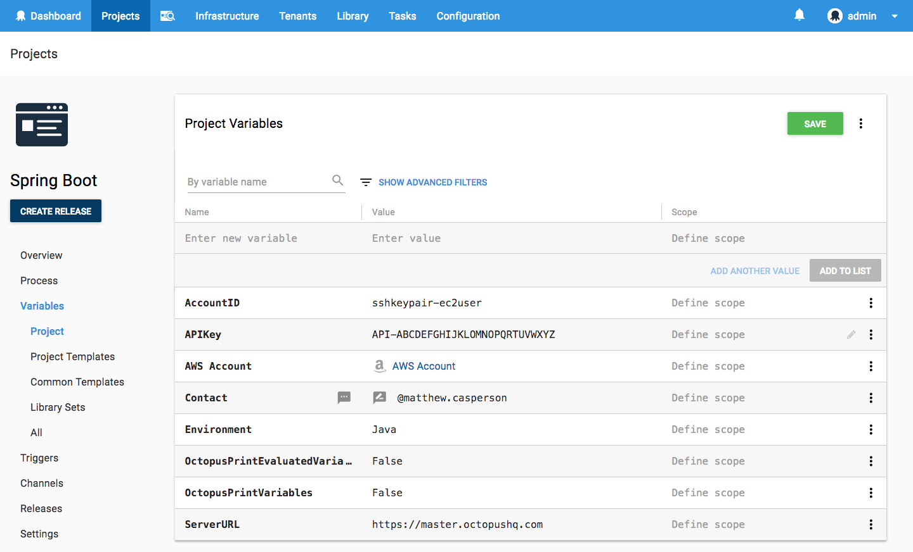

## Starting the Deployment with no Targets

Because we are creating the infrastructure that we will be deploying to as part of the Octopus project, we need to configure some settings to allow Octopus to start the deployment without any pre-existing valid targets. This is done in the project settings under `Deployment Targets`. Setting the value to `Allow deployments to be created when there are no deployment targets` means the project can start deploying even when there are no targets available yet.

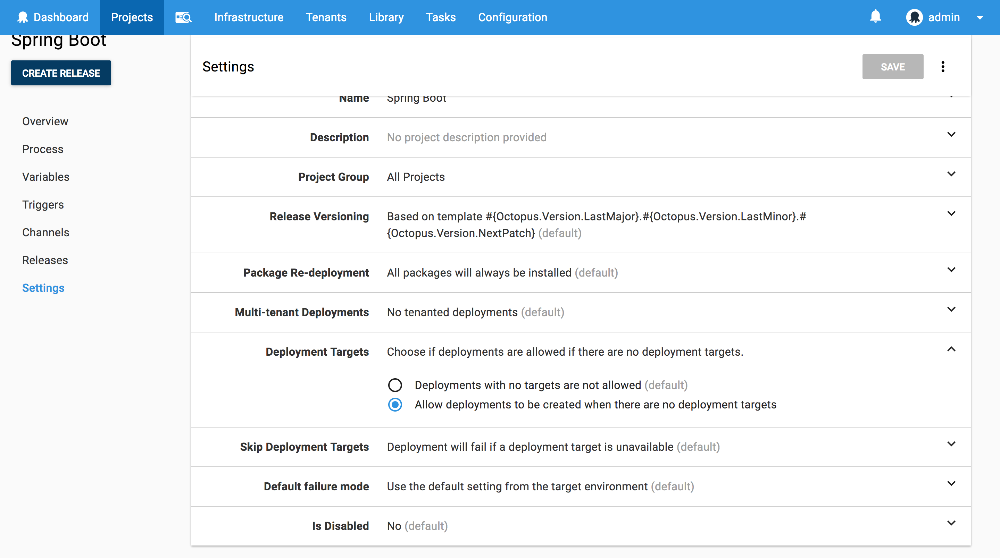

## The CloudFormation Step

Now it is time to start defining the project steps. We'll start by deploying the CloudFormation template, which is done with the `Deploy an AWS CloudFormation template` step.

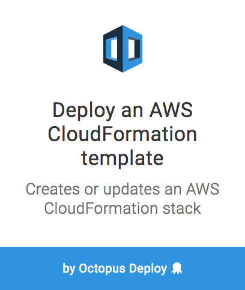

Here is a screenshot of the populated step.

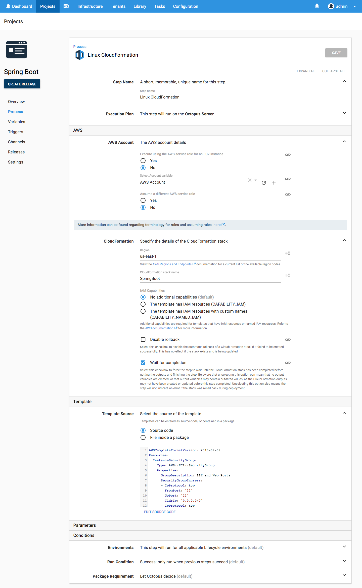

## The Health Check Step

Once the CloudFormation template has been deployed, the EC2 instance it created will have booted up and registered itself with Octopus as a deployment target. We now need to add this new target to the list of targets that the project will deploy to. This is done using the `Health Check` step.

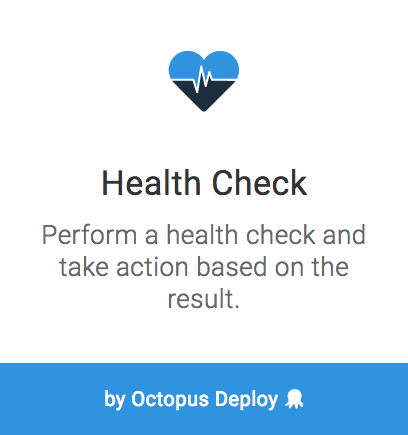

Here is a screenshot of the populated step.

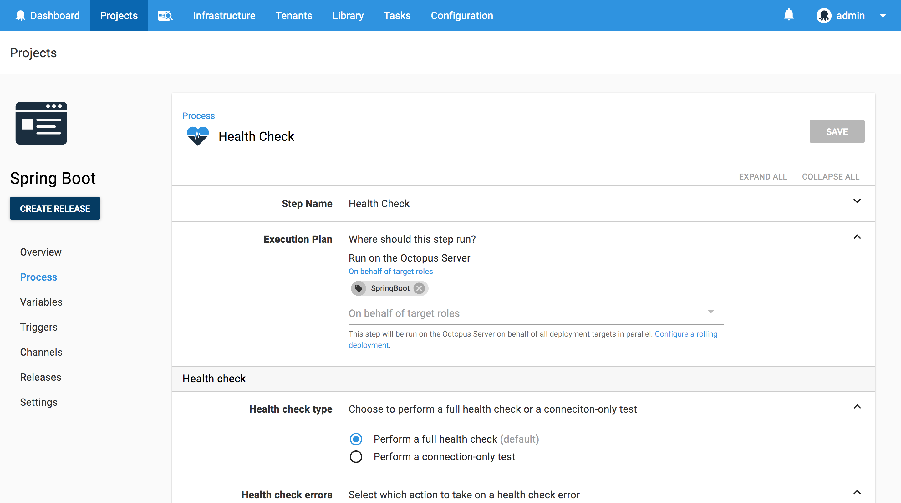

## The Transfer Package Step

Now that our newly created or updated EC2 instance is part of our list of deployment targets, we can transfer our Spring Boot JAR file to it. This is done using the `Transfer a package` step.

:::hint
We use the `Transfer a package` step instead of the `Deploy Java Archive` step because the latter will extract and repack the JAR file. This extraction and repacking is done to allow files in the JAR to have their contents modified (if variable replacement is enabled). However,  Spring Boot fully executable JAR files are not able to be extracted by the `jar` tool. The Spring Boot documentation has this warning:

>Currently, some tools do not accept this format so you may not always be able to use this technique. For example, jar -xf may silently fail to extract a jar or war that has been made fully-executable.

The `Transfer a package` step on the other hand only copies the file, and does not attempt to modify it, which is perfect for our use case.
:::

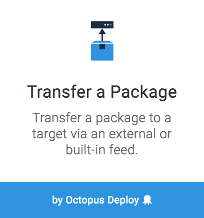

Here is a screenshot of the populated step.

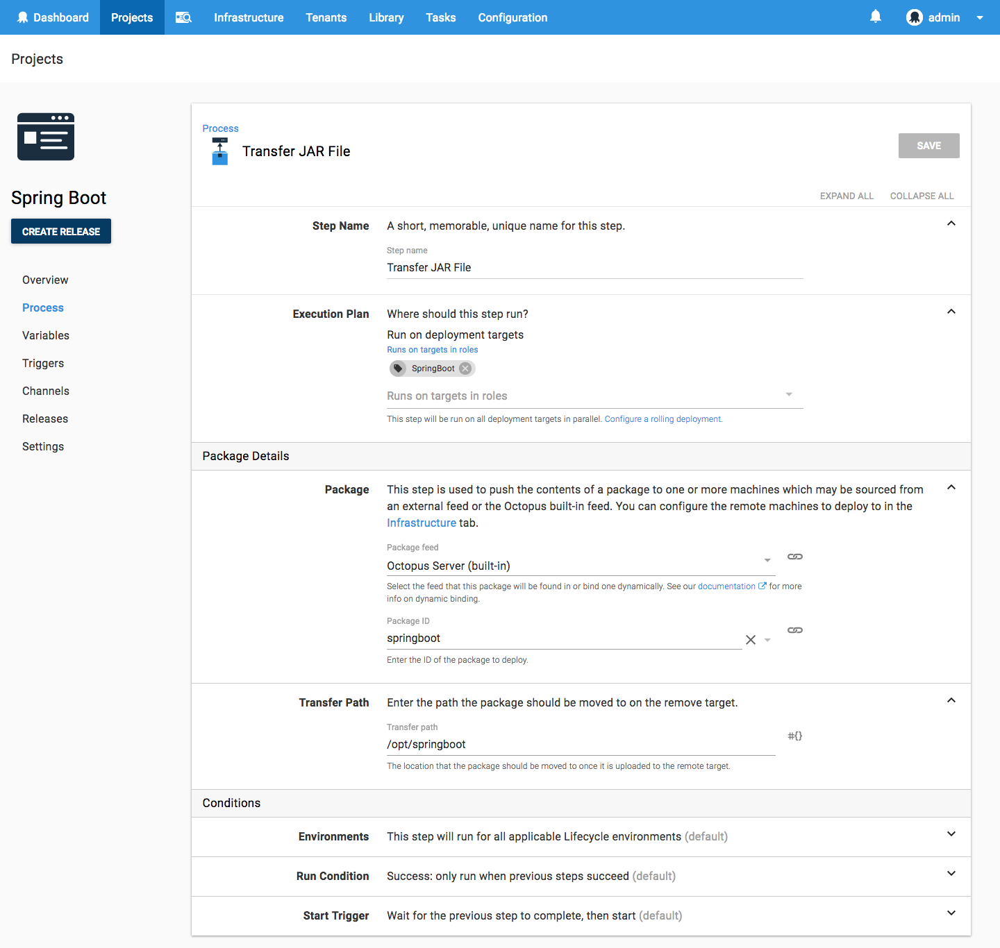

## Installing the Service

With the JAR file on the system we can now install it as a Linux service. This is done by making the JAR file executable, linking the JAR file under `/etc/init.d`, and configuring the service to run on start with `chkconfig`.

We'll run this script with the `Run a Script` step.

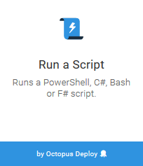

Here is the complete script.

```bash
filePath=$(get_octopusvariable "Octopus.Action[Transfer JAR File].Output.Package.FilePath")
echo Linking $filePath to /etc/init.d/springboot
sudo chmod +x $filePath
sudo rm /etc/init.d/springboot
sudo ln -s $filePath /etc/init.d/springboot
sudo chkconfig springboot on
sudo service springboot restart
```

Here is a screenshot of the populated step.

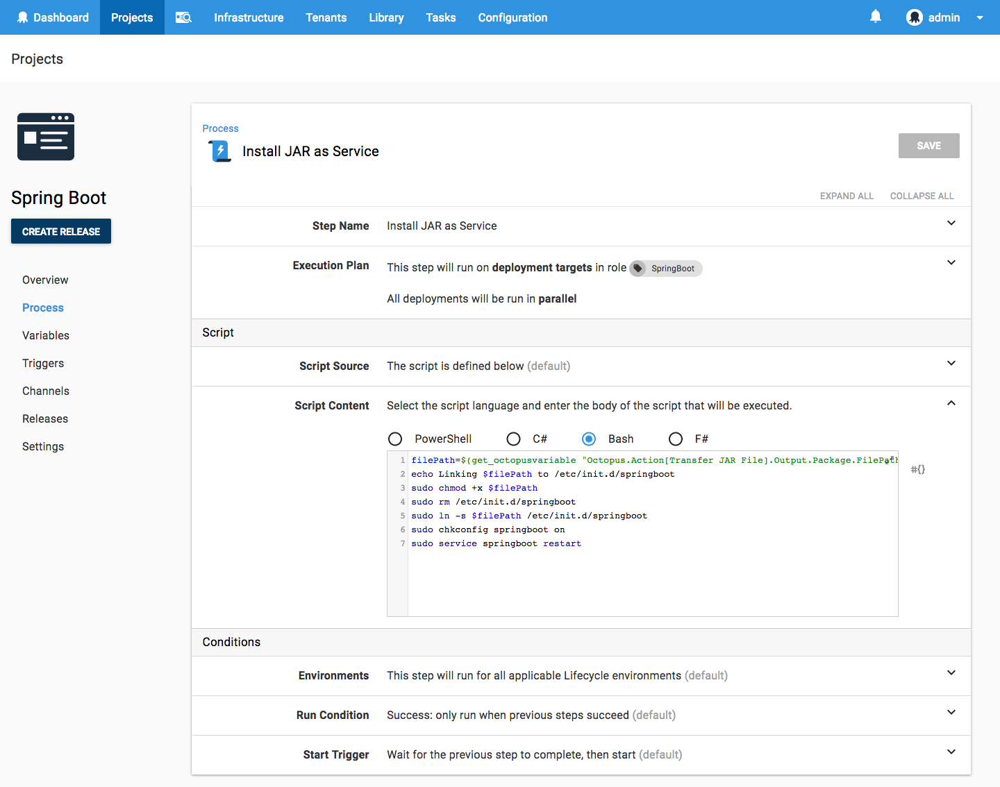

## Displaying Summary Information

For the convenience of those running this deployment we will display some useful summary information. This is done with a second `Run a Script` step.

When the CloudFormation template is deployed, any output variables are captured by Octopus and made available to subsequent steps. We take advantage of this to build a URL based on the public IP address of the EC2 instance.

```powershell
Write-Host "Open application at http://$($OctopusParameters["Octopus.Action[Linux CloudFormation].Output.AwsOutputs[PublicIp]"]):8080"
```

Here is a screenshot of the populated step.

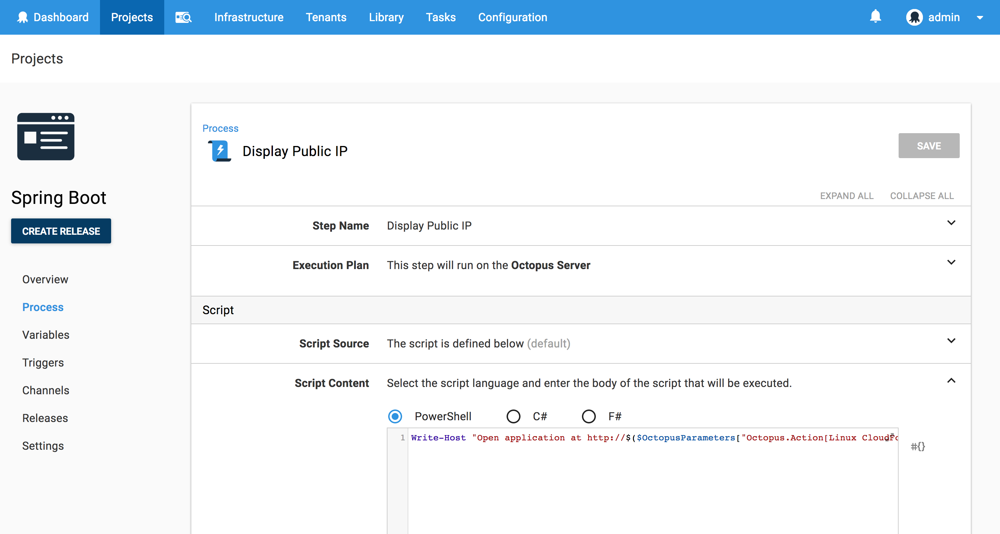

## Deploying the Project

Here is a screenshot of the result of a deployment of this project.


Notice these lines in the output of the CloudFormation template deployment:

```
Saving variable "Octopus.Action[Linux CloudFormation].Output.AwsOutputs[StackId]"
Saving variable "Octopus.Action[Linux CloudFormation].Output.AwsOutputs[PublicIp]"
```

These log messages provide an easy way to get the complete variable names for any output variables created as a result of the CloudFormation deployment.

Also note the output of the health check step. In this deployment I tweaked the CloudFormation template slightly by adding a comment to the UserData script. Although this change does not affect how the EC2 instance is deployed, CloudFormation sees it as a change to the existing stack and therefore shuts down and restarts the EC2 instance. This in turn gives the EC2 instance a new public IP, which means the EC2 instance will reregister itself with Octopus when it boots up. The health check step then checks both the old deployment target and the new one, determines that the old one is no longer valid and removes it, and successfully completes a health check on the new target and includes it in the list of targets used for the rest of the deployment.

## Open the Web Application

The output from the final script step generated a URL of `http://184.73.104.221:8080`. Opening it up shows the Spring Boot application.

:::hint
This URL won't actually work for you because this demo EC2 instance has been shutdown. The URL generated for you will have a different IP address.
:::

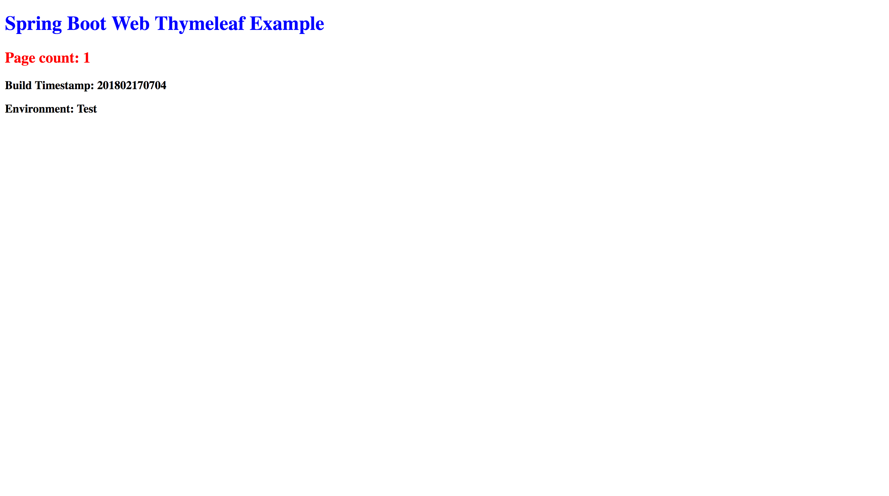

## Verifying the Service

We can verify that the Spring Boot application is running as a Linux service by connecting to the EC2 instance and running the `service` command.

```
$ sudo service springboot status
Running [2716]
```

The service can be started, stopped and restarted like any other service.

```
$ sudo service springboot restart
Stopped [2716]
Started [4123]
$ sudo service springboot stop
Stopped [4123]
$ sudo service springboot start
Started [4235]
```

## Conclusion

Fully executable JAR files allow Spring Boot applications to be deployed as regular Linux services, making them easy to deploy and manage. If you are interested in automating the deployment of your Java applications or creating cloud infrastructure, [download a trial copy of Octopus Deploy](https://octopus.com/downloads), and take a look at [our documentation](https://octopus.com/docs/deploying-applications).
