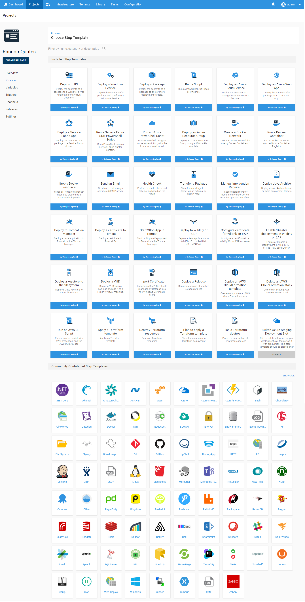

The fantastic team at AppVeyor have recently added built-in support for pushing and deploying your projects through Octopus Deploy. What is Octopus Deploy I hear you ask? Octopus Deploy is an automated release management tool to simplify the process of creating repeatable and manageable continuous integration and deployment pipelines. Deploying your application through its life cycle requires the assurance that the staging and production releases are identical where it counts, but with configuration that can be injected to change from phase to phase.

Let's take a look at how this new partnership between AppVeyor and Octopus Deploy can help set your deployments up for not just success, but predictably reliable success!

The public [OctopusSamples/RandomQuotes-aspmvc4](https://github.com/OctopusSamples/RandomQuotes-aspmvc4) repository provides a basic MVC app to display a bunch of wise quotes. Our goal is to set up a CI pipeline to deploy this website to our IIS server for both a staging and then production environment.

## AppVeyor Octopus Plugin
Starting with the build of our project, I've added the `OctopusSamples/RandomQuotes-aspmvc4` GitHub repository as the source of a new AppVeyor project.

### Build & Pack
Looking at the build phase, you should notice the new `Package Applications for Octopus Deployment`:


This flag ensures that once the build has completed, the contents are zipped up into a package that can be pushed to Octopus Deploy. Although Octopus will accept any NuGet, zip, or tar package this flag will use the `octo.exe` tool to [create a zip](https://octopus.com/docs/packaging-applications/creating-packages/creating-zip-packages), named using the application name and version.

 Advanced features in Octopus-like [Channels](https://octopus.com/docs/deployment-process/channels) allow you to configure custom rules to prevent pre-release versioned packages from getting pushed to production, or ensure that version requirements are met for any linked packages as part of that deployment.

### Push
In the `Deployment` configuration of the AppVeyor project, select the new `Octopus Deploy` deployment provider. This feature performs all the appropriate calls to pass the package into Octopus and create a related Octopus Release.

In Octopus, a [Release](https://octopus.com/docs/deployment-process/releases) ensures that each versioned build artifact will progress through its various environment phases with the same snapshotted deployment process, even if that project process is modified while the release is progressing. Reliable, repeatable deployments are our mantra.


After adding your Octopus Server URL and API Key, tick the `Push Packages` option to allow AppVeyor to auto-detect the Octopus package built in the previous step. AppVeyor will then push the package to the Octopus [built-in NuGet feed](https://octopus.com/docs/packaging-applications/package-repositories/pushing-packages-to-the-built-in-repository). Although Octopus supports [automatic release creation](https://octopus.com/docs/deployment-process/releases/automatic-release-creation) when a new package is available, in this scenario we will trigger it through AppVeyor. Click the `Create Release` checkbox and provide the name of the project, `RandomQuotes` which we will later set-up in Octopus and which AppVeyor will programmatically trigger. Octopus was built [API first](https://octopus.com/docs/api-and-integration/api) and as such _every_ feature and behavior can be configured and triggered via HTTP endpoints to integrate into _any_ existing CI/CD pipeline!).

With our AppVeyor build pipeline set up, let's now jump into our Octopus Server and get this website deployed.

## Continuing Deployment Through Octopus
With a dead simple Octopus Server [installation](https://octopus.com/docs/installation) (which, can naturally itself be [automated](https://octopus.com/docs/installation/automating-installation)) we are ready to add our new `RandomQuotes` project through the Octopus Web Portal. [Hosted Octopus](https://octopus.com/cloud) is an exciting new option which will be available soon that allows you to use Octopus Deploy without any on-premise infrastructure. We will manage your servers for you!

### Octopus Projects
After configuring our [infrastructure](https://octopus.com/docs/infrastructure), go to the `Projects` section, click `Add Project`, and give it the name `RandomQuotes` that we specified earlier in our AppVeyor deploy step. This project contains all the deployment steps and configuration variables that define how this application is deployed.

For our simple deployment scenario, we will first go to the `Process` section and add a new IIS step. Octopus will handle all the complicated interactions to configure our IIS website with just a few inputs from us. There is a wide range of pre-built steps available for use in almost any deployment, so you don't need to write (or support) a single line of code. On top of this, we have an active [community library](https://octopus.com/docs/deployment-process/steps/community-step-templates) with 100's more, and you can build and share your [own steps](https://octopus.com/docs/deployment-process/steps/community-step-templates) between teams.



 You can also include [custom scripts](https://octopus.com/docs/deploying-applications/custom-scripts) in a variety of languages if you have a process in mind that doesn't quite fit any of the provided steps.

### Deployment Step Details
After selecting the `Deploy to IIS` step, we will add a few settings to provide Octopus information to enable creating and configuring the IIS website.


Setting the Role under `Execution Plan` defines which machine(s) the website will be deployed to. A discussion on how Octopus can handle multiple environments each with different machine roles is a discussion in itself which we skip over in this demo. Check out our [docs](https://octopus.com/docs/infrastructure/environments) for more details.

Next, we will configure which package will be used for this step. Using the built-in feed (which AppVeyor will be pushing to) we can provide the PackageId `RandomQuotes`.

Configuring the website itself, which, at its simplest consists of setting just two additional values. The `Website name` and the `AppPool`. For this example, we will host both `Staging` and `Production` on the same machine (not the best idea for a real project), so we will provide a different website name based on the environment being deployed. The `#{Octopus.Environment.Name}` section of the name will be replaced at deploy time with the name of the environment.

### Variables
This introduces us to one of the other awesome features of Octopus Deploy, [variables](https://octopus.com/docs/deployment-process/variables). Using a templating syntax, you can provide configuration values, scripts, or even packages that all make use of variables that can be provided from Octopus itself or even user defined! In addition to the `Website Name` we have also decided to provide a different binding port between  `Staging` and `Production`. This value `#{CustomPort}` is set in the `Variables` section of the project and can be scoped to a different value based on various combinations of deployment contexts like environment, machine or [tenant](https://octopus.com/docs/deployment-patterns/multi-tenant-deployments), to name just a few.


A common pattern is to define variables in Octopus for the different environments which are replaced in configuration files used by the application at run time. Using them during the deployment process opens up a wide range of advanced scenarios.

For our `RandomQuotes` project, we have a config transformation file for each of our environments. The `Web.Production.config` transformation that looks like:
```xml
<?xml version="1.0"?>
<configuration xmlns:xdt="http://schemas.microsoft.com/XML-Document-Transform">
  <appSettings>
    <add key="ReleaseVersion" value="#{Octopus.Release.Number}" xdt:Transform="SetAttributes" xdt:Locator="Match(key)"/>
    <add key="EnvironmentName" value="#{Octopus.Environment.Name}" xdt:Transform="SetAttributes" xdt:Locator="Match(key)"/>
    <add key="BackgroundColor" value="#1e8822" xdt:Transform="SetAttributes" xdt:Locator="Match(key)"/>
  </appSettings>
  <system.web>
    <compilation xdt:Transform="RemoveAttributes(debug)" />
  </system.web>
</configuration>
```

Notice the value for `ReleaseVersion` includes a template pattern During a deployment. (jump to the end of this post if you can't stand the suspense and what to see what this looks like).

## Commit and Enjoy

We now have our automated CI/CD pipeline configured. When we commit a change to our project, AppVeyor will automatically pick up the changes, build the project, and push it to our Octopus Server. From this point on, Octopus Deploy takes over and deploys it to our staging environment. Once we are happy with this release, we can deploy to production with the click of a button. The same built package that has been tested will then be pushed to our production environment using new values provided by our variables.


When the deployment occurs, Octopus will apply any web.config transformations in your project and perform variable replacements so that the same built artifact is run in each environment, ensuring that the code that you test is the code that you run in production.

**Staging**


With the staging version of our application available we can inspect and test it before kicking off a deployment to production...


**Production**


Notice how the transformation has been applied changing the colour of the navbar, while the port and other variables have been updated based on the environment being deployed to.

## AppVeyor + Octopus = Deploy Any Time
AppVeyor and Octopus Deploy combined provides a new and exciting way to improve your deployment automation. Code changes made directly to your applications can be safely deployed in a repeatable fashion using software that can both step in and take care of the tedious configuration you previously had to hand-craft, while at the same time providing the flexibility to meet your application's specific needs. Flex the powers of AppVeyor's new feature today with a free Octopus [trial](https://octopus.com/licenses/trial).

Happy Deployments!
