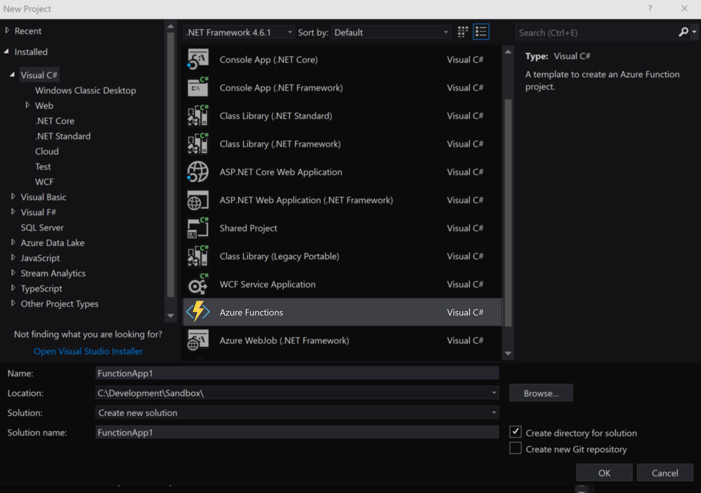
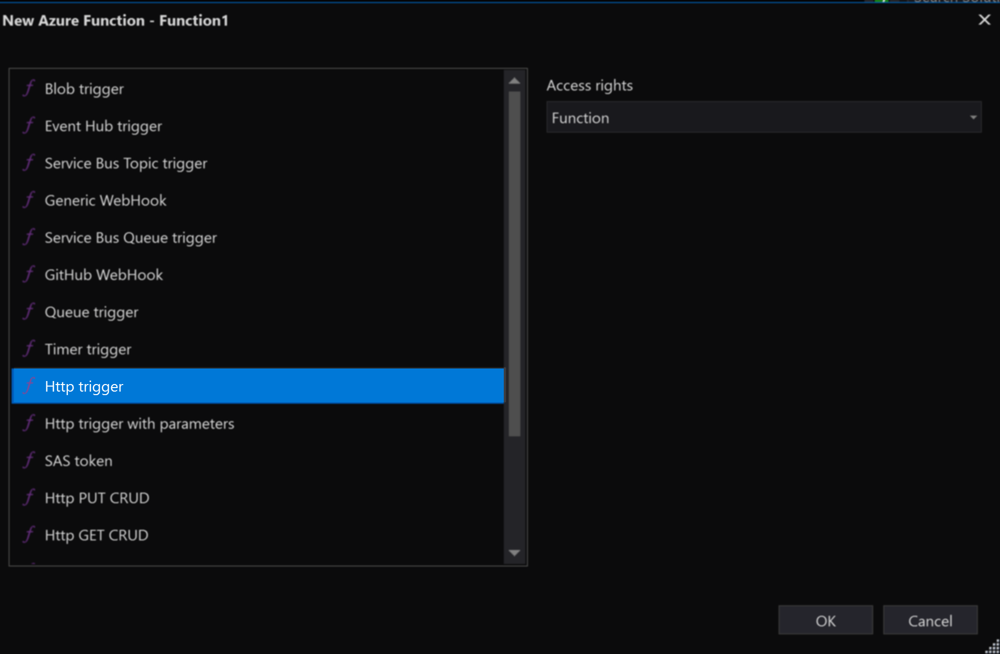
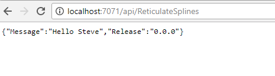
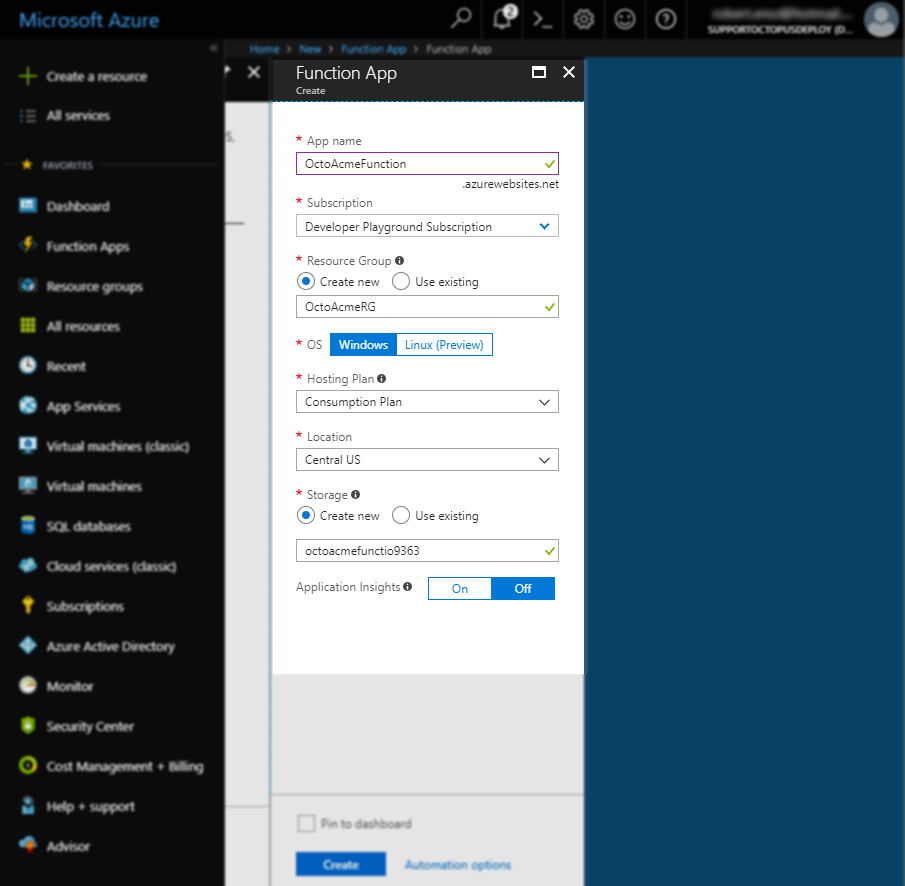

According to many cloud providers, the **serverless computing** application model is the way of the future (citation needed). AWS Lambdas and Azure Functions both allow you to write code that costs you for the actual usage that they incur. Although there are still servers involved, it does mean that you are able to write applications that provide a direct relationship between usage and cost. While this means that now you will be forced to literally pay for writing sloppy code, it also allows 

At Octopus Deploy we expect to provide first class support for AWS Lambdas in the coming months so stay tuned for their arrival. As it turns out Azure Functions are basically just [Azure Web Apps](https://azure.microsoft.com/en-us/services/app-service/web) under the hood with a few extra handlers on top so our existing "Deploy an Azure Web App" steps still fits the bill.


To prove the point and show that I'm not trying to avoid doing work to add a new Azure Lambda step, lets take a look at building and deploying a basic Azure Function through Octopus Deploy.

## Creating and packaging a smple Azure Function Project
For our simple Azure Function we will create a HTTP triggered endpoint that returns a json payload containing some values we want Octopus to provide during deployment.

### Visual Studio Project

If creating the functions via Visual Studio, make sure you have [Visual Studio 2017 v15.4](https://www.visualstudio.com/vs/) or later which includes the Azure SDKs.



Create a new project and select the `Azure Functions` project type. Right click on the project and `Add New Item` and add an `Azure Function`.




Replace the generated class with the following.

```C#
    public static class ReticulateSplines
    {
        [FunctionName("ReticulateSplines")]
        public static async Task<HttpResponseMessage> Run([HttpTrigger(AuthorizationLevel.Function, "get", Route = null)]
            HttpRequestMessage req, TraceWriter log)
        {
            log.Info("Incoming Request request.");
            var myName = Environment.GetEnvironmentVariable("MyName", EnvironmentVariableTarget.Process);
            var release = Environment.GetEnvironmentVariable("Release", EnvironmentVariableTarget.Process);
            var reponse = new {Message = $"Hello {myName}", Release = release};
            return req.CreateResponse(HttpStatusCode.OK, reponse);
        }
    }
```

open the `local.settings.json` file in the solution explorer and add the following properties.
```json
{
  "IsEncrypted": false,
  "Values": {
    "MyName": "Steve",
    "Release":  "0.0.0" 
  }
}
```

These value as used during development. If you run the solution, the Azure Functions development environment should start up and provide a local endpoint that you can test your code with.




### Packaging for Octopus

Unforunately due to the output of Azure Function projects, the standard [`OctoPack`](https://octopus.com/docs/packaging-applications/creating-packages/nuget-packages/using-octopack) generated nuget package will not work.


The result of a build for an Azure Function is a directory containing the `bin` folder with the compiled assemblies, a couple of configuration files used by Azure (the `local.settings.json` is only relevant when running the Azure Development Tools locally) and a folder for each function. Unfortunately it's these function configuration files that OctoPack fails to include when packaging.

Luckily, since Octopus will happily deploy anything that has been packaged up into a zip, we can leverage another command-line tool [`octo.exe`](https://octopus.com/docs/packaging-applications/creating-packages/nuget-packages/using-octo.exe).
Using your standard build tool (or even locally for testing purposes), ensure that the current working directory is the build output of the project and call

```shell
octo pack --id=AcmeFunctions --format=zip --outDir=./dist --version=3.14.159-pi
octo push --server=http://myoctopusserver.acme.com --apiKey=API-ABC123IS4XQUUOG9TWDXXX --package=dist/AcmeFunctions.3.14.159-pi.zip
```

...obviously substituting the relevant values for your Octopus Server, API key and version information. Alternatively you can easily package and push the contents of the project as a zip using one of our plugins for [TeamCity](https://octopus.com/docs/api-and-integration/teamcity), [VSTS](https://octopus.com/docs/api-and-integration/tfs-vsts), [Bamboo](https://octopus.com/docs/api-and-integration/bamboo) and soon-to-be-available AppVeyor.

## Creating the Azure Function
Although I could use the `Deploy an Azure Resource Group` step in a separate deployment project to spin up an Azure function, to keep this demo simple I'll just be creating the function through the Azure portal directly.

From the portal click the `Create a resource` button and search for `Function App`. Fill out the details and take note of the `App name` and `Resource Group` values as we will need to add them into our Octopus project shortly. When the Function App has been created, open it up and go to the `Function App Settings` page and enable slots. This feature is currently marked as "preview" but it will allow us to create a Blue\Green deployment pattern, whereby we first deploy to one slot and confirm that it's configured and running correctly before swapping it around with the "Production" slot. (The term "Production" in this case is different to the Production environment from an Octopus Environments point of view. It simply refers to the fact that the given Azure Function has multiple endpoints which can be configured independently). With the feature enabled create a new slot called `Blue`.



## Creating an Octopus Project
We will now create the project in Octopus deploy that will deploy our package to Azure with a Blue\Green deployment strategy and at the same time provide the appropriately scoped variables for use inside our function.

> The appropriate model for deploying Azure Functions across multiple environments in Octopus Deploy is to have a **separate Azure Function for each environment**. This allows us to safely configure the Functions at each stage without risking changes leaking across environments. It is recommended that you _do not_ try and use multiple slots on a single function to model environments. Azure functions are cheap and cost you noting except for when being used so **there is no reason to try and "squeeze" them together as is often done with other cloud resources.**

### Add Variables
Since we will need to script out a couple of post-deployment steps to deal with slot-swapping, putting them all into the variables section of the project allows us to consolidate them all in one place, and vary them across environments. In the case of a standard deployment lifecycles we would typically use different Azure ResourceGroups and/or Azure Function Apps across the different Octopus environments.

    - MyName = "Max Powers"
    - AzureStagingSlotName = "Blue"
    - AzureFunctionName = "OctoAcmeFunction"
    - AzureResourceGroupName = "OctoAcmeRG"


### Step 1 - Deploy Function
As noted above, Azure Lambdas effectively use the same architecture under the hood as standard Azure Web Apps and so we can create a project in Octopus that uses the `Deploy an Azure Web App` step to push the package.

Using the project variables, set the resource name and Web app. Since we plan on deploying first the the Staging slot, the Web App name for this step takes the format of `<WebAppName>(<SlotName>)`


### Step 2 - Update AppSettings
Although we could perform variable replacement to configuration files during the package upload process, the recommended way to deal with configuration values for Azure Functions is through AppSettings. These expose themselves as environment variables to the running function process.

The AppSettings also contain other environment variables used by Azure Functions itself so we can't just wipe away any values contained within it. The safest methods is to first load the existing variables, update the few key properties we want to change, and then update the whole collection (The Azure PowerShell cmdlets dont provide a granular approach to modify individual values).

Create a `Run an Azure PowerShell Script` step and provide the following script:

```powershell
function UpdateAppSettings {
 param( [string]$ResourceGroup, [string]$FunctionAppName, [string]$Slot, [hashtable]$AppSettings )
 
    Write-Host "Loading Existing AppSettings"
    $webApp = Get-AzureRmWebAppSlot -ResourceGroupName  $ResourceGroup -Name $FunctionAppName -Slot $Slot

    Write-Host "Applying New AppSettings"
    $hash = @{}
    ForEach ($kvp in $webApp.SiteConfig.AppSettings) {
        $hash[$kvp.Name] = $kvp.Value
    }

	ForEach ($key in $AppSettings.Keys) {
        $hash[$key] = $AppSettings[$key]
    }

    Write-Host "Saving AppSettings"
    Set-AzureRMWebAppSlot -ResourceGroupName $ResourceGroup -Name $FunctionAppName -AppSettings $hash -Slot $Slot | Out-Null
    Write-Host "AppSettings Updated"
}

UpdateAppSettings -AppSettings @{"MyName" = $OctopusParameters["MyName"]; Release = $OctopusParameters["Octopus.Release.Number"]} `
	-ResourceGroup $OctopusParameters["AzureResourceGroupName"] `
    -FunctionAppName $OctopusParameters["AzureFunctionName"] `
    -Slot $OctopusParameters["AzureStagingSlotName"]
```

Once this and the preceeding step has run, the `Blue` slot will be updated with the latest package and its variables. The previously deployed version of this Function (assuming this is not the first time the process ran) will still be available from the `Production` slot. All traffic to `https://octoacmefunction.azurewebsites.net/api/ReticulateSplines` will still go to the previous version, but the endpoint at `https://octoacmefunction-blue.azurewebsites.net/api/ReticulateSplines` will now use the new deployment which we can test and make sure it all works as expected. The next step will then swap these slots around so that requests without the slot name go to what we currently have deployed in the `Blue` slot.

### Step 3 - SwapSlot
Add a final `Run an Azure PowerShell Script` and provide the following script:

```powershell
Write-Host Swapping Slot $OctopusParameters["AzureStagingSlotName"] into Production
#Swap the staging slot into production
Switch-AzureRmWebAppSlot -ResourceGroupName $OctopusParameters["AzureResourceGroupName"] `
	-Name $OctopusParameters["AzureFunctionName"]  `
    -SourceSlotName $OctopusParameters["AzureStagingSlotName"] `
    -DestinationSlotName "Production"
```

## Deploy
With each deployment the `Blue` slot will act as the update target, and then its configuration will be swapped with `Production`. If the new deployment starts encountering problems, the option is available to swap the slots _back_ around so that traffic is again delivered to the previous version (though we always encourage the roll forward approach where possible).