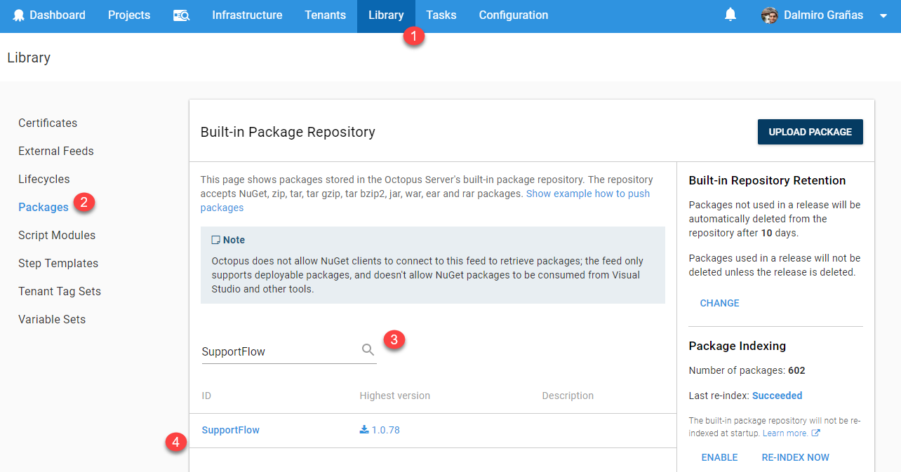
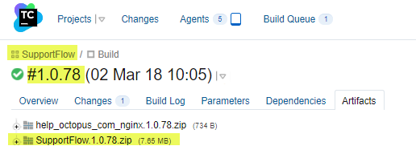

!include <octopus-cli>

In my three years providing support to our customers at Octopus, *"Integrating Octopus with build servers"* is probably the subject I answered the most questions about. In this blog post, I'm going to give you a few tips on how to approach this task if you are starting from scratch, regardless of the build server technology you are using.

This blog post is aimed at users who are just starting their journey integrating Octopus into their continuous integration (CI) pipeline. If you already have this up and running, there might not be too much value for you here :)

## In This Post
 !toc

## Separation of Concerns

In a way, Octopus and every build server technology out there can seem pretty similar at first glance. A few things they have in common are:

- Both tools belong in CI pipelines and are aimed at helping development teams get their code out there faster and more reliably.
- Both are basically process runners. You define a process filled with steps, you execute it, and magic happens.

But that's pretty much where the similarities stop. If you want to integrate any two tools, you need to have a clear understanding of which task each tool takes care of.

The below are two (very simplified) lists of what each tool's role should be in an ideal CI pipeline.

### What Should the Build Server Do?

- **Compile your binaries**. This means running `MSBuild`,`NPM`,`javac`,`dotnet.exe`, etc., and dropping your compiled app to a folder on the build agent.
- **Run tests**.
- **Package and push your app to a repository**. Once the tests passed, create a package with the output of your build and push it to your repository.
- **Call the next tool in the CI pipeline**. In our case, we'll be calling Octopus to tell it to create and deploy a release.

### What Should Octopus Do?

- **Provision/Update infrastructure (optional)**. If you need to create an `Azure WebApp`, an `Elastic Beanstalk` instance, scale up a VM set, create an IIS/Tomcat website or anything that's related to setting up *the place* where you'll be putting your compiled code, adding this task as one of the first steps in your Octopus deployment process is a very good idea. Octopus currently supports [Terraform](https://octopus.com/docs/deployments/terraform), [AWS CloudFormation](https://octopus.com/docs/deployments/aws/cloudformation) and [Azure RM Templates](https://octopus.com/docs/runbooks/runbook-examples/azure/resource-groups).
- **Set configuration values in your application before deployment**. Ideally, the content of your package should be deployable to *any* environment in your lifecycle, and the only thing that should be different are environment-specific configuration values such as connection strings, passwords/API Keys, etc. Octopus has [a wide set of features](https://octopus.com/docs/projects/steps/configuration-features) to modify configuration values at deployment time.
- **Deploy your Application**.

## So How Should I Start Integrating Octopus Into my CI Pipeline?

One of the most common mistakes I've seen people make when starting this task, is to configure too many things at the same time without fully understanding what each tool brings to the table. In this blog post, I'm not gonna share any details about how to set things up (we have great documentation for that). Instead, I want this post to work as a guideline/checklist that'll help you get this task done in an ordered fashion.

We're gonna split this task into three well delimited stages:  **The Build**, **The Deployment** & **The Integration**. Each stage will have its own **Goal** that we are going to focus on.

:::hint
**Working with a teammate?**
Stages **1** and **2** can be worked on in any order because they won't be touching each other until we reach stage **3**. This means, if you are working with a teammate on this integration, he could focus on stage **1** while you focus on stage **2** (you could even bet a beer to see who finishes first).
:::

### Stage 1 - The Build

:::success
**Goal:** By the end of this stage, you should be able to run a successful build of your application, and as a result you should have a package of [any of the supported formats](https://octopus.com/docs/packaging-applications/supported-packages) that contains your build output pushed to a package repository.
:::

#### 1.1 - Get Your Project Building Successfully

I've seen many developers scared by this step, mostly because it forces them to deal with that black box they've been using for a while called "Build Configuration". It's very common in development teams that only 1-2 devs actually know how their build works, and the rest simply click on "Run" and hope for the best.  If you are in the latter group, this might be a good moment to change that situation and pair up with a teammate to learn how your build process works.

To consider this step done, you should have a successful build following these two guidelines:

- The build output must be sent to a fixed folder. Every build tool out there has a parameter that allows you to send the output to a directory of your choice. My recommendation is that you send it to a folder called `Build` or `Output` that sits at the root of your build's `WorkDir`.
- The content in that folder should be structured exactly how you expect it to be deployed to its destination. For example, if your Website/PAAS expects a `web.config` and an `index.html` file at the root, then those two files should also be at the root of this folder.

#### 1.2 - Get Your Build Output Packaged Up and Pushed to a Repository

In this step, you'll package the contents of the `output folder` mentioned in the previous step into a package of [any of the supported formats](https://octopus.com/docs/packaging-applications/supported-packages). Then you'll push that package to a repository where Octopus will pick it up.

Depending on whether you are using [one of our plugins](#a-few-words-about-build-server-plugins-and-octo.exe) or not, and if you are using [the Octopus built-in repository](https://octopus.com/docs/packaging-applications/package-repositories#Packagerepositories-Usingthebuilt-inrepository) to store your packages or not, you'll need to use one of the below approaches:

| Using Plugin | Using built-in repository |             Approach to pack             | Approach to Push                         |
| :----------: | :-----------------------: | :--------------------------------------: | ---------------------------------------- |
|     Yes      |            Yes            | Use the step with the word "Pack" on its name provided by the plugin | Use the step with the words "Push package" on its name provided by the plugin |
|     Yes      |            No             | Use the step with the word "Pack" on its name provided by the plugin | Use [Nuget.exe push](https://docs.microsoft.com/en-us/nuget/tools/cli-ref-push) |
|      No      |            Yes            | Use [Nuget.exe pack](https://docs.microsoft.com/en-us/nuget/tools/cli-ref-pack) | Use [Nuget.exe push](https://docs.microsoft.com/en-us/nuget/tools/cli-ref-push) or [Octo.exe push](https://octopus.com/docs/octopus-rest-api/examples/feeds/push-package-to-builtin-feed) |

:::hint
If you are using TeamCity, the step `Octopus Deploy: Push Package` will *pack* and *push* in one step
:::

Once this is done, check your repository to make sure the package is there. The below screenshot shows how to do that if you are using the built-in repository.

The only key recommendation here is that you version the package with the same version number of the build that's creating it. So if you are building the project `SupportFlow` and you are running the build `1.0.78`, your package should end up being `SupportFlow.1.0.78.zip`

### Stage 2 - The Deployment

:::success
**Goal:** By the end of this stage you should be able to create a release in Octopus and trigger a successful deployment of your application from the command line using [Octo.exe](https://octopus.com/docs/octopus-rest-api/octopus-cli).
:::

#### 2.1 - Upload a Test Package to Your Repository

If you already finished step `1.2`, that means you already have a package in your repository, so you can skip to the next step. If you haven't finished that step yet, simply compile your app locally and package the output using [Octo.exe pack](https://octopus.com/docs/packaging-applications/create-packages/nuget-packages/using-octo.exe). Once you have a package, push it to the [Octopus built-in repository](https://octopus.com/docs/packaging-applications/package-repositories/pushing-packages-to-the-built-in-repository#PushingpackagestotheBuilt-Inrepository-UsingtheOctopuswebportal) and make sure you can see it in the web portal under `Library -> Packages`.

You only need one package for the next step, which you'll use over and over until you get the Deployment Process right. If your deployment process uses more than one package (perhaps deploying a *WebApp* and a *Cloud Service* separately ), repeat this process for each package you need.

#### 2.2 - Design Your deployment Process and Run It

Now here's where you finally start doing things in Octopus. We won't get into too much detail here, because [that's what our documentation is for](https://octopus.com/docs/deploying-applications). But the overall idea of this step is that you setup your Deployment Process in Octopus to deploy the packages mentioned in `2.1`. Once you've done this, you should be able to trigger a successful deployment from the Octopus web portal manually.

If this is your first time setting up your Octopus project, this probably is the step where you'll be spending most of your time. At this point, don't bother too much about the version number of the packages you are using or the release number in Octopus. The sole purpose of this step is that you get comfortable with your Deployment Process and that you fully understand what each step brings to the table.

So sit back and trigger as many deployments as you need :)

#### 2.3 - Create a Release and Trigger a Deployment Using Octo.exe

In the previous step, you learned how to create a release and trigger a deployment from the Web Portal. The goal of this step is that you learn to do the same thing, but using `Octo.exe`.

If you don't know about this CLI tool, here's the TL;DR, it's a command line application that talks to the [Octopus API](https://octopus.com/docs/octopus-rest-api) and helps you do some of the most frequently used actions against your Octopus Instance. You can read about all the functionality it provides in [this document](https://octopus.com/docs/octopus-rest-api/octopus-cli).

The command you should be paying attention to is [create-release](https://octopus.com/docs/octopus-rest-api/octopus-cli/create-release). A few tips about this command:

- If you use the `--deployTo` parameter, it will not only create the release but also deploy it to an environment. It basically combines the commands `create-release` and `deploy-release`.
- Use `--progress` to see the deployment log in the console as it executes. Otherwise, the command will only create a task in Octopus, and you'll be forced to go to the Web Portal to see how the deployment went.
- Use `--whatIf` to see what would happen if you ran that command, without actually triggering anything in Octopus.

:::hint
Every single build server integration out there (at least the ones built by the Octopus team) is simply a UI wrapper around this CLI tool. So the knowledge you gain from this step will come in really handy on the next stage.
:::

### Stage 3 - The Integration

:::success
**Goal**: By the end of this stage, you should be able to add a new step to your build process that triggers a deployment in Octopus.
:::

Now this stage is where we'll put together everything from the two previous stages. For this reason, it's necessary that you finish both of them successfully.

#### 3.1 - Create a Release/Deployment in Octopus From the Build

If you are using one of our build server plugins, look for a step with the words "Create Release" on its name.

If you are not using one of our plugins, don't worry! The knowledge you gained in `2.3` should be more than enough for you to add a PowerShell/Bash script step to your build process that runs the same `Octo.exe` command that you already used. To do this, you'll need `Octo.exe` sitting on your build agent at build time. You can achieve by adding [this NuGet package](https://www.nuget.org/packages/OctopusTools/) or [this Chocolatey package](https://chocolatey.org/packages/octopustools) as dependencies.

Regardless, if you are using the plugin step, or a raw `Octo.exe` call, the main values you need to pass are:

- The `Release Version`. We strongly recommend you to use your build number to set this value, so you always know which build triggered which release in Octopus.

- The `Environment` you are deploying to.

:::hint
**Pro Tip**
Every one of the "Create Release" steps provided by the plugins/extensions will have a checkbox called `Show Deployment Progress` or similar. If you check that box, your build server will keep the connection open with your Octopus deployment, and it will show you the output of it in your build log in real-time. Additionally, if your deployment fails, that step in your build process will also fail. This last bit is extremely handy as you'll know by just looking at your build if the deployment in Octopus failed or not.

If you are using a raw `Octo.exe` call, the equivalent of this feature is the `--progress` parameter.
:::

:::warning
If you run into issues with this step, check our [troubleshooting guide](https://octopus.com/docs/packaging-applications/build-servers/troubleshooting-integrations-with-build-servers) to get some ideas on how to fix it or to learn how to properly ask for help in our forums.
:::

## A Few Words About Build Server Plugins and Octo.exe

If you check our [API](https://octopus.com/docs/octopus-rest-api) and [build server](https://octopus.com/docs/packaging-applications/build-servers) documentation, you'll notice that our team built a few plugins for some of the most popular build servers out there. These plugins extend the functionality of your build server, by adding some custom steps to do things with Octopus, such as triggering deployments and pushing packages. The below list has links to each plugin's documentation, along with the list of steps that each plugin provides.

- **[VSTS/TFS](https://octopus.com/docs/packaging-applications/build-servers/tfs-azure-devops)**
  - Create Octopus Release
  - Deploy Octopus Release
  - Promote Octopus Release
  - Package Application
  - Push Package to Octopus
- **[TeamCity](https://octopus.com/docs/packaging-applications/build-servers/teamcity)**
  - Create Release
  - Deploy Release
  - Promote Release
  - Push Package (also packs)
- **[Bamboo](https://octopus.com/docs/packaging-applications/build-servers/bamboo)**
  - Create Release
  - Deploy Release
  - Pack Package
  - Push Packages
- **AppVeyor** (coming soon)

Behind the scenes, these steps are really just UI wrappers around `Octo.exe`. So if you are not using any of the above build servers, you can simply use `Octo.exe` from a script step in your build process to achieve the same results.

---------------

And that's it! I really hope this guide helps you integrate Octopus into your CI pipeline in a more organized fashion.

Please keep in mind that this guide makes a lot of assumptions, and is mostly targeted to really basic CI pipelines. If you feel like the steps described here won't fit your process, [reach out in our support forum](https://octopus.com/docs/packaging-applications/build-servers/troubleshooting-integrations-with-build-servers#Octopus-Steps-Ask-for-help) and we'll give you a hand with it.

## Learn more

* [Deploying TeamCity to Kubernetes using Octopus Deploy](https://hubs.ly/H0gBSdy0)
* Guide: [How to dynamically set TeamCity version numbers based on the current branch](https://hubs.ly/H0gBQDm0)
* [Octopus vs. Build Servers - Why should I use Octopus when I already have a CI Server?](https://hubs.ly/H0gBSdB0)
* Documentation: [API & integration](https://hubs.ly/H0gBQDp0)
* Video: [How to deploy ASP.NET web app with AppVeyor & Octopus Deploy](https://hubs.ly/H0gBQDs0)