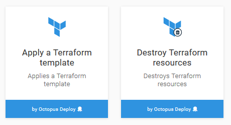
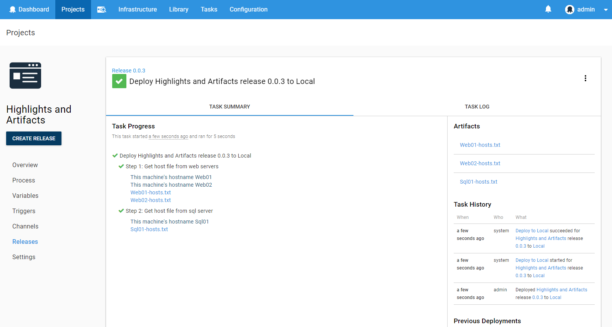

This month, we've greatly improved our support for _infrastructure as code_ unlocking some incredible deployment automation and infrastructure automation scenarios. Octopus `2018.3` introduces support for GitHub repositories as feeds and first-class Terraform support as well as some awesome smaller features like deployment variable preview and highlight messages/artifacts.  Read on for all the exciting details!

## In this post

!toc

## Release Tour

<iframe width="560" height="315" src="https://www.youtube.com/embed/D2ZclLWko18" frameborder="0" allowfullscreen></iframe>

Big thanks to [Jeremy Cade](https://github.com/JeremyCade) for sharing his Terraform scripts to help us with the release tour video.

## GitHub Repository Feed Type

Adding GitHub repositories as a feed type means that you can now deploy your external resources that don't require a dedicated pre-build step. Run scripts, templates or simple applications pulled directly from your source control by using tags to denote versions. Read more in our [Git Hub Feed documentation](https://octopus.com/docs/packaging-applications/package-repositories/github-feeds) for more information on using this new feed type.

## Terraform Support

This release includes two new steps: Apply a Terraform template, and Destroy Terraform resources. These steps allow Terraform templates to be executed as part of an Octopus deployment project, with integrated support for variable substitution and output variable capturing. Refer to the [documentation](https://octopus.com/docs/deployments/terraform) for more information on these new steps.

## Deployment Variable Preview

Projects now include support to preview the variables values that are supplied during deployment for specific deployment contexts including environment, deployment targets, steps etc.

This is part of a highly requested feature from the Octopus community and we're very happy to ship it.

## Highlight Messages and Artifacts

You can now write log messages that appear on the Task Summary tab of the Task page. These messages will also now appear blue and bolded within the task log and not be hidden under the `<n> additional lines not shown` fold. We have added helpers to log at this level (`highlight`). Refer to the [documentation](https://octopus.com/docs/deployments/custom-scripts/logging-messages-in-scripts) for the syntax to use in your script.

Another log level, `wait`, has been added to indicate that the deployment is waiting for something (for example a execution mutex). These messages also appear as a different color in the log. It is primarily used by Octopus internally, but you can also log at this level. In the future we plan on adding a timeline view, which will use log messages at this level to show when a deployment is paused.

Attachments will also now appear under the step they were collected in, but unlike the messages, they only appear once the step has completed due artifact collection only occurring at the end of the step.

## Upgrading

As usual [steps for upgrading Octopus Deploy](https://octopus.com/docs/administration/upgrading) apply. Please see the [release notes](https://octopus.com/downloads/compare?to=2018.3.0) for further information.

## Wrap up

That’s it for this month. Feel free leave us a comment and let us know what you think! Go forth and deploy!

## Dependent Libraries and Extensions

The following table lists the versions of libraries and extensions that can be used with this release of Octopus.

Bamboo users must update the Octopus CLI tool that is executed by the Bamboo plugin. See the [documentation](https://octopus.com/docs/packaging-applications/build-servers/bamboo) for more details.

Library Name | Version
--- | ---
Octopus.Client | 4.31.1
Team City Extension  | 4.31.1  
Team Foundation Server  | 2.0.98  
