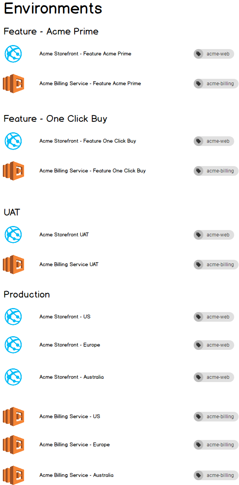

_Summary: Platform-as-a-Service endpoints will be modelled as deployment targets in Octopus._

Octopus is a release-management and deployment-automation tool.  Not surprisingly, the concepts exposed in Octopus reflect this: Releases, Deployments, Environments, and _Targets_ (aka machines). 

One of the strengths (we believe) of Octopus is that it models deployment concepts in a way that matches how people think and communicate about them.  Deployment targets are modelled as first-class objects that live within one or more environments.  This is a surprisingly rare approach.  Many of the tools that play in the same space are primarily build\CI servers, and as such have a different concept of environments and targets\agents.  To them a "target" is often just a bunch of configuration values within a deployment process.  

The current (as at March 2018) types of deployment targets in Octopus are:

- Listening Tentacle
- Polling Tentacle
- SSH
- Offline Drop
- Cloud Region

With the exception of Cloud Region, these targets all represent connections to Windows or Linux machines (indirectly in the case of Offline Drop).

## PaaS

The world is changing. More and more often, a deployment is not targeting a group of machines, but rather a platform-as-a-service endpoint such as an Azure WebApp, an AWS ElasticBeanstalk, or a Kubernetes cluster. There were a few options for how we model these.  We made the decision that from now, Octopus will model the various flavors of PaaS as deployment targets.   


_This sounds familiar..._

Those of you who have been using Octopus for a while may remember that we started down this road once before.  When Octopus 3.0 was released, we [modelled Azure Web Apps and Cloud Services as targets](https://octopus.com/blog/deployment-targets-in-octopus-3).  Then we [changed our minds](https://octopus.com/blog/azure-changes).  

For the full details of why, please read the linked post.  In summary, it was because we didn't have an answer for people who wished to dynamically provision their infrastructure during deployments.  This was a mistake we deeply regret, but in many other ways the Azure target-types were pretty great. And we won't make that mistake again (see [Dynamic Provisioning](#dynamic-provisioning) below). 

### The PaaS Zoo

Which PaaS flavors will be supported?

As a first phase, in our April release (2018.4.0), we will add:

- Azure Web Apps (which also represent Azure Functions)
- Azure Service Fabric

In the coming months we will add:

- AWS Lambda
- Kubernetes 

And no doubt more will follow. 

## Benefits

Modelling these PaaS endpoints as deployment targets brings a number of benefits. Three in particular are worth mentioning.

### 1. Visibility 

We love the idea of being able to view your PaaS targets in their environments:  



Imagine starting work at a new company. Being able to view the infrastructure page in Octopus and see the environments, the targets within them, and the roles those targets possess is very powerful.  We feel this is much nicer than having to reverse-engineer this picture from the various deployment-processes. 

### 2. Multiple Targets 

[Roles](https://octopus.com/docs/infrastructure/environments/target-roles) in Octopus provide a simple yet powerful ability to execute a step across multiple targets.  Targets are assigned one or more roles. Steps in a deployment-process specify which role they should execute on, and the step will then be executed once for each matching target. 

Admittedly with PaaS targets this ability isn't required as often as it is with machines.  For example, when deploying your web app to virtual machines, you must deploy to each machine in your cluster. Whereas with an Azure Web App for example, you just deploy to the PaaS endpoint and it scales internally (this is one of the key benefits).  But... you may have multiple Azure Web Apps in different geographic regions.  The combination of targets and roles provides an easy mechanism to deploy to all of these. Or you may have a multi-tenant application where each tenant has their own web app.  Targets + roles + tenants = a lovely way to model this.  

### 3. Putting the Ops in DevOps

By explicitly modelling PaaS endpoints as self-contained targets which live in environments, Octopus has valuable information and concepts which wouldn't exist if the PaaS targets existed only as configuration values dispersed throughout variables and deployment-processes.  This opens many possible feature avenues, which we are excited to explore.  For example:

- Operations processes which execute against an environment. e.g. running custom health-check processes, or updating HTTPS certificates. 
- Custom status\diagnostic pages for targets. e.g. which pods are running on my Kubernetes cluster? 

## Dynamic Provisioning

As mentioned above, we first added PaaS targets in the 3.0 release of Octopus, but with a significant oversight.  There was no way to dynamically provision, for example an Azure Web App, as part of a deployment process and then have it be used by the current process. 

This time there is.  We have created a mechanism where an executing deployment step can yield a message back to the Octopus server, instructing it to add a new target to the current environment.  Targets created in this way will then be available to subsequent steps in the executing deployment process.    

We have also added cmdlets to make this easy to do via scripts.  For example, see the final line in the code-block below: 

```powershell
# Octopus variables
$environment = $OctopusParameters['Octopus.Environment.Name']
$releaseNumber = $OctopusParameters['Octopus.Release.Number'].Replace(".", "-")
$deploymentId = $OctopusParameters['Octopus.Deployment.Id']

# A unique name based on the Octopus environment, release, and deployment
$uniqueName = "Acme-$environment-$releaseNumber-$deploymentId"

# Create resources in Azure
New-AzureRmResourceGroup -Name $uniqueName -Location "WestUS"
New-AzureRmAppServicePlan -Name $uniqueName -Location "WestUS" -ResourceGroupName $uniqueName -Tier Free
New-AzureRmWebApp -Name $uniqueName -Location "WestUS" -AppServicePlan $uniqueName -ResourceGroupName $uniqueName

# Create new target in Octopus
New-OctopusAzureWebAppTarget -Name $uniqueName -AzureWebApp $uniqueName -AzureResourceGroupName $uniqueName -OctopusAccountIdOrName "my-octopus-azure-serviceprincipal-account" -OctopusRoles "acme-web"
```

And of course if your infrastucture-provisioning is executing outside of Octopus, then you can always create the target via our HTTP API.

We will dive into more detail about this in future posts.

## Pricing

Octopus licensing is machined-based, which has meant that Octopus has not charged for deploying platform-as-a-service applications.  Historically deployments to PaaS endpoints have comprised a small proportion of overall Octopus usage, so this hasn't been a big factor.  But the trends are clear, and there is no reason to think adoption won't continue to increase.   

We have been investing significantly in these technologies, and will continue to do so.  So while the move to model these as targets wasn't _necessary_ to price them (there are other options), and certainly wasn't _the_ reason, it does provide a simple and clean way to include them under our licensing. 

As of the 2018.4.0 release of Octopus, these PaaS targets will be included in the machine (aka target) count for licensing. Note that this will not effect existing _Deploy an Azure Web App_, _Deploy a Service Fabric app_, or _Deploy an Azure Cloud Service_ steps.  Only new targets created going forward will be counted.  

## Migration

There will be no breaking changes. Everything you have configured today will continue to work.

As of the 2018.4.0 release, if you wish to create new _Deploy Azure Web_ or _Deploy a Service Fabric App_ steps you will need to first configure targets in the appropriate environments.  

Counts for license-usage will not change until you create instances of the new targets.  Essentially, your existing configuration in Octopus will continue to function and will be priced exactly as it was. These changes are all forward-only. 

If you have any concerns or questions, please don't hesitate to reach out.

## The Future 

We are excited about this direction.  We feel it is a natural fit, and provides all the immediate [benefits mentioned above](#benefits). 

But this work is also a key stepping-stone for other features we have planned.  We want to make it much easier to dynamically provision and deprovision entire environments (e.g. for feature-branches), and to execute operations processes against environments.  We will post more on these features in the coming months. 

As always, we welcome your feedback.