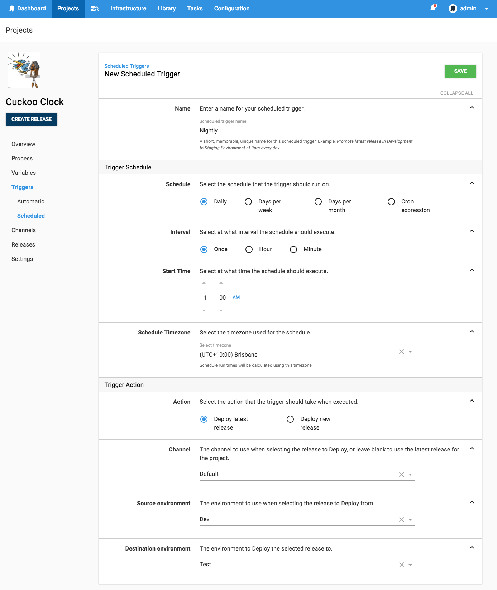
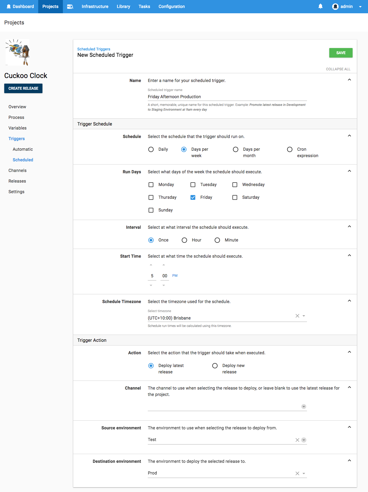

Octopus has long had the ability to schedule deployments for a specific time in the future.   
What was missing was the ability to schedule a deployment to _recur_. This feature was known internally as _DTGAAA: Deployments That Go Again and Again_.  

This was a hugely popular UserVoice item at #4 on our list with 460+ votes. And for good reason:  No one likes doing the same thing over and over.  This is why tools like Octopus exist! 

## Why?

Imagine you have the canonical three environments: `Dev`, `Test`, and `Prod`.

The development team have their continuous-integration pipeline configured so that everytime they push new commits, the build-server builds and pushes the packages to Octopus where an automatic deployment is performed to the `Dev` environment.  This is the target both for the automated system tests and also an opportunity for the developers to perform any manual checks desired. 

The QA team want the latest version available each day, but they would also like it to be relatively stable, and not constantly shifting beneath them.  So they schedule a deployment which will run each night, and promote the latest release from `Dev` to the `Test` environment.  When the QA team arrives in the morning, they can check the release notes in Octopus, and see which new and shiny features those hard-working developers have delivered the previous day.  

If the QA team is satisfied, they can manually trigger a promotion of the release from `Test` into `Prod`. 

Or of course you may have a completely different use-case for this feature. We'd love to hear about it.  

## Voila! 

You can create the schedule in hopefully every way you could ever want to: 

- Daily
- Days of the week
- Days of the month
- Cron expression 

The timezone is important, so we allow you to explicitly select it. For example, if you are in a timezone with daylight-savings time, then you probably want your 7am deployment to respect that.

You can choose to either:

1. Promote the latest existing release, in which case you need to select the source environment you are promoting from and you can optionally restrict the release to be selected from a given channel.

2. Create a new release each time, in which case you select the destination environment and the channel for the created release. 

Option 1 makes sense in scenarios such as the described above, where you are promoting a release that has already been deployed to a previous environment in the lifecycle. 

Option 2 is for when you wish to deploy to the first environment in your lifecycle, and you wish to scoop up the latest packages.

Bonus Octopus points for anyone who configures the schedule below ;)

## When?

Recurring deployments be available in Octopus version 2018.4.0, which will be released early April. 

Happy _recurring_ deployments!